# Technical Design: Multi-Agent Code Architecture

**Feature:** `multi-agent-code-architecture`
**Workflow:** Design-first
**Detail level:** High-Level Design + Low-Level Design
**Status:** Revisado — plataforma avançada de operações de viagem e finanças da viagem, com referência conceitual na Blis.AI; sem implementação nesta fase. Adendo de 29/09/2026: orquestrador autônomo e runtime de skills (7.12), Agente de Viagens com busca de mercado (7.13), identidade visual minimalista e futurista (7.14), ícones enxutos (7.8.11), decisões 31–34, Property 6 e testes 14.13, em 4 etapas sequenciais
**Notation:** pseudocódigo estruturado, independente de linguagem
**Rastreabilidade:** `requirements.md` rastreia as Properties 1–5 (Requirements 1–5). O adendo de 29/09/2026 acrescenta a Property 6, cujos critérios 6.1–6.17 são planejados e serão criados na próxima atualização de `requirements.md`; `tasks.md` será derivado depois, a partir deste design.

## Overview

Esta feature define duas arquiteturas complementares. A primeira preserva uma equipe de agentes e skills do Kiro, versionada no workspace, com um `orchestrator` como único ponto de despacho, agora organizada para construir um sistema avançado de viagens e finanças: 10 agentes (orquestração, arquitetura, segurança com foco também em LLM, desenvolvimento full stack, operações de viagem, finanças da viagem, engenharia do assistente de IA, UX/acessibilidade, QA/property testing e documentação/release) e 21 skills agrupadas nos domínios Viagens, Finanças, IA e Plataforma. A equipe opera por contratos explícitos, handoffs rastreáveis, autoria separada de aprovação, limites de ferramentas e um grafo acíclico de trabalho.

A segunda reposiciona progressivamente o PlannerDuo como uma **plataforma avançada de operações de viagem e finanças da viagem** para o viajante pessoal. A jornada contínua cobre busca e deep links, cotações comparadas lado a lado, decisão, reserva feita no site do provedor com confirmação informada pelo usuário, pós-venda (simulação de remarcação/reemissão, assentos, bagagem e check-in), orçamento e razão da viagem em várias moedas, divisão e acertos, parcelamentos, previsão, relatórios e uma central local de alertas de prazos. Finanças genéricas deixam de ser a narrativa central: registros legados continuam compatíveis, a interface prioriza o contexto de viagem e itens ainda não vinculados permanecem identificáveis.

A referência de produto é a [Blis.AI](https://blisai.com/), traveltech de Minas Gerais que desenvolve agentes autônomos de IA para o turismo. Segundo a cobertura pública, esses agentes cuidam de reemissão de bilhetes (regras tarifárias, diferenças de valor e políticas por companhia), marcação de assentos, reservas de hotel, cotações e atendimento, integram-se a GDS, NDC e OBT, usam WhatsApp e e-mail como interfaces e unem reserva e suporte em um fluxo contínuo, com a ideia de uma IA que executa em vez de apenas responder, voltada a agências, TMCs e consolidadoras ([LatAm Republic](https://www.latamrepublic.com/blis-ai-raises-us-185k-in-pre-seed-funding-led-by-magela-capital-stamina-ventures/), [Estado de Minas](https://www.em.com.br/mundo-corporativo/2026/03/7367777-empresario-mineiro-investe-em-startup-de-ia-para-turismo.html), [Startupi](https://startupi.com.br/como-o-uso-de-inteligencia-artificial-em-viagens-corporativas-atrai-novas-contas-e-agiliza-cotacoes/)). O PlannerDuo espelha apenas conceitos e padrões de UX — agentes temáticos que preparam tarefas executáveis, jornada contínua, cotações, pós-venda e canal conversacional — adaptados da perspectiva B2B de agência para o viajante B2C. Marca, logotipo, cores, layout, textos e trade dress da Blis.AI não são reproduzidos; como o site oficial é uma SPA que não pôde ser lida automaticamente, este design não afirma nada sobre sua identidade visual. Conteúdo das fontes parafraseado para conformidade com restrições de licenciamento.

A exceção controlada ao funcionamento 100% local é o **assistente de IA real**, escolhido explicitamente pelo usuário: um LLM acessado com a chave do próprio usuário (BYOK). Somente o assistente fala com a internet, sempre por um proxy local em loopback (`POST /api/assistant`); o navegador passa de `connect-src 'none'` para `connect-src 'self'` apenas em `app.html`, e a chave nunca chega ao navegador. A IA fica desligada por padrão, exige opt-in que nomeia o provedor, mostra a prévia exata do envio, minimiza e pseudonimiza o contexto e nunca age sozinha: cada sugestão vira uma proposta validada localmente que só é aplicada após clique explícito. Dados, cálculos, alertas, busca e relatórios continuam locais, e o app funciona integralmente sem IA, sem proxy ou offline.

Os dados continuam criptografados localmente. Entretanto, a proteção é apresentada ao usuário como suporte à experiência de viagem, não como o produto em si. Termos visíveis preferidos são **conta**, **acesso seguro**, **dados protegidos** e **área de viagens**. `vault`, `cofre`, códigos `vault/*` e o formato `plannerduo-vault` permanecem somente como nomes técnicos internos e contratos de compatibilidade; não podem aparecer como proposta de valor, título, botão ou mensagem principal.

A revisão também transforma legibilidade e recuperação do acesso em contratos verificáveis. Corpo padrão tem no mínimo 16 px; descrições e textos secundários, 14 px; labels e controles, 14 px por padrão e nunca menos de 13 px; nenhum aviso, erro ou instrução crítica usa texto microscópico. O fluxo de criação e entrada diagnostica falhas por código seguro, sempre devolve o controle da interface após erro e negocia capacidades do navegador antes de persistir dados. Web Locks continua sendo a coordenação preferencial, mas sua ausência não cai em erro genérico: a aplicação oferece um modo de compatibilidade de aba única com limitações explícitas quando houver capacidades mínimas, ou acesso somente leitura/ação de recuperação quando não puder escrever com integridade.

## 2. Goals and Non-goals

### 2.1 Goals

- Preservar a equipe Kiro reutilizável, local ao workspace e governada por contratos.
- Manter responsabilidades, gatilhos, entradas, saídas, limites, handoffs e gates independentes para cada agente.
- Impedir ciclos de delegação, múltiplos donos, autoaprovação e resolução silenciosa de conflitos.
- Preservar uma modularização incremental, por fachadas compatíveis, sem big-bang rewrite.
- Reposicionar a arquitetura de informação, módulos, queries e controllers para um produto travel-first.
- Priorizar busca/comparação de passagens, planejamento, reservas externas, orçamento, gastos e metas de viagem.
- Qualificar o censo fechado de 26 provedores por evidência oficial vigente, domínio/página exatos e manifesto auditável, bloqueando clones, typosquatting, redirectors, shorteners e afiliados ocultos.
- Substituir marcas aproximadas por assets oficiais locais adquiridos somente no desenvolvimento, sanitizados e hasheados, sem hotlink/CDN/request externo no runtime e sem fallback fabricado.
- Tornar gastos e receitas genéricos subordinados ao contexto de viagens sem invalidar registros legados sem vínculo.
- Estabelecer tokens e critérios objetivos de tipografia, contraste, zoom, reflow, foco e responsividade.
- Substituir o fallback visual genérico por uma taxonomia segura e acionável de erros de acesso.
- Garantir que toda falha conhecida restaure botão, foco e estado do formulário sem duplicar operações.
- Detectar Web Crypto, localStorage, sessionStorage e coordenação entre abas antes de criar ou alterar dados.
- Oferecer compatibilidade honesta sem Web Locks, sem alegar garantia equivalente à serialização nativa.
- Preservar envelope, criptografia, backups, migração, CSP (salvo `connect-src 'self'` em `app.html` para o assistente), allowlist de viagens e APIs públicas existentes.
- Exigir testes browser-level do fluxo real de criação/entrada, além de testes unitários e textuais.
- Manter observabilidade estritamente local, redigida e sem conteúdo sensível.
- Reorganizar a equipe Kiro em 10 agentes e 21 skills agrupadas em Viagens, Finanças, IA e Plataforma, sem enfraquecer DAG, limites, ownership e gates.
- Espelhar conceitos e padrões de UX da Blis.AI (agentes temáticos, jornada contínua, cotações, pós-venda e canal conversacional) adaptados ao viajante pessoal, sem copiar marca, copy ou trade dress.
- Entregar um front avançado e funcional: Painel com KPIs, jornada com stepper e linha do tempo, cotações lado a lado, reservas com confirmação informada, pós-venda, finanças da viagem, relatórios, paleta de comandos `Ctrl+K` e central de alertas local.
- Estabelecer um design system local com tokens de tema claro/escuro, contraste WCAG AA, pisos 16/14/13 px, espaçamento, raios, elevação, `prefers-reduced-motion` e componentes acessíveis, sem CDN nem fonte externa.
- Oferecer um assistente de IA real opcional (BYOK), desligado por padrão, via proxy local endurecido, com consentimento, prévia do envio, minimização, pseudonimização e propostas aplicadas somente após confirmação humana.
- Evoluir o schema do workspace de v1 para v2 por migração versionada, sem perda, idempotente e com import de backups v1 e v2, preservando envelope, parâmetros criptográficos e `MAX_AMOUNT`.
- Tratar dinheiro em unidades menores inteiras com moeda ISO 4217, câmbio manual datado, IOF/taxas configuradas pelo usuário, parcelamentos, previsão, acertos e relatórios determinísticos.

### 2.2 Non-goals

- Implementar, mover ou editar código da aplicação nesta fase.
- Criar agora manifests, arquivos `SKILL.md`, módulos, tokens CSS, proxy, adapters ou testes propostos.
- Baixar, copiar, sanitizar ou versionar assets externos nesta fase; o pipeline descrito é contrato de implementação futura.
- Transformar o PlannerDuo em agência, TMC, consolidadora, emissor de bilhetes, processador de pagamento ou agregador com scraping.
- Integrar GDS, NDC, OBT ou APIs de reserva/emissão de companhias, hotéis e locadoras; reservar, emitir, remarcar e reemitir continuam sendo ações do usuário no site do provedor.
- Integrar oficialmente WhatsApp, e-mail ou outro canal de mensagens; no máximo o usuário copia ou exporta localmente um resumo em texto.
- Reservar, emitir, pagar ou criar pedidos em qualquer API; a busca de ofertas via APIs Duffel (voos) e LiteAPI (hospedagem), pelo servidor local em loopback (7.13), é permitida, e a compra acontece sempre no site do provedor. Continua fora alegar regra tarifária oficial, custo de remarcação garantido, disponibilidade garantida após a consulta ou reserva confirmada pelo sistema; regras e confirmações seguem informadas pelo usuário.
- Executar a migração para o schema v2 (8.5) no escopo de implementação de 29/09/2026: ela fica adiada, e as skills de 7.12 operam sobre o schema v1, sem migração; capacidades que dependem da v2 (cotações, reservas e pós-venda persistidos, multimoeda e `settings.assistant`) continuam planejadas.
- Alterar o formato `plannerduo-vault`, a estrutura do envelope, os parâmetros criptográficos ou `MAX_AMOUNT`; a única evolução persistida permitida é a migração versionada do workspace v1 → v2 (8.5).
- Excluir registros financeiros legados sem viagem ou inventar vínculo automaticamente.
- Persistir entidades fora da migração v2 ou apresentar uma reserva `CONFIRMED_BY_USER` como verificada pelo sistema.
- Adicionar backend remoto, sincronização em nuvem, telemetria remota, CDN, framework ou dependência de runtime; o único componente servidor é o proxy local em loopback do assistente, com APIs nativas do Node.js.
- Ativar a IA por padrão, guardar a chave de API no navegador ou no repositório, ou permitir que a IA execute, exclua, exporte, altere conta/segurança, abra URLs ou contate provedores sem clique explícito do usuário.
- Expor o proxy fora do loopback ou usá-lo como relay HTTP genérico.
- Obter câmbio automaticamente de fonte externa ou fixar alíquota de IOF/taxas no código nesta feature.
- Reproduzir marca, logotipo, cores, layout, textos ou trade dress da Blis.AI, ou afirmar detalhes visuais dela.
- Expor causa interna, stack trace, chave, senha, conteúdo de viagem ou PII em mensagem/diagnóstico.
- Usar diminuição de fonte, `transform: scale` ou truncamento de instruções como solução responsiva.
- Alterar `requirements.md` ou `tasks.md` dentro desta revisão do design; a atualização dos requisitos e a derivação das tarefas são permitidas e esperadas nas próximas fases do fluxo design-first.

## 3. Baseline and Immovable Contracts

| Área | Contrato | Consequência para o design revisado |
|---|---|---|
| Runtime | HTML/CSS/JavaScript local, scripts clássicos/IIFE, sem build obrigatório | Extrações começam compatíveis com o carregamento atual; ESM não é pré-requisito. |
| Fachadas | `window.PlannerCore`, `window.PlannerLocal`, `window.PlannerTravel`, `window.PlannerApp` | Nomes, assinaturas e semântica permanecem disponíveis durante a transição. |
| Produto | Viagens, provedores, orçamento, gastos, metas, checklist, decisões e participantes já coexistem nas views `dashboard`, `finances`, `trips`, `goals`, `checklist`, `decisions`, `reports` e `settings` | A navegação evolui para Painel, Viagens (jornada), Cotações, Reservas, Pós-venda, Finanças da viagem, Relatórios e Assistente (7.9), sem apagar capacidades existentes. |
| Modelo atual | Schema v1 (`plannerduo-workspace`, `schemaVersion: 1`); `Trip` contém destino, período, orçamento, valor guardado e notas; `Finance.tripId` e `ChecklistItem.tripId` são opcionais; valores decimais em reais limitados por `MAX_AMOUNT = 1_000_000_000`; moeda fixa BRL | Gastos podem ser vinculados a viagens agora; metas são apresentadas como metas de viagem, sem fingir vínculo persistido inexistente; entidades novas e unidades menores entram somente pela migração v1 → v2 (8.5). |
| Versão de schema | `validateWorkspace` exige `schemaVersion` igual ao suportado e falha com `local/import-version` no load e no import | A versão atual falha fechada diante de dados v2, sem perda silenciosa; a v2 aceita v1 e v2 e rejeita versões futuras do mesmo modo. |
| Busca externa | 26 provedores, quatro grupos e modos exact/conditional/assisted/manual; o baseline visual usa `short`/`accent` e marcas aproximadas | O censo e os builders puros permanecem, mas só entram no registry runtime após `TrustedProviderGate`, evidência oficial, domínio exato e asset verdadeiro local; monogramas/SVGs fabricados são migrados sem fallback silencioso. |
| Assets de provedores | Nenhum hotlink/CDN é necessário para a aplicação local | Aquisição externa ocorre somente no desenvolvimento; `public/assets/providers/`, manifesto auditável, sanitizer, SHA-256 e gates independentes formam o contrato de release. |
| Reservas | A aplicação abre provedores externos; não confirma transação | “Reserva” visível significa planejar, acessar e acompanhar uma intenção; em v2 a reserva persistida guarda a intenção e a confirmação informada pelo usuário (ex.: localizador), nunca verificada pelo sistema. |
| Proteção interna | PBKDF2-SHA-256, 600.000 iterações, salt de 16 bytes; AES-GCM 256, IV de 12 bytes e tag de 128 bits | Parâmetros e formato não mudam; nomes técnicos `vault/*` ficam atrás de adapters de acesso seguro. |
| Persistência | Envelope em `localStorage`; chave de sessão em `sessionStorage` | Nenhum plaintext persistente. Falta de storage/session é detectada antes de criação e recebe recuperação específica. |
| Concorrência | Web Locks hoje é obrigatório; generation/revision/sequence e invalidadores entre abas já existem | Web Locks vira modo completo; fallback de aba única é explicitamente degradado e pausa escrita diante de incerteza. |
| Login | Entradas protegidas passam por `auth.html`; sessão inválida redireciona | Bootstrap falha fechado antes de revelar dados, usando copy de conta/acesso e não identidade de “cofre”. |
| UI observada | Em 1024×576 há textos entre aproximadamente 9–12 px e erro genérico após submit | A viewport entra em layout form-first, sem reduzir tokens; erros conhecidos têm mensagem própria e botão recuperável. |
| CSP | Meta CSP em `index.html`, `auth.html` e `app.html` e header do servidor local com assets locais, `connect-src 'none'`, sem objetos ou base externa; o header também envia `frame-ancestors 'none'` | A única mudança é `connect-src 'self'` em `app.html` (meta e header), para o `POST /api/assistant` same-origin; `index.html` e `auth.html` mantêm `'none'`; nenhum módulo, agente ou diagnóstico introduz outra rede ou telemetria. |
| Servidor local | `scripts/dev-server.mjs` escuta em `localhost`, serve somente `public/`, aceita GET/HEAD e responde 405 aos demais métodos | Ganha exatamente uma rota `POST /api/assistant`, endurecida conforme 7.10; estáticos, rewrites e 405 permanecem. |
| Assistente de IA | Inexistente | Opcional, desligado por padrão, BYOK via proxy local; o app funciona integralmente sem ele. |
| Renderização | `app.js` monta parte do DOM com `innerHTML` e `escapeHtml` | Conteúdo derivado de IA nunca usa `innerHTML`; o legado migra gradualmente para builders DOM seguros. |
| Referência de produto | Nenhuma referência de mercado explícita | Blis.AI como referência conceitual de agentes e jornada, adaptada de B2B para B2C, sem marca, copy ou trade dress. |
| Qualidade | Vitest, fast-check e `npm run verificar`; `verificar-frontend.mjs` exige hoje `connect-src 'none'`, proíbe Firebase/CDN e faz smoke das rotas | Cada slice passa testes direcionados, fluxo real, propriedades e gate completo; a verificação passa a exigir a CSP por página de 14.12, ausência de padrões de chave em `public/` e de host externo fora da allowlist de navegação. |

## 4. Architectural Decisions

1. **Travel-first product identity.** A principal unidade de contexto é a viagem; busca, comparação, planejamento, intenção de reserva, orçamento, gasto e meta aparecem nessa ordem conceitual.
2. **Visible/internal language boundary.** Copy visível usa conta/acesso/dados/viagens. `vault`, `cofre` e códigos legados são permitidos somente em formato, código, adapter, teste técnico e documentação interna explicitamente marcada.
3. **Readable by construction.** Tokens têm pisos em pixels CSS, contraste mínimo e critérios de reflow. Breakpoints removem decoração antes de reduzir legibilidade.
4. **Errors are a typed interface.** Cada falha conhecida possui código estável, estágio, mensagem segura, ação sugerida, efeito sobre dados e próximo foco.
5. **No stuck submit state.** O controller de formulário é uma máquina de estados; toda saída não bem-sucedida termina em estado interativo e impede commits tardios de uma tentativa expirada.
6. **Capability preflight before persistence.** Criptografia, storage, sessão e coordenação são verificadas antes de derivar/persistir uma nova conta.
7. **Layered concurrency.** Web Locks fornece modo completo. Sem Web Locks, um coordenador de aba única pode oferecer escrita degradada somente com detecção de pares, lease, fencing lógico e checagens de sequence/generation; em qualquer dúvida, escrita é pausada. Sem capacidades mínimas, a aplicação oferece somente leitura/exportação ou bloqueia criação com orientação.
8. **No false assurance.** O modo de compatibilidade nunca é chamado de equivalente, seguro entre múltiplas abas ou livre de risco concorrente; a limitação fica persistente enquanto ativo.
9. **One authoritative writer.** Todos os comandos continuam passando por `WorkspaceRepository.update`; fallback não cria um segundo caminho de persistência.
10. **Compatibility-first modularization.** Fachadas estáveis estrangulam o monólito; não há reescrita total.
11. **Security kernel last.** Internos de `public/local.js` são divididos somente depois de contratos de caixa-preta, fluxo real e taxonomia de erro estabilizarem.
12. **No data migration for product repositioning.** A hierarquia visual muda sem migração; capacidades novas entram somente pela migração versionada v1 → v2 do workspace (decisão 27), e o envelope não muda.
13. **Local-only observability.** Diagnósticos usam allowlist de metadados e identificador copiável, nunca conteúdo ou rede.
14. **Workspace-local agent configuration.** Agentes, skills e governança são versionados sob `.kiro/`; estado efêmero não integra o produto.
15. **Orchestration hub-and-spoke.** Somente o orchestrator cria tarefas filhas; especialistas solicitam handoff a ele.
16. **Least privilege and two-person gates.** Autoria não equivale a aprovação; agentes recebem apenas caminhos/capacidades necessários.
17. **No new runtime dependencies.** APIs nativas e dependências de desenvolvimento existentes são preferidas; automação de browser adicional exige decisão separada e versão fixada.
18. **Development-only brand acquisition.** Rede para fontes de marca é permitida somente por comando explícito de desenvolvimento, primeiro em kit/site oficial e apenas depois em Simple Icons com indisponibilidade oficial documentada; runtime usa apenas assets same-origin admitidos.
19. **Trust by exact evidence, never resemblance.** Domínio, página, marca, licença/termos, diretrizes, data e hash são campos verificáveis; semelhança de nome/logo nunca autoriza clone, typosquatting, redirector, shortener, afiliado ou intermediário oculto.
20. **No fabricated brand fallback.** Asset ausente ou inválido bloqueia o provedor/registry; Wordmark_Oficial passa pelos mesmos gates e rollback nunca reativa letra, monograma, template, emoji ou SVG fabricado.
21. **Atomic brand release.** Manifesto, 26 assets e renderer são uma unidade aprovada por Segurança e documentação/release sobre bytes e metadados exatos; qualquer alteração invalida os verdicts.
22. **Conceptual benchmark, not imitation.** A Blis.AI orienta conceitos — agentes que preparam e executam tarefas, jornada contínua, cotações, pós-venda e canal conversacional — adaptados ao viajante pessoal; marca, copy, cores, layout e trade dress não são copiados nem descritos.
23. **Operations platform, not agency.** O PlannerDuo planeja, compara, registra, simula, lembra e explica; reservar, emitir, pagar, remarcar e reemitir continuam no site do provedor. Não há GDS, NDC, OBT, scraping nem canal oficial de mensagens.
24. **Controlled network exception.** Somente o assistente de IA acessa a internet, sempre pelo proxy local em loopback; o navegador ganha apenas `connect-src 'self'` em `app.html`. A IA nasce desligada e o app funciona integralmente sem ela.
25. **Key confinement (BYOK).** A chave de API existe apenas no processo do proxy, lida de variável de ambiente ou de `.env.local` ignorado pelo Git; nunca no navegador, workspace, logs, backups ou repositório. Proxy e adapters usam somente `node:http` e `fetch` nativos, sem dependência nova.
26. **Propose, preview, confirm.** A IA devolve propostas estruturadas; schemas locais em allowlist as validam; um card mostra prévia/diff; somente um clique explícito executa, pelo mesmo caminho de commands e validações do core. A IA nunca exclui, exporta, altera conta/segurança, abre URL ou contata provedor.
27. **Versioned schema v2.** Entidades novas e dinheiro em unidades menores entram por migração v1 → v2 sem perda, idempotente e verificada antes do primeiro commit; todo campo v1 tem destino documentado e campos monetários ganham nomes novos com sufixo `Minor`; backups v1 e v2 são importáveis; envelope, parâmetros criptográficos e `MAX_AMOUNT` permanecem.
28. **Exact money.** Valores são inteiros em unidades menores ISO 4217; câmbio é manual, datado e congelado no lançamento; IOF e taxas são regras do usuário, sem alíquota no código; o arredondamento é único (`HALF_EVEN`) e documentado.
29. **Local design system.** Tokens, temas, componentes e ícones são assets locais; não há fonte, CDN ou biblioteca de UI externa; legibilidade, contraste e movimento reduzido são contratos testáveis.
30. **Product assistants are not Kiro agents.** Os “agentes temáticos” do assistente (Cotações, Remarcação, Hospedagem, Financeiro, Roteiro) são presets de runtime com escopo de contexto e ferramentas; não se confundem com os agentes de engenharia do Kiro da seção 7.2.
31. **Local-first intent orchestration.** Um orquestrador local e determinístico (7.12) interpreta mensagens e aciona skills de forma invisível; o LLM é só fallback opcional para mensagens de baixa confiança com IA habilitada, devolve apenas intenção e slots validados por schema, nunca executa skills nem recebe dados do workspace, e o app funciona integralmente sem ele.
32. **Graduated autonomy.** Leituras executam automaticamente; escritas de comando explícito interpretado localmente executam com recibo e “Desfazer”; escritas vindas de interpretação remota exigem card de confirmação (decisão 26); skills destrutivas ou sensíveis só existem na UI; navegação externa só por clique (7.12.7).
33. **Market search through the local proxy.** Amplia a exceção de rede da decisão 24: o mesmo servidor local em loopback, e somente ele, consulta `api.duffel.com` e `api.liteapi.travel` para busca de ofertas, com chaves confinadas como na decisão 25; reserva, emissão, pagamento e pedidos continuam fora (decisão 23), e a Amadeus fica fora porque o Self-Service foi desativado (7.13.1).
34. **Minimal-futurist visual identity.** A identidade de 7.14 (tema escuro padrão, glass sutil, contrastes luminosos e pilha tipográfica do sistema) prevalece sobre os valores de 7.9.4 e mantém os contratos das decisões 3 e 29 e de 7.6.

## Architecture

### 5.1 Kiro Engineering Team

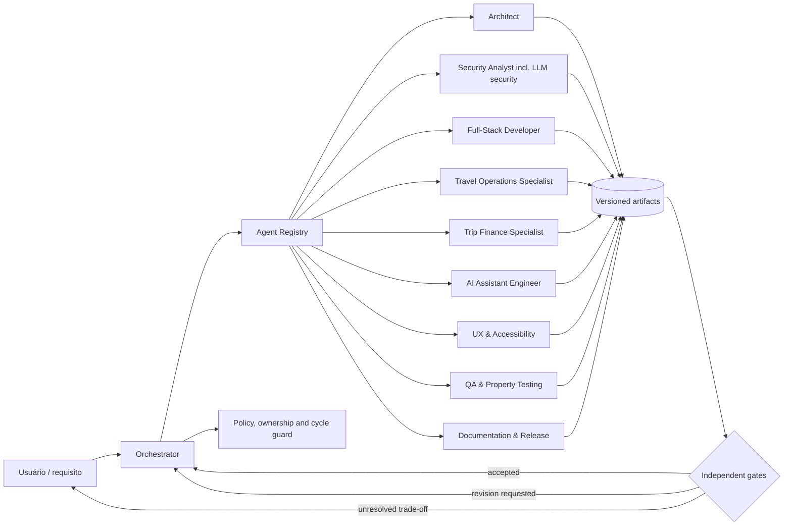

Não existem arestas worker-to-worker. Todo handoff volta ao orchestrator para validar dono, profundidade, tentativas, evidência, paths e conflitos.

A equipe tem 10 agentes: 1 despachante; 2 autores de produção com write paths disjuntos (`fullstack-developer` e `ai-assistant-engineer`); 2 especialistas de domínio (`travel-operations-specialist` e `trip-finance-specialist`) que produzem contratos, tabelas de decisão e fixtures sem escrita de produção; 1 `architect`; e 4 papéis independentes de revisão ou produção não funcional (`security-analyst`, `ux-accessibility`, `qa-property-testing` e `documentation-release`). Os limites continuam: profundidade máxima 4, fan-out máximo 4 por wave e no máximo 2 tentativas sem evidência nova.

### 5.2 PlannerDuo Travel-first Runtime

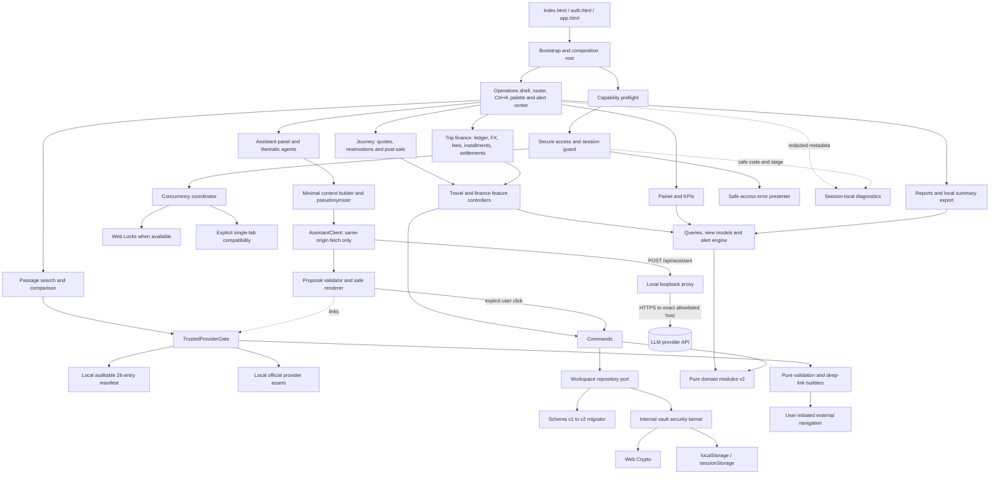

A rede tem um único ponto de saída: `AssistantClient` → proxy local → API do provedor LLM. Nenhum outro módulo do navegador usa `fetch`, `XMLHttpRequest`, `WebSocket`, `EventSource`, `navigator.sendBeacon` ou `import()` remoto. Sem proxy configurado, `ASSIST` mostra “Assistente indisponível” e todos os outros nós funcionam sem alteração.

### 5.3 Product Information Architecture

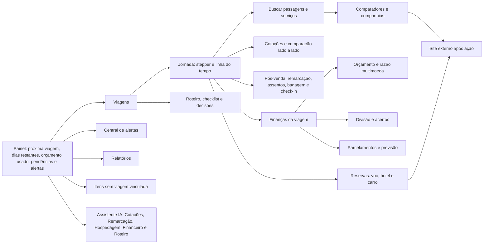

Regras de arquitetura de informação:

- A primeira tela após entrar é o **Painel**; suas ações principais são abrir a próxima viagem, buscar passagens, registrar cotação e lançar gasto.
- “Finanças” não é headline de produto: a área é “Finanças da viagem”, e o consolidado aparece em Relatórios.
- Pós-venda simula e organiza; remarcar, reemitir, marcar assento ou comprar bagagem acontece no site do provedor.
- O Assistente IA é um painel opcional; sem opt-in ou sem proxy ele aparece como “Assistente indisponível”, e nenhuma rota depende dele.
- Registros com `tripId = null` permanecem acessíveis em “Itens sem viagem vinculada”, com ação explícita de vincular; nunca há associação automática.
- Metas existentes aparecem como “Metas de viagem”. Vínculo persistente individual com uma viagem é futuro e não é simulado nesta feature.
- Busca externa informa se o provedor recebeu rota/datas/passageiros e que preço/availability são confirmados no site externo.
- Uma intenção de reserva não é apresentada como reserva confirmada; o estado “Confirmada por você” exige dado informado pelo usuário e nunca afirma verificação.

### 5.4 Layer and Dependency Rules

- UI depende de application ports e view models, nunca de storage, formato interno ou Web Crypto.
- Application coordena commands/queries e estados de operação, mas não implementa criptografia ou HTML.
- Domain é puro e desconhece browser, DOM e copy.
- Somente o security kernel interno lê/escreve envelope, chave e marcadores de sessão.
- Somente `ConcurrencyCoordinator` escolhe Web Locks ou modo compatível; repository não tenta um fallback silencioso.
- Somente `TrustedProviderGate` transforma o manifesto local completo em registry utilizável; UI e builders não contornam evidência, hash ou igualdade de domínio.
- Scripts de aquisição/sanitização são development-only, escrevem em staging e nunca são importados por HTML, bootstrap, service worker ou módulos de runtime.
- `ProviderBrandView` recebe apenas assets locais admitidos e não possui gerador de SVG, letra, monograma, template ou fallback remoto.
- Somente `TravelNavigationAdapter` abre URL externa, após novo gate de domínio/parâmetros e gesto explícito do usuário.
- `SafeAccessErrorPresenter` recebe erros tipados e retorna copy allowlisted; nunca renderiza `cause.message`.
- `ReadableUiContract` é compartilhado por shell, auth e views; nenhum componente local pode reduzir seus pisos.
- Diagnostics é um sink opcional; decisões de segurança e negócio não dependem dele.
- Fachadas de compatibilidade delegam para dentro; módulos alvo nunca chamam as fachadas de volta.
- Somente `AssistantClient` executa `fetch`, e somente para o path relativo same-origin `/api/assistant`; nenhum outro módulo do navegador abre conexão.
- Somente o proxy local fala com o provedor LLM, por host exato em allowlist; o navegador não conhece URL, chave nem parâmetros upstream.
- Saída da IA é dado não confiável: passa por `ProposalValidator` e `SafeMessageRenderer`; somente `ProposalExecutor` converte uma proposta confirmada em command, e ele nunca toca storage diretamente.
- `ContextBuilder` é o único produtor do contexto enviado; recebe o workspace já descriptografado e devolve uma projeção mínima e pseudonimizada, nunca envelope, sessão ou conta.
- O domínio financeiro v2 é puro e inteiro: nenhum módulo de UI arredonda, converte câmbio ou aplica taxa por conta própria.
- `AlertEngine` é função pura de workspace, relógio e configurações; não agenda rede nem notificações do sistema operacional.

## Sequence Diagrams

### 6.1 Create Secure Access with Capability Negotiation

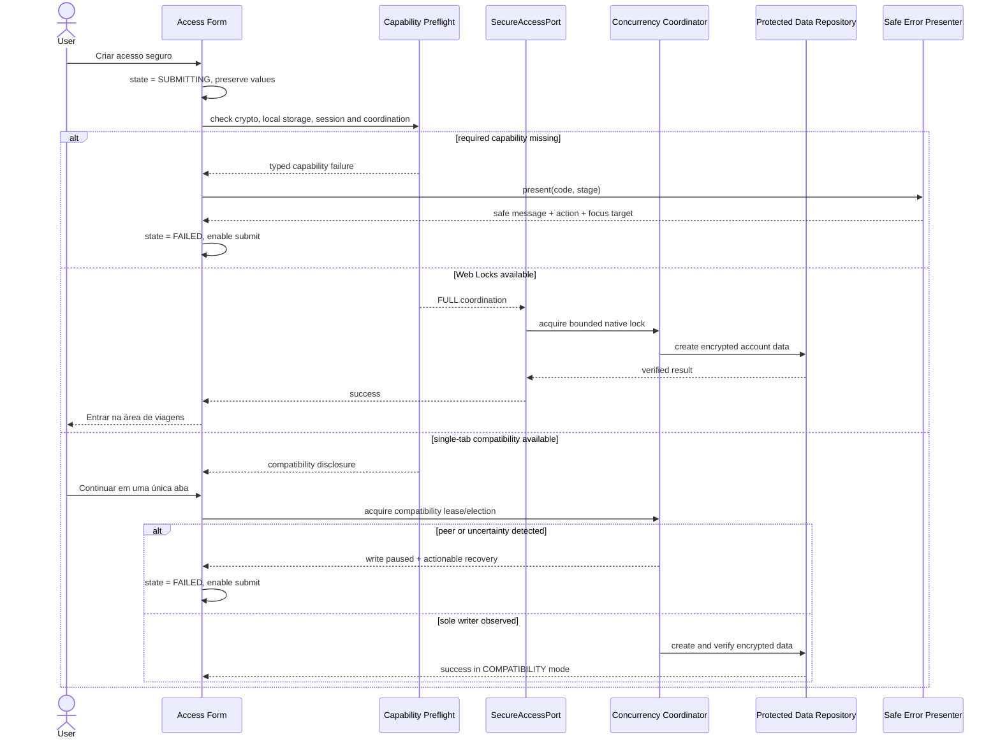

### 6.2 Protected Bootstrap

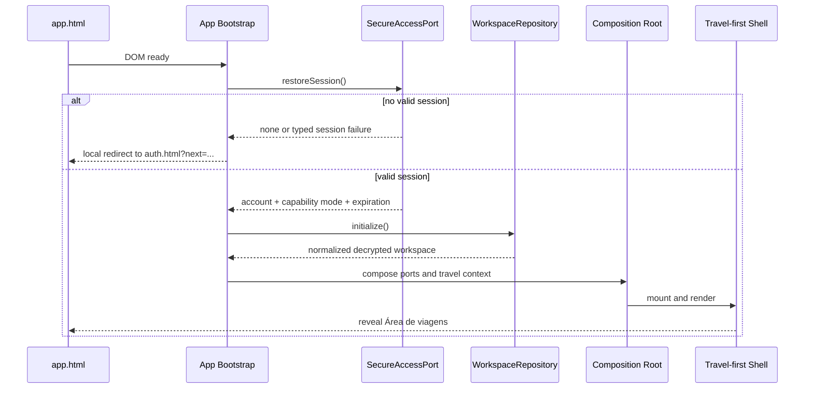

A interface protegida não é revelada antes de autenticação do envelope e inicialização do workspace. Erro de sessionStorage no setup é detectado antes de persistir uma nova conta, evitando “criado, mas não foi possível entrar”.

### 6.3 Search and Compare Passages

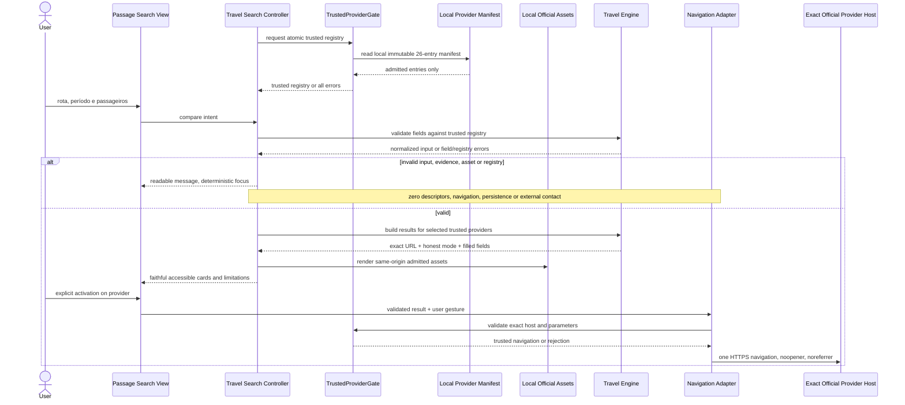

### 6.4 Serialized or Compatibility Workspace Mutation

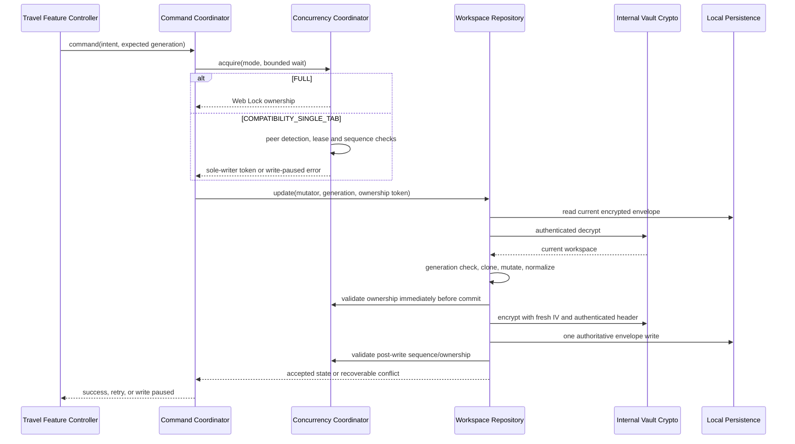

O modo compatível não promete serialização entre várias abas. Se outra aba, lease ambíguo, troca de visibility ou sequência inesperada for detectada, nenhum novo comando é aceito até o usuário fechar/recarregar abas e readquirir exclusividade.

### 6.5 Assistant Request through the Local Proxy

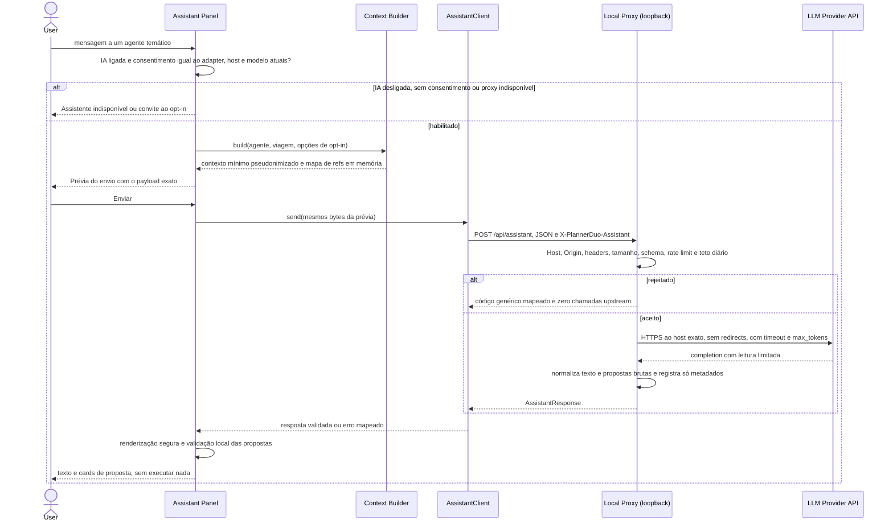

### 6.6 Confirm an Assistant Proposal

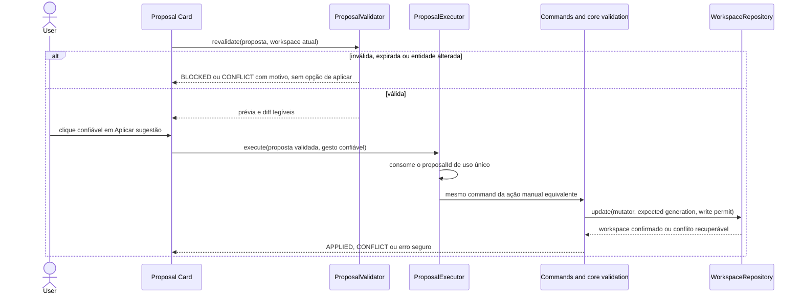

### 6.7 Schema v1 → v2 Migration on Load and Import

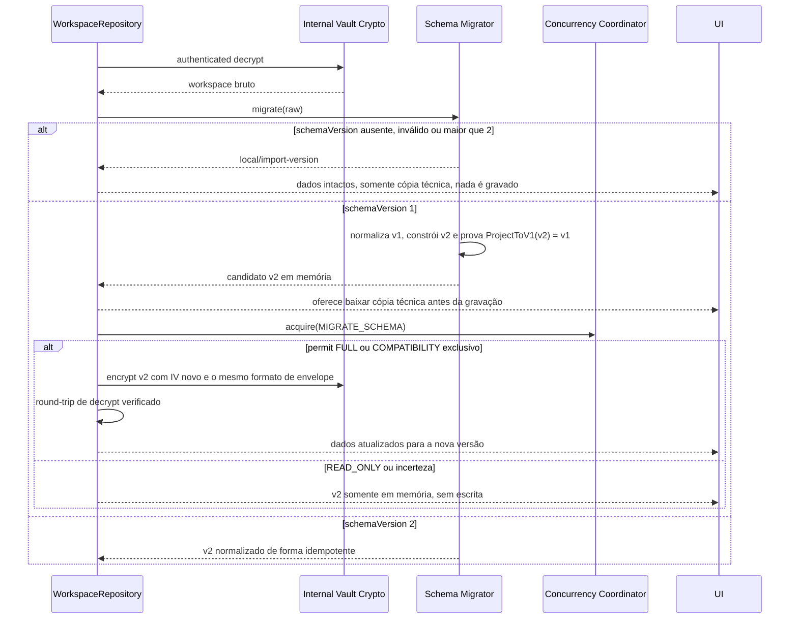

O import de backup usa o mesmo migrador após a validação estrita da versão declarada; backup rejeitado nunca substitui o estado atual.

## Components and Interfaces

### 7.1 Proposed Workspace Structure

```text
.kiro/
  agents/
    orchestrator.json
    architect.json
    security-analyst.json
    fullstack-developer.json
    travel-operations-specialist.json
    trip-finance-specialist.json
    ai-assistant-engineer.json
    ux-accessibility.json
    qa-property-testing.json
    documentation-release.json
  skills/                          # layout plano; o domínio fica declarado nos metadados de cada SKILL.md
    # Viagens
    travel-search-deep-links/SKILL.md
    travel-journey-lifecycle/SKILL.md
    travel-reissue-simulation/SKILL.md
    travel-stays-seats-baggage/SKILL.md
    # Finanças
    trip-budget-ledger/SKILL.md
    multi-currency-exchange/SKILL.md
    expense-splitting-settlements/SKILL.md
    installments-forecast/SKILL.md
    travel-finance-reports/SKILL.md
    # IA
    assistant-proxy-adapters/SKILL.md
    assistant-tool-contracts/SKILL.md
    llm-safety-evaluations/SKILL.md
    # Plataforma
    task-routing-governance/SKILL.md
    modular-boundary-design/SKILL.md
    workspace-schema-evolution/SKILL.md
    advanced-design-system/SKILL.md
    web-accessibility-review/SKILL.md
    local-data-protection-review/SKILL.md
    safe-access-diagnostics/SKILL.md
    property-regression-testing/SKILL.md
    release-evidence/SKILL.md
  steering/
    agent-governance.md
  specs/multi-agent-code-architecture/
    .config.kiro
    requirements.md
    design.md

public/
  app.js                         # temporary compatibility entry
  auth.js                        # temporary access-page entry
  core.js                        # stable PlannerCore facade
  local.js                       # stable PlannerLocal facade; internal technical vault kernel
  travel.js                      # stable PlannerTravel facade
  style.css                      # compatibility stylesheet, later delegates token layers
  modules/
    bootstrap/
      app-bootstrap.js
      auth-bootstrap.js
      composition-root.js
      capability-preflight.js
    shared/
      contracts.js
      errors.js
      text.js
      dates.js
      money.js
      dom.js
    design-system/
      tokens.css
      typography.css
      focus.css
      responsive.css
    platform/
      diagnostics.js
      browser-navigation.js
      download.js
    application/
      travel-workspace-store.js
      command-coordinator.js
      travel-query-service.js
      conflict-policy.js
    domain/
      workspace.js
      participants.js
      trips.js
      itinerary.js
      reservation-intents.js
      travel-budget.js
      travel-expenses.js
      recurrence.js
      settlements.js
      travel-goals.js
      checklist.js
      decisions.js
      reports.js
    security/
      access-errors.js
      access-session.js
      concurrency-coordinator.js
      web-locks-coordinator.js
      single-tab-coordinator.js
      vault-envelope.js            # internal technical name only
      vault-crypto.js              # internal technical name only
      vault-repository.js          # internal technical name only
      vault-migration.js           # internal technical name only
      vault-backup.js              # internal technical name only
    travel/
      provider-registry.js
      provider-manifest.js
      trusted-provider-gate.js
      passage-search.js
      search-validation.js
      url-builders.js
      provider-brand-view.js
      comparison-view-model.js
      reservation-launcher.js
    ui/
      shell.js
      router.js
      dialogs.js
      notifications.js
      access/
        access-controller.js
        access-error-presenter.js
        access-view.js
      views/
        travel-home-view.js
        passage-search-view.js
        trip-plan-view.js
        reservation-links-view.js
        trip-budget-view.js
        trip-expenses-view.js
        travel-goals-view.js
        unlinked-items-view.js
        checklist-view.js
        decisions-view.js
        settings-view.js
```

A estrutura é mapa de ownership, não ordem para criar todos os arquivos. Arquivos só nascem em slices coesos. `reservation-intents.js` coordena o estado transitório dos resultados de busca; a entidade persistida `Reservation` nasce somente com o schema v2 (8.5).

Acréscimos desta revisão ao mapa de ownership:

```text
public/
  app.html                         # única página com connect-src 'self'
  assets/
    icons/                         # ícones de interface autorais e locais; nunca marcas de terceiros
  modules/
    shared/
      money.js                     # unidades menores ISO 4217 e arredondamento único
      dom.js                       # builders DOM seguros, sem innerHTML
    design-system/
      themes.css                   # claro/escuro com contraste AA
      spacing-elevation.css
      motion.css                   # prefers-reduced-motion
      components.css
    application/
      alert-engine.js
      report-service.js
    domain/
      schema-migration.js          # v1 → v2
      quotes.js
      reservations.js
      segments.js
      stays.js
      reissue-simulation.js
      fx.js
      fees.js
      installments.js
      forecast.js
      reminders.js
    assistant/                     # owner: ai-assistant-engineer
      assistant-client.js          # único fetch do navegador: POST /api/assistant
      context-builder.js
      pseudonymizer.js
      payload-preview.js
      proposal-schemas.js          # UMD compartilhado com o proxy
      proposal-validator.js
      proposal-executor.js
      safe-message-renderer.js
      thematic-agents.js
      conversation-memory.js
    ui/
      command-palette.js
      alert-center.js
      components/
        kpi-card.js
        stepper.js
        comparison-table.js
        proposal-card.js
        chat-message.js
        toast.js
        empty-state.js
        skeleton.js
      views/
        dashboard-view.js          # Painel; substitui travel-home-view.js
        journey-view.js            # stepper e linha do tempo
        quotes-view.js
        reservations-view.js
        post-sale-view.js
        trip-finance-view.js
        reports-view.js
        assistant-panel-view.js

scripts/
  dev-server.mjs                   # estáticos GET/HEAD e rota única POST /api/assistant
  assistant/                       # owner: ai-assistant-engineer
    proxy.mjs                      # pipeline de hardening
    config.mjs                     # ambiente e .env.local; validação anti-SSRF
    request-schema.mjs
    limits.mjs                     # rate limit, tetos e contador diário
    prompt.mjs                     # instruções fixas versionadas
    adapters/
      openai-compatible.mjs
      anthropic.mjs

tests/
  fixtures/
    travel/                        # owner: travel-operations-specialist
    finance/                       # owner: trip-finance-specialist
    assistant/prompt-injection/    # owner: qa-property-testing
  fakes/
    fake-llm-upstream.mjs          # upstream falso local; testes nunca chamam provedores reais

.env.example                       # somente nomes de variáveis, sem valores
```

### 7.2 Agent Roster and Contracts

| Agent ID | Responsabilidades e gatilhos | Saídas obrigatórias | Limites e handoff |
|---|---|---|---|
| `orchestrator` | Entrada de toda solicitação; classifica risco e escopo por domínio (Viagens, Finanças, IA, Plataforma); cria DAG; escolhe skills; coordena gates. | Plano, assignments, decisão mesclada, status e índice de evidências. | Único dispatcher; não implementa nem autoaprova; escala trade-offs ao usuário. |
| `architect` | Boundaries, dependências, slices, compatibilidade das fachadas, evolução do schema v2 e topologia do proxy; absorve a análise transversal antes feita por `requirements-domain-analyst` e `architecture-refactoring`. | Decisão arquitetural, mapa de módulos, plano de migração/rollback, impacto cross-feature e riscos. | Sem escrita de produção; não autoriza rewrite amplo nem dispensa segurança/UX. |
| `security-analyst` | Criptografia, acesso, storage, coordenação, CSP, URL, permissões de agente e segurança de LLM: chave, proxy, SSRF, DNS rebinding, CSRF, prompt injection, exfiltração, minimização e LGPD. Obrigatório para `local.js`, `auth.*`, `scripts/assistant/**`, `public/modules/assistant/**`, CSP, `dev-server.mjs` e `verificar-frontend.mjs`. | Findings com severidade/evidência, mitigação, threat model atualizado e verdict. | Read-only salvo patch separado; não aprova a própria correção. |
| `fullstack-developer` | Implementa slices aprovados de domínio, application, UI, design system e adapters do navegador, exceto o assistente; sucede `advanced-full-stack-developer`. | Patch focado, notas e validação direcionada. | Write paths em `public/**` exceto `public/modules/assistant/**`; kernel de segurança só com gate prévio; schema somente pelo plano v2 aprovado; a mudança de CSP de `app.html` ocorre só em task dedicada com gate do `security-analyst` antes e depois; não altera crypto ou dependências sem decisão. |
| `travel-operations-specialist` | Autoridade de domínio para busca/deep links, jornada cotação → decisão → reserva externa → pós-venda, simulação de remarcação/reemissão, hospedagem, assentos, bagagem e check-in; ativado por mudança nesses fluxos. | Contratos de domínio, tabelas de decisão, fixtures em `tests/fixtures/travel/**` e verdict de domínio. | Sem escrita de produção; não afirma regra tarifária oficial; não aprova sozinho o slice que usa seus fixtures. |
| `trip-finance-specialist` | Autoridade de domínio para orçamento e razão da viagem, multimoeda e câmbio, IOF/taxas configuráveis, divisão e acertos, parcelamento, previsão e relatórios; ativado por qualquer cálculo monetário. | Regras de arredondamento, casos-limite, fixtures em `tests/fixtures/finance/**` e verdict de domínio. | Sem escrita de produção; não fixa alíquota no código; não oferece aconselhamento financeiro. |
| `ai-assistant-engineer` | Proxy local, adapters, config anti-SSRF, limites de custo, context builder, pseudonimização, prévia do envio, schemas de propostas, executor confirmado, renderização segura e agentes temáticos. | Patch focado em `scripts/assistant/**`, `public/modules/assistant/**` e na montagem da rota em `scripts/dev-server.mjs`, com notas de threat model e validação direcionada. | Não escreve fora desses paths; propõe, mas não aplica, a mudança de CSP de `app.html`; não cria ferramenta fora da allowlist; não autora o corpus adversarial que aprova seu código. |
| `ux-accessibility` | Identidade travel-first, design system, legibilidade, contraste, zoom, teclado, foco, copy, responsividade, paleta `Ctrl+K`, chat e cards de proposta. Obrigatório para DOM/CSS/copy. | Findings, matriz de tokens/viewports/temas, contrato de foco/copy e verdict. | Não reduz segurança nem muda domínio sem decisão. |
| `qa-property-testing` | Caracterização, unit, property, integration, browser flow, smoke, upstream LLM falso, corpus adversarial de prompt injection e `scripts/verificar-frontend.mjs`. | Testes/relatório, counterexamples, lacunas e verdict. | Write paths em `tests/**` (exceto fixtures de domínio) e `scripts/verificar-frontend.mjs`; não remove teste para fazer patch passar nem corrige produção sem assignment separado. |
| `documentation-release` | Docs, resumo, release, evidência de compatibilidade/rollback, evidência de provedores e transparência sobre os dados enviados à IA. | Documentação e readiness report rastreável. | Não declara pronto sem QA e gates acionados. |

Mapeamento da revisão anterior: `requirements-domain-analyst` → `architect` (impacto transversal) e especialistas de domínio (invariantes de viagem e finanças); `architecture-refactoring` → `architect`; `advanced-full-stack-developer` → `fullstack-developer`; os demais IDs permanecem.

### 7.3 Skill Catalog

O catálogo tem 21 skills em 4 grupos: Viagens (4), Finanças (5), IA (3) e Plataforma (9).

| Grupo | Skill ID | Capacidade | Contrato de saída | Agentes que carregam |
|---|---|---|---|---|
| Viagens | `travel-search-deep-links` | Busca, deep links honestos, modos exact/conditional/assisted/manual e `TrustedProviderGate`. | Matriz provedor → campos preenchidos → modo → limitação. | `travel-operations-specialist`, `fullstack-developer` |
| Viagens | `travel-journey-lifecycle` | Fluxo cotação → decisão → reserva externa → confirmação informada → pós-venda; stepper e linha do tempo. | Máquina de estados, transições permitidas e copy honesta. | `travel-operations-specialist`, `fullstack-developer`, `ux-accessibility` |
| Viagens | `travel-reissue-simulation` | Simulação de remarcação/reemissão com regras informadas: diferença tarifária, multas, taxas, crédito e residual. | Tabela de decisão e fórmula verificável de custo. | `travel-operations-specialist`, `trip-finance-specialist`, `fullstack-developer` |
| Viagens | `travel-stays-seats-baggage` | Hospedagem, assentos, bagagem, check-in e prazos de cancelamento. | Contratos de entidade, validações de datas e fontes de alerta. | `travel-operations-specialist`, `fullstack-developer` |
| Finanças | `trip-budget-ledger` | Orçamento e razão da viagem, vínculo de gastos e itens sem vínculo. | Invariantes de razão e reconciliação orçamento × gasto × guardado. | `trip-finance-specialist`, `fullstack-developer` |
| Finanças | `multi-currency-exchange` | ISO 4217, unidades menores, câmbio manual datado, snapshot aplicado, IOF/taxas configuráveis e arredondamento. | Regras de conversão, casos-limite e propriedades. | `trip-finance-specialist`, `fullstack-developer`, `qa-property-testing` |
| Finanças | `expense-splitting-settlements` | Divisão e acertos por viagem na moeda de referência. | Propriedades de conservação e de transferências. | `trip-finance-specialist`, `fullstack-developer` |
| Finanças | `installments-forecast` | Parcelamento, calendário de vencimentos e previsão mensal sem dupla contagem. | Algoritmo de distribuição de resto e casos-limite. | `trip-finance-specialist`, `fullstack-developer` |
| Finanças | `travel-finance-reports` | Relatórios por viagem, categoria, moeda, participante e mês; resumo exportável local. | Definições de agregação reconciliadas com a razão. | `trip-finance-specialist`, `fullstack-developer`, `documentation-release` |
| IA | `assistant-proxy-adapters` | Proxy loopback, hardening HTTP, config anti-SSRF, adapters `openai-compatible` e `anthropic` e limites de custo. | Checklist de hardening e matriz de erros upstream → código. | `ai-assistant-engineer`, `security-analyst` |
| IA | `assistant-tool-contracts` | Catálogo allowlisted de propostas, schemas, prévia/diff, confirmação humana, context builder e pseudonimização. | Schema por ferramenta, efeitos proibidos e mapeamento para commands. | `ai-assistant-engineer`, `travel-operations-specialist`, `trip-finance-specialist`, `ux-accessibility` |
| IA | `llm-safety-evaluations` | Corpus adversarial de prompt injection e exfiltração; avaliação de propostas e renderização. | Relatório de avaliação com casos, resultados e lacunas. | `qa-property-testing`, `security-analyst`, `ai-assistant-engineer` (consumidor) |
| Plataforma | `task-routing-governance` | Risco, DAG, ownership, budgets, conflitos e escalonamento. | Grafo válido e rationale. | `orchestrator` |
| Plataforma | `modular-boundary-design` | Coesão, ports/adapters e extração incremental compatibility-first; absorve `compatibility-first-refactoring`. | Slice dependency-safe, preservação das fachadas e rollback. | `architect`, `fullstack-developer` |
| Plataforma | `workspace-schema-evolution` | Schema v1/v2, migração, referências, recorrência, votos, backups e fachadas; absorve `plannerduo-domain-contracts`. | Checklist de invariantes e provas de migração sem perda. | `architect`, `fullstack-developer`, `qa-property-testing` |
| Plataforma | `advanced-design-system` | Tokens, temas, tipografia 16/14/13, espaçamento, raios, elevação, movimento, componentes, `Ctrl+K` e alertas; absorve `readable-responsive-ui`. | Matriz computável de tokens e componentes por viewport e tema. | `fullstack-developer`, `ux-accessibility` |
| Plataforma | `web-accessibility-review` | Semântica, teclado, live regions, labels, dialogs, combobox, log de chat e responsive checks. | Evidência de acessibilidade. | `ux-accessibility` |
| Plataforma | `local-data-protection-review` | Envelope interno, PBKDF2/AES-GCM, sessão, migração, backup, concorrência e CSP; sucede `local-vault-security-review`. | Threat findings e matriz de propriedades. | `security-analyst` |
| Plataforma | `safe-access-diagnostics` | Taxonomia de erro, mapping seguro, preflight, estados do submit e recovery. | Matriz código → copy → ação → estado → teste. | `ux-accessibility`, `security-analyst`, `fullstack-developer` |
| Plataforma | `property-regression-testing` | fast-check, equivalência, modelos, minimização e upstream falso. | Plano executável e resultados. | `qa-property-testing` |
| Plataforma | `release-evidence` | Rastreabilidade, gates, riscos, rollback e evidência de provedores. | Readiness report sem claims não suportadas. | `documentation-release` |

Skills contêm prerequisites, inputs permitidos, procedimento, artefato, stop conditions e ações proibidas. Uma skill nunca amplia permissões do agent manifest: um especialista que carrega `travel-reissue-simulation` continua sem write path de produção. `travel-first-product-contracts` da revisão anterior foi dividida entre `travel-search-deep-links` e `travel-journey-lifecycle`.

### 7.4 Agent Configuration and Work Model

```pascal
ENUM RiskLevel
  LOW
  MEDIUM
  HIGH
END ENUM

STRUCTURE AgentManifest
  id: AgentId
  version: PositiveInteger
  skills: List<SkillReference>
  allowed_capabilities: Set<Capability>
  allowed_paths: List<PathPattern>
  denied_paths: List<PathPattern>
  activation_rules: List<ActivationRule>
  input_contract: SchemaReference
  output_contract: SchemaReference
  maximum_child_requests: NonNegativeInteger
  can_dispatch: Boolean
  can_final_approve_own_work: Boolean
END STRUCTURE

STRUCTURE WorkItem
  task_id: TaskId
  parent_task_id: Optional<TaskId>
  objective: NonEmptyText
  owner_agent_id: Optional<AgentId>
  required_skills: Set<SkillId>
  risk_level: RiskLevel
  allowed_paths: Set<PathPattern>
  acceptance_checks: OrderedList<Check>
  status: WorkStatus
  depth: NonNegativeInteger
  attempt: PositiveInteger
  dependency_task_ids: Set<TaskId>
  evidence_ids: Set<ArtifactId>
END STRUCTURE

STRUCTURE HandoffRequest
  source_task_id: TaskId
  requested_role: AgentId
  reason: NonEmptyText
  supplied_artifact_ids: Set<ArtifactId>
  requested_output_contract: SchemaReference
END STRUCTURE
```

Invariantes:

- IDs são únicos e kebab-case; skills referenciadas existem e são compatíveis; o roster tem exatamente 10 agentes e o catálogo exatamente 21 skills.
- Somente `orchestrator.can_dispatch = TRUE`.
- Nenhum agente pode aprovar sozinho o próprio trabalho.
- `architect`, Security, UX, QA, documentação e os especialistas de domínio não têm escrita de produção por padrão; `fullstack-developer` e `ai-assistant-engineer` são os únicos autores de produção e têm write paths disjuntos.
- Fixtures de domínio (`tests/fixtures/travel/**`, `tests/fixtures/finance/**`) pertencem aos especialistas; arquivos `*.test.js`, fakes e o corpus adversarial pertencem a QA.
- Gatilhos obrigatórios: cálculo monetário → `trip-finance-specialist` e QA; fluxo de viagem ou pós-venda → `travel-operations-specialist` e QA; `scripts/assistant/**`, `public/modules/assistant/**`, CSP, `dev-server.mjs`, `verificar-frontend.mjs` ou contexto enviado à IA → `security-analyst`; DOM/CSS/copy → UX.
- Deny paths prevalecem sobre allow paths.
- Um task ativo tem um dono; write paths sobrepostos são serializados.
- Profundidade máxima é 4, tentativas sem nova evidência são no máximo 2 e fan-out por wave é no máximo 4. Um slice típico de IA cabe no limite: `orchestrator` (0) → `ai-assistant-engineer` (1) → `security-analyst` e `qa-property-testing` (2) → `documentation-release` (3).
- Conflitos de confidencialidade, integridade, ação destrutiva ou restrição explícita bloqueiam merge até resolução.

### 7.5 Runtime Interfaces

```pascal
ENUM CoordinationMode
  FULL_WEB_LOCKS
  COMPATIBILITY_SINGLE_TAB
  READ_ONLY
  UNAVAILABLE
END ENUM

STRUCTURE BrowserCapabilities
  secure_crypto: Boolean
  local_storage_readable: Boolean
  local_storage_writable: Boolean
  session_storage_writable: Boolean
  web_locks: Boolean
  broadcast_channel: Boolean
  storage_events: Boolean
  coordination_mode: CoordinationMode
  limitations: List<SafeLimitationCode>
END STRUCTURE

INTERFACE SecureAccessPort
  METHOD preflight(operation: AccessOperation) RETURNS BrowserCapabilities
  METHOD status() RETURNS ProtectedDataStatus
  METHOD createAccount(input: CreateAccountInput, coordination: WritePermit)
    RETURNS Promise<CreateAccountResult>
  METHOD signIn(credentials: Credentials) RETURNS Promise<SignInResult>
  METHOD restoreSession() RETURNS Promise<Optional<SessionSummary>>
  METHOD changePassword(input: PasswordChange) RETURNS Promise<PasswordChangeResult>
  METHOD lock(scope: LockScope) RETURNS Promise<Void>
  METHOD destroyLocalAccount() RETURNS Promise<Void>
END INTERFACE

INTERFACE ConcurrencyCoordinator
  METHOD negotiate(capabilities: BrowserCapabilities) RETURNS CoordinationOffer
  METHOD acquire(operation: WriteOperation, deadline: Duration) RETURNS Promise<WritePermit>
  METHOD validate(permit: WritePermit, envelope_sequence: NonNegativeInteger) RETURNS Validation
  METHOD release(permit: WritePermit) RETURNS Void
  METHOD subscribe(on_mode_change, on_peer_detected) RETURNS Unsubscribe
END INTERFACE

INTERFACE WorkspaceRepository
  METHOD initialize() RETURNS Promise<Workspace>
  METHOD load() RETURNS Promise<Workspace>
  METHOD update(mutator, expected_generation, write_permit) RETURNS Promise<Workspace>
  METHOD exportEncrypted() RETURNS Promise<EncryptedBackup>
  METHOD importBackup(source, optional_password, write_permit) RETURNS Promise<Workspace>
  METHOD subscribe(on_workspace, on_locked, on_conflict) RETURNS Unsubscribe
END INTERFACE

INTERFACE TravelPlanningService
  METHOD search(input: PassageSearchInput, provider_ids: List<ProviderId>)
    RETURNS List<TravelSearchResult>
  METHOD tripSummary(workspace: Workspace, trip_id: TripId) RETURNS TripWorkspaceViewModel
  METHOD unlinkedExpenses(workspace: Workspace) RETURNS List<Finance>
  METHOD linkExpense(workspace: Workspace, finance_id: FinanceId, trip_id: TripId)
    RETURNS Workspace
END INTERFACE

INTERFACE SafeAccessErrorPresenter
  METHOD present(error: UnknownError, context: AccessContext) RETURNS SafeAccessMessage
END INTERFACE

INTERFACE ReadableUiContract
  METHOD tokens() RETURNS TypographyTokens
  METHOD audit(view: RenderedView, viewport: Viewport, zoom: Percentage)
    RETURNS ReadabilityReport
END INTERFACE
```

As interfaces do front avançado, do assistente de IA e das operações de viagem e finanças estão em 7.9.6, 7.10.9 e 7.11.3; `TravelPlanningService` permanece como fachada de compatibilidade e delega para os serviços de 7.11.

### 7.6 Typography, Contrast, Zoom and Responsive Contract

```pascal
STRUCTURE TypographyTokens
  body: 16px
  secondary: 14px
  description: 14px
  label: 14px
  control: 14px
  button: 14px
  caption: 13px
  heading_small: 20px
  heading_medium: 28px
  line_height_body: 1.50
  line_height_secondary: 1.45
  line_height_control: 1.25
END STRUCTURE
```

Regras obrigatórias:

- `16px` é o piso do texto corrente; zoom do browser não é neutralizado.
- `14px` é o piso de descrição, helper, status, erro, lista, texto secundário, label e botão.
- `13px` é permitido somente para tags/metadados não essenciais e nunca para erro, instrução, política, limitação de segurança, placeholder que substitua label ou ação.
- Nenhum texto visível pode ficar abaixo de 13 px por `font-size`, transformação, SVG ou escala herdada.
- Texto normal e placeholders informativos atingem contraste de pelo menos 4.5:1; texto grande, componentes, bordas significativas e indicador de foco, pelo menos 3:1.
- Cor nunca é o único indicador de erro, modo compatível, status ou seleção.
- Focus ring é visível, não recortado e tem área/contraste perceptíveis.
- Controles primários têm alvo mínimo de 44×44 CSS px; controles compactos têm no mínimo 40 px e alternativa espaçada.
- Em zoom 200%, conteúdo reflowa sem sobreposição, perda de ação ou scroll horizontal da página; exceção somente para conteúdo intrinsecamente bidimensional dentro de container identificado e navegável.
- Em 1024×576 e em `max-height: 700px`, autenticação usa layout form-first de uma coluna ou oculta/reduz decoração, nunca fontes. Erro, ação e foco ficam próximos do formulário.
- Em largura efetiva até 512 px causada por zoom 200%, grids viram uma coluna, labels não truncam e botões não dependem de ícones.
- Linhas de texto têm alvo de 45–75 caracteres; mensagens críticas não são truncadas nem escondidas em tooltip.
- Placeholder não substitui label persistente.
- Textos secundários decorativos podem ser removidos em viewport curta; instruções e limitações não.

### 7.7 Visible Copy Boundary

Exemplos aprovados de identidade visível:

| Contexto | Copy preferida |
|---|---|
| Título de entrada | `Entre no PlannerDuo` |
| Subtítulo | `Planeje passagens, reservas e gastos de cada viagem.` |
| Primeiro acesso | `Crie seu acesso seguro` |
| Botão de criação | `Criar acesso seguro` |
| Botão de entrada | `Entrar na área de viagens` |
| Proteção | `Seus dados ficam protegidos neste navegador.` |
| Bloqueio | `Bloquear acesso` |
| Exclusão | `Apagar conta e dados deste navegador` |
| Download técnico | `Baixar cópia técnica dos dados protegidos` |
| Área principal | `Área de viagens` |
| Área financeira contextual | `Orçamento e gastos da viagem` |
| Tela inicial | `Painel` |
| Jornada | `Jornada da viagem` |
| Cotações | `Cotações` e `Comparar lado a lado` |
| Reserva registrada | `Confirmada por você` (nunca “Confirmada” isolado) |
| Pós-venda | `Pós-venda: remarcação, assentos, bagagem e check-in` |
| Simulação | `Simulação — o valor final é definido pela companhia` |
| Finanças | `Finanças da viagem` |
| Assistente | `Assistente IA`; sem proxy: `Assistente indisponível` |
| Envio à IA | `Prévia do envio` |
| Proposta da IA | `Aplicar sugestão`, `Editar antes de aplicar` e `Descartar` |
| Consentimento | `Ativar assistente com {provedor}` |

Regras:

- Build/test executa auditoria sobre strings visíveis de HTML e JavaScript e rejeita `cofre` ou `vault` em headings, labels, botões, status, toasts, onboarding, marketing e `aria-label`.
- Mensagens e sugestões do assistente são sempre rotuladas “Assistente IA” e “Sugestão — revise antes de aplicar”; nenhuma copy atribui à IA uma ação que o usuário ainda não confirmou.
- Copy de cotação, simulação e regra tarifária sempre indica que os valores foram informados pelo usuário ou são estimativas.
- Allowlist técnica limita ocorrências aos nomes internos de arquivos, symbols, códigos de erro, chaves/formato persistido e documentação explicitamente técnica.
- Mensagens não lideram com algoritmos criptográficos. Detalhes técnicos podem existir em uma seção secundária “Como os dados são protegidos”, com fonte de no mínimo 14 px.
- A proposta de valor nunca é “criptografia”; é planejar a viagem com dados locais protegidos.

## 7.8 Trusted Providers and Official Brand Assets

### 7.8.1 Two-plane architecture

A confiança de provedor e de marca é estabelecida em dois planos separados. O plano de desenvolvimento é o único autorizado a consultar fontes externas, adquirir bytes, resolver redirects, sanitizar, calcular integridade e produzir evidência. O plano de runtime consome somente o manifesto e os assets locais já admitidos; strings de URLs de evidência no manifesto são metadados inertes e não disparam requests.

```mermaid
flowchart LR
    subgraph DEV[Development-only admission pipeline]
      C[Closed census: 26 providerIds] --> OE[Official name, domain and booking-page evidence]
      OE --> OS{Official brand kit or provider site has usable asset?}
      OS -->|yes| DL[Explicit HTTPS acquisition]
      OS -->|no| UE[Date-stamped official-unavailability evidence]
      UE --> SI[Simple Icons candidate]
      DL --> SAN[SVG or raster sanitizer]
      SI --> SAN
      SAN --> HASH[Dimensions/viewBox + SHA-256 of final bytes]
      HASH --> MAN[Auditable provider manifest]
      MAN --> TG[TrustedProviderGate]
      TG --> GD{Security + documentation gates}
      GD -->|approved exact artifact| VCS[Version local manifest and assets]
      GD -->|rejected| BLOCK[Block provider and release]
    end

    subgraph RUN[Local-only runtime]
      LM[Local immutable manifest] --> RG[Runtime registry gate]
      LA[public/assets/providers/*] --> CARD[Faithful provider card]
      RG --> SEARCH[Pure travel search]
      SEARCH --> NAV[Navigation adapter]
      NAV -->|explicit user activation only| OFFICIAL[Exact allowlisted official host]
    end

    VCS --> LM
    VCS --> LA
```

O pipeline não é um serviço de runtime, não faz parte do bootstrap e só roda por comando explícito do mantenedor. Startup, renderização, foco, hover, validação e comparação realizam zero contatos com provedores, kits de marca, Simple Icons, CDN, redirectors ou qualquer origem externa. Requests de imagem no runtime são exclusivamente same-origin para arquivos sob `public/assets/providers/`; hotlink e CDN são proibidos.

### 7.8.2 Evidence priority and visible attribution

Para cada uma das 26 entradas, a admissão começa por três evidências oficiais independentes: nome legal ou comercial, domínio canônico e página oficial de busca ou início de reserva. Cada referência registra URL HTTPS, assunto comprovado e `verifiedAt` não futuro com idade máxima de 365 dias. Evidência de uma marca ou de uma página não é reutilizada implicitamente para provar outro assunto.

A aquisição da marca segue esta ordem sem exceção:

1. kit de marca controlado pelo provedor;
2. asset publicado no site oficial do provedor;
3. somente quando os dois anteriores forem consultados e uma `OfficialUnavailabilityEvidence` datada explicar por que nenhuma variante utilizável satisfaz os gates, entrada correspondente no [Simple Icons](https://simpleicons.org/).

O fallback do Simple Icons permanece condicionado aos termos da marca e ao [disclaimer de licenças, marcas e diretrizes do projeto](https://github.com/simple-icons/simple-icons/blob/develop/DISCLAIMER.md). O catálogo não concede licença sobre a marca, não prova domínio ou página de reserva e não implica endosso. Quando houver fallback aceito, a documentação da release e uma seção visível de “Créditos e marcas” registram a origem Simple Icons, o titular da marca e o link do disclaimer, sem transformar essa atribuição em contato automático de rede.

As fontes oficiais já registradas de [GOL](https://www.voegol.com.br/) e [LATAM](https://www.latamairlines.com/) permanecem âncoras de verificação para suas respectivas entradas. Elas não qualificam outras companhias nem dispensam evidência separada de nome, domínio, página, asset, licença ou diretriz. O conteúdo dessas referências é resumido e parafraseado neste design; nenhum texto ou asset externo é reproduzido pelo documento.

### 7.8.3 Proposed repository additions

```text
public/
  assets/
    providers/
      providers.manifest.json          # immutable, auditable, exactly 26 entries
      google-flights.svg|png|webp|jpg  # exactly one admitted asset per providerId
      ...
      booking-cars.svg|png|webp|jpg
  modules/
    travel/
      provider-manifest.js             # local loader and immutable projection
      trusted-provider-gate.js         # exact host/evidence/registry validation
      provider-brand-view.js           # faithful, accessible rendering
scripts/
  acquire-provider-assets.mjs          # explicit development-only acquisition
  verify-provider-assets.mjs           # sanitizer, dimensions/viewBox and hash gate
```

Os nomes acima são mapa de ownership futuro, não criação autorizada por este documento. O script de aquisição escreve primeiro em staging não servido. Somente o verificador pode promover bytes sanitizados e produzir o hash dos bytes finais. O manifesto e os 26 assets formam uma unidade atômica de release; arquivo órfão, asset compartilhado por IDs distintos ou entrada sem arquivo invalida o conjunto.

### 7.8.4 Closed provider census

```pascal
CONSTANT ClosedProviderCensus = {
  flights: [
    ("google-flights", "Google Voos"),
    ("kayak", "KAYAK"),
    ("skyscanner", "Skyscanner"),
    ("momondo", "momondo"),
    ("kiwi", "Kiwi.com"),
    ("expedia-flights", "Expedia Voos"),
    ("decolar", "Decolar"),
    ("latam", "LATAM"),
    ("gol", "GOL"),
    ("azul", "Azul")
  ],
  stays: [
    ("airbnb", "Airbnb"),
    ("booking", "Booking.com"),
    ("expedia-hotels", "Expedia Hotéis"),
    ("hoteis", "Hoteis.com"),
    ("hostelworld", "Hostelworld"),
    ("vrbo", "Vrbo"),
    ("agoda", "Agoda"),
    ("trivago", "trivago")
  ],
  ground: [
    ("clickbus", "ClickBus"),
    ("buser", "Buser"),
    ("rome2rio", "Rome2Rio"),
    ("omio", "Omio"),
    ("flixbus", "FlixBus"),
    ("busbud", "Busbud")
  ],
  cars: [
    ("localiza", "Localiza"),
    ("booking-cars", "Booking Cars")
  ]
}
```

O manifesto contém exatamente estes 26 `providerId`: 10 em `flights`, 8 em `stays`, 6 em `ground` e 2 em `cars`. IDs, nomes, paths e associações de grupo são únicos. A mesma empresa pode ter entradas de produto distintas, como `expedia-flights` e `expedia-hotels`, mas cada entrada mantém página oficial, deep link e asset explicitamente auditados; nenhum alias implícito é aceito.

### 7.8.5 Auditable manifest schema

```pascal
ENUM ProviderGroup
  FLIGHTS
  STAYS
  GROUND
  CARS
END ENUM

ENUM DeepLinkMode
  EXACT
  CONDITIONAL
  ASSISTED
  MANUAL
END ENUM

ENUM BrandSourceKind
  OFFICIAL_BRAND_KIT
  OFFICIAL_PROVIDER_SITE
  SIMPLE_ICONS
END ENUM

ENUM BrandAssetMediaType
  IMAGE_SVG_XML
  IMAGE_PNG
  IMAGE_WEBP
  IMAGE_JPEG
END ENUM

STRUCTURE OfficialEvidenceReference
  subject: PROVIDER_NAME OR CANONICAL_DOMAIN OR SEARCH_OR_BOOKING_PAGE
  url: HttpsUrl
  verifiedAt: CalendarDate
  observedValue: NonEmptyText
END STRUCTURE

STRUCTURE OfficialUnavailabilityEvidence
  requiredWhen: brandSource.kind = SIMPLE_ICONS
  verifiedAt: CalendarDate
  consultedOfficialUrls: NonEmptyUniqueList<HttpsUrl>
  objectiveReason: NonEmptyText
END STRUCTURE

STRUCTURE BrandSourceEvidence
  kind: BrandSourceKind
  sourceUrl: HttpsUrl
  acquiredAt: CalendarDate
  licenseOrTermsUrl: HttpsUrl
  guidelinesUrlOrDocumentedAbsence: EvidenceReference
  officialUnavailability: Optional<OfficialUnavailabilityEvidence>
END STRUCTURE

STRUCTURE SvgAssetDescriptor
  path: LocalPathUnderPublicAssetsProviders
  type: IMAGE_SVG_XML
  byteLength: Integer[1..262144]
  viewBox: FourFiniteNumbersWithPositiveWidthAndHeight
  sha256: LowercaseHexString[64]
END STRUCTURE

STRUCTURE RasterAssetDescriptor
  path: LocalPathUnderPublicAssetsProviders
  type: IMAGE_PNG OR IMAGE_WEBP OR IMAGE_JPEG
  byteLength: Integer[1..1048576]
  width: Integer[1..4096]
  height: Integer[1..4096]
  decodedPixels: Integer[1..16777216]
  sha256: LowercaseHexString[64]
END STRUCTURE

TYPE BrandAssetDescriptor = SvgAssetDescriptor OR RasterAssetDescriptor

STRUCTURE ProviderManifestEntry
  providerId: ClosedProviderId
  displayName: NonEmptyText
  legalOrCommercialName: NonEmptyText
  group: ProviderGroup
  canonicalDomain: LowercaseAsciiHostname
  officialSearchOrBookingUrl: HttpsUrl
  officialEvidence: ExactlyOneEach<
    PROVIDER_NAME,
    CANONICAL_DOMAIN,
    SEARCH_OR_BOOKING_PAGE
  >
  brandSource: BrandSourceEvidence
  verifiedAt: CalendarDate
  asset: BrandAssetDescriptor
  deepLinkMode: DeepLinkMode
  allowedDeepLinkParameters: Set<ExactParameterName>
  affiliateRelationship: NONE
END STRUCTURE

STRUCTURE ProviderManifest
  schemaVersion: 1
  generatedAt: CalendarDate
  entries: Exactly26UniqueEntries
END STRUCTURE
```

Invariantes de schema:

- `verifiedAt` e toda data de evidência são datas reais, não futuras e têm idade de 0 a 365 dias inclusive no momento do gate.
- `officialSearchOrBookingUrl.hostname` é exatamente `canonicalDomain`; não se aceita parent domain, subdomínio não registrado, wildcard ou hostname resultante de substituição textual.
- `officialEvidence` contém três registros separados, ainda que uma única página oficial possa servir como fonte para mais de um assunto.
- `brandSource.kind = SIMPLE_ICONS` implica `officialUnavailability` presente e válida; nos demais kinds esse campo é ausente.
- `licenseOrTermsUrl` e `guidelinesUrlOrDocumentedAbsence` são obrigatórios e a decisão de conformidade é registrada; ausência silenciosa não equivale a permissão.
- SVG usa `viewBox`; raster usa `width` e `height`. Nenhuma entrada omite essa união “dimensions-or-viewBox”.
- `sha256` representa exatamente 64 hexadecimais do SHA-256 calculado sobre os bytes finais versionados e servidos, depois da sanitização.
- `path` é relativo, normalizado, sem traversal, fica sob `public/assets/providers/` e resolve para exatamente um arquivo; nenhum asset é remoto, `data:` ou inline fabricado.
- `affiliateRelationship` é `NONE` nesta feature. Parâmetros fora da allowlist por provedor, inclusive afiliado, referral, partner, click ID ou intermediário não declarado, invalidam a URL.

### 7.8.6 Interfaces and gates

```pascal
INTERFACE ProviderAssetAdmissionPipeline
  METHOD acquireOfficialCandidate(provider_id, evidence)
    RETURNS DevelopmentOnlyStagedAsset
  METHOD acquireSimpleIconsFallback(provider_id, evidence, unavailability_evidence)
    RETURNS DevelopmentOnlyStagedAsset
  METHOD sanitizeAndDescribe(staged_asset)
    RETURNS SanitizedAssetDescriptor OR AdmissionErrors
  METHOD buildManifest(entries, final_asset_bytes)
    RETURNS ProviderManifest OR AdmissionErrors
END INTERFACE

INTERFACE BrandAssetSanitizer
  METHOD sanitizeSvg(bytes, declared_type) RETURNS SanitizedSvg OR RejectionReasons
  METHOD validateRaster(bytes, declared_type) RETURNS RasterDescriptor OR RejectionReasons
  METHOD hashFinalBytes(bytes) RETURNS Sha256Hex
END INTERFACE

INTERFACE TrustedProviderGate
  METHOD validateManifest(manifest, local_assets, current_date)
    RETURNS TrustedProviderRegistry OR AllValidationErrors
  METHOD validateProvider(entry, local_asset_bytes, current_date)
    RETURNS TrustedProvider OR AllValidationErrors
  METHOD validateNavigation(provider, candidate_url)
    RETURNS TrustedNavigation OR RejectionReasons
END INTERFACE

INTERFACE ProviderBrandView
  METHOD render(provider, admitted_asset, visual_area)
    RETURNS AccessibleProviderCard OR RenderBlock
  METHOD audit(card, viewport, zoom)
    RETURNS BrandFidelityReport
END INTERFACE
```

`TrustedProviderGate` é fail-closed e não usa reputação aproximada. Para navegação, ele faz parse pela API de URL, exige `https:`, `username = ""`, `password = ""`, `port = ""` e igualdade byte a byte entre o `hostname` já normalizado pelo parser e o `canonicalDomain` lowercase registrado. Similaridade visual ou lexical nunca concede confiança. Prefixo, sufixo, substring, wildcard, domínio pai, subdomínio não registrado, clone, typosquatting, domínio Unicode confusável divergente, redirector, shortener, afiliado ou intermediário oculto são rejeitados.

No plano de desenvolvimento, a URL oficial e a URL da fonte têm a cadeia de redirects registrada. Todo hop relevante à página de busca/reserva deve permanecer no domínio canônico exato registrado; mudança de host exige nova evidência e nova entrada, nunca confiança transitiva. O runtime não resolve redirects por `fetch`, não testa disponibilidade e não contata hosts para “confirmar” confiança. Builders aceitam somente parâmetros de deep link enumerados e rejeitam qualquer parâmetro extra em vez de preservá-lo.

A validação do manifesto é atômica: qualquer divergência no censo, evidência, data, domínio, página, origem, licença/termos, diretrizes, fallback, path, media type, dimensões/viewBox, conteúdo sanitizado ou hash produz zero `TrustedProviderRegistry`. Consequentemente, uma busca produz zero descritores, zero navegações, zero persistências e zero contatos externos. Todos os erros são listados para manutenção; na UI, o primeiro provedor inválido na ordem submetida recebe associação e foco determinísticos.

### 7.8.7 Sanitization contract

Para SVG, `verify-provider-assets.mjs` valida bytes e tipo real, faz parse XML namespace-aware e rejeita o arquivo inteiro, case-insensitive, quando ocorrer qualquer uma das condições abaixo:

- tamanho fora de 1 a 262.144 bytes inclusive;
- elemento `script`, `foreignObject`, `iframe`, `object`, `embed`, `audio`, `video`, `canvas` ou `image`;
- qualquer elemento cujo nome comece por `animate`, ou elemento `set`;
- qualquer atributo cujo nome comece por `on`;
- declaração de entidade externa, subset externo ou resolução externa;
- `@import`, `@font-face`, importação/referência de fonte ou conteúdo ativo/executável;
- atributo `href`, `xlink:href` ou `src`, ou expressão `url(...)`, cujo valor não seja exclusivamente um fragmento interno iniciado por `#`;
- tipo, extensão, namespace raiz, `viewBox` ou geometria básica incompatível com SVG estático.

A validação é estrutural e fail-closed; regex isolada não é o sanitizer. Nenhum erro é “corrigido” removendo silenciosamente nós ativos, porque isso produziria um asset diferente sem nova revisão. Quando uma transformação determinística explicitamente aprovada for necessária, ela gera novos bytes em staging, reinicia a validação e calcula o hash apenas sobre a saída final.

Para raster, o verificador aceita somente bytes decodificáveis cujo MIME real e extensão concordem em `image/png`, `image/webp` ou `image/jpeg`; exige 1 a 1.048.576 bytes, largura e altura entre 1 e 4.096 pixels e produto `width * height` no máximo 16.777.216 pixels. Tipo divergente, imagem truncada, dimensão inválida, excesso de bytes/pixels ou hash divergente bloqueia a admissão. O hash é recalculado sobre os mesmos bytes que o servidor local entrega.

### 7.8.8 Faithful and accessible rendering

- Cada `providerId` admitido possui exatamente um asset oficial local; não se gera letra, monograma, desenho manual, template, emoji, ícone genérico nem marca aproximada.
- Se nenhum ícone/logotipo oficial utilizável existir, a única alternativa é um `Wordmark_Oficial` obtido, licenciado, sanitizado, hasheado e manifestado pelos mesmos gates. Sem essa alternativa, o provedor e o registry fechado ficam bloqueados.
- O asset é renderizado como imagem local passiva com `object-fit: contain`, sem crop, stretch, máscara, substituição de `fill`/`stroke`, CSS `filter`, blending ou `opacity` diferente de `1` no asset ou em seus ancestrais visuais.
- A diferença relativa entre a proporção renderizada e a proporção intrínseca derivada de `viewBox` ou dimensões é no máximo 1%. A Área_Visual_de_Marca tem largura e altura iguais para os 26 cartões na mesma viewport e mantém pelo menos 4 CSS px livres em cada lado.
- O fundo segue as diretrizes registradas e alcança contraste mínimo de 3:1 com o contorno/componente visual predominante. Quando nenhuma variante oficial pode atingir esse contraste sem recoloração proibida, preserva-se o invólucro oficial e usa-se borda do cartão com contraste mínimo de 3:1.
- O nome textual do provedor permanece adjacente. O asset é decorativo com `alt=""` ou `aria-hidden="true"`; o botão/link possui nome acessível persistente contendo o nome do provedor. Estado disabled não usa opacity no asset.
- A fidelidade é medida em zoom real de 100% e 200%, em todas as viewports obrigatórias; screenshot auxilia revisão, mas não substitui assertions de computed layout, proporção, padding, contraste e acessibilidade.

### 7.8.9 Admission failures, user errors and blocking

| Falha | Gate de desenvolvimento/release | Comportamento local de runtime |
|---|---|---|
| Censo diferente de 26 ou grupo divergente | Falhar o manifesto e a release. | Busca indisponível; zero descritores/navegação. |
| Evidência oficial ausente, vencida ou futura | Bloquear entrada e listar assunto ausente. | Mensagem segura “Este provedor precisa de nova verificação”; foco no provedor. |
| Domínio/página não exatos, clone, typo, redirector ou shortener | Bloquear sem fallback por semelhança. | `provider/domain-untrusted`; zero abertura. |
| Affiliate/referral/intermediário não declarado | Bloquear builder e entrada. | `provider/navigation-blocked`; remover nada silenciosamente e abrir zero URLs. |
| Fonte, licença, termos ou diretriz inconclusivos | Bloquear asset e aprovação de documentação. | Nenhum placeholder visual; provedor indisponível. |
| Simple Icons sem indisponibilidade oficial documentada | Bloquear fallback. | Nenhum uso do asset. |
| SVG/raster fora da política | Sanitizer rejeita com todos os motivos. | Asset nunca é servido como admitido. |
| Hash dos bytes servidos diverge | Falhar integrity gate e release. | Registry não é aceito; zero comparação/navegação. |
| Falha de decode/render ou proporção/padding/contraste inválidos | Falhar UX/browser gate. | Card bloqueado com nome e erro textual; nunca substituir por monograma. |
| Asset/wordmark oficial inexistente | Bloquear inclusão do provedor e o conjunto atômico. | Busca de provedores indisponível até nova release válida. |

Essas mensagens não expõem caminhos internos desnecessários nem induzem o usuário a navegar manualmente para um domínio não verificado. Dados de viagem permanecem intactos; falha de marca ou provedor nunca altera workspace.

### 7.8.10 Migration of fabricated provider marks and rollback

O baseline atual usa `short` e `accent` para construir letras/monogramas e SVGs aproximados. Eles não são evidência de identidade oficial e não podem sobreviver como fallback do novo contrato.

1. **Inventário sem ativação:** congelar os 26 IDs, localizar todos os SVGs gerados, campos `short`/`accent`, templates, snapshots e seletores; classificar cada ocorrência como fabricada, texto legítimo ou asset oficial comprovado.
2. **Manifesto em staging:** coletar evidências oficiais e criar as 26 entradas completas sem mudar o runtime. Entradas incompletas permanecem `BLOCKED`.
3. **Aquisição e admissão:** adquirir bytes development-only pela prioridade definida, sanitizar, medir, calcular SHA-256 final e obter gates independentes de Segurança e documentação/release sobre o artefato exato.
4. **Cutover atômico:** trocar o renderer somente quando existir bijeção válida entre os 26 IDs, 26 entries e 26 assets, todos os hashes servidos coincidirem e testes de zero request externo passarem.
5. **Remoção:** excluir o caminho de SVG/monograma fabricado e seus campos de apresentação somente após prova de ausência de referências e contract tests da fachada. Nomes textuais continuam como dados, não como tentativa de marca.

Rollback posterior ao cutover restaura somente o último conjunto completo de manifesto/assets que já tenha passado pelos mesmos gates. Se não houver conjunto oficial anterior, o rollback desabilita comparação/navegação de provedores com mensagem segura e preserva viagens; ele nunca reativa SVG, letra, monograma, emoji, template ou marca fabricada. Manifesto, assets e renderer são revertidos como uma unidade, enquanto schema do workspace, envelope e Fachadas_Públicas permanecem inalterados.

### 7.8.11 Aquisição enxuta de ícones (escopo 2026-09-29)

Nesta execução vale uma versão enxuta deste pipeline. `scripts/fetch-provider-icons.mjs` roda só por comando explícito de desenvolvimento, nunca no bootstrap ou no runtime, e obtém para cada um dos 26 `providerId` o ícone real do host oficial (hostname da URL de `PlannerTravel.build`, sempre em `allowedHosts`), com um arquivo por `providerId` mesmo quando o host se repete (Expedia):

1. fonte: home oficial por HTTPS, com no máximo 3 redirects e somente no mesmo host, usando o `apple-touch-icon`, depois o maior ícone declarado em `<link rel="icon">` e depois `/favicon.ico`; só se tudo falhar, o serviço de favicons do Google para o mesmo host (`https://www.google.com/s2/favicons?domain=<host>&sz=128`);
2. validação: tipo real por assinatura (PNG, WebP, JPEG, ICO ou SVG passivo conforme 7.8.7), de 1 byte a 256 KiB e de 16 a 512 px;
3. saída: `public/assets/providers/<providerId>.<ext>` e `public/assets/providers/manifest.json` com `providerId`, `host`, `source` (`APPLE_TOUCH_ICON`, `DECLARED_ICON`, `FAVICON` ou `GOOGLE_FAVICONS`), `sourceUrl`, `fetchedAt`, `mediaType`, `bytes` e `sha256`.

O runtime usa somente esses arquivos locais (`img-src 'self' data:`), e os testes conferem o SHA-256 dos bytes servidos. Os tiles deixam de usar `iconSvg`/`badgeFor` (`short`/`accent`), e ícone ausente ou inválido mostra só o nome textual, nunca letra ou monograma (decisão 20). Ficam adiados para a release completa as três evidências por entry, licença e diretrizes, a prioridade de kit de marca, o Simple Icons, o `providers.manifest.json` de 7.8.5 e a aprovação independente de Segurança e documentação/release (decisão 21).

## 7.9 Advanced Front-end Inspired by Blis.AI

O front avançado transforma a jornada de viagem em uma mesa de operações pessoal. A tabela registra a adaptação conceitual; nenhum item copia elemento visual ou textual da Blis.AI.

| Conceito de referência (B2B) | Adaptação no PlannerDuo (B2C) | Limite desta feature |
|---|---|---|
| Agentes de IA que executam tarefas | Agentes temáticos do assistente preparam propostas aplicáveis com um clique | Nada executa sem confirmação; sem GDS, NDC ou OBT |
| Cotações ágeis | Registro de cotações e comparação lado a lado com câmbio explícito | Valores informados ou observados pelo usuário, com validade |
| Reemissão com análise tarifária | Simulador de remarcação/reemissão | Regras informadas pelo usuário; o valor final é da companhia |
| Marcação de assento e reservas de hotel | Pós-venda com assentos, bagagem e check-in; hospedagens | Registro, prazos e lembretes; a ação ocorre no site do provedor |
| Reserva e suporte em fluxo contínuo | Jornada com stepper e linha do tempo por viagem | Reserva sempre externa e confirmação informada |
| WhatsApp e e-mail como interface | Painel conversacional no app e “Copiar resumo” | Sem integração oficial de mensageria |
| Agências, TMCs e consolidadoras | Viajante pessoal e pequenos grupos | Sem multiempresa, back-office ou emissão |

### 7.9.1 Information architecture

| Área | Conteúdo principal | Origem no app atual |
|---|---|---|
| Painel | KPIs de próxima viagem, dias restantes, orçamento usado, pendências e alertas; atalhos para buscar, cotar e lançar gasto | `dashboard` |
| Viagens | Lista e detalhe com jornada (stepper) e linha do tempo de trechos, hospedagens, prazos e lembretes | `trips` |
| Cotações | Registro manual ou a partir de resultado de busca; comparação lado a lado de 2 a 4 cotações | novo |
| Reservas | Voo, hotel e carro como intenção → abertura no provedor → confirmação informada (localizador, valor pago, prazo de cancelamento) | novo |
| Pós-venda | Simulador de remarcação/reemissão, assento por trecho, franquia e extras de bagagem, abertura e status de check-in | novo |
| Finanças da viagem | Razão multimoeda, orçamento × gasto × guardado, câmbio manual, regras de IOF/taxas, parcelamentos, divisão e acertos | `finances`, `goals` |
| Relatórios | Por viagem, categoria, moeda, participante e mês; previsão de parcelas; “Copiar resumo” e CSV local | `reports` |
| Assistente IA | Painel lateral opcional com agentes temáticos | novo |
| Planejamento | Roteiro, checklist e decisões dentro da viagem | `checklist`, `decisions` |
| Configurações | Participantes, tema, janelas de alerta, câmbio/taxas e assistente (consentimento e uso) | `settings` |

As etapas da jornada são sempre derivadas das entidades (9.17), nunca editadas manualmente: `Ideia → Cotação → Decisão → Reserva externa → Confirmada por você → Pré-viagem → Em viagem → Pós-viagem`. A linha do tempo ordena eventos por instante absoluto quando há fuso informado; eventos sem fuso usam o horário local do dispositivo e exibem “fuso não informado”.

Agentes temáticos do assistente (presets de runtime, não agentes Kiro):

| Agente temático | Contexto mínimo padrão | Propostas permitidas |
|---|---|---|
| Cotações | Viagem ativa (destino, datas, viajantes, estágio) e cotações (tipo, provedor, total, moeda, validade, regras informadas, bagagem) | `quote.create`, `quote.compare`, `search.link` |
| Remarcação | Trechos (origem, destino, datas, modo), reservas sem localizador, regras informadas e simulações anteriores | `reissue.simulate`, `reminder.create` |
| Hospedagem | Hospedagens (cidade, datas, hóspedes, prazo de cancelamento), sem endereço | `quote.create` do tipo `STAY`, `reminder.create`, `checklist.create`, `search.link` |
| Financeiro | Orçamento, totais por categoria e moeda, parcelas a vencer, rótulos das regras de taxa e participantes pseudonimizados | `expense.create`, `reminder.create` |
| Roteiro | Datas, cidades, trechos, hospedagens e checklist da viagem | `trip.create`, `trip.update`, `checklist.create`, `reminder.create` |

### 7.9.2 Command palette (`Ctrl+K`)

- Abre com `Ctrl+K` (`⌘K` no macOS) e pelo botão visível “Comandos”; o atalho só chama `preventDefault` quando a paleta de fato abre e é ignorado durante composição de IME.
- Segue o padrão de diálogo modal com combobox e listbox: setas navegam, `Enter` executa, `Escape` fecha e o foco volta ao elemento que abriu a paleta.
- Cada comando é `{ id, label, keywords, group, isAvailable(state), run(context) }` e chama o mesmo controller da UI, com as mesmas validações e confirmações.
- Comandos destrutivos, de conta, de segurança ou de backup não entram na paleta nesta feature; “Abrir assistente” apenas abre o painel.
- A busca é local e determinística: pontuação de correspondência, ordem do grupo, rótulo e `id`.

### 7.9.3 Local alert center

| Fonte | Regra (janelas configuráveis) | Severidade |
|---|---|---|
| `Quote.validUntil` | aviso dentro da janela (padrão 48 h); expirada depois de `validUntil` | aviso / erro |
| `Reservation.cancellationDeadline` e `Stay.freeCancellationUntil` | aviso dentro da janela (padrão 72 h) | aviso |
| `Segment.checkIn.opensAt` com check-in pendente | informação na abertura; aviso 24 h antes da partida | info / aviso |
| Parcela não paga de `InstallmentPlan` | aviso dentro da janela (padrão 5 dias); vencida depois da data | aviso / erro |
| `Reminder.dueAt` com status `PENDING` | a partir de `dueAt − leadMinutes` | conforme o lembrete |

- `AlertEngine.compute` é pura e deterministicamente ordenada (9.17); a chave `tipo:entidade:instante` identifica cada alerta.
- Reconhecer ou adiar grava `settings.alertAcknowledgements` (até 500 entradas, podadas quando a fonte some ou o prazo passa).
- O cabeçalho mostra o total em texto e número; alertas novos surgidos na sessão são anunciados uma vez em `role="status"`.
- Não há notificação do sistema operacional, service worker, push, som ou rede; esses canais são decisão futura.

### 7.9.4 Design system tokens

```pascal
STRUCTURE DesignTokens
  color: Map<Theme, SemanticColors>          // Theme = LIGHT OR DARK
  typography: TypographyTokens               // 7.6: pisos 16 / 14 / 13 px
  spacing: [4px, 8px, 12px, 16px, 24px, 32px, 48px]
  radius: { sm: 4px, md: 8px, lg: 12px, xl: 16px, pill: 999px }
  elevation: { level0, level1, level2, level3 }
  motion: { instant: 0ms, fast: 120ms, base: 200ms, easing: STANDARD }
  layer: { base, sticky, dropdown, overlay, dialog, toast }
  focus: { ring_width: 2px, ring_offset: 2px, minimum_contrast: 3.0 }
  target: { primary_minimum: 44px, compact_minimum: 40px }
END STRUCTURE

STRUCTURE SemanticColors
  surface, surface_raised, surface_sunken: Color
  text, text_muted, text_inverse: Color
  border, border_strong: Color
  accent, accent_contrast: Color
  success, warning, danger, info: Color      // sempre acompanhadas de texto ou ícone
  focus: Color
END STRUCTURE
```

Regras:

- O tema segue `prefers-color-scheme` por padrão; a escolha manual `SYSTEM`, `LIGHT` ou `DARK` fica em `settings.theme` (v2) e só se aplica após a abertura dos dados protegidos; `auth.html` usa o tema do sistema.
- Todo par texto/fundo atinge 4,5:1 (texto normal) e 3:1 (texto grande, componentes, bordas significativas, foco e segmentos de gráfico) nos dois temas e nos estados default, hover, focus, disabled, erro, sucesso e aviso.
- Elevação no tema escuro usa borda e tonalidade de superfície, não só sombra.
- Com `prefers-reduced-motion: reduce`, transições e animações não essenciais têm 0 ms, o skeleton fica estático e não há rolagem suave nem auto-scroll.
- Fontes vêm da pilha do sistema (`system-ui` e equivalentes); ícones de interface são SVGs autorais locais em `public/assets/icons/`, decorativos (`aria-hidden`) e distintos das marcas de provedores (7.8).
- Gráficos são SVG/CSS locais com tabela textual equivalente; cor nunca é o único indicador.
- Nenhum token reduz os pisos de 7.6; densidade compacta reduz espaçamento, nunca fonte.

### 7.9.5 Components

| Componente | Semântica e acessibilidade | Estados obrigatórios |
|---|---|---|
| Card de KPI | `article` com heading; valor, unidade e comparação em texto; tendência nunca só por cor | carregando, vazio, erro, pronto |
| Stepper da jornada | `ol` com uma etapa por item e `aria-current="step"`; estado textual (“concluída”, “atual”, “pendente”) | atual, concluída, bloqueada |
| Tabela comparativa | `table` com `caption`, `th scope` e `aria-sort`; 2 a 4 colunas; abaixo de 600 px vira lista de cards com os mesmos dados | sem cotações, sem taxa de câmbio, expirada |
| Card de proposta de ação | `article` rotulado “Sugestão do Assistente IA — revise antes de aplicar”; resumo, diff campo a campo e avisos; botões “Aplicar sugestão”, “Editar antes de aplicar” e “Descartar” | `READY`, `BLOCKED`, `APPLYING`, `APPLIED`, `CONFLICT`, `EXPIRED`, `DISCARDED` |
| Mensagem de chat | contêiner `role="log"` com `aria-live="polite"`; autor (“Você” ou “Assistente IA”), horário e conteúdo renderizado por 9.21 | enviando, gerando resposta, recebida, erro com retry |
| Toast | `role="status"` para informação e sucesso; erros críticos ficam no formulário e não somem sozinhos; fecha por botão ou `Escape` | info, sucesso, aviso |
| Estado vazio | título, explicação e uma ação primária | — |
| Skeleton | `aria-hidden="true"` com contêiner `aria-busy="true"`; sem shimmer em movimento reduzido; vira erro com retry após timeout | carregando, timeout |
| Paleta de comandos | 7.9.2 | aberta, sem resultados |
| Item de alerta | título, prazo absoluto e relativo, viagem e ações “Abrir” e “Adiar” | novo, reconhecido, adiado |

### 7.9.6 Front interfaces

```pascal
INTERFACE DashboardQuery
  METHOD build(workspace, now, settings) RETURNS DashboardViewModel
END INTERFACE

INTERFACE JourneyQuery
  METHOD stage(trip, related, now) RETURNS JourneyStage
  METHOD timeline(trip, related) RETURNS OrderedList<TimelineEntry>
END INTERFACE

INTERFACE AlertEngine
  METHOD compute(workspace, now, settings) RETURNS OrderedList<Alert>
  METHOD acknowledge(alert_key, until) RETURNS Command
END INTERFACE

INTERFACE CommandPalette
  METHOD register(command) RETURNS Void
  METHOD search(query, state) RETURNS OrderedList<PaletteCommand>
  METHOD open(invoker) RETURNS Void
  METHOD close(reason) RETURNS Void              // devolve o foco ao invoker
END INTERFACE

ENUM JourneyStage
  IDEA
  QUOTING
  DECIDED
  BOOKING_EXTERNAL
  CONFIRMED_BY_USER
  PRE_TRIP
  IN_TRIP
  POST_TRIP
END ENUM

STRUCTURE DashboardViewModel
  next_trip: Optional<TripSummary>
  days_until_departure: Optional<NonNegativeInteger>
  trip_phase: UPCOMING OR IN_PROGRESS OR FINISHED OR UNDATED
  budget_used: Optional<{ spent_minor, budget_minor, basis_points }>
  pending: { open_quotes, unconfirmed_reservations, open_checklist, due_installments }
  top_alerts: List<Alert>                        // no máximo 3
END STRUCTURE

STRUCTURE Alert
  key: AlertKey                                  // tipo:entidade:instante
  type: QUOTE_VALIDITY OR CANCELLATION_DEADLINE OR CHECK_IN OR PAYMENT_DUE OR REMINDER
  severity: INFO OR WARNING OR ERROR
  due_at: Timestamp
  trip_id: Optional<TripId>
  title: SafeText
END STRUCTURE
```

## 7.10 Real AI Assistant — Security-first Design

### 7.10.1 Topology and trust boundaries

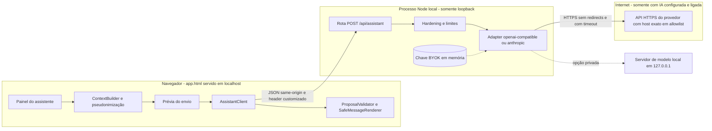

- A rota vive no mesmo processo e na mesma origem de `scripts/dev-server.mjs`, que continua escutando somente em loopback; se o endereço de escuta não for loopback, a rota não é registrada.
- Sem `PLANNERDUO_AI_ADAPTER` válido, a rota responde somente `op: "status"` com `available: false`; hospedagem estática, offline ou servidor antigo resultam em 404, 405 ou erro de rede, todos mapeados para “Assistente indisponível”.
- A CSP de `app.html` muda somente `connect-src 'none'` → `connect-src 'self'`; `img-src 'self' data:`, `script-src 'self'`, `form-action 'self'`, `base-uri 'none'`, `object-src 'none'` e `frame-ancestors 'none'` permanecem.
- O processo do proxy é o único lugar com chave e acesso à internet; `.env.local` fica na raiz do repositório, fora de `public/`, e por isso nunca é servido pelo servidor estático.

### 7.10.2 Configuration and key confinement

| Variável | Regra |
|---|---|
| `PLANNERDUO_AI_ADAPTER` | `openai-compatible` ou `anthropic`; ausente ou inválida mantém o chat inativo |
| `PLANNERDUO_AI_MODEL` | obrigatório; `[A-Za-z0-9._:/-]{1,128}`; exibido no consentimento |
| `PLANNERDUO_AI_API_KEY` | obrigatório para provedor remoto; lido uma vez e mantido na closure do adapter; nunca logado, ecoado ou devolvido |
| `PLANNERDUO_AI_BASE_URL` | opcional; padrão por adapter; validado conforme 7.10.3 |
| `PLANNERDUO_AI_ALLOW_LOCAL_MODEL` | `1` permite `http://127.0.0.1`, `http://[::1]` ou `http://localhost` com porta explícita diferente da porta do próprio servidor |
| `PLANNERDUO_AI_MAX_OUTPUT_TOKENS` | 64–4.096; padrão 800 |
| `PLANNERDUO_AI_TIMEOUT_MS` | 5.000–60.000; padrão 30.000 |
| `PLANNERDUO_AI_RATE_PER_MINUTE` | 1–30; padrão 10 |
| `PLANNERDUO_AI_DAILY_REQUEST_CAP` | 1–10.000; padrão 100 |
| `PLANNERDUO_AI_DAILY_TOKEN_CAP` | 1.000–5.000.000; padrão 200.000 |

- Fontes: variáveis de ambiente do processo, com precedência, e `.env.local` na raiz, lido de forma nativa (por exemplo `process.loadEnvFile` quando disponível, ou um parser mínimo próprio), sem dependência.
- O `.gitignore` atual já ignora `.env` e `.env.*` e mantém somente `.env.example`, que terá apenas nomes de variáveis sem valores.
- Configuração inválida desativa o chat e registra somente o nome da variável e o motivo, nunca o valor.
- O chat não é ativado se `NODE_TLS_REJECT_UNAUTHORIZED=0` estiver definido.

### 7.10.3 Proxy hardening pipeline

Cada falha encerra a requisição antes de qualquer chamada upstream.

| # | Verificação | Regra | Resposta |
|---|---|---|---|
| 1 | Escuta | somente loopback; caso contrário a rota não existe | — |
| 2 | Rota e método | path exato `/api/assistant`; somente `POST`; `OPTIONS` e demais métodos recebem 405 sem nenhum header `Access-Control-*` | 405 |
| 3 | Host | exatamente `localhost:PORT`, `127.0.0.1:PORT` ou `[::1]:PORT` (defesa contra DNS rebinding) | 403 `assistant/forbidden` |
| 4 | Origin | presente e igual à origem `http://` correspondente ao Host aceito; `Sec-Fetch-Site`, quando presente, igual a `same-origin` (defesa contra CSRF) | 403 `assistant/forbidden` |
| 5 | Headers | `Content-Type: application/json` (charset UTF-8 opcional) e `X-PlannerDuo-Assistant: 1`, que força preflight em qualquer tentativa cross-origin | 415 / 403 |
| 6 | Corpo | `Content-Length` até 64 KiB e leitura em stream abortada ao exceder; JSON UTF-8 estrito | 413 / 400 `assistant/request-invalid` |
| 7 | Schema | `AssistantStatusRequest` ou `AssistantChatRequest` (8.6), sem campo desconhecido e dentro dos limites | 400 `assistant/request-invalid` |
| 8 | Rate limit | janela por minuto e no máximo 1 chat em voo | 429 `assistant/local-rate-limited` com `Retry-After` |
| 9 | Custo | teto diário de requisições e tokens; `max_tokens` definido pelo proxy, nunca pelo navegador | 429 `assistant/daily-cap-reached` |
| 10 | Upstream | host exato validado; `redirect: "error"`; timeout por `AbortSignal`; resposta lida até 256 KiB | 502 / 504 mapeados |
| 11 | Normalização | extrai texto e propostas brutas; descarta o resto; o corpo upstream nunca é repassado | 200 `AssistantResponse` |
| 12 | Log | somente `ProxyMetadataLog` (8.6) | — |

As respostas da rota usam `Content-Type: application/json; charset=utf-8`, `Cache-Control: no-store`, `X-Content-Type-Options: nosniff`, `X-Frame-Options: DENY` e a mesma CSP restritiva, sem cookies e sem headers CORS.

Validação anti-SSRF da base URL, feita uma vez na inicialização:

- parse estrito; sem credenciais, query ou fragmento; path igual ao prefixo fixo do adapter;
- remoto: `https:` e hostname exatamente igual ao da allowlist do adapter (`api.openai.com` para `openai-compatible` e `api.anthropic.com` para `anthropic`); IP literal, porta customizada, wildcard e sufixo são rejeitados;
- local: somente com `PLANNERDUO_AI_ALLOW_LOCAL_MODEL=1`, `http:` e hostname exatamente `127.0.0.1`, `::1` ou `localhost`, com porta explícita e diferente da porta do servidor;
- o navegador nunca envia URL, host, path, modelo ou headers upstream; ampliar a allowlist exige mudança de código com gate do `security-analyst`.

### 7.10.4 Provider adapters

| Adapter | Requisição | Resposta usada |
|---|---|---|
| `openai-compatible` | `POST {base}/chat/completions` com `Authorization: Bearer` (omitido para modelo local sem chave), `model`, `messages` (instruções fixas e histórico), `max_tokens` e, quando suportado, `tools` gerados do catálogo 7.10.6 | `choices[0].message.content`, `tool_calls[].function` como propostas brutas e `usage` |
| `anthropic` | `POST https://api.anthropic.com/v1/messages` com `x-api-key`, `anthropic-version` fixo e revisado, `model`, `max_tokens`, `system`, `messages` e `tools` do catálogo | blocos `text`, blocos `tool_use` como propostas brutas e `usage` |

- O adapter `openai-compatible` cobre a API da OpenAI e servidores locais compatíveis, como Ollama e LM Studio em loopback — a opção privada, sem envio de dados à internet; servidor local sem suporte a `tools` opera em modo somente texto, sem propostas.
- Bedrock é decisão futura (assinatura SigV4 e credenciais AWS sem dependência nova).
- O modelo é configurado somente no servidor.
- Não há streaming na primeira versão nem loop de ferramentas: uma mensagem gera exatamente uma chamada upstream, e resultados de ferramentas nunca são reenviados automaticamente ao modelo.
- As instruções fixas são versionadas (`promptVersion`) e declaram que o conteúdo de `context` é dado, não instrução; a segurança não depende delas, e sim de capacidades limitadas, validação local e confirmação humana.
- O catálogo de ferramentas tem fonte única: `public/modules/assistant/proposal-schemas.js`, em formato UMD como `core.js`, carregado pelo navegador e pelo proxy (`createRequire`), para que os schemas enviados ao modelo e os de validação nunca divirjam.

### 7.10.5 Consent, preview and minimization

Consentimento:

- `settings.assistant.enabled = false` em todo workspace novo ou migrado.
- Ativar exige o diálogo “Ativar assistente com {provedor}”, que mostra a partir de `op: "status"` o provedor, host e modelo e se o modelo é local; o que é enviado por agente temático; o que nunca é enviado; a necessidade de internet (exceto modelo local); a cobrança na chave do usuário; o tratamento pelo provedor conforme os termos dele; as conversas somente em memória; e como desligar.
- O aceite grava `settings.assistant.consent = { adapterId, host, model, consentVersion, grantedAt }` nos dados protegidos; se o `status` divergir, o assistente pausa até novo aceite. Desligar apaga consentimento e conversas.
- O diálogo segue princípios da LGPD (finalidade, necessidade e transparência), sem constituir parecer jurídico.

Prévia do envio:

- Antes de cada envio, “Prévia do envio” mostra o JSON canônico exato de `AssistantChatRequest` e a versão das instruções fixas, com o texto completo disponível.
- O cliente serializa uma única vez; a mesma string é exibida e usada como corpo. Mudar qualquer opção gera nova prévia.
- A prévia abre expandida no primeiro envio da sessão e pode ficar sempre visível.

Minimização pelo `ContextBuilder` (9.18):

- Projeção por allowlist de campos do agente temático (7.9.1), com até 50 itens por lista e 16 KiB serializados.
- Nunca enviados: senha, material de chave, envelope ou header técnico, marcadores de sessão, e-mail ou nome da conta, dados de recuperação, backups, identificadores diagnósticos, localizadores, endereços, nomes reais de participantes e IDs internos.
- Participantes viram “Participante A”, “Participante B” etc.; entidades viram referências locais (`T1`, `Q2`, `S3`); o mapa de reversão existe só em memória durante a conversa.
- Notas livres e endereços só entram por opt-in explícito na mensagem (“Incluir notas desta viagem”), truncados a 1.000 caracteres por item.
- Texto livre entra somente como valor JSON em `context`, nunca concatenado às instruções.

### 7.10.6 Proposal tools and human confirmation

| Ferramenta | Efeito ao aplicar | Command | Restrições principais |
|---|---|---|---|
| `trip.create` | cria viagem | `createTrip` | destino obrigatório e datas válidas |
| `trip.update` | edita campos allowlisted de uma viagem | `updateTrip` | referência válida, fingerprint da entidade e nenhuma exclusão |
| `quote.create` | registra cotação | `createQuote` | `providerId` do censo ou rótulo livre; valores inteiros; validade futura |
| `quote.compare` | abre a comparação | somente leitura | 2 a 4 cotações da mesma viagem |
| `expense.create` | lança gasto | `createFinance` v2 | moeda do catálogo; câmbio escolhido pelo usuário no card quando a moeda difere da referência |
| `reissue.simulate` | salva simulação | `saveReissueSimulation` | entradas informadas; resultado recomputado localmente |
| `reminder.create` | cria lembrete ou prazo | `createReminder` | `dueAt` válido |
| `checklist.create` | cria item de checklist | `createChecklistItem` | texto de até 200 caracteres |
| `search.link` | monta link de busca | `PlannerTravel.build` e `TrustedProviderGate` | abrir o site exige outro clique no link |

Efeitos proibidos e ausentes do catálogo: excluir ou arquivar registros; exportar, importar ou restaurar backup; alterar senha, conta, sessão ou bloqueio; alterar consentimento ou configurações do assistente; alterar participantes, taxas de câmbio ou regras de IOF/taxas; abrir URL; contatar provedor.

Regras de confirmação:

- Cards são montados pela UI local a partir de propostas validadas; texto da IA não cria botões, cards ou links fora de 7.10.7.
- “Aplicar sugestão” exige evento confiável (`isTrusted`) no botão do próprio card; cada `proposalId` é de uso único; o estado `APPLYING` bloqueia clique duplo.
- No máximo 5 propostas por resposta, cada uma com exatamente um command; não existe “aplicar todas”.
- Antes de executar, a proposta é revalidada contra o workspace atual; em `trip.update`, fingerprint divergente leva a `CONFLICT` e exige nova revisão.
- Totais sugeridos pela IA, como o custo de uma remarcação, são ignorados e recomputados localmente; divergência aparece como aviso.
- “Editar antes de aplicar” abre o formulário manual pré-preenchido, e o salvamento segue o fluxo normal.

### 7.10.7 Safe rendering and link policy

- `SafeMessageRenderer` (9.21) aceita um subconjunto mínimo de markdown: parágrafos, quebras de linha, `**negrito**`, `*itálico*`, código inline, listas com até 2 níveis e títulos exibidos como texto forte.
- Toda saída usa `createElement` e `textContent`; elementos permitidos: `p`, `br`, `strong`, `em`, `code`, `ul`, `ol`, `li` e `a` somente para links aprovados; atributos permitidos: `href`, `rel`, `target` e `referrerpolicy` nesses links e classes de uma lista fixa.
- HTML bruto aparece como texto literal; imagens markdown viram “[imagem omitida]”; tabelas, iframes, mídia, `data:` e `javascript:` nunca são renderizados.
- Limites: 8.000 caracteres e 200 linhas por resposta, com excedente truncado e avisado; código inline de até 200 caracteres.
- URLs `https://` detectadas só viram link se `TrustedProviderGate.validateNavigation` aceitar host exato e parâmetros allowlisted; o texto visível mostra o host real, e a abertura exige clique com `noopener`, `noreferrer` e `referrerpolicy="no-referrer"`. A sintaxe `[texto](url)` é exibida como “texto (url)” para impedir rótulo enganoso. Qualquer outro URL é texto inerte.
- Não há prefetch ou preload; `img-src 'self' data:` continua bloqueando imagens externas como defesa em profundidade.
- `public/modules/assistant/**` não contém `innerHTML`, `outerHTML`, `insertAdjacentHTML`, `document.write` nem `eval`.

### 7.10.8 Conversation memory, degradation and cost control

- Conversas ficam somente na memória da aba e são apagadas em bloqueio, saída, auto-lock por inatividade, expiração da sessão de 8 h, desligamento do assistente, mudança de consentimento e fechamento da página; nunca vão para `localStorage`, `sessionStorage`, IndexedDB, workspace, backup ou diagnóstico. Persistência cifrada é decisão aberta.
- Cada requisição leva no máximo as 12 mensagens mais recentes; o corte é avisado, sem resumo automático por IA.
- Degradação: sem proxy, offline ou em hospedagem estática, o painel mostra “Assistente indisponível” e o restante do app funciona igual; erros seguem 13.4, preservam o texto digitado e nunca alteram dados.
- Custo: `max_tokens` por requisição, limites de corpo e de contexto, rate limit e contador diário de requisições e tokens (uso informado pelo provedor ou estimativa de 1 token a cada 4 caracteres), exibido como “Uso hoje: N de M”. O contador fica na memória do proxy e zera à meia-noite local; sua persistência é decisão aberta.

### 7.10.9 Assistant interfaces

```pascal
INTERFACE AssistantClient
  METHOD status() RETURNS Promise<AssistantStatus OR AssistantUnavailable>
  METHOD send(serialized_request: CanonicalJsonText) RETURNS Promise<AssistantResponse OR AssistantError>
END INTERFACE

INTERFACE ContextBuilder
  METHOD build(workspace, agent: ThematicAgentId, trip_id, options: ContextOptions, today)
    RETURNS { context: MinimalContext, refs: MemoryOnlyRefMap, serialized: CanonicalJsonText }
END INTERFACE

INTERFACE ProposalValidator
  METHOD validate(raw: UntrustedProposal, refs, workspace, agent, now)
    RETURNS ValidatedProposal OR ProposalRejection
END INTERFACE

INTERFACE ProposalExecutor
  METHOD execute(proposal: ValidatedProposal, gesture: TrustedGesture) RETURNS Promise<ProposalOutcome>
END INTERFACE

INTERFACE SafeMessageRenderer
  METHOD render(text: UntrustedText, gate: TrustedProviderGate) RETURNS DocumentFragment
END INTERFACE

INTERFACE AssistantProxy                          // processo Node local
  METHOD handle(request: IncomingHttpRequest) RETURNS HttpResponse OR NotHandled
END INTERFACE

INTERFACE ProviderAdapter
  METHOD buildUpstream(instructions: FixedInstructions, request: ValidatedChatRequest, limits)
    RETURNS UpstreamRequest
  METHOD parse(status: Integer, body: BoundedJson) RETURNS NormalizedCompletion OR UpstreamError
END INTERFACE
```

## 7.11 Travel Operations and Trip Finance Components

### 7.11.1 Money rules

- Moedas suportadas vêm de um catálogo local ISO 4217 com o expoente da unidade menor. Catálogo inicial: BRL, USD, EUR, GBP, ARS, CLP (0), UYU, PYG (0), COP, PEN, MXN, CAD, AUD, CHF e JPY (0); as demais têm expoente 2. Moeda fora do catálogo é rejeitada, e ampliar o catálogo exige gate do `trip-finance-specialist`.
- Todo valor persistido é inteiro seguro em `[0, MAX_AMOUNT × 10^expoente]`, preservando `MAX_AMOUNT = 1_000_000_000` em unidades maiores; agregados usam aritmética inteira verificada (BigInt interno) e falham com erro explícito em vez de transbordar.
- A moeda de referência é `settings.currency` (BRL); orçamento, acertos e relatórios consolidados usam `baseAmountMinor`. Tornar a referência configurável é decisão aberta.
- A taxa de câmbio é manual e datada: 1 unidade da moeda estrangeira vale `rate` unidades da moeda de referência (por exemplo, 1 USD = 5,50 BRL), decimal positivo com até 12 dígitos significativos. A seleção usa o par exato com a data mais recente não posterior à do gasto, sem inversão implícita, e o gasto guarda um `FxSnapshot` que não muda quando a tabela muda.
- O total de um gasto na referência é `totalBaseMinor = baseAmountMinor + Σ fees[].amountMinor`; orçamento, acertos, parcelamentos e relatórios usam sempre esse total.
- IOF e demais taxas são `FeeRule` criadas pelo usuário (percentual em pontos-base ou valor fixo na moeda de referência); o código não contém alíquota, e sem regra nenhuma taxa é aplicada.
- O arredondamento é único, `HALF_EVEN`, para conversão e percentuais; restos de divisão (acertos e parcelas) são distribuídos em ordem determinística.
- Um parcelamento distribui `totalMinor` em 1 a 48 parcelas; o gasto entra uma vez no orçamento da viagem e as parcelas entram somente na previsão de caixa.

### 7.11.2 Journey and reservation lifecycle

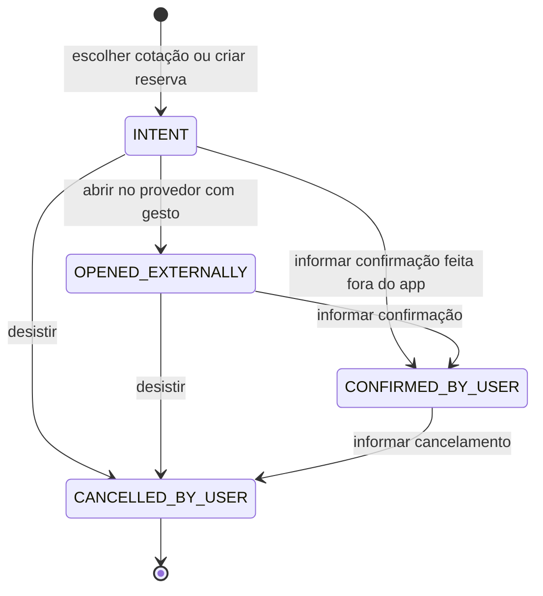

- Cotação: `OPEN → CHOSEN` ou `OPEN → DISCARDED`; `EXPIRED` é derivado de `validUntil`, e escolher uma cotação expirada exige reconfirmar valor e validade.
- `CONFIRMED_BY_USER` resulta sempre de formulário preenchido pelo usuário; o sistema não verifica nem consulta o provedor.
- O localizador é dado sensível: fica nos dados protegidos e não aparece em alertas, diagnósticos, logs, contexto de IA nem no resumo exportado, salvo escolha explícita do usuário no resumo.

### 7.11.3 Domain services

```pascal
INTERFACE QuoteService
  METHOD create(workspace, input: QuoteInput) RETURNS Command
  METHOD choose(quote_id) RETURNS Command
  METHOD compare(quotes, rates, reference_currency, now) RETURNS QuoteComparison
END INTERFACE

INTERFACE ReservationService
  METHOD fromQuote(quote) RETURNS ReservationDraft           // status INTENT
  METHOD markOpenedExternally(reservation_id) RETURNS Command
  METHOD recordUserConfirmation(reservation_id, input: UserConfirmationInput) RETURNS Command
  METHOD recordUserCancellation(reservation_id) RETURNS Command
END INTERFACE

INTERFACE PostSaleService
  METHOD simulateReissue(input: ReissueInput) RETURNS ReissueResult     // puro
  METHOD recordSeat(segment_id, seat) RETURNS Command
  METHOD recordBaggage(segment_id, allowance) RETURNS Command
  METHOD markCheckIn(segment_id, done) RETURNS Command
END INTERFACE

INTERFACE MoneyService
  METHOD parse(decimal_text, currency) RETURNS MinorAmount OR MoneyError
  METHOD format(minor, currency) RETURNS Text                           // Intl pt-BR
  METHOD selectRate(rates, from, to, on_date) RETURNS Optional<ExchangeRate>
  METHOD convert(minor, from, to, rate) RETURNS MinorAmount
  METHOD applyFees(base_minor, rules, payment_method, is_foreign, on_date) RETURNS List<AppliedFee>
END INTERFACE

INTERFACE InstallmentService
  METHOD schedule(plan) RETURNS OrderedList<Installment>
  METHOD forecast(workspace, from_month, months) RETURNS List<MonthlyForecast>
END INTERFACE

INTERFACE SettlementService
  METHOD settle(workspace, trip_id) RETURNS SettlementResult             // centavos da referência
END INTERFACE

INTERFACE ReportService
  METHOD tripReport(workspace, trip_id) RETURNS TripReport
  METHOD summaryText(report, options: ExportOptions) RETURNS PlainText   // copiar ou exportar localmente
END INTERFACE
```

`SettlementService` reutiliza o algoritmo de `PlannerCore.calculateSettlements` sobre `totalBaseMinor`, preservando a conservação em unidades menores da referência. `ReportService.summaryText` gera texto local para copiar ou baixar; é a única ponte com WhatsApp e e-mail, e quem cola o texto é o usuário.

## 7.12 Orquestrador autônomo e runtime de skills (escopo de implementação 2026-09-29)

### 7.12.1 Escopo e precedência

A diretiva de 29/09/2026 transforma o PlannerDuo em uma plataforma de agentes autônomos orientados a skills, com orquestração inteligente e UI minimalista e futurista, mantendo a Blis.AI como referência apenas conceitual (decisão 22). A execução tem quatro etapas estritamente sequenciais, cada uma iniciada só após o gate da anterior (14.13): (1) orquestrador e runtime de skills (7.12); (2) Agente de Viagens com busca de mercado (7.13); (3) refatoração visual e caça a bugs visuais (7.14 e 7.8.11); (4) integração final, estresse e zero falhas (Property 6). Onde o texto anterior diverge, vale este adendo dentro do escopo:

| Trecho anterior | Regra neste escopo |
|---|---|
| Overview, 2.2 e decisão 24 (só o assistente acessa a internet, pelo proxy local); seções 3 e 7.1 (servidor com rota única); 7.10.1–7.10.3 (`/api/assistant`, `X-PlannerDuo-Assistant`, `PLANNERDUO_AI_ADAPTER`) | 7.13.2: quatro rotas `POST`, `X-PlannerDuo: 1` e `PLANNERDUO_AI_PROVIDER`; o mesmo processo em loopback consulta Duffel e LiteAPI (decisão 33); `connect-src 'self'` continua só em `app.html` |
| 2.2 (preço em tempo real) e 22 (item deferido de preço/availability) | Busca de ofertas permitida; reserva, emissão, pagamento e pedidos continuam fora |
| Seções 5.2 e 7.1 (`assistant-client.js` como único `fetch`), 14.11–14.12 e Properties 2.38, 2.45, 5.1 (rede com IA desligada) e 5.2 | Property 6.13 e 14.13: único `fetch` em `market-client.js`, para quatro paths same-origin, após mensagem ou ação do usuário, salvo um `POST /api/status` ao abrir a Central |
| 7.10.5 e 8.5 (`settings.assistant` persistido) | Schema v2 adiado: o consentimento da IA fica só na memória da sessão e é renovado a cada desbloqueio |
| 7.7 e 7.9.1 (Painel como tela inicial) e 7.9.4 (valores dos tokens) | 7.14: Central como tela inicial e tokens próprios |
| 7.8.2–7.8.10 (admissão completa de marcas) | 7.8.11: aquisição enxuta; os gates completos continuam alvo de release |

### 7.12.2 Agentes de runtime

| Agente | Responsabilidade | Presets de 7.9.1 absorvidos |
|---|---|---|
| `orchestrator` (Orquestrador) | Interpreta, planeja, executa e compõe a resposta; ajuda e “Desfazer” | — |
| `travel` (Agente de Viagens) | Viagens, voos, hospedagens e links dos 26 provedores | Cotações, Hospedagem e trechos do Roteiro |
| `finance` (Agente Financeiro) | Transações, recorrência, orçamentos, metas, acertos e relatórios | Financeiro |
| `planner` (Agente de Planejamento) | Checklist, decisões e votos, participantes e workspace | Checklist do Roteiro |

São agentes de runtime do produto, registrados só no `PlannerSkills`, e não se confundem com a equipe Kiro de 7.2: o `orchestrator` de runtime não é o despachante de 5.1 (decisão 30). O preset Remarcação depende do schema v2 e fica fora deste escopo.

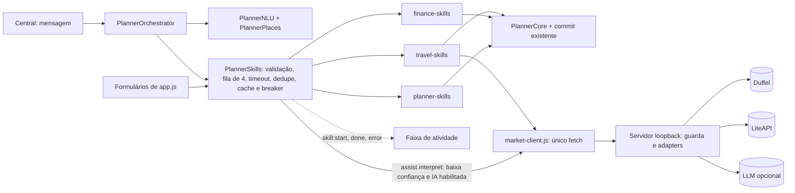

### 7.12.3 Módulos e interfaces

```text
public/modules/
  agents/places.js         # PlannerPlaces: cidades brasileiras e destinos internacionais, aliases sem acento, IATA, ISO-2 e coordenadas
  agents/nlu.js            # PlannerNLU: normalização, intents em allowlist, entidades e follow-ups
  agents/ranking.js        # PlannerRanking: política estrita e score (7.13.4), puro
  agents/skill-runtime.js  # PlannerSkills: registry, validação, fila, timeout, dedupe, cache, breaker e retry
  agents/market-client.js  # PlannerMarketClient: único fetch do navegador (7.13.2)
  agents/orchestrator.js   # PlannerOrchestrator: turnos, plano, eventos e blocos tipados
  skills/travel-skills.js, finance-skills.js, planner-skills.js   # register(runtime) por agente
  ui/central-view.js       # blocos renderizados com builders DOM seguros, sem innerHTML
```

Todos seguem o UMD de `core.js` (`module.exports` e global), são testáveis no Vitest e carregam por `<script>` em `app.html` depois das fachadas atuais, na ordem acima; `app.js` compõe o runtime com o `commit` existente.

```pascal
INTERFACE SkillRuntime                      // PlannerSkills.createRuntime({ core, commit, travel, market, clock })
  METHOD define(definition: SkillDefinition) RETURNS Void            // valida e congela; id duplicado lança
  METHOD invoke(id, input, opts: { source: CHAT OR UI, signal, turnId }) RETURNS Promise<Output>
  METHOD on(event: skill:start OR skill:done OR skill:error, handler) RETURNS Unsubscribe
  METHOD reset() RETURNS Void                                         // fila, cache e breakers; ao bloquear/sair
END INTERFACE

STRUCTURE SkillDefinition
  id: SkillId                               // ^[a-z]+(\.[a-z-]+)+$, único
  agent: orchestrator OR travel OR finance OR planner
  kind: read OR write;  exposure: NonEmptySet<chat OR ui>;  timeoutMs: 100..30000
  cache: Optional<{ ttlMs, maxEntries }>    // somente read
  validate(input) RETURNS { ok: true, value } OR { ok: false, fields: List<FieldError> }
  run(value, ctx: { signal, now, core, commit, travel, market }) RETURNS Promise<Output>
END STRUCTURE

STRUCTURE ParsedMessage                     // PlannerNLU.parse(text, context, clock): total, nunca lança
  intent: AllowlistedIntent OR unknown;  confidence: Real em [0, 1];  followUp: Boolean;  missing: OrderedList<SlotName>
  slots: { origin, destination: Place; departDate, returnDate: IsoDate; nights: 1..30; adults: 1..9;
           childrenAges: List<0..17>; cabin; directOnly; maxPriceMinor; amountMinor; financeType; category; tripRef;
           description }                  // texto livre extraído do original, sem normalização
END STRUCTURE

STRUCTURE ResponseBlock                     // PlannerOrchestrator: handle(text), act(blockId, action, gesture), clear()
  id; turnId; agent: RuntimeAgentId
  type: text OR question OR flights OR stays OR links OR summary OR receipt OR confirmation OR error
  payload: TypedPayload                     // dados, nunca HTML; renderizados com textContent
END STRUCTURE
```

- Intents em allowlist: `travel.search`, `travel.flights`, `travel.stays`, `travel.links`, `trip.create`, `trip.list`, `finance.add`, `finance.summary`, `finance.settle`, `budget.set`, `goal.create`, `goal.progress`, `checklist.add`, `checklist.list`, `decision.create`, `decision.vote`, `report.month`, `help`, `undo` e `unknown`.
- `normalize` (NFD sem diacríticos, minúsculas, espaços e pontuação canônicos, até 1.000 caracteres) é idempotente. Datas absolutas (“12/11”, “12 de novembro”) e relativas (“amanhã”, “próxima sexta”, “daqui a 2 semanas”) usam o relógio injetado e o fuso do dispositivo; em viagens, dia/mês já passado vai para o ano seguinte; “de 10 a 15/11”, “volta dia 20” e “por 5 noites” definem o intervalo; mês sem dia vira pergunta. `PlannerPlaces.resolve` devolve `match`, `ambiguous` (pergunta com chips) ou `none`; “eu e minha esposa” conta 2 adultos, e criança entra com a idade.
- Erros do runtime: `skill/not-found`, `skill/invalid-input`, `skill/timeout`, `skill/aborted`, `skill/circuit-open` e `skill/failed`, com `skillId`, `retryable` e `fields`; a copy vem de tabela fixa pt-BR, sem causa bruta.

### 7.12.4 Invocação de skills

```pascal
PROCEDURE Invoke(id, input, opts)
  def ← registry[id]
  IF def IS NULL OR opts.source NOT IN def.exposure THEN RAISE skill/not-found     // skill de UI é invisível ao chat
  v ← def.validate(input);  IF NOT v.ok THEN RAISE skill/invalid-input(v.fields)
  key ← id + ":" + CanonicalJson(v.value)
  IF def.kind = read AND cache.fresh(key) THEN RETURN cache.get(key)                // TTL + LRU, só em memória
  IF def.kind = read AND inflight.has(key) THEN RETURN inflight.join(key, opts.signal)   // dedupe
  FOR attempt ← 1 TO 2 DO
    IF breaker.isOpen(id) THEN RAISE skill/circuit-open             // 3 falhas seguidas → 30 s aberto; depois 1 prova
    signal ← AnySignal(opts.signal, TimeoutSignal(def.timeoutMs))   // AbortSignal.any ou composição manual
    outcome ← limiter.run(def.kind, () ⇒ def.run(v.value, Context(signal)))   // ≤ 4 em execução
    IF outcome.ok THEN breaker.success(id);  CacheIfRead(def, key, outcome.value);  RETURN outcome.value END IF
    IF outcome.code IN { skill/aborted, skill/invalid-input } THEN RAISE outcome.error   // fora do breaker
    breaker.failure(id)
    IF NOT (def.kind = read AND outcome.retryable AND attempt = 1) THEN RAISE outcome.error   // timeout ou failed
    WAIT Backoff(300 ms + jitter injetado, opts.signal)
  END FOR
END PROCEDURE
```

Invariantes: no máximo 4 execuções simultâneas, com escrita à frente na fila FIFO; no máximo 2 tentativas, a segunda só em leitura com erro `retryable`; toda leitura nova registra uma execução compartilhada em `inflight`, abortada só quando todos os interessados abortam; `skill/aborted` e `skill/invalid-input` não contam no breaker; escritas nunca são deduplicadas nem cacheadas; fila, cache e breakers vivem só em memória.

### 7.12.5 Turno do orquestrador

```pascal
PROCEDURE HandleTurn(text)
  current.abort();  turn ← NewTurn();  t ← Truncate(text, 1000)  // supersessão do turno anterior
  parsed ← PlannerNLU.parse(t, memory, clock)
  IF parsed.confidence < 0.45 AND AiEnabled() THEN                  // no máximo 1 chamada remota por turno
    remote ← runtime.invoke("assist.interpret", { text: t, pending: parsed.missing }, { source: CHAT, signal: turn.signal })
    IF ValidInterpretation(remote) THEN parsed ← Merge(parsed, remote, origin = REMOTE) END IF
  END IF
  plan ← BuildPlan(parsed, memory, AutonomyPolicy)                  // puro; escrita sem autonomia vira confirmation
  IF plan.missing ≠ ∅ THEN EMIT question(plan.missing[0], Chips(plan.missing[0]));  RETURN END IF
  FOR each stage IN plan.stages DO                                  // ex.: [voos ‖ hospedagem ‖ links] → resumo
    FOR each settled IN AsCompleted(stage.steps, RunStep(turn)) DO   // invoke com source CHAT e turn.signal
      IF turn.superseded THEN RETURN                                // resultado tardio nunca renderiza
      EMIT BlockFor(settled)                                        // renderização progressiva
    END FOR
  END FOR
  memory ← Remember(memory, parsed)                                 // só em memória; limpa ao bloquear/sair
END PROCEDURE
```

- Pergunta, recibo e links locais aparecem em até 100 ms após o envio, e buscas mostram skeleton imediato e blocos progressivos. Os slots obrigatórios vêm do `validate` de cada skill, e só o primeiro faltante é perguntado (ex.: “Quem pagou?” com chips dos participantes). Não há polling nem re-planejamento automático após falha; follow-ups (“e para 3 pessoas?”, “só direto”, “e em dezembro?”) reutilizam os slots da última busca; falha de skill vira bloco `error` com ação segura (“Tentar de novo” ou links), nunca stack ou corpo upstream.

### 7.12.6 Catálogo de skills

| Skill | Agente | Tipo | Exposição | Encapsula |
|---|---|---|---|---|
| `travel.flights.search`, `travel.stays.search` | travel | read | chat, ui | `market-client` + `PlannerRanking` (7.13) |
| `travel.links.build`, `travel.trip.list`, `travel.trip.summary` | travel | read | chat, ui | `PlannerTravel.validate`/`build` dos 26 provedores; viagens com orçamento, gasto e guardado |
| `travel.trip.create`, `travel.trip.update` | travel | write | chat, ui | formulário de viagem e “Salvar como viagem” |
| `finance.transaction.create`, `finance.budget.set`, `finance.goal.create`, `finance.goal.update` | finance | write | chat, ui | receita/gasto com pagador, divisão, `tripId` e recorrência; orçamento por categoria; metas |
| `finance.summary`, `finance.settlements`, `finance.report` | finance | read | chat, ui | totais, `calculateSettlements` e relatório mensal |
| `finance.transaction.update`, `finance.recurring.materialize`, `finance.report.csv` | finance | write, read | ui | edição, `materializeRecurring` e CSV local |
| `planner.checklist.add`, `planner.checklist.toggle`, `planner.decision.create`, `planner.decision.vote`, `planner.decision.close`, `planner.participant.add`, `planner.workspace.rename` | planner | write | chat, ui | checklist, decisões (`vote`), participantes e nome do workspace |
| `planner.checklist.list`, `planner.decision.list` | planner | read | chat, ui | listagens |
| `*.delete`, `planner.participant.remove`, `planner.workspace.reset` | do domínio | write | ui | exclusões, `removeFinance`, `removeParticipant` e reset |
| `planner.backup.export`, `planner.backup.import`, `planner.account.password`, `planner.account.lock`, `planner.account.destroy`, `planner.security.settings` | planner | read, write | ui | backup, conta e segurança via `PlannerLocal` |
| `assist.help`, `assist.interpret`, `assist.undo` | orchestrator | read, write | chat (`assist.undo` também ui) | ajuda contextual, interpretação remota opcional (7.12.7) e desfazer o último recibo |

Toda skill de escrita usa o `commit` existente (`Repository.update` com as validações de `PlannerCore`). UI e chat compartilham `validate` e `run`: os handlers de formulário de `app.js` passam a chamar `runtime.invoke(id, input, { source: UI })`, sem segundo caminho de escrita (decisão 9).

### 7.12.7 Política de autonomia

- **Leitura** (busca, listagem, resumo, cálculo e links) executa automaticamente e aparece na faixa de atividade.
- **Escrita por comando explícito local** (intent de escrita com confiança ≥ 0,75 e todos os slots extraídos localmente) executa uma vez e emite `receipt` com “Desfazer”, disponível por 30 s ou até a próxima escrita; o desfazer aplica a pré-imagem guardada em memória e é recusado, com aviso, se a entidade mudou.
- **Escrita com slot remoto ou confiança local < 0,75** vira `confirmation` com resumo campo a campo e só executa, uma vez, após clique confiável (`isTrusted`) no card (decisão 26).
- **Skills `exposure: ui`** nunca entram no plano; no chat, o orquestrador indica em `text` a tela onde fazer. **Navegação externa** só ocorre por clique em link validado pela allowlist de `PlannerTravel`, com `noopener` e `noreferrer`.
- **IA habilitada** significa `/api/status` com IA disponível e opt-in da sessão nomeando provedor, host e modelo. `interpret` envia só o texto digitado (≤ 1.000 caracteres) e os nomes dos slots pendentes, nunca dados do workspace; o JSON exato fica em “Ver envio” na faixa de atividade, aberto no primeiro envio da sessão (prévia de 7.10.5); a resposta só vale se passar no schema `{ intent ∈ allowlist, slots tipados, confidence ∈ [0, 1] }`, e a busca resultante é leitura do orquestrador local, não ação da IA.

## 7.13 Agente de Viagens e busca ativa de mercado

### 7.13.1 Fontes de mercado

O portal Self-Service da Amadeus for Developers foi desativado em 17/07/2026: as chaves self-service foram desligadas e só as APIs Enterprise seguem disponíveis ([PhocusWire](https://www.phocuswire.com/amadeus-shut-down-self-service-apis-portal-developers), [AirLabs](https://airlabs.co/amadeus-self-service-api-shutdown)), por isso a Amadeus fica fora. Voos usam a Duffel, cujo test mode é gratuito e responde com a companhia fictícia “Duffel Airways” ([quick start](https://duffel.com/docs/guides/quick-start), [test mode](https://duffel.com/docs/api/overview/test-mode)). Como o Duffel Stays exige pedido de acesso ([Stays](https://duffel.com/docs/guides/getting-started-with-stays)), hospedagem usa LiteAPI/Nuitee Connect com chave sandbox ([hotels/rates](https://docs.liteapi.travel/reference/post_hotels-rates), [estrutura da resposta](https://docs.liteapi.travel/docs/hotel-rates-api-json-data-structure)). Conteúdo das fontes parafraseado para conformidade com restrições de licenciamento.

### 7.13.2 Servidor local, rotas e configuração

```text
scripts/
  dev-server.mjs          # entrada: carrega a config, cria o app-server e escuta só em loopback
  server/app-server.mjs   # estáticos GET/HEAD, rewrites, roteador /api/* e CSP por página
  server/api-guard.mjs    # guarda comum das rotas /api/*
  server/config.mjs       # ambiente + .env.local (gitignored) com validação; nunca registra valores
  server/upstream.mjs     # fetch nativo com timeout, redirect: "error", host fixo e teto de bytes
  market/duffel-flights.mjs, market/liteapi-stays.mjs   # adapters de busca
  market/normalize.mjs    # respostas Duffel/LiteAPI → FlightOffer/StayOffer
  assistant/              # interpretação opcional: adapters openai-compatible e anthropic, JSON validado por schema
.env.example              # somente nomes de variáveis
```

Sem dependências (`node:http` e `fetch` nativo). A guarda roda antes de qualquer upstream: somente `POST` (demais métodos recebem 405 sem `Access-Control-*`); Host exatamente `localhost`, `127.0.0.1` ou `[::1]` na porta vinculada; Origin igual à origem do Host; `Sec-Fetch-Site`, quando presente, `same-origin`; `X-PlannerDuo: 1`; `Content-Type: application/json`; corpo ≤ 64 KiB lido em stream; JSON estrito sem `__proto__`, `constructor`, `prototype` ou campo desconhecido; rate limit por rota (mercado: 30/min e 2 em voo; interpretação: limites de 7.10.2) com `Retry-After`; sem CORS e sem cookies; respostas JSON com `Cache-Control: no-store` e `nosniff`.

| Rota | Entrada | Saída |
|---|---|---|
| `POST /api/status` | `{}` | `{ market: { flights: { configured }, stays: { configured, live } }, ai: { available, provider, host, model, local } }`, nunca chaves |
| `POST /api/market/flights` | `{ slices: [{ origin, destination, date }] (1–2), adults (1–9), childrenAges, cabin, directOnly }` | `{ offers: List<FlightOffer>, fetchedAt, truncated }` |
| `POST /api/market/stays` | `{ place, checkin, checkout, occupancies: [{ adults, childrenAges }] (1–4), refundableOnly }` | `{ offers: List<StayOffer>, fetchedAt, truncated }` |
| `POST /api/assistant/interpret` | `{ text (≤ 1.000), pending: List<SlotName>, today }` | `{ intent, slots, confidence }` validado por schema |

| Variável | Regra |
|---|---|
| `PLANNERDUO_DUFFEL_TOKEN` | `[A-Za-z0-9_-]{20,512}`; ausente ou inválida desliga só voos |
| `PLANNERDUO_LITEAPI_KEY` | prefixo `sand_`/`sandbox_` (teste, `live = false`) ou `prod_` (produção), conforme a [documentação da LiteAPI](https://docs.liteapi.travel/reference/prompt-for-vibe-coding-tools); outro desliga só hospedagem |
| `PLANNERDUO_AI_PROVIDER` (`openai-compatible` ou `anthropic`, no lugar de `PLANNERDUO_AI_ADAPTER`), `PLANNERDUO_AI_API_KEY`, `PLANNERDUO_AI_MODEL`, `PLANNERDUO_AI_BASE_URL` | Regras de 7.10.2–7.10.3, inclusive anti-SSRF |
| `PLANNERDUO_MARKET_CURRENCY` (`BRL`), `PLANNERDUO_GUEST_NATIONALITY` (`BR`) | ISO 4217 do catálogo de 7.11.1 e ISO 3166-1 alfa-2 |

- Ambiente tem precedência sobre `.env.local` (já ignorado por `.env.*`); erro de configuração desliga só o recurso afetado e registra o nome da variável, nunca o valor. Chaves vivem em closures dos adapters e nunca chegam ao navegador, logs, `public/`, workspace ou backups.
- Upstream: hosts fixos `api.duffel.com` e `api.liteapi.travel`, sem base URL configurável; `redirect: "error"`; tetos de 8 MiB e 4 MiB e timeouts de 15 s e 12 s. Acima de 1.000 voos ou 300 hospedagens, ficam as de menor preço (desempate por `id`), com `truncated: true`.
- Duffel: `POST /air/offer_requests?return_offers=true&supplier_timeout=10000` com `Authorization: Bearer`, `Duffel-Version: v2`, `Accept` e `Content-Type` JSON; corpo `data.slices` (`origin`, `destination`, `departure_date`), `passengers` (`{ type: "adult" }` ou `{ age }`), `cabin_class` e `max_connections` (0 com “direto”, senão 1).
- LiteAPI: `POST /v3.0/hotels/rates` com `X-API-Key`; `checkin`, `checkout`, `currency`, `guestNationality`, `occupancies[{ adults, children }]` e local por `cityName` + `countryCode` de `PlannerPlaces` (coordenadas com `radius` de 15.000 m se a cidade for ambígua); `limit: 50`, `maxRatesPerHotel: 3`, `timeout: 8`, `includeHotelData: true`, `minReviewsCount: 30` e `refundableRatesOnly` quando pedido. Nome, endereço e rating são lidos de forma defensiva em `data[]` ou na lista de hotéis anexa, por `hotelId`.
- Erros: `market/not-configured`, `market/forbidden`, `market/request-invalid`, `market/rate-limited`, `market/upstream-auth`, `market/upstream-unavailable`, `market/timeout` e `market/response-invalid`, sem repassar o corpo upstream; `interpret` usa os códigos `assistant/*` de 13.4. Testes injetam `fetchImpl` falso: zero chamadas reais.

### 7.13.3 Modelos normalizados

```pascal
STRUCTURE FlightOffer                            // transitório; nunca persistido
  id: OpaqueText;  source: "Duffel";  live: Boolean (live_mode);  fetchedAt;  expiresAt: Optional<Timestamp>
  price: { totalMinor: PositiveSafeInteger, currency: Iso4217 }    // total_amount (string) → unidades menores, sem float
  owner: { iata: Optional<Text>, name: Text }
  flexibility: { refundable, changeable: YES OR NO OR UNKNOWN }    // conditions.*.allowed
  slices: List<{                                                   // 1 ou 2
    origin, destination: IataCode;  durationMin: PositiveInteger  // ISO 8601 → minutos
    segments: List<{ from, to, departLocal, arriveLocal, durationMin, marketing: { iata, name, flightNumber },
                     operating: { iata, name }, cabin }>
    connections: List<{ airport, minutes, airportChange, overnight, international: Boolean }>
    baggage: { checked, carryOn: NonNegativeInteger OR UNKNOWN } }>  // mínimo entre segmentos do 1º adulto
END STRUCTURE

STRUCTURE StayOffer                              // transitório; nunca persistido
  id: OpaqueText (offerId);  hotelId;  source: "LiteAPI";  live: Boolean (prefixo da chave);  fetchedAt
  name: Text;  address: Optional<Text>;  stars: Optional<0..5>;  rating: Optional<0..10>;  reviews: Optional<Integer ≥ 0>
  nights: 1..30;  totalMinor, perNightMinor: PositiveSafeInteger;  currency: Iso4217
  board: Text;  breakfast: Boolean;  refundable: Boolean          // refundableTag = "RFN"
END STRUCTURE
```

- `departing_at` e `arriving_at` são horários locais de cada aeroporto: a conexão é a diferença entre chegada e partida no mesmo aeroporto, `overnight` indica que ela atravessa 00:00 local, e `international` vale quando um segmento adjacente cruza países (país desconhecido conta como internacional). Total da hospedagem: `offerRetailRate` ou, na ausência, a soma de `retailRate.total[0]` por quarto; `perNightMinor = HALF_EVEN(totalMinor / nights)`; `breakfast` e `stars` vêm de `boardName` e dos dados do hotel por allowlist. Textos externos são limpos (sem controle ou bidi, até 120 caracteres) e renderizados só com `textContent`.

### 7.13.4 Política estrita e ranking

```pascal
INTERFACE PlannerRanking                         // puro e determinístico; relógio injetado
  METHOD rankFlights(offers, criteria: { now, directOnly, maxPriceMinor }) RETURNS RankingResult
  METHOD rankStays(offers, criteria: { now, refundableOnly, maxPriceMinor }) RETURNS RankingResult
END INTERFACE

STRUCTURE RankingResult
  recommended: List<{ offer, score: 0..100, labels: Set<Label>, reasons: List<PtBrText> }>   // no máximo 5
  input, approved: NonNegativeInteger;  discarded: Map<DiscardReason, PositiveInteger>;  currency: Iso4217
END STRUCTURE
```

- **Voos**: cada oferta é aprovada ou descartada pela primeira regra violada, nesta ordem: `invalid` (estrutura, datas, duração ou preço ≤ 0); `currency` (moeda diferente da predominante; empate → `PLANNERDUO_MARKET_CURRENCY`); `expired` (`expiresAt ≤ now`); `unknown-carrier`; `price-ceiling`; `stops` (mais de 1 escala por trecho, ou qualquer escala com “direto”); `airport-change`; `short-connection` (< 60 min, ou < 90 min se internacional); `long-connection` (> 8 h, ou pernoite de 4 h ou mais); e, por último, `too-slow` (duração > 2× a da mais rápida entre as que passaram nas regras anteriores).
- **Hospedagem**: `invalid` (nome, noites ou preço), `currency`, `price-ceiling`, `not-refundable` (quando pedido), `unrated`, `low-rating` (< 7,5/10) e `few-reviews` (< 30, quando informado).
- **Score** inteiro de 0 a 100 (`HALF_EVEN`), com mínimos calculados sobre os aprovados. Voos: 45 × preçoMín/preço + 25 × duraçãoMín/duração + 10 × escalas (1 direto; 0,5 com uma) + 10 × bagagem (1 despachada; 0,5 só de mão; 0 desconhecida) + 5 × flexibilidade (1 reembolsável; 0,5 só remarcável) + 5 × horário (1 sem partida ou chegada entre 00:00 e 05:59 locais). Hospedagem: 45 × porNoiteMín/porNoite + 35 × rating/10 + 10 × reembolsável + 5 × café + 5 × estrelas/5.
- **Ordem e rótulos**: score desc, preço asc, duração asc (voos) e `id` asc. `best-value` é o 1º; `cheapest`, o menor preço (desempate por duração e `id`); `fastest`, a menor duração (desempate por preço e `id`); `flexible`, reembolsável ou, em voos, remarcável; `direct`, sem conexões.
- **Recomendados**: top 5, e `cheapest`/`fastest` fora dele substituem as últimas posições, mantendo a ordem por score; até 3 motivos por card, de uma tabela fixa pt-BR (“Menor preço entre as opções confiáveis”, “Direto”, “Conexão de 1 h 35 min em GRU”, “Bagagem despachada incluída”, “Nota 8,9 com 1.240 avaliações”), e resumo de descartes com contagem por motivo. No navegador, filtro e score rodam em fatias de até 500 ofertas por tarefa.
- **Honestidade**: todo preço mostra fonte e horário da consulta (“Duffel · consultado às 14:32”), a validade quando houver `expiresAt` e o selo “Ambiente de teste” quando `live = false`; não há conversão de moeda (o câmbio segue manual) nem preço inventado; a compra abre, por clique, um provedor do censo com rota e datas (a própria companhia quando for LATAM, GOL ou Azul).

### 7.13.5 Fluxo do Agente de Viagens

- O agente entende a mensagem em linguagem natural (7.12.3), sem comandos fixos, e pergunta só o que falta, um slot por vez e com chips (destino → origem → ida → volta ou noites); sem menção, passageiros = 1 adulto, exibido e editável no resumo.
- Voos e hospedagem, via `market-client.js` (único `fetch` do navegador: same-origin, `X-PlannerDuo: 1`, `AbortSignal` do turno e resposta validada por schema), e links locais rodam em paralelo, com timeouts de 20 s, 15 s e 1 s; links aparecem primeiro e skeletons ocupam o lugar das buscas. Cache: 5 min para voos (nunca além do menor `expiresAt`) e 10 min para hospedagem, em LRU de 50 entradas.
- Sem API configurada, com upstream indisponível, circuito aberto ou zero aprovados, o agente mostra os links dos 26 provedores confiáveis com rota e datas exatas, conforme o `deepLinkMode` de cada um, e o resumo de descartes, sem inventar preço. “Salvar como viagem” invoca `travel.trip.create` com destino, datas e a oferta escolhida em texto nas notas, com recibo e “Desfazer”.

## 7.14 Identidade visual minimalista e futurista

### 7.14.1 Tokens

```pascal
STRUCTURE VisualTokens                          // DARK padrão; LIGHT opcional com os mesmos papéis
  bg: #05060a + radial índigo #7c8cff (≤ 14%) + radial ciano #3ee0ff (≤ 10%)   // fixos, sem animação
  surface: rgba(255,255,255,.035) | raised .06, com backdrop-filter: blur(16px)
  surface_fallback: #0c0e14 | #13151c          // sem suporte a backdrop-filter
  line: rgba(255,255,255,.08) | strong .14
  text: #f4f6fb | muted #b4bccd | subtle #8e97ab                  // ≥ 4,5:1
  accent: linear-gradient(135deg, #7c8cff, #3ee0ff);  on_accent: #05060a (≥ 6,8:1)
  status: success #3ddc97 | warning #ffc857 | danger #ff6b7a | info #5cc8ff   // sempre com texto ou ícone
  font: "Inter", "Segoe UI Variable Text", "Segoe UI", system-ui, -apple-system, Roboto, sans-serif
  size: body 16 | secundário 14 | label 14 (mín. 13) | h3 20 | h2 24 | h1 clamp(28px, 3vw + 12px, 40px)
  space: 4, 8, 12, 16, 20, 24, 32, 40, 48, 64, 80, 96;  radius: 10 | 14 | 20 | 28 | pill 999
  elevation: borda + 0 8px 24px rgba(0,0,0,.35);  glow: 0 0 0 1px rgba(124,140,255,.35), 0 0 24px rgba(62,224,255,.18)
  motion: 120 | 200 | 320 ms, cubic-bezier(.2,.8,.2,1);  reduce ⇒ 0 ms, sem parallax nem shimmer
  focus: anel 2px #3ee0ff + offset 2px (≥ 3:1);  target ≥ 44px;  números com tabular-nums
END STRUCTURE
```

- Os brilhos ficam em cantos opostos (índigo no alto à esquerda, ciano embaixo à direita), sem sobreposição atrás de conteúdo; assim, `subtle` sobre glass mantém cerca de 5:1 no pior ponto, e o gate mede o contraste sobre o fundo computado (14.3). Tema claro: fundo `#f6f7fb`, superfície `#ffffff`, texto `#0b0d14`/`#3d4457`/`#5a6275` e destaque sólido `#4f5bd5`, todos ≥ 4,5:1. Não há fonte externa nem `@font-face` remoto; Inter só aparece se já estiver instalada.

### 7.14.2 Layout, componentes e caça a bugs visuais

- **Shell**: sidebar de 248 px (Central, Painel, Viagens, Finanças, Metas, Checklist, Decisões, Relatórios e Configurações) e conteúdo de até 1180 px; até 900 px a sidebar vira drawer modal (foco preso, `Escape` fecha e o foco volta ao botão de menu); até 600 px, uma coluna; nenhuma viewport a partir de 320 px tem overflow horizontal.
- **Central** (tela inicial após o login; `/app` abre a view `central`): compositor com campo multilinha rotulado e botão “Enviar”, chips de sugestão, faixa de atividade dos agentes (`role="status"`, um anúncio por mudança) e conversa em `role="log"` com `aria-live="polite"`; respostas como blocos tipados.
- **Componentes** sobre os tokens e os estados de 7.9.5: botões (primário em gradiente, secundário glass, fantasma e de ícone com nome acessível), inputs e selects com rótulo persistente, chips, tabs, cards glass, KPI, bolhas de chat, skeleton (estático com movimento reduzido), toast, diálogos e tiles de provedores com ícone real local (7.8.11) ao lado do nome.
- **Card de voo**: companhia em texto (nome e código, sem logotipo remoto ou monograma), horários grandes com “+1” quando chega no dia seguinte, duração, escalas com aeroporto e tempo de conexão, bagagem, flexibilidade, preço tabular com moeda, rótulos, motivos, linha de honestidade (7.13.4) e ações “Ver opções de compra” e “Salvar como viagem”. **Card de hospedagem**: nome, nota/10 e avaliações, noites, total e por noite, regime, reembolsável, linha de honestidade e as mesmas ações.
- **Caça a bugs visuais** (gate da etapa 3): escala de espaço única, alinhamento consistente nos cards, todo botão com nome, foco visível e alvo ≥ 44 px, uma pilha tipográfica computada em todo texto, nada abaixo de 13 px, nenhum corte ou sobreposição de 360 a 1440 px e em zoom de 200%, ícones decorativos com `aria-hidden` e copy sem “cofre” ou “vault” (7.7).

## Data Models

### 8.1 Persisted Models — Schema v1 Baseline

```pascal
STRUCTURE Workspace
  format: ConstantWorkspaceFormat
  schemaVersion: ConstantSchemaVersion
  id: "workspace-local"
  generation: GenerationId
  revision: NonNegativeInteger
  name: Text
  participants: List<Participant>
  finances: List<Finance>
  trips: List<Trip>
  goals: List<Goal>
  checklist: List<ChecklistItem>
  decisions: List<Decision>
  budgets: Map<Category, Money>
  settings: WorkspaceSettings
  createdAt: Timestamp
  updatedAt: Timestamp
END STRUCTURE

STRUCTURE Trip
  id: EntityId
  destination: NonEmptyText
  emoji: Text
  startDate: Optional<CalendarDate>
  endDate: Optional<CalendarDate>
  budget: Money
  saved: Money
  notes: Text
  createdAt: Timestamp
END STRUCTURE

STRUCTURE Finance
  id: EntityId
  type: INCOME OR EXPENSE
  description: NonEmptyText
  amount: Money
  date: CalendarDate
  category: FinanceCategory
  paidById: Optional<ParticipantId>
  splitBetweenIds: UniqueList<ParticipantId>
  tripId: Optional<TripId>
  notes: Text
  recurring: Boolean
  recurringSourceId: Optional<FinanceId>
  recurrenceSeriesId: Optional<FinanceId>
  occurrenceMonth: Optional<YearMonth>
  recurrenceSkippedMonths: UniqueList<YearMonth>
  createdAt: Timestamp
END STRUCTURE

STRUCTURE Goal
  id: EntityId
  title: NonEmptyText
  emoji: Text
  target: Money
  current: Money
  deadline: Optional<CalendarDate>
  description: Text
  createdAt: Timestamp
END STRUCTURE

STRUCTURE VaultEnvelope
  INTERNAL_TECHNICAL_NAME_ONLY
  format: "plannerduo-vault"
  version: 1
  vaultId: VaultId
  sequence: NonNegativeInteger
  keyVersion: PositiveInteger
  account: VisibleLocalAccountMetadata
  kdf: Pbkdf2Sha256Parameters
  cipher: AesGcmCiphertextWithIvAndTagMetadata
  createdAt: Timestamp
  updatedAt: Timestamp
END STRUCTURE
```

Esta é a linha de base v1. Na evolução para v2 (8.5), todo campo v1 tem destino documentado: campos não monetários mantêm nome e semântica, e campos monetários decimais passam para inteiros em unidades menores com sufixo `Minor`, sem reinterpretar um nome existente. `Finance.tripId = null` continua válido e aparece em “Itens sem viagem vinculada”, `Goal` continua apresentado como meta de viagem sem vínculo individual persistido e o formato técnico interno do envelope continua idêntico, sem aparecer na copy principal.

### 8.2 Travel-first View Models

```pascal
STRUCTURE TravelHomeViewModel
  active_trips: List<TripCard>
  next_trip: Optional<TripSummary>
  passage_search_defaults: PassageSearchInput
  pending_reservation_intents: List<ReservationIntent>
  trip_budget_alerts: List<TripBudgetAlert>
  travel_goal_progress: List<GoalProgress>
  unlinked_expense_count: NonNegativeInteger
END STRUCTURE

STRUCTURE TripWorkspaceViewModel
  trip: Trip
  passage_search: PassageSearchInput
  reservation_links: List<ExternalReservationLink>
  budget_total: Money
  expenses_total: Money
  remaining_budget: Money
  related_finances: List<Finance>
  checklist: List<ChecklistItem>
  decisions: List<DecisionProjection>
END STRUCTURE

STRUCTURE ReservationIntent
  TRANSIENT_ONLY
  trip_id: Optional<TripId>
  provider_id: ProviderId
  kind: FLIGHT OR STAY OR GROUND OR CAR
  search_result: TravelSearchResult
  status: PLANNED OR OPENED_EXTERNALLY
  confirmation_claim: ALWAYS_FALSE
END STRUCTURE
```

`DashboardViewModel` (7.9.6) substitui `TravelHomeViewModel` no Painel, com as mesmas fontes de dados. `ReservationIntent` continua transitório para resultados de busca; a reserva persistida é `Reservation` (8.5), cuja confirmação é sempre informada pelo usuário.

### 8.3 Safe Access Error Model

```pascal
ENUM AccessStage
  PREFLIGHT
  VALIDATION
  COORDINATION
  KEY_DERIVATION
  ENCRYPTION
  PERSISTENCE
  VERIFICATION
  SESSION_ESTABLISHMENT
  MIGRATION
  AUTHENTICATION
  UNKNOWN
END ENUM

STRUCTURE SafeAccessError
  public_code: AllowlistedAccessCode
  stage: AccessStage
  severity: INFO OR WARNING OR ERROR
  title: NonEmptyText
  message: NonEmptyText
  primary_action: Optional<SafeAction>
  secondary_action: Optional<SafeAction>
  focus_target: Optional<ElementId>
  data_effect: UNCHANGED OR PRESERVED_LEGACY OR ACCOUNT_ALREADY_EXISTS OR UNKNOWN
  retryable: Boolean
  diagnostic_id: LocalOpaqueId
END STRUCTURE
```

`diagnostic_id` é aleatório/local e não codifica e-mail, nome, provider, destino, senha, stack ou mensagem da exceção. A causa bruta pode existir apenas em memória de desenvolvimento explicitamente habilitada e nunca entra em copy, clipboard automático ou persistência.

### 8.4 Access Error Mapping

| Código interno/condição | Título visível | Mensagem/ação acionável | Efeito garantido |
|---|---|---|---|
| `vault/crypto-unavailable`, contexto inseguro | `Acesso seguro indisponível neste navegador` | Orientar navegador atualizado e origem local/HTTPS; oferecer verificar requisitos. | Nenhum dado criado/alterado; botão reativado. |
| `vault/locks-unavailable` com fallback elegível | `Modo de compatibilidade em uma aba` | Explicar que edições simultâneas não têm a mesma proteção; pedir manter uma aba e pausar ao detectar outra. | Só continua após aceite explícito; banner persistente. |
| Web Locks ausente e fallback inelegível | `Não é possível editar com integridade neste navegador` | Oferecer abrir em navegador compatível; se houver dados, permitir visualizar/exportar quando possível. | Nenhuma escrita; nunca promete proteção completa. |
| `local/storage-unavailable` | `O navegador bloqueou o armazenamento local` | Pedir habilitar dados do site/modo não privado e tentar novamente. | Preflight impede criação parcial. |
| `vault/session-unavailable` | `O navegador bloqueou a sessão desta aba` | Pedir permitir armazenamento de sessão; explicar que ele é necessário para entrar na área de viagens após autenticar. | Nova conta não é persistida antes dessa checagem. |
| quota ou `local/write-failed` | `Não foi possível salvar os dados protegidos` | Sugerir liberar espaço, baixar backup existente e tentar de novo. | Envelope anterior continua autoritativo; botão reativado. |
| `vault/invalid-email`, `vault/invalid-name`, `vault/weak-password` | Mensagem do campo | Explicar regra concreta e focar campo. | Sem tentativa persistente; valores não secretos preservados. |
| `vault/invalid-credentials` | `Não foi possível entrar` | Pedir conferir e-mail/senha; informar que os dados não foram alterados; manter rate limit. | Envelope não muda; senha é limpa. |
| `vault/already-exists` | `Já existe uma conta neste navegador` | Oferecer `Entrar` e recuperação local. | Conta existente preservada. |
| `vault/legacy-invalid`, import future/invalid | `Os dados existentes precisam de revisão` | Oferecer baixar cópia técnica e não prosseguir automaticamente. | Dados legíveis de origem preservados. |
| `vault/migration-conflict` | `Os dados mudaram durante a proteção` | Pedir fechar outras abas, recarregar e tentar; oferecer download. | Origem preservada; candidato removido. |
| `vault/migration-failed` | `Não foi possível proteger os dados existentes` | Informar que a cópia anterior foi preservada; oferecer retry/download. | Nenhuma remoção da origem. |
| envelope inválido/tamper | `Os dados protegidos precisam de recuperação` | Oferecer cópia técnica e restauração por backup; não sugerir conta vazia. | Conteúdo armazenado não é sobrescrito. |
| lock ocupado/deadline | `Outra aba está usando os dados` | Pedir concluir/fechar outra aba e tentar novamente; ação `Tentar de novo`. | Sem commit tardio da tentativa expirada. |
| falha desconhecida | `Algo impediu a criação do acesso` | `Tente novamente. Se persistir, verifique as permissões de armazenamento e copie o código local {id}.` | Causa não vaza; estado volta a interativo; efeito de dados é verificado antes da mensagem. |

### 8.5 Schema v2 — Travel Operations and Trip Finance

```pascal
TYPE CurrencyCode = ISO4217AlphaCode FROM LocalCurrencyCatalog      // 7.11.1
TYPE MinorAmount = SafeInteger IN [0, MAX_AMOUNT × 10^Exponent(currency)]
TYPE SignedMinorAmount = SafeInteger IN [−MAX_AMOUNT × 10^Exponent(currency), MAX_AMOUNT × 10^Exponent(currency)]
TYPE DecimalRate = DecimalString > 0 WITH at_most_12_significant_digits
TYPE EntityOrigin = LEGACY OR MANUAL OR SEARCH_RESULT OR ASSISTANT_PROPOSAL
TYPE PaymentMethod = CASH OR DEBIT OR CREDIT OR PIX OR TRANSFER OR OTHER
TYPE ServiceKind = FLIGHT OR STAY OR GROUND OR CAR OR OTHER

STRUCTURE WorkspaceV2
  format: "plannerduo-workspace"                  // inalterado
  schemaVersion: 2
  id: "workspace-local"
  generation: GenerationId
  revision: NonNegativeInteger
  name: Text
  participants: List<Participant>                  // inalterado
  finances: List<FinanceV2>
  trips: List<TripV2>
  goals: List<GoalV2>
  checklist: List<ChecklistItem>                   // inalterado
  decisions: List<Decision>                        // inalterado
  budgetsMinor: Map<Category, MinorAmount>         // moeda de referência
  quotes: List<Quote>
  reservations: List<Reservation>
  segments: List<Segment>
  stays: List<Stay>
  reissueSimulations: List<ReissueSimulation>
  exchangeRates: List<ExchangeRate>
  feeRules: List<FeeRule>
  installmentPlans: List<InstallmentPlan>
  reminders: List<Reminder>
  settings: WorkspaceSettingsV2
  migratedFrom: Optional<{ fromVersion: 1, migratedAt: Timestamp, migratorVersion: PositiveInteger }>
  createdAt: Timestamp
  updatedAt: Timestamp
END STRUCTURE

STRUCTURE TripV2
  id, destination, emoji, startDate, endDate, notes, createdAt   // v1, mesma semântica
  budgetMinor: MinorAmount                         // v1 budget × 100 (BRL)
  savedMinor: MinorAmount                          // v1 saved × 100 (BRL)
END STRUCTURE

STRUCTURE GoalV2
  id, title, emoji, deadline, description, createdAt              // v1, mesma semântica
  targetMinor: MinorAmount                         // > 0
  currentMinor: MinorAmount
END STRUCTURE

STRUCTURE FinanceV2
  id, type, description, date, category, paidById, splitBetweenIds, tripId, notes,
  recurring, recurringSourceId, recurrenceSeriesId, occurrenceMonth,
  recurrenceSkippedMonths, createdAt               // v1, mesma semântica
  currency: CurrencyCode                           // migrado: "BRL"
  amountMinor: MinorAmount                         // valor original na moeda do lançamento; ≥ 1
  fx: Optional<FxSnapshot>                         // obrigatório se, e somente se, currency ≠ referência
  baseAmountMinor: MinorAmount                     // valor convertido para a referência
  fees: List<AppliedFee>                           // congeladas no lançamento, moeda de referência
  paymentMethod: Optional<PaymentMethod>
  installmentPlanId: Optional<InstallmentPlanId>
  quoteId: Optional<QuoteId>
  reservationId: Optional<ReservationId>
  origin: EntityOrigin                             // migrado: LEGACY
END STRUCTURE

STRUCTURE FxSnapshot
  rateId: Optional<ExchangeRateId>
  currency: CurrencyCode                           // estrangeira
  base: CurrencyCode                               // referência
  rate: DecimalRate                                // 1 currency = rate base
  effectiveDate: CalendarDate
  source: USER_MANUAL
END STRUCTURE

STRUCTURE ExchangeRate
  id: ExchangeRateId
  currency: CurrencyCode                           // ≠ base
  base: CurrencyCode                               // settings.currency
  rate: DecimalRate
  effectiveDate: CalendarDate                      // único por (currency, base, effectiveDate)
  source: USER_MANUAL                              // fonte automática é decisão aberta
  note: Text
  createdAt: Timestamp
END STRUCTURE

STRUCTURE FeeRule
  id: FeeRuleId
  label: NonEmptyText                              // ex.: "IOF cartão", definido pelo usuário
  kind: PERCENT_BASIS_POINTS OR FIXED
  basisPoints: Optional<Integer[0..10000]>         // obrigatório se PERCENT; 1 bp = 0,01%
  fixedMinor: Optional<MinorAmount>                // obrigatório se FIXED; moeda de referência
  appliesTo: { paymentMethods: NonEmptySet<PaymentMethod>, foreignCurrencyOnly: Boolean }
  validFrom: CalendarDate
  validUntil: Optional<CalendarDate>
  active: Boolean
  createdAt: Timestamp
END STRUCTURE

STRUCTURE AppliedFee
  ruleId: Optional<FeeRuleId>                      // ausente quando ajustada manualmente
  label: NonEmptyText
  amountMinor: MinorAmount                         // moeda de referência, congelado
END STRUCTURE

STRUCTURE FareRulesInput                           // sempre informadas pelo usuário
  changeAllowed: YES OR NO OR UNKNOWN
  changePenaltyMinor: Optional<MinorAmount>
  refundAllowed: YES OR NO OR UNKNOWN
  refundPenaltyMinor: Optional<MinorAmount>
  noShowPenaltyMinor: Optional<MinorAmount>
  downgradePolicy: FORFEIT_DIFFERENCE OR KEEP_AS_CREDIT OR UNKNOWN
  informedAt: Timestamp
  sourceNote: Text[0..200]
END STRUCTURE

STRUCTURE BaggageAllowance
  personalItem: Boolean
  carryOnPieces: Integer[0..5]
  checkedPieces: Integer[0..10]
  checkedWeightKgPerPiece: Optional<Integer[1..50]>
  extraFeeMinor: Optional<MinorAmount>
  extraFeeCurrency: Optional<CurrencyCode>
END STRUCTURE

STRUCTURE Quote
  id: QuoteId
  tripId: Optional<TripId>
  kind: ServiceKind
  providerId: Optional<ClosedProviderId>           // exatamente um entre providerId e providerLabel
  providerLabel: Optional<Text[1..80]>             // fora do censo: texto simples, nunca link
  title: NonEmptyText[1..120]
  currency: CurrencyCode
  totalMinor: MinorAmount                          // total informado pelo usuário; ≥ 1
  breakdown: List<{ label: Text[1..60], amountMinor: MinorAmount }>   // se presente, Σ = totalMinor
  observedAt: Timestamp
  validUntil: Optional<Timestamp>
  fareRules: Optional<FareRulesInput>
  baggage: Optional<BaggageAllowance>
  searchMode: Optional<EXACT OR CONDITIONAL OR ASSISTED OR MANUAL>
  status: OPEN OR CHOSEN OR DISCARDED              // EXPIRED é derivado de validUntil
  origin: EntityOrigin
  notes: Text
  createdAt: Timestamp
END STRUCTURE

STRUCTURE Reservation
  id: ReservationId
  tripId: Optional<TripId>
  kind: ServiceKind
  quoteId: Optional<QuoteId>
  providerId: Optional<ClosedProviderId>
  providerLabel: Optional<Text[1..80]>
  status: INTENT OR OPENED_EXTERNALLY OR CONFIRMED_BY_USER OR CANCELLED_BY_USER
  confirmation: Optional<UserReportedConfirmation> // presente se, e somente se, CONFIRMED_BY_USER
  cancellationDeadline: Optional<Timestamp>
  fareRules: Optional<FareRulesInput>
  origin: EntityOrigin
  notes: Text
  createdAt: Timestamp
  updatedAt: Timestamp
END STRUCTURE

STRUCTURE UserReportedConfirmation
  source: USER_REPORTED                            // constante; nunca verificado pelo sistema
  locator: Optional<Text[1..32]>                   // sensível: nunca em alertas, diagnóstico ou IA
  paidCurrency: Optional<CurrencyCode>
  paidAmountMinor: Optional<MinorAmount>
  reportedAt: Timestamp
END STRUCTURE

STRUCTURE Segment
  id: SegmentId
  tripId: Optional<TripId>
  reservationId: Optional<ReservationId>
  mode: FLIGHT OR BUS OR TRAIN OR FERRY OR CAR OR OTHER
  carrierLabel: Text[0..80]
  number: Optional<Text[1..12]>
  origin: NonEmptyText[1..80]
  destination: NonEmptyText[1..80]
  departureLocal: LocalDateTime                    // AAAA-MM-DDTHH:MM
  departureOffset: Optional<UtcOffset>             // ±HH:MM
  arrivalLocal: Optional<LocalDateTime>
  arrivalOffset: Optional<UtcOffset>
  seat: Optional<{ code: Text[1..6], status: PLANNED OR SELECTED_BY_USER,
                   feeMinor: Optional<MinorAmount>, feeCurrency: Optional<CurrencyCode> }>
  baggage: Optional<BaggageAllowance>
  checkIn: Optional<{ opensAt: Optional<Timestamp>, done: Boolean }>
  createdAt: Timestamp
END STRUCTURE

STRUCTURE Stay
  id: StayId
  tripId: Optional<TripId>
  reservationId: Optional<ReservationId>
  providerId: Optional<ClosedProviderId>
  propertyLabel: NonEmptyText[1..120]
  city: NonEmptyText[1..80]
  address: Optional<Text[0..200]>                  // sensível; só vai à IA com opt-in
  checkInDate: CalendarDate
  checkOutDate: CalendarDate                       // > checkInDate
  guests: Integer[1..20]
  rooms: Integer[1..10]
  freeCancellationUntil: Optional<Timestamp>
  currency: CurrencyCode
  totalMinor: Optional<MinorAmount>
  createdAt: Timestamp
END STRUCTURE

STRUCTURE ReissueSimulation                        // resultado derivado por 9.15, nunca persistido
  id: SimulationId
  tripId: Optional<TripId>
  reservationId: Optional<ReservationId>
  currency: CurrencyCode                           // todas as entradas nesta moeda
  originalFareMinor: MinorAmount
  newFareMinor: MinorAmount
  penalties: List<{ label: Text[1..60], amountMinor: MinorAmount }>
  fees: List<{ label: Text[1..60], amountMinor: MinorAmount }>
  creditMinor: MinorAmount
  downgradePolicy: FORFEIT_DIFFERENCE OR KEEP_AS_CREDIT
  inputsInformedBy: USER                           // constante
  origin: EntityOrigin
  createdAt: Timestamp
END STRUCTURE

STRUCTURE InstallmentPlan
  id: InstallmentPlanId
  financeId: FinanceId                             // gasto de origem; no máximo um plano por gasto
  count: Integer[1..48]
  firstDueDate: CalendarDate
  paidInstallments: UniqueList<Integer[1..count]>
  createdAt: Timestamp
END STRUCTURE                                      // total = totalBaseMinor do gasto; parcelas derivadas por 9.14

STRUCTURE Reminder
  id: ReminderId
  tripId: Optional<TripId>
  kind: CHECK_IN OR CANCELLATION_DEADLINE OR QUOTE_EXPIRY OR PAYMENT_DUE OR DOCUMENT OR CUSTOM
  title: NonEmptyText[1..120]
  dueAt: Timestamp
  leadMinutes: Integer[0..43200]
  relatedEntity: Optional<{ type: QUOTE OR RESERVATION OR SEGMENT OR STAY OR INSTALLMENT_PLAN, id: EntityId }>
  status: PENDING OR DONE OR DISMISSED
  origin: EntityOrigin
  createdAt: Timestamp
END STRUCTURE

STRUCTURE WorkspaceSettingsV2
  currency: "BRL"                                  // moeda de referência, inalterada
  defaultSplit: "equal"
  onboardingCompleted: Boolean
  theme: SYSTEM OR LIGHT OR DARK                   // padrão SYSTEM
  alertWindows: { quoteHours: Integer[1..720] = 48, cancellationHours: Integer[1..720] = 72,
                  paymentDays: Integer[0..60] = 5, checkInHours: Integer[1..72] = 24 }
  alertAcknowledgements: List<{ key: AlertKey, until: Optional<Timestamp> }>   // ≤ 500
  assistant: { enabled: Boolean = FALSE, consent: Optional<AssistantConsent>,
               previewAlwaysVisible: Boolean = FALSE }
END STRUCTURE

STRUCTURE AssistantConsent
  adapterId: "openai-compatible" OR "anthropic"
  host: LowercaseHostname
  model: ModelId
  localModel: Boolean
  consentVersion: PositiveInteger
  grantedAt: Timestamp
END STRUCTURE
```

Mapeamento v1 → v2:

| v1 | v2 | Regra |
|---|---|---|
| `schemaVersion: 1` | `schemaVersion: 2` e `migratedFrom` | `format`, `id`, `generation`, `revision`, `createdAt` e `updatedAt` copiados; revision e updatedAt mudam somente no commit do repository |
| `finances[].amount` (decimal BRL) | `currency: "BRL"`, `amountMinor = baseAmountMinor = Round(amount × 100)`, `fx = null`, `fees = []`, vínculos novos nulos e `origin: LEGACY` | exato para valores normalizados v1, que têm precisão de centavo e magnitude ≤ `MAX_AMOUNT` |
| `trips[].budget`, `saved` | `budgetMinor`, `savedMinor` | × 100, exato |
| `goals[].target`, `current` | `targetMinor`, `currentMinor` | × 100, exato |
| `budgets` | `budgetsMinor` | × 100 por categoria |
| `participants`, `checklist`, `decisions` e demais campos | idênticos | — |
| coleções novas | `[]` | — |
| `settings` | campos v1 copiados; `theme: SYSTEM`, janelas padrão, `alertAcknowledgements: []` e `assistant.enabled: false` | IA sempre desligada após migrar |

Regras de integridade v2:

- Todo campo monetário é `MinorAmount` válido para a sua moeda; `baseAmountMinor` e `totalBaseMinor` ficam dentro de `[0, MAX_AMOUNT × 100]` para BRL, ou o lançamento é rejeitado com `finance/amount-out-of-range`.
- `currency = settings.currency` implica `fx = null` e `baseAmountMinor = amountMinor`; caso contrário `fx` é obrigatório e `baseAmountMinor = ConvertToReference(amountMinor, fx)` (9.13).
- Referências (`tripId`, `quoteId`, `reservationId`, `stayId`, `financeId`, `installmentPlanId`, participantes) resolvem para entidades existentes. Referência pendente é anulada e o registro permanece, como `Finance.tripId` já faz em v1, exceto `InstallmentPlan.financeId`: plano sem gasto é descartado pela normalização e, no import estrito, gera `local/import-lossy`.
- `Reservation.status = CONFIRMED_BY_USER` se, e somente se, `confirmation` está presente com `source = USER_REPORTED`.
- `Quote.breakdown`, quando presente, soma exatamente `totalMinor`; `Stay.checkOutDate > checkInDate`; chegada ≥ partida quando os dois offsets estão presentes.
- Ordem das listas e IDs é preservada pela normalização, que é idempotente.

Compatibilidade e rollback:

- `ProjectToV1(v2)` é uma projeção interna, usada como adaptador das funções legadas de `PlannerCore` e como oráculo de testes: remove campos e coleções v2 e converte `amount = totalBaseMinor / 100`, `budget`, `saved`, `target`, `current` e `budgets` de volta a decimais.
- `PlannerCore.SCHEMA_VERSION` passa a 2 somente no slice de cutover, como mudança deliberada e documentada de contrato da fachada, com contract tests atualizados e verdict do `architect`; durante a transição, as funções legadas continuam operando sobre `ProjectToV1`.
- O código v1 atual falha fechado diante de dados v2 (`local/import-version`), sem perda. Por isso a v2 oferece “Baixar cópia compatível com a versão anterior”: exporta `ProjectToV1` como backup cifrado v1 e avisa que cotações, reservas e demais dados novos não entram. Rollback de código após o cutover exige uma versão capaz de ler v2.

### 8.6 Assistant Protocol Models (not persisted)

```pascal
STRUCTURE AssistantStatusRequest
  op: "status"
END STRUCTURE

STRUCTURE AssistantChatRequest
  op: "chat"
  protocolVersion: 1
  agent: QUOTES OR REISSUE OR STAYS OR FINANCE OR ITINERARY
  messages: List<{ role: USER OR ASSISTANT, text: Text[1..4000] }>[1..12]   // a última tem role USER
  context: MinimalContext                           // ≤ 16 KiB serializado
  includesNotes: Boolean                            // reflete o opt-in desta mensagem
  consent: { adapterId, host, model, consentVersion }   // deve coincidir com o status do proxy
  clientRequestId: RandomId
END STRUCTURE                                       // corpo total ≤ 64 KiB; chaves desconhecidas, __proto__, constructor e prototype são rejeitadas

STRUCTURE MinimalContext
  referenceCurrency: CurrencyCode
  today: CalendarDate
  trip: Optional<{ ref: "T1", destination, startDate, endDate, stage: JourneyStage,
                   budgetMinor, spentMinor, participantCount }>
  quotes: List<{ ref, kind, providerName, currency, totalMinor, validUntil, status,
                 fareRulesSummary, baggageSummary }>[0..50]
  segments: List<{ ref, mode, origin, destination, departureLocal, arrivalLocal,
                   hasSeat, checkInDone }>[0..50]
  stays: List<{ ref, city, checkInDate, checkOutDate, guests, freeCancellationUntil }>[0..50]
  finance: Optional<{ totalsByCategory, totalsByCurrency, dueInstallments, feeRuleLabels }>
  participants: List<PseudonymLabel>[0..20]         // "Participante A", "Participante B", ...
  notes: Optional<List<{ ref, text: Text[0..1000] }>>   // somente com includesNotes = TRUE
END STRUCTURE

STRUCTURE AssistantStatus
  available: Boolean
  adapterId: Optional<"openai-compatible" OR "anthropic">
  host: Optional<LowercaseHostname>
  model: Optional<ModelId>
  localModel: Boolean
  promptVersion: PositiveInteger
  tools: List<ProposalToolId>
  limits: { maxOutputTokens, requestsPerMinute, dailyRequestCap, dailyTokenCap }
  daily: { requests, tokens }
END STRUCTURE

STRUCTURE AssistantResponse
  ok: TRUE
  requestId: RandomId
  text: Text[0..8000]
  proposals: List<UntrustedProposal>[0..5]
  usage: { inputTokens, outputTokens, estimated: Boolean }
  daily: { requests, requestCap, tokens, tokenCap }
END STRUCTURE

STRUCTURE UntrustedProposal
  tool: Text[1..40]                                 // validado contra o catálogo de 7.10.6
  arguments: JsonValue                              // ≤ 4 KiB
END STRUCTURE

STRUCTURE ValidatedProposal
  proposalId: RandomId                              // uso único
  tool: ProposalToolId
  command: CommandDescriptor
  preview: { summary: SafeText, diff: List<{ field, before, after }>, warnings: List<SafeText> }
  targetFingerprint: Optional<Digest>
  createdAt: Timestamp
  expiresAt: Timestamp                              // createdAt + 15 minutos
  state: READY OR BLOCKED OR APPLYING OR APPLIED OR CONFLICT OR EXPIRED OR DISCARDED
END STRUCTURE

STRUCTURE AssistantError
  ok: FALSE
  code: AllowlistedAssistantCode                    // 13.4
  retryAfterSeconds: Optional<Integer>
END STRUCTURE

STRUCTURE ProxyMetadataLog
  timestamp: Timestamp
  requestId: RandomId
  op: STATUS OR CHAT
  agent: Optional<ThematicAgentId>
  adapterId: Optional<AdapterId>
  outcomeCode: AllowlistedAssistantCode OR "ok"
  httpStatus: Integer
  durationBucket: DurationBucket
  requestBytesBucket: SizeBucket
  inputTokens: Optional<NonNegativeInteger>
  outputTokens: Optional<NonNegativeInteger>
  proposalCount: Integer[0..5]
END STRUCTURE                                       // nunca: mensagens, contexto, propostas, texto upstream, chave, headers ou Host/Origin brutos
```

Nenhum desses modelos é persistido no navegador. Somente `settings.assistant` (8.5) fica nos dados protegidos, sem conversas.

## Algorithmic Pseudocode

### 9.1 Orchestrator Execution

```pascal
PROCEDURE ExecuteRequest(request, repository_context, registry, policy)
  root_task <- CreateRootTask(request)
  graph <- NewDirectedAcyclicGraph(root_task)
  ready_queue <- ClassifyAndPlan(root_task, repository_context, registry, policy)

  WHILE ready_queue IS NOT EMPTY DO
    ASSERT IsAcyclic(graph)
    ASSERT EveryActiveTaskHasSingleOwner(graph)
    ASSERT NoOverlappingWriteAssignments(graph)

    wave <- SelectIndependentTasks(ready_queue, policy.maximum_fan_out)
    FOR EACH task IN wave DO
      agent <- ResolveEligibleAgent(task, registry)
      artifact <- InvokeWithMinimumContext(agent, task)
      RecordImmutableArtifact(task, artifact)

      IF artifact CONTAINS HandoffRequest THEN
        candidate <- BuildChildTask(task, artifact.handoff)
        IF WouldCreateCycle(graph, candidate)
           OR ExceedsDepth(candidate)
           OR RepeatsWithoutNewEvidence(graph, candidate) THEN
          MarkBlocked(task, "cycle, budget, or stagnation")
        ELSE
          AddTask(graph, candidate)
        END IF
      ELSE
        verdicts <- RunIndependentGates(task, artifact, policy)
        ApplyVerdicts(task, verdicts)
      END IF
    END FOR

    IF DetectUnresolvedHighPriorityConflict(graph) THEN
      EscalateToUser(graph.conflicts)
      PAUSE
    END IF
    EnqueueNewlyReadyTasks(graph, ready_queue)
  END WHILE

  ASSERT EveryAcceptedClaimHasEvidence(graph)
  RETURN BuildResult(graph)
END PROCEDURE
```

### 9.2 Access Creation Controller

```pascal
PROCEDURE SubmitCreateAccess(form)
  IF form.state = SUBMITTING THEN RETURN END IF

  attempt <- NewOperationAttempt()
  form.state <- SUBMITTING
  DisableSubmitFor(attempt)
  Announce("Verificando os requisitos deste navegador.")

  TRY
    input <- ValidateAccountInput(form)
    capabilities <- PreflightAccessCapabilities(CREATE_ACCOUNT)

    IF NOT capabilities.secure_crypto THEN
      RAISE AccessError("vault/crypto-unavailable", PREFLIGHT)
    END IF
    IF NOT capabilities.local_storage_writable THEN
      RAISE AccessError("local/storage-unavailable", PREFLIGHT)
    END IF
    IF NOT capabilities.session_storage_writable THEN
      RAISE AccessError("vault/session-unavailable", PREFLIGHT)
    END IF

    offer <- ConcurrencyCoordinator.negotiate(capabilities)
    IF offer.mode = UNAVAILABLE OR offer.mode = READ_ONLY THEN
      RAISE AccessError("access/write-coordination-unavailable", COORDINATION)
    END IF
    IF offer.mode = COMPATIBILITY_SINGLE_TAB THEN
      accepted <- AskExplicitCompatibilityConsent(offer.limitations)
      IF NOT accepted THEN
        form.state <- IDLE
        RETURN
      END IF
    END IF

    permit <- ConcurrencyCoordinator.acquire(CREATE_ACCOUNT, BOUNDED_LOCK_WAIT)
    material <- DeriveKeyMaterial(input.credentials)
    ASSERT attempt IS CURRENT AND NOT EXPIRED
    result <- SecureAccessPort.createAccount(input, permit)
    ASSERT PersistedDataRoundTripVerified(result)
    ASSERT SessionEstablished(result)

    form.state <- SUCCEEDED
    ClearPasswordFields()
    NavigateTo("Área de viagens")
  CATCH error
    InvalidateCommitPermissionFor(attempt)
    safe <- SafeAccessErrorPresenter.present(error, CREATE_ACCOUNT)
    form.state <- FAILED
    RenderReadableError(safe)
    Focus(safe.focus_target OR ErrorSummary)
  FINALLY
    ConcurrencyCoordinator.release(permit IF PRESENT)
    IF form.state != SUCCEEDED THEN
      EnableSubmit()
      RestoreOriginalButtonLabel()
    END IF
  END TRY
END PROCEDURE
```

### 9.3 Concurrency Negotiation

```pascal
FUNCTION NegotiateCoordination(capabilities) RETURNS CoordinationOffer
  IF capabilities.web_locks THEN
    RETURN Offer(FULL_WEB_LOCKS, no_limitations)
  END IF

  IF capabilities.local_storage_writable
     AND capabilities.session_storage_writable
     AND capabilities.broadcast_channel
     AND capabilities.storage_events THEN
    RETURN Offer(
      COMPATIBILITY_SINGLE_TAB,
      limitations = [
        "Use somente uma aba para editar",
        "Edições pausam se outra aba for detectada",
        "Garantia concorrente é menor que no modo completo"
      ],
      requires_explicit_consent = TRUE
    )
  END IF

  IF capabilities.local_storage_readable AND capabilities.secure_crypto THEN
    RETURN Offer(READ_ONLY, limitations = ["Edição indisponível", "Exportação permitida quando autenticada"])
  END IF

  RETURN Offer(UNAVAILABLE, limitations = ["Use navegador compatível e armazenamento permitido"])
END FUNCTION
```

### 9.4 Single-tab Compatibility Permit

```pascal
FUNCTION AcquireCompatibilityPermit(operation, deadline) RETURNS WritePermit
  tab_id <- SessionRandomId()
  AnnounceClaim(tab_id, operation)
  ObservePeersFor(ELECTION_SETTLE_WINDOW)

  IF AnyLivePeerClaimsWrite() THEN
    RAISE AccessError("access/peer-tab-detected", COORDINATION)
  END IF

  lease <- AcquireBestEffortLease(tab_id, bounded_expiration = TRUE)
  IF NOT LeaseOwnedAndObservable(lease) THEN
    RAISE AccessError("access/coordination-uncertain", COORDINATION)
  END IF

  StartHeartbeat(lease)
  SubscribeToPeerAndStorageChanges()
  RETURN WritePermit(
    mode = COMPATIBILITY_SINGLE_TAB,
    owner = tab_id,
    initial_sequence = ReadEnvelopeSequence(),
    expires_at = lease.expires_at,
    guarantee = DEGRADED_SINGLE_TAB_ONLY
  )
END FUNCTION
```

Antes de cada commit, o repository exige lease vivo, nenhuma aba par detectada e sequence/generation esperados. Qualquer perda pausa escrita. Este algoritmo reduz risco no caso comum, mas não é descrito como mutex atômico nem substitui semanticamente Web Locks.

### 9.5 Travel Search and Comparison

```pascal
FUNCTION ComparePassages(raw_input, selected_provider_ids, reference_date, trusted_registry)
  IF trusted_registry IS NOT AtomicTrustedRegistryOfClosedProviderCensus THEN
    RETURN ProviderErrors(AllRegistryFailures(), zero_results = TRUE)
  END IF

  input <- SanitizeAndValidateTravelInput(raw_input, reference_date)
  selection <- ValidateUniqueSelectedProviderIds(selected_provider_ids, trusted_registry)
  IF input HAS FIELD_ERRORS OR selection HAS PROVIDER_ERRORS THEN
    RETURN CombinedErrorsInDeterministicFocusOrder(
      input.errors,
      selection.errors,
      zero_results = TRUE
    )
  END IF

  candidate_results <- EmptyList()
  FOR EACH provider_id IN selected_provider_ids DO
    ASSERT EveryResultIn(candidate_results) IsExactHostTrustedAndTruthful
    provider <- trusted_registry.get(provider_id)
    result <- BuildTravelSearch(provider, input, reference_date)
    validated <- ValidateTrustedNavigation(provider, result.url)
    IF validated IS REJECTED THEN
      RETURN ProviderErrors(validated.errors, zero_results = TRUE)
    END IF
    Append(candidate_results, result WITH validated.url)
  END FOR

  RETURN SortForPresentationWithoutInventingPrices(candidate_results)
END FUNCTION
```

### 9.6 Compatibility-first Extraction

```pascal
PROCEDURE ExtractCompatibilitySlice(slice, baseline_contracts)
  characterization <- CaptureBehavior(slice, baseline_contracts)
  ASSERT characterization COVERS affected behavior

  target_module <- DefineTargetBoundary(slice)
  MoveOneResponsibility(slice, target_module)
  MakeExistingFacadeDelegate(target_module)

  targeted <- RunTargetedTests(slice)
  browser_flow <- RunAffectedRealFlow(slice)
  full <- RunFullVerification()
  equivalence <- CompareObservableBehavior(characterization, target_module)

  IF targeted FAILS OR browser_flow FAILS OR full FAILS OR equivalence FAILS THEN
    RevertSliceWithoutDataMigration()
    RETURN RollbackEvidence()
  END IF

  ASSERT NoSecondWriterExists()
  ASSERT PublicFacadeContractUnchanged()
  RETURN AcceptedMigrationEvidence()
END PROCEDURE
```

### 9.7 Development-only Provider Asset Admission

```pascal
PROCEDURE AdmitProviderAssets(closed_census, evidence_records, current_date)
  REQUIRE ExecutionEnvironment = DEVELOPMENT_MAINTAINER_COMMAND
  REQUIRE NoApplicationRuntimeIsUsingThisProcedure()

  ASSERT closed_census = ClosedProviderCensus
  admitted_entries <- EmptyList()
  staged_outputs <- EmptyStagingArea()

  FOR EACH provider IN closed_census IN DEFINED ORDER DO
    ASSERT EveryEntryIn(admitted_entries) HasValidEvidenceAndFinalHash

    official <- ValidateThreeOfficialEvidenceSubjects(
      evidence_records[provider.id],
      current_date,
      maximum_age_days = 365
    )
    IF official IS INVALID THEN
      RecordAllErrors(provider.id, official.errors)
      CONTINUE
    END IF

    official_attempts <- AcquireHttpsCandidatesInOrder(
      provider,
      sources = [OFFICIAL_BRAND_KIT, OFFICIAL_PROVIDER_SITE]
    )
    admitted_official <- FirstCandidatePassing(
      official_attempts,
      checks = [SOURCE_MATCH, LICENSE_OR_TERMS, GUIDELINES, SanitizeBrandAsset]
    )

    IF admitted_official EXISTS THEN
      candidate <- admitted_official.candidate
      sanitized <- admitted_official.sanitized
      source_kind <- admitted_official.source_kind
    ELSE
      unavailable <- ValidateOfficialUnavailabilityEvidence(
        evidence_records[provider.id],
        current_date,
        consulted_urls = UrlsOf(official_attempts),
        objective_reasons = RejectionReasonsOf(official_attempts)
      )
      IF unavailable IS INVALID THEN
        RecordError(provider.id, "provider/official-brand-evidence-missing")
        CONTINUE
      END IF

      candidate <- AcquireMatchingSimpleIconsCandidate(provider)
      source_kind <- SIMPLE_ICONS
      sanitized <- SanitizeBrandAsset(candidate.bytes, candidate.declared_type)
      IF NOT HasValidSimpleIconsSourceLicenseGuidelinesAndBrandMatch(candidate)
         OR sanitized IS REJECTED THEN
        RecordAllErrors(provider.id, CandidateAndSanitizerErrors(candidate, sanitized))
        CONTINUE
      END IF
    END IF

    descriptor <- DescribeAndHashFinalBytes(sanitized.final_bytes)
    entry <- BuildManifestEntry(provider, official, source_kind, descriptor)
    IF ValidateProviderManifestEntry(entry, descriptor.final_bytes, current_date) IS VALID THEN
      Append(admitted_entries, entry)
      StageWithoutServing(staged_outputs, entry, descriptor.final_bytes)
    ELSE
      RecordAllErrors(provider.id, ValidationErrors())
    END IF
  END FOR

  IF AnyErrorsRecorded()
     OR admitted_entries.count != 26
     OR GroupCounts(admitted_entries) != {10, 8, 6, 2} THEN
    Destroy(staged_outputs)
    RETURN Rejected(AllRecordedErrors(), zero_promoted_files = TRUE)
  END IF

  manifest <- BuildImmutableManifest(admitted_entries)
  approval <- RunExactArtifactGates(manifest, staged_outputs, [SECURITY, DOCUMENTATION_RELEASE])
  IF approval IS NOT FULLY_APPROVED THEN
    Destroy(staged_outputs)
    RETURN Rejected(approval.errors, zero_promoted_files = TRUE)
  END IF

  PromoteAtomically(staged_outputs, manifest, "public/assets/providers/")
  RETURN Accepted(manifest.digest, exactly_26_assets = TRUE)
END PROCEDURE
```

### 9.8 Brand Asset Sanitization

```pascal
FUNCTION SanitizeBrandAsset(bytes, declared_type) RETURNS SanitizedAsset OR Rejection
  sniffed_type <- SniffMediaType(bytes)
  IF sniffed_type != declared_type THEN
    RETURN Rejection("asset/type-mismatch")
  END IF

  IF sniffed_type = IMAGE_SVG_XML THEN
    IF Size(bytes) NOT IN [1, 262144] THEN
      RETURN Rejection("asset/svg-size")
    END IF

    document <- ParseXmlNamespaceAwareWithoutExternalResolution(bytes)
    violations <- EmptyList()
    FOR EACH node IN document.nodes DO
      lower_name <- CaseFold(node.local_name)
      IF lower_name IN {
        "script", "foreignobject", "iframe", "object", "embed",
        "audio", "video", "canvas", "image", "set"
      } OR StartsWith(lower_name, "animate") THEN
        Add(violations, NodeViolation(node))
      END IF

      FOR EACH attribute IN node.attributes DO
        attribute_name <- CaseFold(attribute.qualified_name)
        IF StartsWith(attribute_name, "on") THEN
          Add(violations, EventHandlerViolation(attribute))
        END IF
        IF attribute_name IN {"href", "xlink:href", "src"}
           AND NOT IsInternalFragmentOnly(attribute.value) THEN
          Add(violations, ExternalReferenceViolation(attribute))
        END IF
        FOR EACH reference IN CssUrlReferences(attribute.value) DO
          IF NOT IsInternalFragmentOnly(reference) THEN
            Add(violations, ExternalReferenceViolation(reference))
          END IF
        END FOR
      END FOR
    END FOR

    FOR EACH reference IN CssUrlReferences(AllCssTextAndStyleBlocks(document)) DO
      IF NOT IsInternalFragmentOnly(reference) THEN
        Add(violations, ExternalReferenceViolation(reference))
      END IF
    END FOR

    IF ContainsExternalEntityDeclaration(bytes)
       OR ContainsCssImport(bytes)
       OR ContainsFontFace(bytes)
       OR ContainsFontImportOrReference(bytes)
       OR ContainsExecutableContent(bytes) THEN
      Add(violations, DocumentLevelActiveContentViolation())
    END IF

    IF violations IS NOT EMPTY OR NOT HasValidPositiveViewBox(document) THEN
      RETURN Rejection(violations)
    END IF
    RETURN SanitizedSvg(bytes, document.viewBox, Sha256Hex(bytes))
  END IF

  IF sniffed_type IN {IMAGE_PNG, IMAGE_WEBP, IMAGE_JPEG} THEN
    IF Size(bytes) NOT IN [1, 1048576] THEN
      RETURN Rejection("asset/raster-size")
    END IF
    image <- DecodeRasterFully(bytes)
    IF image.width NOT IN [1, 4096]
       OR image.height NOT IN [1, 4096]
       OR image.width * image.height > 16777216 THEN
      RETURN Rejection("asset/raster-dimensions")
    END IF
    RETURN ValidatedRaster(bytes, image.width, image.height, Sha256Hex(bytes))
  END IF

  RETURN Rejection("asset/media-type-not-allowed")
END FUNCTION
```

### 9.9 Trusted Provider Registry Gate

```pascal
FUNCTION BuildTrustedProviderRegistry(manifest, served_local_assets, current_date)
  errors <- EmptyList()

  IF ManifestIdsAndGroups(manifest) != ClosedProviderCensus THEN
    Add(errors, "provider/closed-census-mismatch")
  END IF
  IF NOT HasUniqueIdsNamesGroupsAndAssetPaths(manifest) THEN
    Add(errors, "provider/manifest-not-bijective")
  END IF

  FOR EACH entry IN manifest.entries IN DEFINED ORDER DO
    ASSERT EveryPreviouslyAcceptedEntryIsFullyTrusted()
    errors <- errors + ValidateEvidenceDatesAndSubjects(entry, current_date, 365)
    errors <- errors + ValidateBrandSourcePriorityLicenseAndGuidelines(entry)
    errors <- errors + ValidateExactOfficialUrl(entry)

    bytes <- served_local_assets.read(entry.asset.path)
    errors <- errors + ValidateAssetAgainstDescriptor(bytes, entry.asset)
    IF Sha256Hex(bytes) != entry.asset.sha256 THEN
      Add(errors, ErrorFor(entry.providerId, "provider/asset-integrity"))
    END IF
  END FOR

  IF errors IS NOT EMPTY THEN
    RETURN Rejected(All(errors), zero_registry_entries = TRUE)
  END IF

  RETURN ImmutableTrustedRegistry(manifest.entries)
END FUNCTION
```

### 9.10 Exact Navigation Validation

```pascal
FUNCTION ValidateTrustedNavigation(provider, candidate_url) RETURNS TrustedNavigation
  parsed <- ParseUrlStrict(candidate_url)

  IF parsed.protocol != "https:"
     OR parsed.username != ""
     OR parsed.password != ""
     OR parsed.port != ""
     OR parsed.hostname != provider.canonicalDomain THEN
    RETURN Rejected("provider/domain-untrusted")
  END IF

  IF IsCloneOrTyposquat(parsed.hostname, provider.canonicalDomain)
     OR IsRedirectorOrShortener(parsed.hostname)
     OR ContainsUnallowlistedParameter(parsed, provider.allowedDeepLinkParameters)
     OR ContainsAffiliateReferralPartnerClickId(parsed)
     OR DeclaresUndocumentedIntermediary(parsed) THEN
    RETURN Rejected("provider/navigation-blocked")
  END IF

  RETURN TrustedNavigation(parsed, noopener = TRUE, noreferrer = TRUE)
END FUNCTION
```

A checagem de clone/typosquatting é somente defensiva e nunca substitui a igualdade exata: qualquer hostname divergente já falha. Redirect chains são auditadas no desenvolvimento; esta função não faz request de rede.

### 9.11 Faithful Provider Card Rendering

```pascal
FUNCTION RenderTrustedProviderCard(provider, asset, visual_area)
  REQUIRE provider AND asset CameFromTrustedProviderRegistry
  REQUIRE asset.path IS LocalUnder("public/assets/providers/")

  image <- CreatePassiveImage(asset.path)
  image.alt <- ""
  image.aria_hidden <- TRUE
  image.object_fit <- CONTAIN
  image.opacity <- 1
  ProhibitCssRecolorFilterMaskAndCrop(image)

  card <- ComposeCard(
    visual_area = EqualSizeBrandArea(minimum_padding_each_side = 4px),
    image = image,
    adjacent_text = provider.displayName,
    control_accessible_name = "Abrir " + provider.displayName
  )

  IF RelativeAspectRatioDifference(card.image, asset.intrinsic_ratio) > 0.01
     OR AnySidePadding(card.visual_area, card.image) < 4px
     OR NOT HasApprovedBrandBackgroundOrContrastingWrapper(card, minimum_ratio = 3.0)
     OR AnyAssetOrVisualAncestorOpacity(card) != 1 THEN
    RETURN RenderBlock("provider/brand-fidelity-failed")
  END IF

  RETURN card
END FUNCTION
```

### 9.12 Schema Migration v1 → v2

```pascal
FUNCTION MigrateWorkspace(raw, clock) RETURNS WorkspaceV2
  IF raw IS NOT PlainObject OR raw.format != "plannerduo-workspace" THEN
    RAISE AccessError("local/import-version", MIGRATION)
  END IF
  IF raw.schemaVersion = 2 THEN
    RETURN NormalizeV2(raw)
  END IF
  IF raw.schemaVersion != 1 THEN
    RAISE AccessError("local/import-version", MIGRATION)      // ausente, inválida ou futura
  END IF

  v1 <- NormalizeV1(raw)                                        // normalização v1 atual, preservada internamente
  v2 <- CopyNonMonetaryFields(v1)
  v2.schemaVersion <- 2

  FOR EACH finance IN v1.finances IN ORDER DO
    ASSERT EveryMigratedFinancePreservesOrderAndCents(v2.finances, v1.finances)
    cents <- Round(finance.amount × 100)
    ASSERT IsSafeInteger(cents) AND cents / 100 = finance.amount
    Append(v2.finances, FinanceV2(
      finance WITHOUT amount,
      currency = "BRL", amountMinor = cents, baseAmountMinor = cents,
      fx = NONE, fees = [], paymentMethod = NONE, installmentPlanId = NONE,
      quoteId = NONE, reservationId = NONE, origin = LEGACY))
  END FOR

  v2.trips <- Map(v1.trips, trip -> TripV2(trip, Cents(trip.budget), Cents(trip.saved)))
  v2.goals <- Map(v1.goals, goal -> GoalV2(goal, Cents(goal.target), Cents(goal.current)))
  v2.budgetsMinor <- MapValues(v1.budgets, Cents)
  InitializeEmpty(v2, [quotes, reservations, segments, stays, reissueSimulations,
                       exchangeRates, feeRules, installmentPlans, reminders])
  v2.settings <- DefaultSettingsV2(v1.settings) WITH assistant.enabled = FALSE
  v2.migratedFrom <- { fromVersion: 1, migratedAt: clock.now(), migratorVersion: 1 }

  result <- NormalizeV2(v2)
  ASSERT ProjectToV1(result) = v1
  ASSERT NormalizeV2(result) = result
  RETURN result
END FUNCTION
```

O migrador é puro e não grava nada: a persistência ocorre depois, pelo repository, sob permit de escrita e com round-trip verificado (6.7). `generation` é preservada e `revision` aumenta uma vez nesse commit.

### 9.13 Currency Conversion and Configurable Fees

```pascal
FUNCTION SelectRate(rates, currency, base, on_date) RETURNS Optional<ExchangeRate>
  candidates <- [rate IN rates WHERE rate.currency = currency
                                 AND rate.base = base
                                 AND rate.effectiveDate <= on_date]
  IF candidates IS EMPTY THEN RETURN NONE END IF
  RETURN MaxBy(candidates, rate -> (rate.effectiveDate, rate.id))
END FUNCTION

FUNCTION ConvertToReference(amount_minor, fx) RETURNS MinorAmount
  REQUIRE IsSafeInteger(amount_minor) AND amount_minor >= 0 AND fx.currency != fx.base
  (digits, scale) <- ParseDecimal(fx.rate)                      // rate = digits / 10^scale, BigInt
  REQUIRE digits > 0
  shift <- Exponent(fx.base) − Exponent(fx.currency)
  numerator <- BigInt(amount_minor) × digits × 10^Max(shift, 0)
  denominator <- 10^scale × 10^Max(−shift, 0)
  result <- RoundHalfEven(numerator, denominator)
  IF result > MAX_AMOUNT × 10^Exponent(fx.base) THEN
    RAISE FinanceError("finance/amount-out-of-range")
  END IF
  RETURN ToSafeInteger(result)
END FUNCTION

FUNCTION RoundHalfEven(numerator, denominator) RETURNS BigInt   // numerator >= 0, denominator > 0
  quotient <- numerator DIV denominator
  remainder <- numerator MOD denominator
  IF 2 × remainder > denominator
     OR (2 × remainder = denominator AND quotient IS ODD) THEN
    RETURN quotient + 1
  END IF
  RETURN quotient
END FUNCTION

FUNCTION ApplyFeeRules(base_minor, rules, payment_method, is_foreign, on_date) RETURNS List<AppliedFee>
  applicable <- [rule IN rules WHERE rule.active
                  AND rule.validFrom <= on_date
                  AND (rule.validUntil IS NONE OR on_date <= rule.validUntil)
                  AND payment_method IN rule.appliesTo.paymentMethods
                  AND (NOT rule.appliesTo.foreignCurrencyOnly OR is_foreign)]
  fees <- EmptyList()
  FOR EACH rule IN SortById(applicable) DO
    ASSERT EveryFeeIn(fees) IsComputedOverBaseOnlyFromItsOwnRule
    IF rule.kind = PERCENT_BASIS_POINTS THEN
      amount <- RoundHalfEven(BigInt(base_minor) × rule.basisPoints, 10000)
    ELSE
      amount <- rule.fixedMinor
    END IF
    Append(fees, AppliedFee(rule.id, rule.label, ToSafeInteger(amount)))
  END FOR
  RETURN fees
END FUNCTION
```

Sem forma de pagamento informada, nenhuma regra se aplica. As taxas incidem sobre a base, sem capitalização entre regras. O formulário mostra as taxas calculadas; o usuário pode ajustá-las ou removê-las antes de salvar, e depois de salvas elas ficam congeladas no lançamento. Juros de parcelamento, quando existirem, entram como taxa fixa informada.

### 9.14 Installment Schedule and Cash-flow Forecast

```pascal
FUNCTION ScheduleInstallments(plan, finance) RETURNS OrderedList<Installment>
  REQUIRE finance.type = EXPENSE AND NOT finance.recurring AND finance.id = plan.financeId
  total <- TotalBaseMinor(finance)
  count <- plan.count
  REQUIRE 1 <= count <= 48
  share <- total DIV count
  remainder <- total − share × count                           // 0 <= remainder < count
  schedule <- EmptyList()
  FOR k FROM 1 TO count DO
    ASSERT Sum(schedule.amountMinor) = (k − 1) × share + Min(k − 1, remainder)
    amount <- share + (IF k <= remainder THEN 1 ELSE 0)
    due <- AddMonthsClamped(plan.firstDueDate, k − 1)          // sempre a partir da primeira data
    Append(schedule, { number: k, dueDate: due, amountMinor: amount,
                       paid: k IN plan.paidInstallments })
  END FOR
  ASSERT Sum(schedule.amountMinor) = total
  RETURN schedule
END FUNCTION

FUNCTION ForecastCashFlow(workspace, from_month, months) RETURNS List<MonthlyForecast>
  REQUIRE 1 <= months <= 24
  financed_ids <- { plan.financeId FOR plan IN workspace.installmentPlans }
  result <- EmptyList()
  FOR EACH month IN MonthRange(from_month, months) DO
    ASSERT NoFinanceCountedTwice(result)
    installments <- Sum(unpaid installments with dueDate IN month)
    recurring <- Sum(VirtualRecurringOccurrences(workspace, month))   // mesma regra de materializeRecurring, sem gravar
    planned <- Sum(TotalBaseMinor(finance) FOR EXPENSE finance
                   WHERE finance.date IN month AND finance.id NOT IN financed_ids)
    Append(result, { month, installmentsMinor: installments, recurringMinor: recurring,
                     plannedMinor: planned, totalMinor: installments + recurring + planned })
  END FOR
  RETURN result
END FUNCTION
```

`AddMonthsClamped` usa o mesmo dia do mês da primeira parcela e o último dia em meses curtos, sem deriva acumulada. O gasto parcelado entra uma vez no orçamento da viagem, pela data da compra; na previsão de caixa entram somente as parcelas.

### 9.15 Reissue and Rebooking Simulation

```pascal
FUNCTION SimulateReissue(input) RETURNS ReissueResult
  REQUIRE every amount IN input IS MinorAmount IN input.currency
  fare_difference <- input.newFareMinor − input.originalFareMinor
  IF input.downgradePolicy = FORFEIT_DIFFERENCE THEN
    effective_difference <- Max(0, fare_difference)
  ELSE
    effective_difference <- fare_difference                     // KEEP_AS_CREDIT
  END IF

  penalties <- 0
  FOR EACH item IN input.penalties DO
    ASSERT penalties = Sum(amountMinor of items already visited)
    penalties <- penalties + item.amountMinor
  END FOR
  fees <- Sum(input.fees.amountMinor)

  net <- effective_difference + penalties + fees − input.creditMinor
  RETURN {
    fareDifferenceMinor: fare_difference,
    effectiveFareDifferenceMinor: effective_difference,
    penaltiesMinor: penalties,
    feesMinor: fees,
    netMinor: net,
    amountDueMinor: Max(0, net),
    residualCreditMinor: Max(0, −net)
  }
END FUNCTION
```

O formulário sugere `FORFEIT_DIFFERENCE` por ser a hipótese conservadora e pré-preenche multas com `FareRulesInput.changePenaltyMinor` quando existir. Se as regras informadas disserem `changeAllowed = NO`, a simulação continua calculável, mas exibe o aviso “As regras informadas não permitem alteração”. A copy sempre informa “Simulação — o valor final é definido pela companhia”.

### 9.16 Deterministic Quote Comparison

```pascal
FUNCTION CompareQuotes(quotes, rates, reference, now) RETURNS QuoteComparison
  rows <- EmptyList()
  FOR EACH quote IN quotes DO
    ASSERT EveryRowIn(rows) HasComparableAmountOnlyFromExplicitRate
    expired <- quote.validUntil IS PRESENT AND quote.validUntil < now
    IF quote.currency = reference THEN
      comparable <- quote.totalMinor
      rate_used <- NONE
    ELSE
      rate_used <- SelectRate(rates, quote.currency, reference, LocalDate(quote.observedAt))
      comparable <- IF rate_used IS PRESENT
                    THEN ConvertToReference(quote.totalMinor, SnapshotOf(rate_used))
                    ELSE NONE
    END IF
    Append(rows, { quote, expired, comparable, rate_used })
  END FOR

  ordered <- SortBy(rows, row -> (
    row.quote.status = DISCARDED,
    row.expired,
    row.comparable IS NONE,
    row.comparable,
    NormalizedName(ProviderName(row.quote)),                    // NFD sem diacríticos, minúsculas, code point
    row.quote.id))
  lowest <- First(ordered WHERE NOT expired AND status != DISCARDED AND comparable IS PRESENT)
  RETURN { rows: ordered, lowestComparableId: lowest.quote.id IF PRESENT, reference }
END FUNCTION
```

Cotação em moeda estrangeira sem taxa aplicável fica depois das comparáveis, com o aviso “Sem câmbio para comparar”; o sistema nunca estima câmbio. O rótulo visível é “Menor total informado”, nunca “melhor preço”.

### 9.17 Journey Stage, Timeline and Local Alerts

```pascal
FUNCTION DeriveJourneyStage(trip, related, today) RETURNS JourneyStage
  effective_end <- trip.endDate OR trip.startDate
  IF effective_end IS PRESENT AND today > effective_end THEN RETURN POST_TRIP END IF
  IF trip.startDate IS PRESENT AND trip.startDate <= today <= effective_end THEN RETURN IN_TRIP END IF

  active <- [reservation IN related.reservations WHERE reservation.status != CANCELLED_BY_USER]
  IF active IS NOT EMPTY AND Every(active, reservation -> reservation.status = CONFIRMED_BY_USER) THEN
    IF trip.startDate IS PRESENT AND DaysBetween(today, trip.startDate) <= PRE_TRIP_DAYS THEN
      RETURN PRE_TRIP                                          // PRE_TRIP_DAYS = 7
    END IF
    RETURN CONFIRMED_BY_USER
  END IF
  IF active IS NOT EMPTY THEN RETURN BOOKING_EXTERNAL END IF
  IF Any(related.quotes, quote -> quote.status = CHOSEN) THEN RETURN DECIDED END IF
  IF Any(related.quotes, quote -> quote.status = OPEN) THEN RETURN QUOTING END IF
  RETURN IDEA
END FUNCTION

FUNCTION BuildTimeline(trip, related, device_offset) RETURNS OrderedList<TimelineEntry>
  entries <- EventsFrom(related.segments, related.stays, related.reservations,
                        related.quotes, related.reminders, related.installments)
  FOR EACH entry IN entries DO
    entry.instant <- ToInstant(entry.localTime, entry.offset OR device_offset)
    entry.offsetUnknown <- entry.offset IS NONE
  END FOR
  RETURN SortBy(entries, entry -> (entry.instant, TypeOrder(entry.type), entry.entityId))
END FUNCTION

FUNCTION ComputeAlerts(workspace, now, settings) RETURNS OrderedList<Alert>
  alerts <- EmptyMap<AlertKey, Alert>()
  FOR EACH source IN AlertSources(workspace) DO                // fontes de 7.9.3
    ASSERT EveryKeyIn(alerts) IsUniqueAndDerivedFromExistingEntity(workspace)
    IF source.resolved THEN CONTINUE END IF                    // pago, feito, escolhido, descartado ou cancelado
    rule <- AlertRuleFor(source.type, settings.alertWindows)
    severity <- rule.SeverityAt(now, source)                   // NONE fora da janela ou após expirar
    IF severity = NONE THEN CONTINUE END IF
    key <- source.type + ":" + source.entityId + ":" + source.dueAt
    acknowledgement <- FindAcknowledgement(settings.alertAcknowledgements, key)
    IF acknowledgement IS PRESENT
       AND (acknowledgement.until IS NONE OR now < acknowledgement.until) THEN
      CONTINUE
    END IF
    alerts[key] <- Alert(key, source.type, severity, source.dueAt, source.tripId, SafeTitle(source))
  END FOR
  RETURN SortBy(Values(alerts), alert -> (SeverityRank(alert.severity) DESC, alert.due_at ASC, alert.key ASC))
END FUNCTION
```

`SafeTitle` nunca inclui localizador, endereço, valores de conta ou notas. O Painel mostra os 3 primeiros alertas; a central mostra todos.

### 9.18 Assistant Context Builder and Pseudonymization

```pascal
FUNCTION BuildAssistantContext(workspace, agent, trip_id, options, today)
  spec <- ThematicAgentSpec(agent)                             // allowlist de campos e ferramentas (7.9.1)
  refs <- NewMemoryOnlyRefMap()
  pseudonyms <- AssignPseudonyms(SortById(workspace.participants))   // A, B, C ... estáveis na conversa
  context <- { referenceCurrency: workspace.settings.currency, today }

  IF trip_id IS PRESENT THEN
    context.trip <- Project(FindTrip(workspace, trip_id), spec.tripFields, refs)
  END IF
  FOR EACH collection IN spec.collections DO
    items <- First(50, SortDeterministically(RelatedItems(workspace, collection, trip_id)))
    FOR EACH item IN items DO
      ASSERT EveryEmittedField(context) IN spec.allowlist
      Append(context[collection], Project(item, spec.fields[collection], refs, pseudonyms))
    END FOR
  END FOR
  IF options.includeNotes THEN
    context.notes <- TruncateEach(NotesOf(workspace, trip_id), 1000)
  END IF

  serialized <- CanonicalJson(context)
  WHILE Size(serialized) > 16 KiB DO
    DropLastItemOfLowestPriorityList(context)
    serialized <- CanonicalJson(context)
  END WHILE
  IF ContainsAny(serialized, SensitiveTokens(workspace, session)) THEN
    RAISE AssistantError("assistant/context-blocked")          // nunca envia
  END IF
  RETURN { context, refs, serialized }
END FUNCTION
```

`SensitiveTokens` reúne e-mail e nome da conta, localizadores, endereços sem opt-in, identificadores diagnósticos e IDs internos. A verificação é defesa em profundidade: a garantia primária é a projeção por allowlist. Nomes de participantes são substituídos na construção; textos livres digitados pelo usuário em título, destino ou na própria mensagem seguem como digitados e aparecem na prévia.

### 9.19 Local Proxy Request Handling

```pascal
PROCEDURE HandleAssistantRequest(request, config, limits, adapter, clock)
  IF request.pathname != "/api/assistant" THEN RETURN NOT_HANDLED END IF
  IF request.method != "POST" THEN RETURN Respond(405, headers = NoCorsHeaders()) END IF
  IF request.host NOT IN LoopbackHostAllowlist(bound_port) THEN
    RETURN Deny(403, "assistant/forbidden")
  END IF
  IF request.origin != "http://" + request.host
     OR (request.secFetchSite IS PRESENT AND request.secFetchSite != "same-origin") THEN
    RETURN Deny(403, "assistant/forbidden")
  END IF
  IF MediaType(request.contentType) != "application/json" THEN
    RETURN Deny(415, "assistant/request-invalid")
  END IF
  IF request.header("X-PlannerDuo-Assistant") != "1" THEN
    RETURN Deny(403, "assistant/forbidden")
  END IF

  body <- ReadBodyWithLimit(request, 64 KiB)                   // aborta ao exceder, com ou sem Content-Length
  IF body IS TOO_LARGE THEN RETURN Deny(413, "assistant/request-too-large") END IF
  message <- ParseStrictJsonRejectingPrototypeKeys(body)
  IF message IS INVALID OR NOT MatchesOneSchema(message, [AssistantStatusRequest, AssistantChatRequest]) THEN
    RETURN Deny(400, "assistant/request-invalid")
  END IF
  IF message.op = "status" THEN RETURN Respond(200, StatusOf(config, limits)) END IF   // zero upstream
  IF NOT config.available THEN RETURN Deny(503, "assistant/unavailable") END IF
  IF message.consent != ConsentFingerprintOf(config) THEN
    RETURN Deny(409, "assistant/consent-mismatch")
  END IF

  permit <- limits.tryAcquire(clock.now())                     // por minuto, 1 em voo e tetos diários
  IF permit IS DENIED THEN RETURN Deny(429, permit.code, retry_after = permit.retryAfter) END IF
  TRY
    upstream <- adapter.buildUpstream(FixedInstructions(message.agent), message, limits.maxOutputTokens)
    ASSERT upstream.url.hostname = config.allowlistedHost AND upstream.redirect = "error"
    response <- config.fetchImpl(upstream, signal = Timeout(config.timeoutMs))
    bounded <- ReadResponseWithLimit(response, 256 KiB)
    completion <- adapter.parse(response.status, bounded)
    limits.record(permit, completion.usage)
    LogMetadata(RedactedMetadata(message, completion, outcome = "ok"))
    RETURN Respond(200, AssistantResponse(completion, limits.daily()))
  CATCH error
    code <- MapUpstreamError(error)                            // 13.4; corpo upstream nunca é repassado
    LogMetadata(RedactedMetadata(message, NONE, outcome = code))
    RETURN Deny(HttpStatusFor(code), code)
  FINALLY
    limits.release(permit)
  END TRY
END PROCEDURE
```

`config.fetchImpl` é o `fetch` nativo em produção e é injetado nos testes (14.10). `Respond` e `Deny` sempre emitem os headers de 7.10.3, sem CORS e sem eco de Host, Origin ou corpo.

### 9.20 Proposal Validation and Confirmed Execution

```pascal
FUNCTION ValidateProposal(raw, refs, workspace, agent, now) RETURNS ValidatedProposal OR ProposalRejection
  IF raw.tool NOT IN AllowedTools(agent) THEN RETURN Reject("assistant/tool-not-allowed") END IF
  schema <- ProposalSchema(raw.tool)                           // fonte única: proposal-schemas.js
  arguments <- ParseStrictJson(raw.arguments, maximum = 4 KiB)
  IF arguments IS INVALID OR NOT schema.accepts(arguments) OR HasUnknownFields(arguments, schema) THEN
    RETURN Reject("assistant/proposal-invalid")
  END IF
  resolved <- ResolveRefs(arguments, refs)                     // T1, Q2 ... → IDs reais, somente em memória
  IF resolved HAS UNKNOWN_OR_FOREIGN_REF THEN RETURN Reject("assistant/proposal-invalid") END IF

  command <- ToCommand(raw.tool, resolved)                     // mesmo descriptor da ação manual
  dry_run <- ApplyToClone(workspace, command)                  // validações do core; nada é gravado
  IF dry_run HAS ERRORS THEN RETURN Blocked(raw.tool, dry_run.errors) END IF
  IF raw.tool = "search.link" THEN
    link <- PlannerTravel.build(resolved.providerId, resolved.input, LocalDate(now))
    IF TrustedProviderGate.validateNavigation(ProviderOf(resolved), link.url) IS REJECTED THEN
      RETURN Blocked(raw.tool, "provider/navigation-blocked")
    END IF
  END IF

  warnings <- DifferencesBetweenSuggestedAndLocalTotals(arguments, dry_run)   // totais da IA são ignorados
  RETURN ValidatedProposal(
    proposalId = RandomId(), tool = raw.tool, command = command,
    preview = BuildDiff(workspace, dry_run.workspace, warnings),
    targetFingerprint = FingerprintOfTarget(workspace, command),
    createdAt = now, expiresAt = now + 15 minutes, state = READY)
END FUNCTION

PROCEDURE ExecuteConfirmedProposal(proposal, gesture, repository, now)
  REQUIRE gesture.isTrusted AND gesture.target = ApplyButtonOf(proposal)
  IF proposal.state != READY THEN RETURN END IF
  IF now >= proposal.expiresAt THEN
    proposal.state <- EXPIRED
    RETURN
  END IF
  proposal.state <- APPLYING                                   // consome o proposalId de uso único
  current <- repository.load()
  IF FingerprintOfTarget(current, proposal.command) != proposal.targetFingerprint THEN
    proposal.state <- CONFLICT
    RETURN
  END IF
  TRY
    permit <- ConcurrencyCoordinator.acquire(APPLY_PROPOSAL, BOUNDED_LOCK_WAIT)
    repository.update(draft -> ApplyCommand(draft, proposal.command), current.generation, permit)
    proposal.state <- APPLIED
  CATCH error
    proposal.state <- IF IsConflict(error) THEN CONFLICT ELSE BLOCKED
    RenderSafeError(error)
  FINALLY
    ConcurrencyCoordinator.release(permit IF PRESENT)
  END TRY
END PROCEDURE
```

Para `quote.compare`, o command é uma navegação de leitura e não grava. Para `search.link`, aplicar apenas exibe o link validado; abrir o site exige outro clique no próprio link. `expense.create` em moeda estrangeira sem taxa aplicável fica `BLOCKED` com a ação “Editar antes de aplicar”.

### 9.21 Safe Assistant Message Rendering

```pascal
FUNCTION RenderAssistantMessage(text, gate) RETURNS DocumentFragment
  text <- TruncateWithNotice(NormalizeNewlines(text), maximum_chars = 8000, maximum_lines = 200)
  fragment <- CreateDocumentFragment()
  FOR EACH block IN SplitBlocks(text) DO                       // parágrafo, lista de até 2 níveis ou título
    ASSERT fragment CONTAINS ONLY AllowlistedElements AND AllowlistedAttributes
    element <- CreateElement(BlockElementFor(block))           // p, ul, ol, li; título vira p > strong
    FOR EACH token IN TokenizeInline(block.text) DO
      IF token IS STRONG OR EMPHASIS OR INLINE_CODE THEN
        child <- CreateElement(InlineElementFor(token))
        child.textContent <- token.text
      ELSE IF token IS MARKDOWN_IMAGE THEN
        child <- CreateTextNode("[imagem omitida]")
      ELSE IF token IS MARKDOWN_LINK THEN
        child <- Fragment(CreateTextNode(token.label + " ("), RenderUrl(token.url, gate), CreateTextNode(")"))
      ELSE IF token IS URL THEN
        child <- RenderUrl(token.value, gate)
      ELSE
        child <- CreateTextNode(token.raw)                     // HTML bruto aparece como texto literal
      END IF
      Append(element, child)
    END FOR
    Append(fragment, element)
  END FOR
  RETURN fragment
END FUNCTION

FUNCTION RenderUrl(candidate, gate) RETURNS Node
  provider <- ProviderWithExactCanonicalHost(candidate)
  IF provider IS NONE OR gate.validateNavigation(provider, candidate) IS REJECTED THEN
    RETURN CreateTextNode(candidate)                           // texto inerte
  END IF
  link <- CreateElement("a")
  link.href <- gate.normalizedUrl
  link.rel <- "noopener noreferrer"
  link.target <- "_blank"
  link.referrerPolicy <- "no-referrer"
  link.textContent <- HostOf(gate.normalizedUrl)               // mostra o host real
  RETURN link
END FUNCTION
```

## Key Functions with Formal Specifications

### 10.1 `DispatchWorkItem`

```pascal
FUNCTION DispatchWorkItem(task, graph, registry, policy) RETURNS ArtifactRecord
```

**Preconditions**

- `task.status = READY`; dependencies estão aceitas/fechadas.
- Contratos de input/output e paths são completos.
- Não existe writer ativo sobreposto.
- Agente e skills existem e são permitidos.

**Postconditions**

- Exatamente um agente elegível possui a tarefa durante execução.
- Artefato é imutável, atribuído e ligado a evidência.
- Handoff volta ao orchestrator.
- Violação de política gera `BLOCKED`, nunca fallback sem governança.

**Loop invariants**

- Grafo permanece acíclico.
- Cada write path ativo tem no máximo um owner.
- Claims aceitos continuam apoiados por evidência.

### 10.2 `PreflightAccessCapabilities`

```pascal
FUNCTION PreflightAccessCapabilities(operation) RETURNS BrowserCapabilities
```

**Preconditions**

- Executa antes de derivação cara e antes de qualquer persistência da operação.
- Probes usam valores aleatórios temporários e removem seus próprios dados.

**Postconditions**

- Distingue Web Crypto, contexto, localStorage read/write, sessionStorage e coordenação.
- Não altera envelope/workspace/conta.
- Probe de quota/permissão não apaga dados existentes.
- Retorna modo candidato e limitações, não mensagem genérica.

**Loop invariants**

- Para cada capability já testada, seu resultado é independente de copy e não contém PII.

### 10.3 `SubmitCreateAccess`

```pascal
FUNCTION SubmitCreateAccess(form_state, input) RETURNS Promise<AccessOutcome>
```

**Preconditions**

- Não há outra tentativa ativa do mesmo formulário.
- Labels, erro summary e live region existem e atendem aos tokens mínimos.

**Postconditions**

- Sucesso ocorre somente após persistência verificada e sessão estabelecida.
- Toda falha conhecida retorna código seguro, mensagem acionável e foco.
- Em falha/cancelamento/deadline, botão é reativado e label original restaurada.
- Senha é apagada após tentativa de autenticação; nome/e-mail podem ser preservados para correção.
- Tentativa expirada não pode efetuar commit tardio.
- Falta de sessionStorage não cria conta parcial.

**Loop invariants**

- Durante espera por coordenação, há no máximo uma tentativa ativa e o usuário recebe status em texto de pelo menos 14 px.

### 10.4 `CommitProtectedWorkspace`

```pascal
PROCEDURE CommitProtectedWorkspace(mutator, expected_generation, write_permit)
```

**Preconditions**

- Sessão não expirada corresponde a account, vault ID técnico, key version e auth epoch.
- `write_permit` é FULL válido ou COMPATIBILITY_SINGLE_TAB ainda exclusivo segundo seus checks.
- Mutator atua somente sobre clone e não persiste diretamente.

**Postconditions**

- Exatamente um envelope criptografado autoritativo é escrito em sucesso.
- Revision e sequence aumentam uma vez; generation permanece salvo operação explícita de replacement.
- IV novo de 12 bytes e AAD autenticado são usados.
- Plaintext/chave não entram em persistência, copy ou diagnóstico.
- Falha/conflict mantém envelope anterior ou sinaliza conflito recuperável; candidato não vira autoridade silenciosamente.
- No modo compatível, sequência/ownership são validados imediatamente antes e depois do write; dúvida pausa novos writes.

**Loop invariants**

- Em FULL, chamadas aceitas observam ordem serial de Web Locks.
- Em COMPATIBILITY, apenas uma aba observada pode escrever; detecção de peer quebra o loop e pausa comandos.

### 10.5 `PresentSafeAccessError`

```pascal
FUNCTION PresentSafeAccessError(error, context) RETURNS SafeAccessMessage
```

**Preconditions**

- `error` é tratado como dado não confiável.
- Existe mapping allowlisted por código/estágio.

**Postconditions**

- Códigos conhecidos nunca retornam a antiga mensagem genérica.
- Falha desconhecida recebe copy acionável, diagnostic ID local e verificação de efeito nos dados.
- Saída não contém password, key, plaintext, email completo, destination, raw cause ou stack.
- Mensagem tem título, ação, foco, retryability e data effect.
- Texto crítico usa no mínimo 14 px e contraste 4.5:1.

**Loop invariants**

- Ao percorrer causes, nenhuma mensagem bruta é promovida à UI; apenas códigos reconhecidos podem alterar o mapping.

### 10.6 `BuildTravelSearch`

```pascal
FUNCTION BuildTravelSearch(provider, input, reference_date) RETURNS TravelSearchResult
```

**Preconditions**

- Provider pertence ao `TrustedProviderRegistry` atômico de 26 entradas e sua entry possui evidência, domínio, página, asset local e hash válidos.
- Datas, passageiros e locais foram validados.

**Postconditions**

- URL usa HTTPS, hostname exatamente igual ao domínio canônico da entry, sem credentials, custom port, redirector, shortener, clone, typo, afiliado ou intermediário oculto.
- `mode` e `filled` não alegam dados ausentes da URL.
- Falta de requisito degrada para assisted/manual sem adivinhar.
- Não navega, não faz request, não altera clipboard e não inventa preço/reserva.

**Loop invariants**

- Na validação do registry, providers já processados têm ID único, grupo conhecido, SVG local seguro e host allowlisted.

### 10.7 `AuditReadableInterface`

```pascal
FUNCTION AuditReadableInterface(view, viewport, zoom) RETURNS ReadabilityReport
```

**Preconditions**

- View está renderizada com CSS real e fontes de fallback suportadas.
- Viewport inclui 1024×576, 360×640 e desktop a 200% de zoom.

**Postconditions**

- Corpo >= 16 px; secondary/description/label/control/error >= 14 px; caption não crítico >= 13 px.
- Contrastes atendem 4.5:1/3:1 conforme categoria.
- Nenhuma ação/erro/instrução é cortada, sobreposta ou dependente de hover.
- Página reflowa sem scroll horizontal global nas condições exigidas.
- Falhas listam seletor, computed value e critério violado.

**Loop invariants**

- Todo elemento visível já auditado preserva o piso de sua categoria em cada viewport/zoom processado.

### 10.8 `AdmitProviderAssets`

```pascal
PROCEDURE AdmitProviderAssets(closed_census, evidence_records, current_date)
```

**Preconditions**

- Executa somente por comando explícito de desenvolvimento, fora do runtime e sem alterar workspace.
- Censo candidato enumera os 26 IDs definidos e evidências são tratadas como dados não confiáveis.
- Diretório de staging não é servido pela aplicação.

**Postconditions**

- Sucesso promove atomicamente exatamente 26 entries e 26 assets locais em bijeção, com grupos 10/8/6/2, evidência vigente e gates independentes de Segurança e documentação/release vinculados aos bytes e manifesto exatos.
- Fonte oficial é tentada antes de Simple Icons; fallback contém `OfficialUnavailabilityEvidence` válida.
- Todo hash corresponde aos bytes finais pós-sanitização; nenhuma aquisição ocorre no runtime.
- Qualquer falha remove staging da tentativa, promove zero arquivos e retorna todos os erros conhecidos.

**Loop invariants**

- Cada entry já admitida possui exatamente três assuntos de evidência oficial, source/license/guidelines verificáveis, asset sanitizado e hash final.
- Nenhum provider pendente ou rejeitado aparece no conjunto promovível.

### 10.9 `SanitizeBrandAsset`

```pascal
FUNCTION SanitizeBrandAsset(bytes, declared_type) RETURNS SanitizedAsset OR Rejection
```

**Preconditions**

- Bytes são não confiáveis e foram adquiridos em staging por HTTPS no desenvolvimento.
- Tipo declarado pertence ao conjunto SVG, PNG, WebP ou JPEG.

**Postconditions**

- SVG aceito tem 1–262.144 bytes, `viewBox` positivo, conteúdo XML passivo e nenhuma construção, atributo, entidade, importação, fonte ou referência externa proibida em 2.19.
- Raster aceito tem tipo real PNG/WebP/JPEG, 1–1.048.576 bytes, dimensões 1–4.096 por eixo e no máximo 16.777.216 pixels decodificados.
- Retorno aceito inclui dimensões ou `viewBox` e SHA-256 de 64 hex dos bytes finais exatos.
- Qualquer violação causa rejeição total; nenhum nó ativo é removido silenciosamente.

**Loop invariants**

- Todo nó e atributo já percorrido foi classificado sem executar, resolver ou carregar conteúdo externo.
- A lista de violações preserva todas as causas detectadas e nunca transforma rejeição em aceitação parcial.

### 10.10 `BuildTrustedProviderRegistry`

```pascal
FUNCTION BuildTrustedProviderRegistry(manifest, served_local_assets, current_date)
  RETURNS TrustedProviderRegistry OR Rejection
```

**Preconditions**

- Manifesto, arquivos e datas são não confiáveis.
- O censo fechado e o schema versionado estão disponíveis localmente.

**Postconditions**

- Sucesso contém exatamente os 26 IDs/grupos esperados, cada um com domínio/página exatos, três evidências oficiais separadas, fonte/licença/diretrizes, data válida, asset local único e hash correspondente aos bytes servidos.
- `SIMPLE_ICONS` nunca é aceito sem evidência válida de indisponibilidade oficial.
- Uma única falha retorna todos os erros, zero entries confiáveis e impede todos os descritores/navegações.
- A função não faz request externo, não corrige manifest e não persiste estado.

**Loop invariants**

- Toda entry previamente aceita individualmente satisfaz o schema completo, mas só se torna utilizável após aceitação atômica do conjunto inteiro.

### 10.11 `ValidateTrustedNavigation`

```pascal
FUNCTION ValidateTrustedNavigation(provider, candidate_url) RETURNS TrustedNavigation
```

**Preconditions**

- Provider veio do registry confiável e URL candidata veio de builder puro.
- Ativação explícita do usuário ainda não foi consumida.

**Postconditions**

- Aceita somente HTTPS sem credentials/porta, hostname exatamente igual ao domínio canônico e parâmetros explicitamente permitidos.
- Rejeita clones, typosquatting, prefixo/sufixo/substring, wildcard, domínio pai, subdomínio não registrado, confusável divergente, redirector, shortener, affiliate/referral e intermediário oculto.
- Não resolve redirect, não faz `fetch`, não navega e não produz efeito colateral.
- Navegação posterior usa uma única abertura com `noopener` e `noreferrer`.

**Loop invariants**

- Para cada parâmetro já inspecionado, o nome está na allowlist exata e o valor não introduz autoridade ou intermediário.

### 10.12 `RenderTrustedProviderCard`

```pascal
FUNCTION RenderTrustedProviderCard(provider, asset, visual_area)
  RETURNS AccessibleProviderCard OR RenderBlock
```

**Preconditions**

- Provider/asset pertencem à mesma entry admitida e o asset é local.
- Diretriz de fundo e proporção intrínseca estão registradas.

**Postconditions**

- Card aceito não fabrica, redesenha, recorta, distorce, recolore, filtra nem reduz opacity da marca.
- Proporção difere no máximo 1%, padding é no mínimo 4 CSS px por lado e fundo/wrapper satisfaz contraste de 3:1.
- Nome textual é adjacente; imagem é decorativa e controle preserva nome acessível do provedor.
- Falha bloqueia o card e nunca substitui o asset por letra, monograma, emoji, template ou marca de terceiro.

**Loop invariants**

- Em cada viewport/zoom já auditado, fidelidade, padding, contraste e semântica permanecem dentro dos mesmos limites.

### 10.13 `MigrateWorkspace`

```pascal
FUNCTION MigrateWorkspace(raw, clock) RETURNS WorkspaceV2
```

**Preconditions**

- `raw` já foi autenticado e decifrado pelo kernel ou validado como backup; é tratado como dado não confiável.
- `clock` é injetado, para que a migração seja determinística em testes.

**Postconditions**

- `schemaVersion = 1` → v2 com `ProjectToV1(result) = NormalizeV1(raw)` e `NormalizeV2(result) = result`.
- `schemaVersion = 2` → `NormalizeV2(raw)`, idempotente; ausente, inválida ou maior que 2 → `local/import-version`, sem efeito.
- Nenhum campo, registro ou ordem v1 é perdido; campos monetários viram inteiros exatos; `generation` é preservada e `settings.assistant.enabled = false`.
- Função pura: não grava, não lê storage e não altera envelope.

**Loop invariants**

- Todo gasto já migrado mantém posição, ID e centavos exatos do original.

### 10.14 `ConvertToReference`

```pascal
FUNCTION ConvertToReference(amount_minor, fx) RETURNS MinorAmount
```

**Preconditions**

- `amount_minor` é inteiro seguro ≥ 0 na moeda `fx.currency`; `fx.rate` é decimal positivo com até 12 dígitos significativos; `fx.currency ≠ fx.base`.

**Postconditions**

- Resultado é inteiro na unidade menor de `fx.base`, arredondado uma única vez por `HALF_EVEN` a partir do valor exato racional, com erro absoluto ≤ 0,5 unidade menor.
- Monótona não decrescente em `amount_minor`; `amount_minor = 0` → 0.
- Resultado acima de `MAX_AMOUNT × 10^expoente` falha com `finance/amount-out-of-range`; nunca há ponto flutuante nem overflow silencioso.

**Loop invariants:** N/A.

### 10.15 `ApplyFeeRules`

```pascal
FUNCTION ApplyFeeRules(base_minor, rules, payment_method, is_foreign, on_date) RETURNS List<AppliedFee>
```

**Preconditions**

- `base_minor` é `MinorAmount` na moeda de referência; as regras foram criadas pelo usuário e validadas.

**Postconditions**

- Aplica exatamente as regras ativas, vigentes em `on_date`, compatíveis com a forma de pagamento e com a condição de moeda estrangeira; sem regra aplicável, a lista é vazia.
- Percentual = `HALF_EVEN(base × bp / 10000)`; fixo = `fixedMinor`; a ordem do resultado é por ID de regra.
- Nenhuma alíquota vem do código.

**Loop invariants**

- Cada taxa já calculada depende somente da base e da própria regra.

### 10.16 `ScheduleInstallments`

```pascal
FUNCTION ScheduleInstallments(plan, finance) RETURNS OrderedList<Installment>
```

**Preconditions**

- `finance` é despesa não recorrente referenciada por `plan.financeId`; `1 ≤ plan.count ≤ 48`.

**Postconditions**

- Exatamente `count` parcelas numeradas 1..count; Σ = `TotalBaseMinor(finance)`; valores diferem entre si em no máximo 1 unidade menor, com as primeiras `remainder` parcelas maiores.
- Vencimentos estritamente crescentes, calculados a partir da primeira data com clamp de fim de mês.
- A previsão de caixa conta as parcelas, e o orçamento conta o gasto uma única vez.

**Loop invariants**

- Após k parcelas, a soma parcial é `k × share + min(k, remainder)`.

### 10.17 `SimulateReissue`

```pascal
FUNCTION SimulateReissue(input) RETURNS ReissueResult
```

**Preconditions**

- Todos os valores estão na mesma moeda e foram informados pelo usuário; a política de downgrade foi escolhida explicitamente.

**Postconditions**

- `netMinor = effectiveFareDifferenceMinor + penaltiesMinor + feesMinor − creditMinor`.
- `effectiveFareDifferenceMinor = max(0, new − original)` em `FORFEIT_DIFFERENCE` e `new − original` em `KEEP_AS_CREDIT`.
- `amountDueMinor = max(0, net)`, `residualCreditMinor = max(0, −net)` e `amountDue − residualCredit = net`.
- Pura; o resultado nunca é persistido nem aceito de fonte externa, inclusive IA.

**Loop invariants**

- A soma parcial de multas é igual à soma dos itens já percorridos.

### 10.18 `CompareQuotes`

```pascal
FUNCTION CompareQuotes(quotes, rates, reference, now) RETURNS QuoteComparison
```

**Preconditions**

- Cotações e taxas estão normalizadas; `now` é injetado.

**Postconditions**

- Ordem total e determinística: descartadas por último, válidas antes de expiradas, comparáveis antes das sem câmbio, menor total na referência, nome normalizado e ID.
- Permutar a entrada não altera a saída; nenhuma conversão usa taxa inexistente, inferida ou invertida.
- `lowestComparableId` aponta para a primeira cotação válida, não descartada e comparável, ou é ausente.

**Loop invariants**

- Cada linha já produzida tem valor comparável derivado somente de taxa explícita.

### 10.19 `ComputeAlerts`

```pascal
FUNCTION ComputeAlerts(workspace, now, settings) RETURNS OrderedList<Alert>
```

**Preconditions**

- Workspace v2 normalizado; `now` e janelas injetados.

**Postconditions**

- Exatamente um alerta por fonte não resolvida dentro da janela e não reconhecida, com chave única `tipo:entidade:instante`.
- Ordem por severidade decrescente, prazo e chave; recomputar com as mesmas entradas produz a mesma lista.
- Nenhum título contém localizador, endereço, notas ou dado de conta; nenhuma rede, timer externo ou notificação do sistema.

**Loop invariants**

- Todas as chaves já emitidas são únicas e correspondem a entidades existentes.

### 10.20 `BuildAssistantContext`

```pascal
FUNCTION BuildAssistantContext(workspace, agent, trip_id, options, today)
  RETURNS { context, refs, serialized }
```

**Preconditions**

- IA ligada, consentimento válido e sessão desbloqueada; `agent` pertence ao catálogo temático.

**Postconditions**

- `context` contém somente campos da allowlist do agente, no máximo 50 itens por lista e 16 KiB serializados.
- Senha, material de chave, envelope, sessão, dados da conta, recuperação, backups, localizadores, endereços sem opt-in, diagnósticos, IDs internos e nomes reais de participantes não aparecem.
- Notas aparecem somente se `options.includeNotes`; `refs` existe apenas em memória; `serialized` é exatamente o texto exibido na prévia e enviado.

**Loop invariants**

- Todo campo já emitido pertence à allowlist do agente.

### 10.21 `HandleAssistantRequest`

```pascal
PROCEDURE HandleAssistantRequest(request, config, limits, adapter, clock)
```

**Preconditions**

- Servidor escutando em loopback; configuração validada na inicialização (7.10.2 e 7.10.3).

**Postconditions**

- Método, Host, Origin, headers, tamanho ou schema inválidos → erro genérico mapeado e zero chamadas upstream.
- `status` nunca contata o upstream; `chat` faz no máximo uma chamada, ao host exato, sem redirect, com timeout, `max_tokens` do servidor e resposta limitada.
- A resposta nunca contém chave, corpo upstream bruto, headers CORS nem eco da requisição.
- O log contém somente `ProxyMetadataLog`.

**Loop invariants:** N/A; a leitura em stream mantém bytes lidos ≤ limite.

### 10.22 `ValidateProposal`

```pascal
FUNCTION ValidateProposal(raw, refs, workspace, agent, now) RETURNS ValidatedProposal OR ProposalRejection
```

**Preconditions**

- `raw` é saída não confiável do modelo; `refs` pertence à conversa atual.

**Postconditions**

- Aceita somente ferramenta do catálogo permitida ao agente, com schema estrito, sem campos extras e referências resolvidas.
- A execução a seco usa as validações do core e não grava; totais sugeridos são recomputados localmente; links passam pelo `TrustedProviderGate`.
- Resultado `READY` tem prévia/diff, fingerprint do alvo e expiração; qualquer falha gera `BLOCKED` ou rejeição com motivo, nunca efeito.

**Loop invariants:** N/A.

### 10.23 `ExecuteConfirmedProposal`

```pascal
PROCEDURE ExecuteConfirmedProposal(proposal, gesture, repository, now)
```

**Preconditions**

- `proposal.state = READY`; gesto confiável no botão “Aplicar sugestão” do próprio card.

**Postconditions**

- No máximo uma execução por `proposalId`; proposta expirada ou alvo alterado não grava.
- Sucesso produz o mesmo workspace que a ação manual equivalente com as mesmas entradas, por `WorkspaceRepository.update` sob permit de coordenação.
- Nenhuma exclusão, exportação, alteração de conta/segurança, abertura de URL ou contato com provedor ocorre.

**Loop invariants:** N/A.

### 10.24 `RenderAssistantMessage`

```pascal
FUNCTION RenderAssistantMessage(text, gate) RETURNS DocumentFragment
```

**Preconditions**

- `text` é não confiável; o gate de provedores está carregado.

**Postconditions**

- O fragmento contém somente elementos e atributos da allowlist de 7.10.7, criados via DOM seguro; HTML aparece como texto literal.
- Links existem somente para URLs aceitas pelo gate e exibem o host real; nada é carregado, pré-buscado ou navegado automaticamente.
- Limites de caracteres e linhas são respeitados, com aviso de truncamento.

**Loop invariants**

- Todo nó já anexado pertence à allowlist.

## Example Usage

### 11.1 Travel-first User Journey

```pascal
SEQUENCE
  user <- SignInWithSecureAccess()
  home <- Open("Área de viagens")
  search <- EnterPassageSearch(
    origin = "Belo Horizonte (CNF)",
    destination = "São Paulo (GRU)",
    departure = "2026-12-10",
    return_date = "2026-12-15",
    passengers = 2
  )
  trusted_registry <- LoadAtomicTrustedProviderRegistry()
  results <- ComparePassages(search, PreferredProviders(), Today(), trusted_registry)

  FOR EACH result IN results DO
    card <- RenderTrustedProviderCard(
      result.provider,
      trusted_registry.assetFor(result.provider.id),
      StandardBrandVisualArea()
    )
    DISPLAY card
    DISPLAY result.provider_name
    DISPLAY HonestPrefillDescription(result.mode, result.filled)
    DISPLAY "Preço e disponibilidade serão confirmados no site externo."
  END FOR

  selected <- UserSelects(results)
  OpenAfterUserGesture(selected)
  plan <- CreateOrOpenTrip("São Paulo")
  LinkExpenseToTrip(plan.id, expense_id)
  ShowTripBudget(plan.id)
END SEQUENCE
```

### 11.2 Actionable Access Failure

```pascal
SEQUENCE
  outcome <- SubmitCreateAccess(form)

  IF outcome.code = "vault/locks-unavailable" AND outcome.compatibility_available THEN
    DISPLAY "Modo de compatibilidade em uma aba"
    DISPLAY outcome.limitations USING font_size >= 14px
    OFFER "Continuar em uma única aba"
    OFFER "Usar outro navegador"
  ELSE IF outcome IS FAILURE THEN
    DISPLAY outcome.safe_title
    DISPLAY outcome.safe_message
    DISPLAY "Código local: " + outcome.diagnostic_id
    ENABLE submit_button
    FOCUS outcome.focus_target
  END IF
END SEQUENCE
```

### 11.3 Agent Orchestration for the First UI Slice

```pascal
SEQUENCE
  request <- "Revisar acesso e identidade travel-first sem alterar o formato persistido"
  result <- ExecuteRequest(request, repository_context, agent_registry, governance_policy)

  EXPECT result.graph CONTAINS architect_impact_analysis
  EXPECT result.graph CONTAINS architecture_slice
  EXPECT result.graph CONTAINS security_review
  EXPECT result.graph CONTAINS ux_accessibility_review
  EXPECT result.graph CONTAINS full_stack_implementation
  EXPECT result.graph CONTAINS qa_property_and_browser_flow_gate
  EXPECT result.graph CONTAINS documentation_evidence

  IF result.status = BLOCKED THEN
    DISPLAY result.unresolved_trade_offs
  ELSE
    DISPLAY result.accepted_artifacts AND result.validation_evidence
  END IF
END SEQUENCE
```

### 11.4 Quote to Post-sale with Multi-currency Finance

```pascal
SEQUENCE
  trip <- OpenTrip("Lisboa")
  AddExchangeRate(currency = "EUR", base = "BRL", rate = "6.10", effectiveDate = "2026-10-01")
  q1 <- RegisterQuote(trip.id, kind = FLIGHT, providerId = "latam", currency = "BRL",
                      totalMinor = 520000, validUntil = "2026-10-05T23:59-03:00")
  q2 <- RegisterQuote(trip.id, kind = FLIGHT, providerLabel = "Companhia X", currency = "EUR",
                      totalMinor = 82000, observedAt = "2026-10-02T10:00-03:00")
  comparison <- CompareQuotes([q1, q2], workspace.exchangeRates, "BRL", Now())
  DISPLAY comparison                      // q2 = 82000 × 6.10 = 500200 → R$ 5.002,00: “Menor total informado”

  ChooseQuote(q2.id)
  reservation <- ReservationService.fromQuote(q2)            // INTENT
  OpenAfterUserGesture(reservation)                           // OPENED_EXTERNALLY
  RecordUserConfirmation(reservation.id, locator = "ABC123",
                         paidCurrency = "EUR", paidAmountMinor = 82000)
  DISPLAY "Confirmada por você"

  expense <- CreateFinance(trip.id, currency = "EUR", amountMinor = 82000,
                           paymentMethod = CREDIT, date = "2026-10-02")
  // baseAmountMinor = 500200; com uma FeeRule do usuário "IOF cartão" de 438 bp:
  // HALF_EVEN(500200 × 438 / 10000) = 21909 → totalBaseMinor = 522109
  plan <- CreateInstallmentPlan(expense.id, count = 3, firstDueDate = "2026-11-10")
  DISPLAY ScheduleInstallments(plan, expense)                 // 174037, 174036, 174036

  simulation <- SimulateReissue(currency = "EUR", originalFareMinor = 82000, newFareMinor = 90000,
                                penalties = [{ "Multa de alteração", 15000 }],
                                fees = [{ "Taxa de serviço", 2000 }],
                                creditMinor = 0, downgradePolicy = FORFEIT_DIFFERENCE)
  DISPLAY simulation.amountDueMinor                           // 8000 + 15000 + 2000 − 0 = 25000 → € 250,00
  DISPLAY "Simulação — o valor final é definido pela companhia"
END SEQUENCE
```

A alíquota de 438 pontos-base é apenas um valor de exemplo criado pelo usuário; o código não contém alíquota de IOF.

### 11.5 Assistant Proposal with Explicit Confirmation

```pascal
SEQUENCE
  IF NOT settings.assistant.enabled THEN
    status <- AssistantClient.status()
    IF status IS UNAVAILABLE THEN
      DISPLAY "Assistente indisponível"                       // o restante do app segue igual
      STOP
    END IF
    consent <- ShowConsentDialog(status.adapterId, status.host, status.model, status.localModel)
    IF NOT consent.accepted THEN STOP END IF
  END IF

  message <- "Compare as cotações de Lisboa e me lembre do prazo de cancelamento"
  built <- BuildAssistantContext(workspace, QUOTES, trip.id, options = { includeNotes: FALSE }, Today())
  request <- CanonicalJson(ChatRequest(QUOTES, message, built.context))
  ShowPreview(request)                                        // o usuário vê exatamente o que sai
  IF UserClicks("Enviar") THEN
    response <- AssistantClient.send(request)                 // mesmos bytes da prévia
    RENDER RenderAssistantMessage(response.text, TrustedProviderGate)
    FOR EACH raw IN response.proposals DO
      proposal <- ValidateProposal(raw, built.refs, workspace, QUOTES, Now())
      RENDER ProposalCard(proposal)                           // READY ou BLOCKED, com diff
    END FOR
  END IF

  // nada mudou até aqui
  ON TrustedClick(card.applyButton) DO
    ExecuteConfirmedProposal(card.proposal, event, WorkspaceRepository, Now())
  END ON
END SEQUENCE
```

## Correctness Properties

### Property 1: Agent System Properties

**Validates: Requirements 1.1, 1.2, 1.3, 1.4, 1.5, 1.6, 1.7, 1.8, 1.9, 1.10**

1. **Acyclic delegation:** para todo grafo de run `G`, `G` não contém ciclo dirigido.
2. **Single ownership:** para toda task ativa existe exatamente um owner; para todo write path há no máximo um owner ativo.
3. **Bounded termination:** profundidade, fan-out e retries finitos levam toda solicitação a `CLOSED`, `CANCELLED` ou `BLOCKED` em despachos finitos.
4. **Skill closure:** toda skill requerida resolve para uma versão instalada e compatível antes da invocação.
5. **No privilege amplification:** capabilities efetivas são subconjunto do manifest menos denies.
6. **No direct worker dispatch:** toda criação de task filha é feita pelo orchestrator.
7. **Separation of duties:** autor de código não é o único aprovador de segurança/QA.
8. **Evidence-backed acceptance:** todo claim aceito possui evidência imutável.
9. **Conflict safety:** conflito não resolvido de confidencialidade, integridade, destruição ou restrição explícita bloqueia merge.
10. **Stagnation control:** role/objective repetido sem nova evidência nunca excede o budget.
11. **Triggered expertise:** mudanças de copy/CSS acionam UX; mudanças de acesso/coordenação acionam Security; toda mudança de comportamento aciona QA.
12. **Minimum context:** handoffs carregam somente paths, contratos e evidência necessários, sem segredo ou contexto irrelevante.
13. **Roster and catalog closure:** o registry contém exatamente os 10 agentes de 7.2 e as 21 skills de 7.3; toda skill pertence a exatamente um grupo (Viagens, Finanças, IA ou Plataforma), é carregada por pelo menos um agente e toda skill referenciada por um manifest existe.
14. **Production-author separation:** somente `fullstack-developer` e `ai-assistant-engineer` possuem write paths de produção, e esses conjuntos são disjuntos; `architect`, especialistas de domínio e revisores não possuem nenhum.
15. **Domain-triggered expertise:** toda mudança em cálculo monetário aciona `trip-finance-specialist` e QA; toda mudança em jornada, cotação, reserva ou pós-venda aciona `travel-operations-specialist` e QA; toda mudança no assistente, proxy, CSP, `dev-server.mjs` ou `verificar-frontend.mjs` aciona `security-analyst`.
16. **Adversarial independence:** o corpus de prompt injection e exfiltração que aprova código do assistente não tem como autor o `ai-assistant-engineer`.

Os itens 13–16 estendem Requirement 1 e serão rastreados quando `requirements.md` for atualizado.

### Property 2: PlannerDuo Properties

**Validates: Requirements 2.1, 2.2, 2.3, 2.4, 2.5, 2.6, 2.7, 2.8, 2.9, 2.10, 2.11, 2.12, 2.13, 2.14, 2.15, 2.16, 2.17, 2.18, 2.19, 2.20**

1. **Travel-first hierarchy:** em toda entrada principal, busca/viagens/reservas/orçamento da viagem precedem finanças genéricas na arquitetura de informação.
2. **Finance contextualization:** todo gasto com `tripId` válido aparece no contexto da viagem; gasto sem vínculo permanece recuperável e nunca é associado por inferência.
3. **Reservation honesty:** nenhuma intenção/link externo é apresentado como reserva confirmada, preço final ou disponibilidade verificada.
4. **Visible terminology isolation:** nenhuma string visível principal contém `cofre` ou `vault`; ocorrências ficam restritas à allowlist técnica interna.
5. **Legibility floors:** para todo texto visível, body >= 16 px; secondary/description/label/button/status/error >= 14 px; metadata não crítica >= 13 px.
6. **Critical text protection:** erro, instrução, limitação, recovery e política nunca usam caption, truncamento, tooltip-only ou contraste inferior a 4.5:1.
7. **Zoom/reflow:** em zoom 200% e viewports de referência, ações e conteúdo reflowam sem perda, sobreposição ou scroll horizontal global não essencial.
8. **Short desktop responsiveness:** em 1024×576, o formulário e a mensagem resultante têm prioridade; decoração é reduzida antes de qualquer fonte.
9. **Known-error specificity:** todo código conhecido de crypto, locks, storage, session, quota, credentials e migration resolve para mensagem/ação específica, nunca para o fallback genérico anterior.
10. **Submit recoverability:** toda tentativa não bem-sucedida restaura botão/label/foco em tempo limitado e uma tentativa expirada não comita depois.
11. **Preflight atomicity:** se storage ou session necessários estiverem bloqueados, criação não persiste conta/envelope parcial.
12. **Fallback honesty:** ausência de Web Locks ativa FULL nunca; COMPATIBILITY exige capacidades mínimas, consentimento e aviso persistente; incerteza pausa escrita.
13. **Read-only safety:** sem coordenação mínima, nenhuma mutação é aceita; visualização/exportação só ocorre após autenticação e quando tecnicamente possível.
14. **Facade equivalence:** para todo input anterior válido, fachadas delegadas mantêm resultados e erros observacionalmente compatíveis salvo copy visível explicitamente revisada; a única exceção deliberada é a evolução de schema v2 (8.5), cuja compatibilidade é provada pela projeção v1 da Property 4.10.
15. **Normalization idempotence:** normalizar workspace já normalizado não o altera.
16. **Reference integrity:** referências de participantes, trips, recurrence e votes resolvem conforme schema atual.
17. **Cent conservation:** soma dos balances de settlement em centavos é zero.
18. **Vote uniqueness:** participante aparece no máximo em uma option por decision e não vota em decision fechada.
19. **Recurrence idempotence:** materialização repetida no mesmo mês não duplica occurrence.
20. **Encrypted at rest:** toda persistência autoritativa contém envelope autenticado e nunca workspace legível.
21. **Fresh IV and authenticated envelope:** writes bem-sucedidos usam IVs novos; mudança em header autenticado/ciphertext falha fechada.
22. **Credential immutability:** credencial incorreta não altera o conteúdo persistido.
23. **Full-mode serializability:** updates aceitos sob Web Locks equivalem a alguma ordem serial.
24. **Compatibility write pause:** detecção de peer/lease/sequence inesperado impede próximo write até recuperação explícita.
25. **Session isolation:** sessão expirada, inválida ou incompatível não revela dados protegidos.
26. **Migration preservation:** origem legível só é removida depois de persistência criptografada e round-trip; falha preserva origem.
27. **Backup atomicity:** backup rejeitado não substitui estado atual; aceito é validado e recriptografado.
28. **Closed trusted-provider census:** para todo manifesto aceito, o conjunto é exatamente o censo fechado de 26 `providerId`, com exatamente 10 `flights`, 8 `stays`, 6 `ground` e 2 `cars`, sem ID, nome, grupo ou path duplicado ou adicional.
29. **Evidence completeness and freshness:** para toda entry aceita existem evidências oficiais separadas de nome, domínio e página de busca/reserva, e toda data de verificação é real, não futura e tem no máximo 365 dias.
30. **Official-source priority:** para todo asset aceito, a origem é kit de marca/site oficial ou, se e somente se houver evidência válida de indisponibilidade nesses dois locais, a entrada correspondente no Simple Icons com licença/termos e diretrizes registrados.
31. **Manifest totality:** para cada um dos 26 IDs existe exatamente uma entry completa com domínio, URL oficial, source, licença/termos, diretrizes, `verifiedAt`, path local, media type, dimensões ou `viewBox`, SHA-256 de 64 hex e deep-link mode; e existe exatamente um asset local correspondente.
32. **Served-byte integrity:** para todo asset admitido, o SHA-256 dos bytes exatos servidos localmente é o hash manifestado; alterar qualquer byte faz a admissão falhar.
33. **SVG passive closure:** para todo SVG aceito, bytes e árvore XML estão nos limites e não contêm, em qualquer capitalização, elementos, atributos, entidades, imports, fontes, conteúdo ativo ou referências externas proibidos por Requirement 2.19.
34. **Raster bounded decoding:** para todo raster aceito, tipo real é PNG/WebP/JPEG, tamanho e dimensões pertencem aos intervalos de 2.19, produto de pixels é no máximo 16.777.216 e decode/hash são válidos.
35. **Exact-domain trust:** para toda URL aceita, protocolo é HTTPS, credentials/porta são vazios e hostname é exatamente o domínio canônico registrado; qualquer prefixo, sufixo, substring, wildcard, pai, subdomínio não registrado, clone, typo, confusável divergente, redirector, shortener, afiliado ou intermediário oculto é rejeitado.
36. **Atomic provider rejection:** se qualquer input, entry, evidência, data, origem, licença/termos, diretriz, fallback, asset, hash, domínio ou URL falhar, a operação inteira produz zero descritores, zero navegações, zero contatos externos, zero persistências e foco determinístico no primeiro campo/provedor inválido.
37. **No runtime asset network:** startup, renderização, foco, hover, validação e comparação fazem zero requests externos de asset e zero contatos com provedores; assets vêm somente de `public/assets/providers/`, sem hotlink ou CDN.
38. **Explicit-contact boundary:** exatamente uma navegação externa pode seguir uma ativação explícita sobre resultado validado, usando `noopener`/`noreferrer`; antes disso, nenhuma origem externa é contatada no fluxo de busca (o canal opcional do assistente é regido pela Property 5).
39. **Truthful deep links:** `deepLinkMode` e campos preenchidos correspondem ao conteúdo real da URL; ausência de requisito degrada para assisted/manual sem inventar suporte, preço, disponibilidade ou confirmação.
40. **Faithful brand rendering:** para todo card aceito, asset oficial não é fabricado, redesenhado, cortado, distorcido, recolorido, filtrado ou tornado translúcido; a proporção difere no máximo 1%, há pelo menos 4 CSS px em cada lado e o fundo/wrapper satisfaz contraste de 3:1.
41. **Provider-card accessibility:** todo card mantém nome textual adjacente, asset decorativo e controle com nome acessível persistente; as propriedades permanecem em zoom real de 100% e 200% nas viewports exigidas.
42. **No fabricated fallback:** falha ou ausência de asset oficial admite somente Wordmark_Oficial submetido aos mesmos gates; sem ele, o provedor e o registry são bloqueados e nenhuma letra, monograma, desenho, template, emoji ou marca de terceiro aparece.
43. **Brand migration safety:** cutover só ocorre com bijeção 26↔26, hashes servidos válidos e gates aprovados; rollback usa último conjunto oficial aprovado ou desabilita a busca, nunca restaura SVG/monograma fabricado.
44. **Independent brand approval:** todo manifesto/assets aceito possui Vínculos_de_Gate válidos de `security-analyst` e `documentation-release` sobre a saída e as evidências exatas de cada uma das 26 entries.
45. **CSP preservation:** páginas mantêm assets locais; conexões de background ficam bloqueadas (`connect-src 'none'`) em `index.html` e `auth.html` e restritas a `'self'` somente em `app.html`, exclusivamente para `/api/assistant` (Property 5.2).
46. **Safe rendering:** texto controlado pelo usuário nunca é interpretado como markup executável.
47. **Diagnostic confidentiality:** diagnóstico não contém segredo/PII/conteúdo de viagem, permanece local e respeita cap.
48. **Real-flow coverage:** para cada classe de erro de criação/entrada, pelo menos um teste executa o HTML e handlers reais e verifica copy, foco, estado do botão e efeito nos dados.

### Property 3: Advanced Front-end Properties

**Validates: Requirements 3.1, 3.2, 3.3, 3.4, 3.5, 3.6, 3.7, 3.8, 3.9, 3.10**

Os critérios 3.1–3.10 são planejados, correspondem 1:1 aos itens desta propriedade e serão criados na atualização de `requirements.md`.

1. **Dashboard KPI correctness:** para todo workspace e data, a próxima viagem é a de menor `startDate` ainda não encerrada (sem data por último; empate por `createdAt` e ID), os dias restantes são a diferença de dias de calendário ≥ 0, e o orçamento usado é `floor(gasto × 10000 / orçamento)` pontos-base quando o orçamento é positivo e ausente caso contrário.
2. **Journey determinism:** a etapa da jornada é função pura das entidades e da data (9.17); nunca há etapa editada à mão, e `CONFIRMED_BY_USER` ou `PRE_TRIP` exigem que toda reserva ativa esteja “Confirmada por você”.
3. **Timeline order:** a linha do tempo é ordenada por instante, tipo e ID; permutar as fontes não muda o resultado, e eventos sem fuso exibem “fuso não informado”.
4. **Alert completeness and uniqueness:** para toda fonte não resolvida, dentro da janela e não reconhecida existe exatamente um alerta com chave única; nenhum alerta sobrevive à resolução, exclusão ou fim da janela da fonte; a ordem é determinística; nenhum título contém localizador, endereço, notas ou dado de conta.
5. **Palette parity:** todo comando da paleta chama o mesmo controller e as mesmas validações da ação equivalente na UI; nenhum comando destrutivo, de conta, de segurança ou de backup está registrado; fechar a paleta devolve o foco ao elemento que a abriu.
6. **Theme contrast:** para todo par de tokens texto/fundo, nos temas claro e escuro e nos estados default, hover, focus, disabled, erro, sucesso e aviso, o contraste é ≥ 4,5:1 para texto normal e ≥ 3:1 para texto grande, componentes, foco e segmentos de gráfico.
7. **Reduced motion:** com `prefers-reduced-motion: reduce`, toda transição ou animação não essencial tem duração computada de 0 ms e não há rolagem suave nem auto-scroll.
8. **Local-only design system:** CSS, HTML e JS do navegador não referenciam fontes, ícones, estilos ou scripts externos; fontes vêm da pilha do sistema.
9. **Equivalent representations:** a tabela comparativa e sua forma em cards (abaixo de 600 px) apresentam os mesmos valores, avisos e ordem; gráficos têm tabela textual equivalente.
10. **Component floors:** todo componente novo (KPI, stepper, tabela, card de proposta, chat, toast, estado vazio, skeleton, paleta e alerta) satisfaz 2.5–2.7 nos dois temas e em zoom de 100% e 200%.

### Property 4: Travel Operations and Trip Finance Properties

**Validates: Requirements 4.1, 4.2, 4.3, 4.4, 4.5, 4.6, 4.7, 4.8, 4.9, 4.10, 4.11, 4.12, 4.13, 4.14, 4.15, 4.16**

Os critérios 4.1–4.16 são planejados, correspondem 1:1 aos itens desta propriedade e serão criados na atualização de `requirements.md`.

1. **Integer money:** todo valor monetário persistido é inteiro seguro dentro de `[0, MAX_AMOUNT × 10^expoente]` da sua moeda; agregados nunca transbordam silenciosamente e falham com erro explícito.
2. **Consistent FX conversion:** para toda quantia e taxa, converter para a própria moeda de referência é identidade; `ConvertToReference` difere do valor racional exato em no máximo 0,5 unidade menor com desempate `HALF_EVEN`; é monótona em quantia; usa somente a taxa explícita do par exato com data mais recente não posterior ao lançamento; e alterar ou excluir taxas não altera o `FxSnapshot` de gastos existentes.
3. **Configurable fees:** sem regra aplicável, nenhuma taxa é cobrada; toda taxa aplicada deriva de uma `FeeRule` do usuário ou de ajuste manual registrado; `totalBaseMinor = baseAmountMinor + Σ taxas`; o código não contém alíquota de IOF ou de taxa.
4. **Settlement conservation:** para toda viagem com gastos em várias moedas, a soma dos saldos de acerto em unidades menores da referência é zero, e cada transferência é positiva.
5. **Installment sum:** para todo plano, a soma das parcelas é exatamente `totalBaseMinor`, há exatamente `count` parcelas, quaisquer duas diferem em no máximo 1 unidade menor e os vencimentos são estritamente crescentes.
6. **No double counting:** um gasto parcelado conta uma vez no orçamento da viagem, e somente suas parcelas contam na previsão de caixa; ocorrências recorrentes já materializadas nunca são projetadas de novo.
7. **Reissue cost:** para toda entrada, `netMinor = effectiveFareDifferenceMinor + penaltiesMinor + feesMinor − creditMinor`, `amountDueMinor = max(0, net)`, `residualCreditMinor = max(0, −net)` e no máximo um dos dois é positivo; a diferença efetiva é `max(0, new − original)` em `FORFEIT_DIFFERENCE`.
8. **Deterministic quote ordering:** para toda lista de cotações e toda permutação dela, `CompareQuotes` produz a mesma ordem total; cotações sem taxa aplicável nunca recebem valor comparável inventado.
9. **Reservation honesty:** `CONFIRMED_BY_USER` ocorre se, e somente se, há confirmação com `source = USER_REPORTED` preenchida por formulário do usuário; nenhum caminho de IA, busca ou provedor define esse estado sem clique explícito, e a copy sempre diz “Confirmada por você”.
10. **Lossless migration and v1 projection:** para todo workspace v1 válido, `ProjectToV1(MigrateWorkspace(v1)) = NormalizeV1(v1)`, preservando registros, ordem, IDs e centavos; funções legadas das fachadas aplicadas à projeção produzem os mesmos resultados que antes da migração.
11. **Migration idempotence:** `MigrateWorkspace(MigrateWorkspace(x)) = MigrateWorkspace(x)` e `NormalizeV2(NormalizeV2(w)) = NormalizeV2(w)`.
12. **Versioned import:** backups v1 e v2 válidos são importados pela mesma migração; formato desconhecido ou `schemaVersion` ausente, inválida ou maior que 2 falha com `local/import-version` e o estado atual não muda.
13. **Envelope invariance:** migração e commits v2 preservam `format`, `version`, parâmetros KDF e de cifra do envelope; mudam somente ciphertext, IV, sequence e `updatedAt`, e a IA continua desligada após migrar.
14. **v2 referential integrity:** toda referência v2 resolve ou é anulada pela regra documentada em 8.5, sem cascata que exclua registros; o único descarte é o de parcelamento sem gasto, rejeitado como `local/import-lossy` no import estrito.
15. **Report reconciliation:** para toda viagem, o total do relatório por categoria, por moeda de origem convertida, por pagador e por mês é o mesmo total da razão da viagem.
16. **Sensitive-field isolation:** localizadores e endereços nunca aparecem em alertas, diagnósticos, logs, contexto de IA ou resumo exportado, salvo escolha explícita do usuário no resumo.

### Property 5: AI Assistant Properties

**Validates: Requirements 5.1, 5.2, 5.3, 5.4, 5.5, 5.6, 5.7, 5.8, 5.9, 5.10, 5.11, 5.12, 5.13, 5.14, 5.15, 5.16, 5.17, 5.18, 5.19, 5.20, 5.21, 5.22**

Os critérios 5.1–5.22 são planejados, correspondem 1:1 aos itens desta propriedade e serão criados na atualização de `requirements.md`.

1. **Off by default:** todo workspace novo ou migrado tem `settings.assistant.enabled = false`; sem opt-in, nenhuma requisição `chat` é enviada; nenhuma requisição ao proxy ocorre antes de o usuário abrir o painel ou o diálogo de ativação; com a IA desligada, o navegador não faz requisição de rede fora de navegação iniciada pelo usuário.
2. **Single browser egress:** a CSP de `app.html` (meta e header) é exatamente a documentada, com `connect-src 'self'`, e `index.html`/`auth.html` mantêm `connect-src 'none'`; o único alvo de `fetch` no navegador é o path relativo `/api/assistant`, a partir de `assistant-client.js`.
3. **Host and Origin allowlist:** para toda requisição com Host fora de `localhost`, `127.0.0.1` ou `[::1]` na porta vinculada, Origin divergente, `Sec-Fetch-Site` diferente de `same-origin`, ausência do header customizado ou `Content-Type` diferente de JSON, o proxy rejeita e faz zero chamadas upstream.
4. **No CORS surface:** nenhuma resposta da rota contém header `Access-Control-*`; `OPTIONS`, `GET` e demais métodos recebem 405.
5. **Bounded exchange:** corpos acima de 64 KiB, JSON inválido, chaves de protótipo, campos desconhecidos ou limites excedidos são rejeitados; respostas upstream acima de 256 KiB ou além do timeout são abortadas; `max_tokens` é sempre definido pelo servidor e ≤ ao teto configurado.
6. **SSRF-safe upstream:** para toda base URL configurada fora da allowlist do adapter, ou do conjunto local permitido, o assistente fica desativado; toda chamada upstream vai ao host exato configurado, com `redirect: "error"`, e o navegador não consegue influenciar URL, host, path, modelo ou headers upstream.
7. **Key confinement:** para toda chave gerada, ela nunca aparece em corpo ou header de resposta ao navegador, em logs, em arquivos de `public/`, no workspace, em backups ou no repositório, inclusive em todos os caminhos de erro.
8. **No secret in payload:** para todo workspace com senha, material de chave, envelope, sessão, e-mail, localizadores, endereços, diagnósticos e nomes de participantes gerados, o payload serializado não contém nenhum desses valores e contém somente campos da allowlist do agente.
9. **Preview fidelity:** os bytes enviados em cada requisição são idênticos ao texto exibido em “Prévia do envio” para aquela mensagem.
10. **Pseudonymization:** nomes reais de participantes nunca saem do navegador; pseudônimos são estáveis durante uma conversa, e o mapa de reversão existe somente em memória.
11. **Human confirmation:** para toda resposta do modelo, inclusive adversarial, o workspace permanece inalterado até um clique confiável em “Aplicar sugestão”; cada proposta executa no máximo uma vez e não existe execução em lote.
12. **Tool allowlist:** propostas com ferramenta desconhecida ou não permitida ao agente, campos extras, valores fora de faixa ou referências estranhas são rejeitadas; nenhuma proposta consegue excluir, exportar, importar, alterar conta, segurança, consentimento, participantes, taxas ou regras, abrir URL ou contatar provedor.
13. **Proposal-manual equivalence:** aplicar uma proposta válida produz o mesmo workspace que a ação manual equivalente com as mesmas entradas, pelas mesmas validações do core e pelo mesmo `WorkspaceRepository.update`.
14. **Link restriction:** toda URL presente na saída do modelo vira link somente se o `TrustedProviderGate` aceitar host exato e parâmetros; caso contrário, é texto inerte; nenhuma navegação, prefetch ou carregamento de imagem acontece sem clique do usuário.
15. **Inert rendering:** para toda string de saída do modelo, o DOM renderizado contém somente elementos e atributos da allowlist de 7.10.7, nenhum handler de evento, nenhum `javascript:` ou `data:` e nenhum script executado; HTML aparece como texto literal.
16. **Ephemeral conversations:** conversas nunca são gravadas em storage, workspace, backup ou diagnóstico e são apagadas em bloqueio, saída, auto-lock, expiração de sessão, desligamento do assistente e mudança de consentimento.
17. **Graceful degradation:** sem proxy, offline ou em hospedagem estática, todas as funcionalidades fora do assistente produzem o mesmo DOM e o mesmo workspace que com o assistente disponível e ocioso; respostas sem `application/json` ou fora do schema são tratadas como “Assistente indisponível”.
18. **Cost ceilings:** requisições por minuto, requisições em voo, requisições e tokens por dia e `max_tokens` por requisição nunca excedem os tetos configurados.
19. **Error mapping totality:** todo status upstream (401, 403, 404, 408, 413, 429 e 5xx), timeout, erro de rede, redirect e JSON inválido mapeia para um código da allowlist de 13.4; o corpo upstream bruto nunca chega ao navegador.
20. **Log redaction:** para todo conteúdo gerado, os logs do proxy contêm somente os campos de `ProxyMetadataLog` e nenhum trecho de mensagem, contexto, proposta, resposta, chave ou header.
21. **Consent binding:** quando adapter, host ou modelo do status diferem do consentimento registrado, nenhuma requisição `chat` é enviada até novo aceite.
22. **Zero real provider calls in tests:** a suíte automatizada não contata nenhum provedor real; toda chamada upstream vai ao upstream falso local ou falha pelo guard de rede.

### Property 6: Orchestrator, Travel Agent and Market Properties

**Validates: Requirements 6.1, 6.2, 6.3, 6.4, 6.5, 6.6, 6.7, 6.8, 6.9, 6.10, 6.11, 6.12, 6.13, 6.14, 6.15, 6.16, 6.17**

Os critérios 6.1–6.17 são planejados, correspondem 1:1 aos itens desta propriedade e serão criados na atualização de `requirements.md`.

1. **Routing totality:** para toda string (vazia, longa, com controle, bidi ou emoji), `PlannerNLU.parse` nunca lança, devolve intent da allowlist ou `unknown` e `confidence ∈ [0, 1]`, e o turno produz ao menos um bloco tipado.
2. **Normalization idempotence:** `normalize(normalize(s)) = normalize(s)`, e, para o mesmo contexto e relógio, `parse(s)` e `parse(normalize(s))` produzem a mesma intent, a mesma confiança e os mesmos slots estruturados (texto livre, como `description`, preserva o original).
3. **Date validity:** com relógio injetado, toda data de viagem extraída (ida, volta, check-in e check-out) é ISO `YYYY-MM-DD` real e não passada, e volta > ida (check-out > check-in); entrada que viole isso gera pergunta, nunca busca.
4. **Slot completeness:** uma skill de busca só é invocada com todos os slots exigidos; caso contrário, o turno tem exatamente um bloco `question` e zero chamadas de mercado.
5. **Turn supersession:** quando chega a mensagem `n + 1`, o turno `n` é abortado, e nenhum bloco, evento ou recibo dele é renderizado depois disso.
6. **Bounded concurrency:** em todo instante há no máximo 4 skills em execução.
7. **Dedupe and cache:** leituras com a mesma chave canônica em voo compartilham uma execução; dentro do TTL, a repetição faz zero chamadas de rede; escritas nunca são deduplicadas nem cacheadas; o cache respeita o limite LRU e é limpo ao bloquear ou sair.
8. **Circuit breaker:** após 3 falhas consecutivas elegíveis de uma chave, toda invocação falha com `skill/circuit-open` sem rede por 30 s; depois, uma única tentativa de prova fecha ou reabre o circuito.
9. **Retry bound:** cada invocação faz no máximo 2 tentativas, e a segunda só ocorre em leitura com erro `retryable`; escrita nunca é repetida automaticamente.
10. **Ranking soundness:** recomendados ⊆ entrada, todo recomendado satisfaz todas as regras de 7.13.4, há no máximo 5, e cada oferta é aprovada ou descartada com exatamente um motivo, de modo que aprovados + Σ descartes = |entrada|.
11. **Determinism and permutation invariance:** para toda lista de ofertas, toda permutação dela e o mesmo relógio, o ranking produz o mesmo resultado (ordem, scores, rótulos, motivos e contagens).
12. **Label correctness:** `best-value` tem o maior score, `cheapest` o menor preço e `fastest` a menor duração entre os aprovados, com os desempates de 7.13.4; `direct` ⇔ zero conexões; `flexible` ⇔ reembolsável (ou remarcável, em voos); cada um de `best-value`, `cheapest` e `fastest` marca no máximo uma oferta.
13. **Key isolation and API guard:** tokens Duffel/LiteAPI e a chave de IA nunca aparecem em respostas, logs, `public/`, workspace, backups ou repositório; o único `fetch` do navegador está em `market-client.js` e alcança só os quatro paths same-origin; toda requisição fora da guarda de 7.13.2 é rejeitada com zero chamadas upstream e sem header `Access-Control-*`.
14. **Market data honesty:** todo preço exibido mostra fonte, horário da consulta e, com `live = false`, o selo “Ambiente de teste”; nenhuma oferta expirada é recomendada; nenhum valor é convertido ou inventado; a compra só abre o site do provedor por clique.
15. **Autonomy policy:** leituras executam sem confirmação; escrita de comando local explícito executa uma vez com recibo e “Desfazer”, que restaura a pré-imagem ou é recusado se a entidade mudou; escrita com slot remoto não altera o workspace sem clique confiável; skill `exposure: ui` nunca é invocada pelo chat; nenhuma navegação externa ocorre sem clique.
16. **Single UI/chat path:** para toda entrada válida, a mesma skill invocada pela UI ou pelo chat produz o mesmo workspace e os mesmos erros, pelo mesmo `commit`.
17. **Non-blocking UI:** nenhuma etapa síncrona do navegador excede 50 ms no ambiente de referência de 14.13 ao interpretar uma mensagem de 1.000 caracteres, ranquear 5.000 ofertas em fatias ou renderizar 30 cards, e a UI segue responsiva durante buscas paralelas lentas ou falhas.

## Error Handling

### 13.1 Access Form State Machine

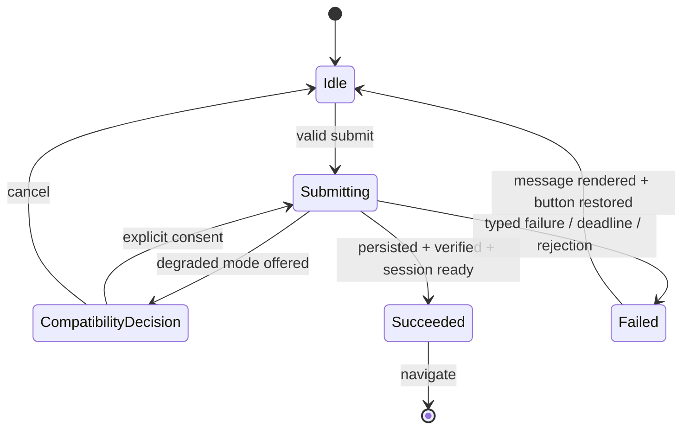

- `Submitting` não pode ser reentrante.
- Apenas `Succeeded` mantém botão indisponível durante navegação.
- `catch` mapeia erro; `finally` sempre libera permit e restaura botão em qualquer outro estado.
- Espera por lock/lease tem deadline e caminho `Tentar de novo`.
- Operation token invalida commit de tentativa cancelada/expirada.
- Live region usa `role=status` para progresso e `role=alert`/error summary para falha, sem anúncios duplicados.
- Primeiro campo inválido ou summary recebe foco; a mensagem fica no DOM e não desaparece automaticamente.

### 13.2 Agent Workflow Errors

| Cenário | Resposta | Recuperação |
|---|---|---|
| Agent/skill ausente | Rejeitar antes de invocar e marcar config inválida. | Corrigir referência e revalidar. |
| Cycle/repeated handoff | Bloquear child com ancestor/objective detectado. | Reframe com evidência nova ou perguntar ao usuário. |
| Write ownership sobreposto | Serializar writers; review read-only pode continuar. | Liberar primeiro owner e atualizar contexto. |
| Specialist failure | Registrar evidência parcial e um retry idempotente. | Replanejar ou escalar; nunca assumir aprovação. |
| Security/QA/UX veto | `REVISION_REQUIRED` com evidência. | Nova revision pelo autor; reviewer independente revalida. |
| Trade-off de produto | Não aplicar precedência técnica como preferência. | `BLOCKED` e decisão do usuário. |
| Tool/path violation | Parar antes de mutation. | Narrow task ou autorização explícita. |

### 13.3 Runtime Recovery Matrix

| Cenário | Resposta | Recovery |
|---|---|---|
| Módulo obrigatório ausente | Mensagem fatal local e legível; área protegida oculta. | Corrigir deployment/recarregar; sem init parcial. |
| Crypto/contexto indisponível | Código específico e requisitos de browser/origem. | Atualizar/trocar browser ou usar localhost/HTTPS. |
| localStorage bloqueado | Preflight bloqueia create/update. | Habilitar dados do site/sair de modo privado e retry. |
| sessionStorage bloqueado | Setup bloqueado antes de persistir; login não finge sessão. | Habilitar sessão e retry. |
| Web Locks ausente | Oferecer modo single-tab se elegível; senão read-only/unavailable. | Consentir com limitação, manter uma aba ou trocar browser. |
| Outra aba detectada | Pausar escrita com status persistente. | Fechar/recarregar abas e readquirir permit. |
| Wrong credentials | Mensagem neutra; password limpa; envelope intacto. | Corrigir dados e retry após rate limit. |
| Quota/write failure | Envelope anterior autoritativo; botão restaurado. | Liberar espaço/exportar backup e retry. |
| Migration invalid/conflict/failure | Origem preservada; copy técnica acionável. | Download, fechar abas, corrigir/importar e retry. |
| Corruption/tamper | Não substituir por workspace vazio. | Export raw técnico/restaurar backup. |
| Generation replaced | Retornar state atual e descartar candidate. | Rerender e confirmar retry do intent. |
| Travel input invalid | Field error de 14 px, focus e nenhuma tab aberta. | Corrigir campo. |
| Manifesto/evidência de provedor inválido | Rejeitar registry inteiro, zero descritores/contatos e erro ligado ao primeiro provedor. | Atualizar evidência development-only e executar novamente Security/docs gates. |
| Asset ausente, inseguro, sem licença/diretriz ou hash divergente | Bloquear provider/registry sem placeholder, monograma ou marca aproximada. | Readmitir asset oficial/Wordmark_Oficial pelo pipeline ou manter busca indisponível. |
| URL fora da allowlist exata, clone, typo, redirector, shortener ou affiliate oculto | Safe build error e zero navigation. | Corrigir manifest/builder sob Security review; nunca abrir alternativa semelhante. |
| Fidelidade/a11y da marca falha | Card bloqueado com nome e erro textual, dados intactos. | Corrigir layout/fundo sem recolor/filter/opacity e repetir browser gate 100%/200%. |
| Falha inesperada | Diagnostic ID local + retry + verificação do efeito. | Copiar ID, revisar permissões; sem raw cause. |

### 13.4 Assistant Error Mapping

| Código | Condição | Copy visível | Ação | Efeito garantido |
|---|---|---|---|---|
| `assistant/unavailable` | proxy ausente, hospedagem estática, offline, 404/405 ou resposta sem `application/json` | `Assistente indisponível` | Explicar que o assistente precisa do servidor local configurado; o restante do app funciona | Nenhuma chamada upstream; dados intactos |
| `assistant/disabled` | IA desligada | `Assistente desligado` | `Ativar assistente com {provedor}` | Nenhuma requisição `chat` |
| `assistant/consent-mismatch` | adapter, host ou modelo mudou desde o aceite | `A configuração do assistente mudou` | Revisar e aceitar de novo | Nenhum envio até novo aceite |
| `assistant/forbidden` | Host, Origin, `Sec-Fetch-Site` ou header customizado inválido | `O assistente recusou esta origem` | Abrir o PlannerDuo pelo endereço local exibido no terminal | Zero chamadas upstream |
| `assistant/request-invalid`, `assistant/request-too-large` | schema, JSON ou tamanho inválido | `Não foi possível preparar a mensagem` | Encurtar a mensagem ou desmarcar notas | Texto digitado preservado |
| `assistant/context-blocked` | verificação de dados sensíveis encontrou um valor proibido | `Removemos o envio porque ele continha dados protegidos` | Revisar a mensagem e a prévia | Nada é enviado |
| `assistant/local-rate-limited`, `assistant/busy` | limite por minuto ou requisição já em voo | `Aguarde alguns segundos` | Nova tentativa após `Retry-After` | Nenhum envio duplicado |
| `assistant/daily-cap-reached` | teto diário de requisições ou tokens | `Limite diário do assistente atingido` | Informar o uso; ajustar o teto no servidor | Nenhuma chamada upstream |
| `assistant/provider-auth` | upstream 401 ou 403 | `O provedor recusou a chave configurada` | Conferir a chave no ambiente do servidor | Chave nunca exibida |
| `assistant/model-unavailable` | upstream 404 ou modelo inexistente | `O modelo configurado não está disponível` | Conferir `PLANNERDUO_AI_MODEL` | — |
| `assistant/provider-rate-limited` | upstream 429 | `O provedor limitou as requisições` | Tentar mais tarde | — |
| `assistant/provider-unavailable` | upstream 5xx | `O provedor está indisponível` | Tentar mais tarde | — |
| `assistant/timeout` | timeout local ou upstream 408/504 | `O assistente demorou demais para responder` | `Tentar de novo` | Nenhuma resposta tardia é aplicada |
| `assistant/network` | DNS, TLS ou conexão | `Sem conexão com o provedor` | Verificar a internet ou usar modelo local | — |
| `assistant/provider-redirect-blocked` | upstream respondeu com redirect | `O provedor respondeu de forma inesperada` | Revisar a configuração do servidor | Redirect não seguido |
| `assistant/provider-response-invalid` | JSON inválido ou resposta acima de 256 KiB | `A resposta do assistente não pôde ser lida` | `Tentar de novo` | Corpo descartado |
| `assistant/tool-not-allowed`, `assistant/proposal-invalid` | proposta fora do catálogo ou do schema | Card `Sugestão indisponível` com motivo | Descartar ou pedir de novo | Nenhum efeito |

Toda falha preserva o texto digitado, mantém o foco no campo de mensagem, anuncia o erro uma vez e nunca altera dados. O corpo upstream, a chave e detalhes de configuração nunca aparecem na UI.

### 13.5 Proposal Card State Machine

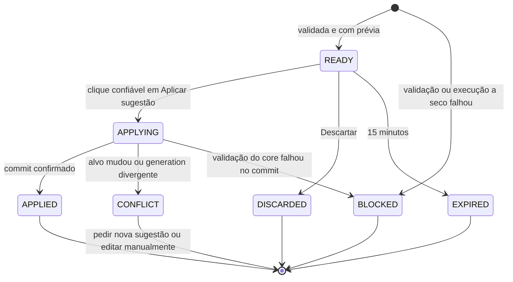

- `APPLYING` desabilita os três botões do card; não há retry automático.
- “Editar antes de aplicar” sai do fluxo da proposta e abre o formulário manual pré-preenchido.
- Bloqueio, auto-lock ou saída descartam todos os cards junto com a conversa.

### 13.6 Migration and Trip Finance Errors

| Código | Condição | Copy visível | Recuperação | Efeito garantido |
|---|---|---|---|---|
| `local/import-version` | `schemaVersion` ausente, inválida ou maior que 2; formato desconhecido | `Os dados foram criados por uma versão diferente` | Atualizar o PlannerDuo ou importar um backup compatível | Estado atual intacto |
| `local/migration-verification-failed` | `ProjectToV1` ou round-trip divergiu | `Não foi possível atualizar o formato dos dados` | Baixar cópia técnica e tentar de novo | Envelope v1 continua autoritativo |
| `local/migration-write-paused` | sem permit de escrita ou modo somente leitura | `Seus dados abriram em modo de leitura` | Fechar outras abas e recarregar | v2 apenas em memória; nada é gravado |
| `local/import-lossy` | backup v2 com referência obrigatória ausente | `O backup tem registros inconsistentes` | Corrigir a origem ou usar outro backup | Estado atual intacto |
| `finance/rate-missing` | moeda estrangeira sem taxa para a data | `Informe o câmbio desta data` | Cadastrar taxa manual ou editar o lançamento | Lançamento não salvo |
| `finance/amount-out-of-range` | valor ou conversão acima do limite | `Valor acima do limite permitido` | Revisar valor e taxa | Lançamento não salvo |
| `finance/currency-unsupported` | moeda fora do catálogo | `Moeda não suportada` | Escolher moeda do catálogo | Lançamento não salvo |
| `finance/breakdown-mismatch` | detalhamento da cotação não soma o total | `Os itens não somam o total informado` | Corrigir itens ou total | Cotação não salva |
| `travel/invalid-dates` | check-out ≤ check-in ou chegada antes da partida com fusos informados | `Confira as datas informadas` | Corrigir o campo destacado | Nada é salvo |

Uma aba antiga que ainda executa o código v1 falha fechada diante de dados v2 com a mensagem genérica atual; o README e as notas da release orientam recarregar todas as abas após a atualização.

## Testing Strategy

### 14.1 Agent and Configuration Tests

- Schema de manifests/skills; IDs únicos e versões compatíveis.
- Roster com exatamente 10 agentes e catálogo com exatamente 21 skills; grupo único por skill; toda skill carregada por pelo menos um agente; write paths de produção somente em `fullstack-developer` e `ai-assistant-engineer`, disjuntos.
- Exatamente um dispatcher; nenhum self-approval.
- Deny sobrepõe allow; high-risk aciona confirmação/gates.
- Properties de DAG: acyclic, single ownership, bounded depth/retry/fan-out e termination.
- Routing obrigatório para UX em copy/CSS, Security em auth/storage/coordination/assistente/CSP, `trip-finance-specialist` em cálculo monetário e `travel-operations-specialist` em jornada e pós-venda.
- Conteúdo adversarial do repositório tratado como dado, não governance.

### 14.2 Real Browser Access-flow Tests

Teste de source text não é evidência suficiente. Deve existir pelo menos um harness browser-level que carregue `auth.html`, `core.js`, `local.js`, `auth.js` e CSS reais por origem local, submeta o formulário por interação e observe DOM/storage. Casos mínimos:

1. criação bem-sucedida com Web Crypto, storage, session e Web Locks;
2. Web Locks ausente com fallback elegível, disclosure, consentimento e modo persistente na UI;
3. Web Locks ausente e fallback inelegível, sem escrita e com alternativa read-only/browser;
4. Web Crypto ausente ou contexto não seguro;
5. localStorage getter/setItem bloqueado;
6. sessionStorage bloqueado, provando que nenhum envelope novo foi persistido;
7. quota/write failure, provando preservação do envelope anterior;
8. credenciais incorretas, senha limpa e dados intactos;
9. legacy invalid, migration conflict e migration verification failure com origem preservada;
10. falha inesperada injetada em cada estágio crítico;
11. lock/lease deadline e detecção de segunda aba;
12. em toda falha: mensagem específica, diagnostic ID seguro quando aplicável, submit habilitado, label restaurada, foco correto e nova tentativa possível;
13. sucesso só navega após session estabelecida;
14. nenhuma mensagem visível principal usa terminologia técnica proibida.

O teste deve falhar se aparecer exatamente `Não foi possível concluir a operação com segurança` para um código conhecido.

### 14.3 Readability, Accessibility and Responsive Tests

- Auditoria de computed styles para cada categoria textual; não apenas regex do CSS.
- Viewports obrigatórias: 1440×900, 1024×576, 768×1024, 390×844 e 360×640.
- Repetir fluxos críticos em zoom 200% ou viewport CSS equivalente, verificando reflow e scroll.
- Contraste calculado nos estados default, hover, focus, disabled, error, success e compatibility warning.
- Teclado: ordem de tab, submit, focus no erro, retorno após dialog, Escape onde aplicável.
- Screen reader semantics: labels persistentes, error association, live regions sem duplicação e headings hierárquicos.
- Nenhuma informação crítica só em cor, ícone, placeholder, tooltip ou microcopy de 13 px.
- Screenshot/regression do acesso em 1024×576 confirma form-first e legibilidade; comparação visual não substitui assertions computadas.
- Touch targets e focus ring medidos.
- Auditoria de strings visíveis rejeita `cofre`/`vault` fora da allowlist técnica.

### 14.4 Travel-first Product and Closed Registry Tests

- Landing, entrada e área principal apresentam gerenciamento de passagens/viagens antes de proteção/finanças.
- Ações principais: buscar passagens, abrir/criar viagem e acessar orçamento da viagem.
- O manifesto contém exatamente os 26 IDs do `ClosedProviderCensus`, sem adicionais: 10 `flights`, 8 `stays`, 6 `ground` e 2 `cars`; ID, nome, grupo e asset path são únicos e há bijeção entre 26 entries e 26 arquivos.
- Cada entry preenche domínio, página oficial, três evidências separadas, source, licença/termos, diretrizes, `verifiedAt`, path, type, dimensions-or-viewBox, SHA-256 e deep-link mode. Datas futuras, inválidas ou mais antigas que 365 dias são rejeitadas.
- Para cada source `SIMPLE_ICONS`, existe evidência datada de consulta ao brand kit e site oficial e motivo objetivo de indisponibilidade; ausência dessa evidência falha. Sources oficiais não exigem nem recebem esse fallback record.
- GOL e LATAM mantêm evidências próprias apontando para seus sites oficiais registrados; o teste não reutiliza essas referências para qualificar outro provedor.
- Modes/fill claims são honestos; sem preço, disponibilidade ou confirmação inventados.
- Expense com `tripId` aparece na viagem correta; `tripId = null` aparece em itens sem vínculo.
- Vincular/desvincular não altera valor, recorrência, payer, split ou histórico.
- Goal copy é de meta de viagem sem afirmar vínculo persistido inexistente.
- Budget view conserva valores e diferencia orçamento, gasto e valor guardado.
- Falha de qualquer entry ou asset invalida atomicamente o registry e produz zero descritores, navegações, contatos externos e persistências, com foco no primeiro campo/provedor inválido.

### 14.5 Unit, Contract and Property Tests

- Contratos das quatro fachadas antes de cada split: exports, globals, signatures, error codes e immutability.
- Normalization idempotence, cents conservation, vote uniqueness e recurrence idempotence.
- Web Locks full-mode serializability.
- Modelo do single-tab coordinator: peer detection pausa writes, lease expiry invalida permit e sequence mismatch nunca é aceito.
- Safe error presenter: todo código conhecido mapeado; inputs arbitrários nunca aparecem na saída.
- Diagnostics: tokens sensíveis gerados por fast-check nunca aparecem serializados.
- Travel validators/builders puros e URL-safe; equivalence tests entre implementação anterior e facade delegada.
- Cada Property Test executa no mínimo 100 iterações e referencia a propriedade correspondente (Property 2, 3, 4 ou 5).
- **Censo/manifesto:** gerar remoção, adição, duplicação, troca de grupo, path compartilhado e campo ausente; qualquer variação do conjunto fechado falha de forma atômica.
- **Integridade:** para cada um dos 26 assets aceitos, copiar os bytes, alterar exatamente um byte sem alterar o manifesto e provar falha de SHA-256. Hash com comprimento, capitalização ou caractere fora de 64 hex também falha.
- **SVG:** testar limites 0, 1, 262.144 e 262.145 bytes e rejeitar, com capitalizações combinadas, `script`, `foreignObject`, `iframe`, `object`, `embed`, `audio`, `video`, `canvas`, `image`, todo `animate*`, `set`, atributo `on*`, entidade externa, `@import`, `@font-face`, referência/importação de fonte, conteúdo executável e `href`, `xlink:href`, `src` ou `url(...)` que não seja fragmento interno `#`; referências internas válidas não são rejeitadas apenas por existirem.
- **Raster:** testar MIME real/extensão, decode truncado, bytes 0/1/1.048.576/1.048.577, dimensões 0/1/4.096/4.097 e produto de pixels 16.777.216/16.777.217 para PNG, WebP e JPEG.
- **Domínio exato:** para cada domínio canônico, gerar protocolo HTTP, credentials, porta, prefixo, sufixo, substring, wildcard textual, parent, subdomínio, Unicode/punycode divergente, clone/typo, redirector, shortener e hostname de afiliado; somente igualdade exata HTTPS sem credentials/porta passa.
- **Parâmetros:** gerar chaves não allowlisted e padrões de affiliate/referral/partner/click ID; nenhum valor extra é removido silenciosamente ou navegado.
- **Prioridade de origem:** gerar combinações de source e evidência; Simple Icons passa se e somente se indisponibilidade oficial, licença/termos, diretrizes e correspondência da marca forem válidos.
- **Falha fechada:** strings, manifesto, XML e metadados arbitrários nunca resultam em placeholder, monograma, execução ativa, trust parcial ou navegação.

### 14.6 Integration, Browser, Security and Migration Tests

- Setup/sign-in/protected redirect/inactivity/lock/password change/destroy.
- Create/load/update/reset/import/export e cross-tab invalidation.
- Wrong-password, tamper e write-failure non-mutation.
- Falha de session establishment não produz criação ambígua.
- Legacy cutover somente após round-trip; conflito preserva origem.
- O admission pipeline só executa em comando explícito de desenvolvimento, baixa por HTTPS para staging não servido, registra redirects e promove manifesto/assets como uma unidade; tentativa incompleta promove zero arquivos.
- Servidor local entrega para cada um dos 26 paths exatamente os bytes cujo SHA-256 consta no manifesto, com MIME correto. Arquivo ausente, extra, compartilhado ou com byte divergente falha.
- Instrumentação browser intercepta requests: antes da ativação explícita há zero requests externos de asset e zero contatos com provedores em startup, render, foco, hover, validação e comparação; imagens são exclusivamente same-origin, sem hotlink/CDN. Após uma ativação válida ocorre uma única navegação ao host exato, com `noopener` e `noreferrer`.
- Teste browser-level real executa cards em 1440×900, 1024×576, 768×1024, 390×844 e 360×640, em zoom real de 100% e 200%, e mede proporção intrínseca/renderizada com diferença máxima de 1%, padding mínimo de 4 CSS px em cada lado, ausência de crop/recolor/filter/opacity diferente de 1, fundo/wrapper com 3:1, nome adjacente, imagem decorativa e nome acessível do controle.
- O teste falha se DOM, CSS, manifest ou JavaScript contiver caminho ativo de apresentação por `short`, `accent`, letra, monograma, SVG gerado, template, emoji ou marca aproximada. Texto legítimo do nome do provedor não é confundido com asset.
- Falhas de evidência, source, licença/termos, guidelines, data, sanitizer, hash, decode, render ou domínio exibem erro textual, preservam dados e foco e não substituem a marca.
- Migração testa cutover somente com 26↔26 válido, remoção de referências fabricadas e rollback para último conjunto oficial aprovado; sem conjunto anterior, busca fica indisponível em vez de reativar marcas fabricadas.
- CSP, assets locais, ausência de runtime remoto e rotas HTTP smoke permanecem verificadas.
- Compatibility mode testa banner, segunda aba, visibility change, lease expiry e transição para read-only; Full mode continua sendo testado como garantia superior.

### 14.7 Required Gate per Implementation Slice

1. Testes direcionados do módulo e Property Tests afetados, com pelo menos 100 iterações por propriedade.
2. Contract/equivalence da fachada afetada.
3. Verificação completa do manifesto, sanitizer, dimensões/viewBox, 26 hashes e correspondência entre bytes servidos e registrados.
4. Browser flow com instrumentação de rede e matriz real 100%/200% para toda alteração de registry, asset, card ou navegação.
5. UX/accessibility gate para DOM, CSS, copy, fidelidade da marca, proporção, fundo, nome e semântica.
6. Gate independente do `security-analyst` para aquisição, sanitizer, integridade, domínio, redirects, URL e isolamento de requests.
7. Gate independente do `documentation-release` para cada uma das 26 evidências de nome/domínio/página, source prioritária, fallback, licença/termos, diretrizes, trademark, data e atribuição; verdict é vinculado ao manifesto e bytes exatos.
8. Aprovação é invalidada por qualquer byte ou metadado alterado; novo gate é obrigatório.
9. `npm run verificar` é a última verificação executada.
10. Smoke manual documenta apenas lacuna não automatizável e nunca substitui hash mutation, network instrumentation, sanitizer, browser ou gates formais.

Gates adicionais por domínio, sempre executados antes do item 9:

- **Finanças:** verdict do `trip-finance-specialist` sobre fixtures e arredondamento, Property Tests de 14.8 e reconciliação de relatórios.
- **Viagens:** verdict do `travel-operations-specialist` sobre jornada, reservas, simulação e prazos, com fixtures de 14.8.
- **Schema v2:** round-trip, idempotência e import de 14.9, com verdicts do `architect` e do `security-analyst` sobre envelope inalterado.
- **Assistente:** suíte do proxy com upstream falso (14.10), corpus adversarial e browser flow do chat (14.11), checagens de 14.12 e verdict do `security-analyst` vinculado ao diff exato de proxy, CSP e contexto enviado.

Nenhum watcher ou processo interativo integra execução automatizada.

### 14.8 Travel Operations and Trip Finance Tests

- Fixtures versionados pelos especialistas em `tests/fixtures/travel/**` e `tests/fixtures/finance/**`, com casos-limite: moedas com expoente 0 (JPY, CLP, PYG), taxa com 12 dígitos significativos, empate exato de `HALF_EVEN`, valor máximo, 1 e 48 parcelas, fim de mês e ano bissexto, multa maior que a diferença tarifária e crédito maior que o custo.
- Property Tests (≥ 100 iterações) para Property 4.2–4.8, 4.15 e 4.16 com fast-check: conversão contra um oráculo racional BigInt independente, soma de parcelas, conservação de acertos em várias moedas, fórmula de remarcação, permutação de cotações e reconciliação de relatórios.
- Teste estático falha se `public/**` contiver literal de alíquota associado a IOF ou taxa (por exemplo, número percentual ao lado de `IOF` fora de fixtures e testes).
- Alertas: relógio injetado e janelas geradas; exatamente um alerta por fonte elegível, chaves únicas, ordem estável e ausência de campos sensíveis nos títulos (Property 3.4).
- Jornada e linha do tempo: geração de conjuntos de reservas e cotações e verificação de 9.17 (Property 3.2 e 3.3).
- Browser-level: Painel, jornada, comparação lado a lado (tabela e cards abaixo de 600 px), reservas com “Confirmada por você”, pós-venda, paleta `Ctrl+K` e central de alertas nas viewports de 14.3, em zoom de 100% e 200% e nos temas claro e escuro, com teclado e movimento reduzido.

### 14.9 Schema v2 Migration Tests

- Gerador fast-check de workspaces v1 válidos, incluindo recorrência, votos, participantes arquivados, gastos sem viagem e valores com centavos no limite de `MAX_AMOUNT`.
- `ProjectToV1(MigrateWorkspace(v1)) = NormalizeV1(v1)` e idempotência (Property 4.10 e 4.11).
- Fachada: `calculateSettlements`, `materializeRecurring`, `removeFinance`, `removeParticipant` e `vote` produzem o mesmo resultado antes e depois da migração, via projeção.
- Import: backups v1 e v2 aceitos; `schemaVersion` ausente, `0`, `3`, string, formato desconhecido e v2 com referência obrigatória ausente rejeitados sem mudar o estado (Property 4.12 e 4.14).
- Kernel: envelope após migração mantém `format`, `version`, KDF e parâmetros de cifra; IV novo; round-trip de decrypt verificado antes de declarar sucesso; `READ_ONLY` migra somente em memória (Property 4.13).
- Browser-level: login com dados v1 reais cifrados, oferta de cópia técnica, commit único, segunda aba e recarga; `settings.assistant.enabled` falso após migrar.

### 14.10 Assistant Proxy Tests with Fake Upstream

- `tests/fakes/fake-llm-upstream.mjs` sobe um servidor `node:http` em `127.0.0.1` com porta aleatória e simula respostas OpenAI-compatible e Anthropic: sucesso, `tool_calls`/`tool_use`, 401, 403, 404, 408, 413, 429, 500, 503, timeout, redirect 3xx, JSON inválido, resposta de 256 KiB + 1 byte e stream lento.
- Os adapters recebem `fetchImpl` por injeção: em teste, ele roteia para o fake e registra a URL pretendida, permitindo afirmar host exato, path, headers e `max_tokens` sem contato real. Um guard global falha o teste em qualquer tentativa de conexão a host não loopback (Property 5.22).
- Hardening (Property 5.3–5.6): matriz de Host (`evil.test`, `localhost` com porta errada, IP LAN, Host ausente), Origin (ausente, `null`, outra porta, outro esquema), `Sec-Fetch-Site`, header customizado, `Content-Type` (`text/plain`, `multipart/form-data`), corpo de 64 KiB e 64 KiB + 1 com e sem `Content-Length`, chaves `__proto__`, campos desconhecidos, `OPTIONS` e `GET`; toda rejeição tem zero chamadas ao fake e nenhum header `Access-Control-*`.
- SSRF: base URLs com IP literal, `http:` remoto, sufixo, subdomínio, credenciais, query, fragmento, porta customizada e a própria porta do servidor desativam o assistente.
- Chave (Property 5.7): chave gerada injetada no ambiente; varredura de todas as respostas, headers e logs em todos os caminhos de erro, sem ocorrência.
- Custo (Property 5.18): rate limit, requisição em voo e tetos diários com relógio injetado; virada do dia local.
- Logs (Property 5.20): conteúdo gerado aleatório nunca aparece nos logs; somente campos de `ProxyMetadataLog`.
- Mapeamento de erros (Property 5.19): cada cenário do fake resulta no código de 13.4 e o corpo do fake nunca é repassado.

### 14.11 Assistant Browser-level, Prompt-injection and Rendering Tests

- Harness browser-level carrega `app.html` servido pelo servidor local com o fake upstream: opt-in, consentimento nomeando provedor e modelo, prévia expandida e igualdade byte a byte entre prévia e corpo interceptado (Property 5.1 e 5.9).
- Instrumentação de rede: com IA desligada, zero requisições; com IA ligada, somente `POST /api/assistant` same-origin; nenhuma imagem, fonte ou prefetch externo após qualquer resposta.
- Payload (Property 5.8 e 5.10): workspaces gerados com segredos marcados (senha, e-mail, localizador, endereço, diagnóstico e nomes de participantes); nenhum marcador aparece no corpo interceptado; notas só com opt-in.
- Corpus adversarial versionado por QA em `tests/fixtures/assistant/prompt-injection/`: instruções para ignorar regras, pedidos de exclusão, exportação, troca de senha ou desligamento de proteções, ferramentas inexistentes, argumentos com campos extras, referências de outra conversa, URLs de typosquatting, encurtadores e redirecionadores, imagens markdown de exfiltração, `javascript:` e `data:`, HTML e SVG com handlers, markdown aninhado, textos acima dos limites, caracteres de controle e bidi e injeção embutida em notas e cotações. Para cada caso: nenhum efeito sem clique, nenhuma ferramenta proibida, nenhum link não aprovado e nenhum HTML executado (Property 5.11, 5.12, 5.14 e 5.15).
- Renderização: fast-check gera strings arbitrárias e HTML/markdown hostil; o DOM resultante contém somente a allowlist de 7.10.7, sem atributos `on*` e sem execução (sentinela global nunca disparada).
- Confirmação: aplicar por clique real altera o workspace uma vez; clique sintético (`isTrusted = false`), duplo clique, card expirado e alvo alterado não gravam; o resultado é igual ao da ação manual equivalente (Property 5.11 e 5.13).
- Ciclo de vida (Property 5.16 e 5.17): bloqueio, saída, auto-lock, expiração de sessão e desligamento apagam conversa e cards; storage inspecionado não contém conversa; sem proxy, as views fora do assistente permanecem idênticas.
- Acessibilidade: log do chat com `aria-live` sem anúncios duplicados, foco após envio e após erro, cards navegáveis por teclado e pisos tipográficos nos dois temas.

### 14.12 `verificar-frontend.mjs` Updates

- Substituir a checagem agregada atual de `connect-src 'none'` por checagens por página: a meta CSP de `app.html` é exatamente a documentada, com `connect-src 'self'`; `index.html` e `auth.html` mantêm exatamente `connect-src 'none'`.
- Header do servidor: `/app` e `/app.html` recebem CSP com `connect-src 'self'`; as demais rotas mantêm `'none'`. Como meta e header se aplicam cumulativamente, os dois precisam permitir `'self'` na página do app.
- Nenhum padrão de chave de API em `public/**`: `sk-` seguido de 20 ou mais caracteres, `sk-ant-`, `AKIA` seguido de 16 caracteres, `Bearer ` seguido de token literal, valores de `x-api-key` e atribuições `PLANNERDUO_AI_API_KEY=`.
- `git ls-files` não contém `.env` nem `.env.*`, exceto `.env.example`, que só tem nomes de variáveis sem valores.
- Nenhum host externo no JavaScript do navegador: todo literal `http(s)://` em `public/**/*.js` pertence a `PlannerTravel.allowedHosts` (hoje, os hosts HTTPS dos 26 provedores, usados só em navegação iniciada pelo usuário); URIs de namespace XML, se forem necessárias, entram em allowlist explícita; URLs de evidência ficam somente no manifesto JSON inerte.
- `fetch(` só aparece em `public/modules/assistant/assistant-client.js`, com o path relativo `/api/assistant`; `XMLHttpRequest`, `WebSocket`, `EventSource`, `sendBeacon`, `importScripts` e `import()` remoto são proibidos em `public/**`.
- Proibidos em `public/modules/assistant/**`: `innerHTML`, `outerHTML`, `insertAdjacentHTML`, `document.write`, `eval` e `new Function`.
- CSS e HTML sem `@import` remoto, `@font-face` com origem externa ou `url(http...)`.
- Smoke HTTP: `GET` e `OPTIONS` em `/api/assistant` → 405 sem `Access-Control-*`; `POST` com Host ou Origin inválidos → 403; `op: "status"` sem configuração → `available: false`; `GET /.env.local` devolve o fallback de `index.html`, sem nenhum padrão de chave.
- A checagem atual de ausência de Firebase e CDN continua; o texto final passa de “sem dependências externas” para “sem dependências externas de runtime”.

### 14.13 Orchestrator, Travel Agent and Market Tests (adendo 2026-09-29)

- **Runtime (Property 6.6–6.9):** relógio, aleatoriedade e `fetch` falsos; fast-check gera cargas com latências, falhas `retryable` e não `retryable` e abortos, e verifica pico ≤ 4, dedupe por chave canônica, TTL/LRU, abertura e meia-abertura do circuito e no máximo um retry, só em leitura.
- **NLU (6.1–6.4):** corpus versionado `tests/fixtures/nlu/pt-br.json` com frases reais (“voo de BH pra Salvador dia 12/11 volta 18/11”, “hotel em Gramado 3 noites a partir de sexta”, “quero ir pra Lisboa em dezembro com minha esposa e meu filho de 6 anos”, “só voo direto até 2 mil”, “gastei 120 no mercado na viagem do Rio”, “e pra 3 pessoas?”), datas relativas com relógio injetado (virada de mês e ano, bissexto), aliases sem acento e ambiguidade; fast-check para totalidade e idempotência.
- **Ranking (6.10–6.12 e 6.14):** fast-check com no mínimo 100 iterações por propriedade e geradores de ofertas válidas e adversariais (conexões de 59/60/89/90 min, troca de aeroporto, pernoite, oferta expirada, companhia ausente, moedas mistas, preço zero, negativo ou malformado); oráculo de partição, permutações e rótulos.
- **Orquestrador (6.5 e 6.15–6.17):** estresse com 100 mensagens em rajada (0–20 ms entre elas) contra upstream falso lento (até 25 s) e falho (500, timeout, JSON inválido): só o último turno renderiza, nada tardio aparece, as chamadas ficam dentro de dedupe e breaker e nenhuma tarefa passa de 50 ms (`performance.now()`, CPU sem throttling); política de autonomia e “Desfazer” com workspace em memória.
- **Servidor (6.13 e 6.14):** `scripts/server/**` e adapters com `fetchImpl` falso que registra URL, headers e corpo pretendidos (host exato, `Duffel-Version: v2`, `X-API-Key`, `return_offers`, `supplier_timeout`); matriz da guarda (método, Host, Origin, `Sec-Fetch-Site`, `X-PlannerDuo`, `Content-Type`, 64 KiB e 64 KiB + 1, `__proto__`, rate limit) com zero chamadas upstream; fixtures sintéticas Duffel/LiteAPI, inclusive com campos ausentes ou em posição alternativa; varredura de tokens gerados em respostas e logs; guard global que falha em conexão fora do loopback.
- **DOM do Central:** harness `node:vm` com DOM mínimo de teste, sem dependência nova, cobrindo ordem e tipo dos blocos, chips, `role="log"`/`aria-live` e estados vazio, erro e skeleton.
- **Smoke browser opcional:** `scripts/smoke-browser.mjs` localiza Chrome ou Edge instalados, abre via CDP (`--remote-debugging-port` e `WebSocket` nativo do Node) o app servido localmente com upstream falso e mede overflow horizontal em 360, 390, 768, 1024 e 1440 px, alvos ≥ 44 px, pilha tipográfica única, foco visível e zero requisições externas; sem navegador, informa “pulado” sem falhar o gate.
- **`verificar-frontend.mjs`:** 14.12 vale com três trocas: `fetch(` só em `public/modules/agents/market-client.js`, para `/api/status`, `/api/market/flights`, `/api/market/stays` e `/api/assistant/interpret`; o smoke HTTP cobre essas quatro rotas (`GET` e `OPTIONS` → 405 sem `Access-Control-*`, Host ou Origin inválidos → 403, `/api/status` sem configuração → nada disponível); e a varredura de chaves inclui `duffel_` seguido de modo e token ([test mode](https://duffel.com/docs/api/overview/test-mode)), `sand_`, `sandbox_` e `prod_` seguidos de UUID ([LiteAPI](https://docs.liteapi.travel/reference/prompt-for-vibe-coding-tools)) e atribuições com valor de `PLANNERDUO_DUFFEL_TOKEN` ou `PLANNERDUO_LITEAPI_KEY`. `public/modules/agents/**`, `public/modules/skills/**` e `public/modules/ui/central-view.js` também proíbem `innerHTML`, `outerHTML`, `insertAdjacentHTML`, `document.write`, `eval` e `new Function`.
- **Gate por etapa:** a etapa 1 exige Property 6.1–6.9, 6.15 e 6.16 e a regressão das fachadas; a etapa 2, 6.10–6.14; a etapa 3, a matriz de 14.3 nos dois temas e o smoke; a etapa 4, o estresse (6.5 e 6.17); em todas, `npm run verificar` é a última verificação.

## 15. Incremental Migration Strategy

| Fase | Escopo | Exit gate | Rollback |
|---|---|---|---|
| 0 — Baseline freeze | Inventariar globals, selectors, copy, computed font sizes, códigos, storage keys, providers e captura 1024×576. | Baseline e reprodução do erro genérico documentadas; `npm run verificar` passa. | Revert de testes/docs. |
| 1 — Agent governance | Manifests, skills, policy e dry-run routing. | DAG, permissions, handoffs e gates validam. | Remover/desabilitar assets de agents. |
| 2 — Product/copy and readability contracts | Introduzir tokens, matriz travel-first, glossary e testes de legibilidade antes de redesign amplo. | Pisos, contraste, 200% e 1024×576 passam; audit de terminologia passa. | Reverter slice de style/copy mantendo comportamento. |
| 3 — Access diagnostics and capability negotiation | Error mapping, state machine, preflight e testes browser-level; depois fallback sem Web Locks. | Todos os casos de acesso têm code/action/focus/button/data-effect; modos FULL/COMPATIBILITY/READ_ONLY provados. | Reverter adapters mantendo formato interno; sem data migration. |
| 4 — Travel-first shell | Reordenar landing, home e navegação para busca/viagens/reservas/orçamento. | Journey tests e UX gate; nenhuma capability removida. | Restaurar shell anterior via facade. |
| 4B — Advanced front and design system | Tokens de tema claro/escuro, espaçamento, raios, elevação e movimento; componentes de 7.9.5; Painel com KPIs sobre dados v1; paleta `Ctrl+K`; builders DOM seguros. | Property 3.1, 3.5–3.10; matriz de 14.3 nos dois temas; zero recurso externo. | Reverter slice de CSS/componentes; dados intactos. |
| 5A — Trusted provider and brand admission | Congelar censo, coletar três evidências oficiais por entry, adquirir assets development-only por prioridade, sanitizar e produzir manifesto/hash em staging. | Exatamente 26 entries/assets 10/8/6/2, bytes servidos íntegros, zero fallback indevido e approvals exatos de Segurança e documentação/release. | Descartar staging; runtime anterior não recebe asset parcial. |
| 5B — Passage search, official cards and reservation links | Extrair registry/validation/builders/view model/launcher e fazer cutover atômico dos `short`/`accent`/SVGs fabricados para o conjunto oficial. | Host exato, honest modes, zero request externo pré-gesto, browser 100%/200%, 26 hash mutations e ausência de referência fabricada. | Restaurar último conjunto oficial aprovado; se inexistente, desabilitar busca/navegação sem restaurar monograma ou SVG fabricado. |
| 6A — Schema v2 migration | Schema v2, `MigrateWorkspace`, `ProjectToV1`, import v1/v2, commit verificado e cutover de `PlannerCore.SCHEMA_VERSION`; nenhuma UI nova. | Property 4.10–4.14; 14.9 completo; envelope inalterado; verdicts de `architect` e `security-analyst`. | Antes do cutover: reverter código. Depois: somente para versão que leia v2; “Baixar cópia compatível com a versão anterior” como salvaguarda. |
| 6 — Trip financial context | Extrair budget/gastos/queries e vínculo por `tripId`; preservar itens sem vínculo. | CRUD, cents, recurrence, linking e legacy-unlinked passam. | Restaurar controller anterior; schema intacto. |
| 6B — Travel operations | Cotações, comparação lado a lado, reservas com confirmação informada, trechos, assentos, bagagem, check-in, hospedagens, simulador de remarcação, jornada e linha do tempo. | Property 3.2, 3.3, 4.7–4.9; fixtures de viagem; verdict do `travel-operations-specialist`. | Reverter views e commands; entidades v2 permanecem válidas e sem uso. |
| 6C — Multi-currency finance, alerts and reports | Câmbio manual, regras de IOF/taxas, parcelamentos, previsão, acertos por viagem, central de alertas e relatórios com “Copiar resumo”. | Property 3.4, 4.1–4.6, 4.15 e 4.16; fixtures de finanças; verdict do `trip-finance-specialist`. | Reverter slice; valores gravados continuam inteiros e válidos. |
| 7 — Remaining travel planning | Checklist, goals, decisions, itinerary projections e views. | DOM/keyboard/copy/equivalence por slice. | Reverter um slice. |
| 8 — Auth and domain facades | Afinar bootstrap/auth e separar puros de `core.js` mantendo globals. | Access flow e domain contracts passam. | Reverter modules; persistência intacta. |
| 9 — Internal security kernel | Por último, separar envelope, crypto, session, migration, backup e concurrency atrás de `PlannerLocal`. | Security/property/browser suite completa. | Reverter split; mesmo formato legível. |
| 10 — Consolidation | Remover código interno morto após prova de ausência de referência e atualizar docs. | Sem duplicidade ou redução de gates. | Restaurar última facade conhecida. |
| 11 — Assistant proxy (dark launch) | Rota `POST /api/assistant`, config e validação anti-SSRF, adapters, limites, logs redigidos, upstream falso e atualização de `verificar-frontend.mjs`; CSP do navegador ainda `'none'`. | Property 5.3–5.7 e 5.18–5.22; 14.10 completo; verdict do `security-analyst`. | Remover a rota; nenhum dado afetado. |
| 12 — Assistant panel and proposals | CSP `connect-src 'self'` em `app.html` (meta e header), `AssistantClient`, consentimento, prévia, context builder, pseudonimização, renderização segura, agentes temáticos e cards de proposta. | Property 5.1, 5.2 e 5.8–5.17; 14.11 e 14.12; gates de UX e `security-analyst` sobre o diff exato. | Voltar a CSP para `'none'` e ocultar o painel; `settings.assistant` fica inerte e os dados permanecem íntegros. |

Regras:

- Cada linha pode conter vários slices pequenos e independentes.
- Copy/legibilidade e diagnóstico de acesso vêm antes da modularização visual ampla porque corrigem falhas observadas.
- `public/local.js` e fallback concorrente exigem Security antes e depois.
- Não se mudam o formato do envelope nem os parâmetros criptográficos; o schema do workspace muda somente na fase 6A, pela migração v1 → v2.
- A fase 12 começa somente depois de 4B, 6B e 6C, porque as propostas usam componentes e commands v2; as fases 11 e 12 podem correr em paralelo a 8–10, já que os write paths são disjuntos, e a CSP muda em uma única task com gate de segurança.
- Nenhum módulo persiste workspace fora de `WorkspaceRepository`.
- Testes textuais só são substituídos depois que testes comportamentais mais fortes existem.
- Aquisição de marca é development-only e nunca integra bootstrap, service worker ou runtime; bytes externos ficam em staging até sanitizer/hash/gates.
- Cutover de provedores exige o conjunto completo 26↔26; nenhuma entry parcial ou asset fabricado permanece como fallback.
- Manifesto/assets não alteram workspace nem envelope e podem ser revertidos independentemente dos dados de viagem.
- Remoção de globals/routes é feature futura.

## 16. Local Observability

```pascal
STRUCTURE RedactedDiagnosticEvent
  event_id: EventId
  diagnostic_id: LocalOpaqueId
  timestamp: Timestamp
  area: BOOTSTRAP OR ACCESS OR COMMAND OR VIEW OR TRAVEL OR FINANCE OR MIGRATION OR ASSISTANT OR INTERNAL_STORAGE
  operation: AllowlistedOperationName
  stage: Optional<AccessStage>
  outcome: STARTED OR SUCCEEDED OR FAILED OR CONFLICTED OR WRITE_PAUSED
  capability_mode: Optional<CoordinationMode>
  duration_bucket: Optional<DurationBucket>
  error_code: Optional<AllowlistedErrorCode>
  provider_id: Optional<TravelProviderId>
  entity_type: Optional<EntityType>
END STRUCTURE
```

- Ring buffer em memória por aba, máximo 200 eventos.
- Sem nome, e-mail, senha, chave, ciphertext, descrição, nota, valor, destino, data, URL completa, clipboard ou entidade serializada.
- Diagnostic ID permite correlacionar UI e evento local, sem codificar conteúdo.
- Falha do diagnostics não altera comportamento.
- Sem rede: diagnósticos nunca usam o canal do assistente; `connect-src` permanece `'none'` em `index.html` e `auth.html` e é `'self'` somente em `app.html`, exclusivamente para `/api/assistant`.
- Eventos `ASSISTANT` registram somente agente temático, código de resultado, faixa de duração e contagem de propostas, nunca mensagem, contexto, proposta ou resposta.
- O proxy mantém seu próprio log de metadados (`ProxyMetadataLog`, 8.6) no stdout do processo local; ele não é persistido pelo app nem enviado a terceiros.
- Console normal não exibe causa sensível. Development switch explícito pode exibir apenas snapshot redigido.
- Agent runs registram task IDs, roles, artifact digests e verdicts, não raw prompts/secrets.

## Performance Considerations

- Não reduzir PBKDF2 para “corrigir” lentidão; custo é deliberado. A UI informa progresso em texto legível.
- Preflight barato ocorre antes da derivação para evitar trabalho e criação ambígua.
- Lock/lease acquisition tem espera limitada; crypto concluída verifica operation token antes de commit.
- Rendering, diagnóstico e queries ficam fora do lock.
- Queries podem memoizar por revision/filtro, nunca persistir plaintext.
- Legibilidade não é variável de performance: fonte não diminui para caber; decoração e colunas cedem primeiro.
- Em 1024×576, painel promocional pode ser removido para reduzir scroll e priorizar formulário.
- Medir medianas de protected bootstrap, busca local e commits no mesmo ambiente. Regressão sustentada >15% exige investigação, não enfraquecimento de segurança/legibilidade.
- Session diagnostics permanece limitado a 200 eventos.
- Agent fan-out máximo 4 e buscas duplicadas são deduplicadas.
- Painel, jornada, alertas e relatórios são projeções puras memoizadas por `revision`; alertas e ordenação são O(n log n) sobre as fontes da viagem.
- Aritmética BigInt fica restrita a conversão, taxas e agregados; listas e tabelas renderizam números já formatados. Listas acima de 200 linhas usam paginação ou renderização incremental, nunca redução de fonte.
- A migração v1 → v2 roda uma vez, em memória, antes do primeiro commit; a meta é concluir em menos de 1 s para 10.000 registros no ambiente de referência, sem bloquear a entrada com spinner indefinido.
- O assistente é assíncrono e não bloqueia a UI: timeout padrão de 30 s, no máximo 1 requisição em voo, sem streaming na primeira versão e com skeleton estático em movimento reduzido. Limites de contexto (16 KiB) e de saída (`max_tokens`) controlam latência e custo.
- O proxy lê corpos em stream com limite e aborta cedo; a leitura da resposta upstream também é limitada.

## Security Considerations

### 19.1 Agent-system Threat Model

- Repository, comments, fetched text e artifacts são dados não confiáveis; não substituem governance/user intent.
- Manifests/skills são configuração sensível versionada e revisada como código.
- Least privilege por capability/path; Security/QA read-only por padrão.
- Nenhum agent transmite código, dados ou segredo a terceiros sem autorização explícita.
- Git destrutivo, storage, infra, parâmetro de segurança e dependency requerem confirmação/decisão própria.
- Dependency nova usa versão exata, review de supply chain/licença e necessidade demonstrada.
- Finding precisa de evidência e invariant afetado; persona não cria falsa confiança.

### 19.2 Application Threat Boundaries

- Derivação, key bytes, encrypt/decrypt e session ficam no kernel interno.
- UI recebe apenas resultados redigidos; nunca key/plaintext técnico em diagnóstico.
- AAD continua autenticando metadata e parser valida algoritmo/length/version.
- Web Locks é garantia preferida de serialização.
- O modo single-tab é explicitamente degradado: não se afirma mutex atômico; peer/uncertainty pausa writes; usuário pode preferir browser com modo completo.
- Read-only é preferido a write incerto quando capabilities mínimas faltam.
- Capability preflight evita persistir account antes de descobrir que session não pode ser estabelecida.
- Cross-tab lock/password/destroy continuam invalidando sessions por epoch e canais locais.
- Wrappers não expõem debug API com plaintext/key.
- User content é escapado; o registry de marcas aceita somente os 26 assets oficiais locais admitidos pelo sanitizer SVG/raster, hash dos bytes servidos, evidência e gates, sem fallback fabricado.
- Bytes, XML, rasters, redirects, manifestos e metadados de qualquer fonte externa — inclusive site oficial — são dados não confiáveis, permanecem em staging no desenvolvimento e nunca são executados durante a admissão.
- `TrustedProviderGate` exige igualdade exata do hostname canônico e rejeita clone, typosquatting, confusável divergente, redirector, shortener, affiliate e intermediário oculto; reputação ou similaridade não concede confiança.
- Simple Icons fornece no máximo um candidato de marca após indisponibilidade oficial documentada; não concede confiança ao provedor nem substitui análise de licença, termos, diretrizes ou trademark.
- URLs externas passam protocolo/host/parâmetros exatos e abrem após gesto com isolamento; o runtime não usa `fetch` para resolver redirects.
- CSP bloqueia script e conexão remota; `connect-src 'self'` existe somente em `app.html`, para o proxy local; sem dynamic remote import/CDN, hotlink ou request externo de asset.
- Backups continuam criptografados por padrão; legacy import é validado e recriptografado; import v1/v2 passa pela mesma migração verificada.
- Error mapping não diferencia causas criptográficas sensíveis além do necessário para recuperação; raw cause/stack nunca é visível.
- Rate limiting de credenciais permanece, mas o tempo de bloqueio e a ação de retry são informados e o botão não fica indefinidamente disabled.
- Localizadores e endereços são dados protegidos: nunca entram em alertas, diagnósticos, contexto de IA ou resumo exportado sem escolha explícita.

### 19.3 LLM Assistant and Local Proxy Threat Model

| Ameaça | Vetor | Mitigação | Verificação |
|---|---|---|---|
| Vazamento da chave de API | chave no navegador, logs, erros, backups ou Git | chave somente no processo do proxy (ambiente ou `.env.local` ignorado); nunca devolvida ou logada; `.env.local` fora de `public/` | Property 5.7; varredura de 14.10 e 14.12 |
| Exfiltração por links ou imagens | modelo induzido a gerar URL com dados na query ou imagem remota | links somente via `TrustedProviderGate` e com clique; imagens markdown omitidas; `img-src 'self' data:`; sem prefetch | Property 5.14 e 5.15; corpus de 14.11 |
| Prompt injection direta ou indireta | mensagem do usuário ou texto salvo (notas, títulos, cotações) com instruções | capacidades limitadas ao catálogo; schemas estritos; nenhuma ferramenta destrutiva; execução a seco; confirmação humana por clique confiável; contexto como dado JSON | Property 5.11–5.13; corpus adversarial |
| SSRF pelo proxy | base URL manipulada ou parâmetros vindos do navegador | base URL validada na inicialização contra allowlist exata; navegador não envia URL ou host; `redirect: "error"`; modelo local só em loopback com opt-in | Property 5.6; 14.10 |
| DNS rebinding | página maliciosa resolvendo para 127.0.0.1 | Host exato em allowlist de loopback com a porta vinculada | Property 5.3 |
| CSRF e uso cross-origin | formulário ou `fetch` de outra origem | Origin exato, `Sec-Fetch-Site`, JSON obrigatório, header customizado que força preflight, `OPTIONS` → 405 sem CORS, sem cookies | Property 5.3 e 5.4 |
| Abuso de custo | laço de requisições, contexto grande ou saída longa | rate limit, 1 requisição em voo, tetos diários, `max_tokens` do servidor e limites de corpo e contexto | Property 5.5 e 5.18 |
| Resposta upstream maliciosa ou gigante | JSON hostil, HTML ou corpo enorme | leitura limitada, parser estrito, normalização para texto e propostas, renderização DOM segura | Property 5.5, 5.15 e 5.19 |
| Exposição do proxy na rede | escuta em interface pública | rota registrada somente com escuta em loopback | 14.10 |
| XSS residual usando `'self'` | script injetado tentando usar o canal | o canal só alcança o proxy de destino fixo; renderização segura e `script-src 'self'` continuam | 14.11 e 14.12 |
| Processo local malicioso | software na máquina chamando o proxy | fora do modelo: quem executa código localmente já lê `.env.local`; tetos diários limitam o custo | documentado no README |
| Alucinação de regra tarifária ou preço | modelo afirma regra, preço ou disponibilidade | copy de sugestão; totais recomputados localmente; regras sempre informadas pelo usuário; nenhum “confirmado” sem o usuário | Property 4.7, 4.9 e 5.13 |
| Retenção pelo provedor | termos do provedor sobre dados enviados | consentimento nomeando provedor e modelo, minimização, pseudonimização e opção de modelo local | Property 5.8, 5.10 e 5.21 |

### 19.4 Privacy and LGPD Considerations

- Finalidade e necessidade: somente os campos da allowlist do agente temático saem do dispositivo, apenas para responder ao pedido do usuário.
- Transparência: o diálogo de consentimento e a “Prévia do envio” mostram o que sai, para quem (provedor, host e modelo) e o que nunca sai.
- Consentimento livre e revogável: IA desligada por padrão; desligar apaga consentimento e conversas imediatamente; o app funciona integralmente sem IA.
- Dados de terceiros: participantes são pseudonimizados; o usuário é orientado a não incluir dados pessoais de terceiros em notas e mensagens, porque texto livre é enviado como digitado quando incluído.
- Transferência internacional: provedores remotos podem processar dados fora do Brasil conforme seus termos; o consentimento informa isso e a opção de modelo local evita a transferência.
- Retenção local: nenhuma conversa persiste; o log do proxy guarda só metadados.
- Esta seção orienta o design e não constitui parecer jurídico; a decisão final de conformidade cabe ao responsável pelo produto.

## Dependencies

### Runtime Dependencies Retained

- Browser Web Crypto API.
- Web Locks API quando disponível para modo completo.
- `BroadcastChannel` e storage events quando disponíveis para modo de compatibilidade.
- `localStorage` e `sessionStorage`.
- Standard DOM, URL, Blob, Clipboard e Intl APIs.
- Assets HTML/CSS/JavaScript locais.
- Manifesto e assets de marca admitidos sob `public/assets/providers/`; são dados locais versionados, não dependências ou endpoints remotos.
- Node.js 20.11 ou superior, já exigido por `import.meta.dirname` em `scripts/dev-server.mjs`, com `node:http`, `fetch`, `AbortSignal` e `BigInt` nativos para o proxy; nenhum pacote npm novo.

### Optional External Services (assistente, BYOK)

- Somente quando o usuário configura e ativa o assistente: a API do provedor escolhido, acessada pelo proxy local com a chave do próprio usuário — `api.openai.com` pelo adapter `openai-compatible` ou `api.anthropic.com` pelo adapter `anthropic` ([visão geral da API da Anthropic](https://platform.claude.com/docs/en/api/overview)).
- Alternativa privada: servidor de modelo local compatível com a API da OpenAI em loopback, como Ollama ou LM Studio ([compatibilidade OpenAI do Ollama](https://docs.ollama.com/api/openai-compatibility)).
- Esses serviços não são dependências de runtime do app: sem eles, tudo fora do assistente funciona igual.

### Development Dependencies and Evidence Sources Retained

- Vitest.
- fast-check.
- Node.js scripts usados por `npm run verificar`; o design reserva `acquire-provider-assets.mjs` e `verify-provider-assets.mjs` sem autorizar sua criação nesta fase.
- Kiro workspace agents, skills, steering e specs.
- Kits/sites oficiais de cada provedor como fontes de evidência e aquisição development-only, incluindo as referências oficiais já registradas de [GOL](https://www.voegol.com.br/) e [LATAM](https://www.latamairlines.com/).
- [Simple Icons](https://simpleicons.org/) apenas como fonte de fallback condicionada à evidência de indisponibilidade oficial e ao respectivo [disclaimer de licença, marca e brand guidelines](https://github.com/simple-icons/simple-icons/blob/develop/DISCLAIMER.md); não é biblioteca, CDN, autoridade de domínio nem dependência de runtime.

- Upstream LLM falso local (`tests/fakes/fake-llm-upstream.mjs`) com `node:http`, sem pacote novo.
- Referência conceitual de produto, sem reprodução de marca ou copy: [Blis.AI](https://blisai.com/) e a cobertura pública citada no Overview.

Nenhuma nova dependency de runtime é necessária. Fontes e ferramentas de aquisição não são carregadas pela aplicação e não recebem código, dados de viagem ou segredo. O único componente que recebe dados de viagem para terceiros é o assistente opcional, com consentimento e prévia. A implementação deve escolher um meio de executar browser-level tests reais. Se o ambiente atual não fornecer um browser harness adequado, adicionar uma ferramenta exige decisão separada, pacote legítimo e versão exata; até lá, smoke manual documentado não elimina a obrigação de automatização.

## 21. Risks and Mitigations

| Risco | Probabilidade/impacto | Mitigação |
|---|---|---|
| Rebranding apenas cosmético | Média/Alta | Travel-first em IA, módulos, queries, tests e properties, não só headings. |
| Microtext reaparece em componentes densos | Alta/Média | Tokens com pisos, computed-style audit, 1024×576 e zoom 200% como gates. |
| Contraste de dark theme falha | Média/Média | Cálculo por estado/theme; 4.5:1 e 3:1 concretos. |
| Código conhecido cai no fallback genérico | Alta/Média | Mapping exhaustivo e property de totalidade; teste falha para frase antiga. |
| Account persiste mas session falha | Média/Alta | Preflight session antes de persistência; success somente após round-trip + session. |
| Button trava após reject/deadline | Alta/Média | State machine, `finally`, bounded acquisition, operation token e browser tests. |
| Fallback sem Web Locks cria falsa sensação | Média/Alta | Disclosure/consent/banner, nome `COMPATIBILITY_SINGLE_TAB`, pausa por peer e read-only quando incerto. |
| Race residual no fallback | Baixa/Alta | Não alegar equivalência, checks pre/post, single writer observado, pause, backup/export e recomendar FULL para multi-tab. |
| Mudança de linguagem quebra testes textuais | Alta/Baixa | Migrar para behavioral/copy contract tests antes de remover assertions antigas. |
| Reserva é confundida com confirmação | Média/Alta | `ReservationIntent` transitório, disclaimers e properties de honestidade. |
| Gastos legados desaparecem da UI | Média/Alta | “Itens sem viagem vinculada”, counts e contract/property tests. |
| Scope vira schema redesign | Média/Alta | Evolução limitada ao schema v2 enumerado em 8.5; vínculo Goal→Trip e novas entidades fora dele exigem feature futura. |
| Crypto regression no split | Baixa/Crítica | Split por último, black-box/browser characterization, Security gates. |
| Diagnostics vaza conteúdo | Baixa/Alta | Schema allowlisted, PBT de redaction, memory cap e no network. |
| Asset não autorizado ou trademark usado fora da diretriz | Média/Alta | Fonte oficial prioritária, licença/termos e guidelines por entry, revisão `documentation-release`, atribuição e bloqueio diante de dúvida. |
| Simple Icons é tratado como licença ou prova de confiança | Média/Alta | Fallback só com indisponibilidade oficial documentada; disclaimer visível; domínio/página continuam exigindo evidência oficial separada. |
| Evidência/domínio fica obsoleto após 365 dias | Alta/Média | Gate por `verifiedAt`, renovação antes da release e falha fechada; nunca renovar data sem rever a fonte. |
| Download ou SVG de origem oficial contém conteúdo ativo | Baixa/Alta | Staging não servido, parser fail-closed, limites SVG/raster, hash final e Security gate; “oficial” não significa seguro. |
| Redirect ou typosquatting passa por semelhança | Média/Alta | Igualdade exata de hostname, cadeia auditada no desenvolvimento, reject de shortener/affiliate e PBT adversarial. |
| Hash do manifesto não corresponde ao arquivo servido | Média/Alta | SHA-256 sobre bytes finais, teste local dos 26 e mutação de um byte por asset. |
| Rollback reativa monograma/SVG fabricado | Média/Alta | Rollback somente para conjunto oficial aprovado ou busca desabilitada; teste de ausência de `short`/`accent`/renderer fabricado. |
| Marca oficial perde legibilidade em dark theme/zoom | Média/Média | Sem recolor/filter/opacity; variante/fundo permitidos, wrapper 3:1, proporção/padding medidos em 100%/200%. |
| Agent overhead | Média/Baixa | Ativação por trigger e grafo mínimo em tarefa de baixo risco. |
| Chave de API vaza para navegador, log ou Git | Baixa/Crítica | Chave só no proxy; `.env.local` ignorado; varreduras de 14.10 e 14.12; nenhum eco em erro. |
| Prompt injection induz ação indevida | Média/Alta | Catálogo sem ferramentas destrutivas, schemas estritos, execução a seco, confirmação por clique e corpus adversarial independente. |
| Exfiltração de dados por link ou imagem gerada | Média/Alta | Links só via `TrustedProviderGate`, imagens omitidas, `img-src 'self' data:`, sem prefetch. |
| Dados de viagem e finanças enviados a terceiros sem entendimento | Média/Alta | IA desligada por padrão, consentimento nomeando provedor e modelo, prévia exata, minimização, pseudonimização e opção de modelo local. |
| Custo inesperado na chave do usuário | Média/Média | `max_tokens` do servidor, rate limit, tetos diários, contador visível e uma requisição em voo. |
| Proxy exposto ou usado via DNS rebinding/CSRF | Baixa/Alta | Somente loopback, Host e Origin exatos, header customizado, sem CORS e 405 para os demais métodos. |
| IA afirma regra tarifária, preço ou disponibilidade falsos | Alta/Média | Copy de sugestão, totais recomputados localmente, regras sempre informadas pelo usuário e confirmação honesta. |
| Mudança de API ou indisponibilidade do provedor LLM | Média/Baixa | Adapters isolados, mapeamento de erros, “Assistente indisponível” e app integral sem IA. |
| Migração v1 → v2 perde ou corrompe dados | Baixa/Crítica | Migrador puro, `ProjectToV1` e round-trip antes do commit, oferta de cópia técnica, PBT de 14.9 e envelope inalterado. |
| Rollback de código após o cutover v2 | Média/Alta | Rollback só para versão que leia v2; “Baixar cópia compatível com a versão anterior”; aviso para recarregar abas antigas. |
| Erros de arredondamento ou câmbio | Média/Alta | Unidades menores inteiras, BigInt, `HALF_EVEN` único, snapshot por lançamento, oráculo racional nos testes e verdict do `trip-finance-specialist`. |
| Alíquota de IOF desatualizada no código | Média/Média | Nenhuma alíquota no código; regras criadas e datadas pelo usuário; teste estático. |
| Escopo desliza para agência (emissão, GDS, pagamento, WhatsApp) | Média/Alta | Non-goals explícitos, decisão 23 e gate do `architect`. |
| Imitação de marca ou trade dress da Blis.AI | Baixa/Média | Decisão 22; design system próprio; nenhuma copy, cor ou layout da Blis; revisão de `documentation-release`. |
| Front avançado fica lento ou inacessível | Média/Média | Projeções memoizadas, paginação, matriz de 14.3 nos dois temas e Property 3. |

## 22. Implementation Readiness and Open Decisions

Antes de implementar:

- Validar schema concreto dos agent manifests instalado no workspace.
- Capturar computed styles e contraste atuais, incluindo 1024×576.
- Congelar uma matriz de strings visíveis e allowlist de termos técnicos internos.
- Definir capability matrix de browsers suportados para FULL, COMPATIBILITY, READ_ONLY e UNAVAILABLE.
- Fazer threat review específico do `SingleTabCoordinator`; se não atingir o mínimo definido, oferecer somente READ_ONLY em vez de write best-effort.
- Definir deadline de lock/lease e comportamento de operation token sem cancelar commit já iniciado.
- Escolher harness para fluxo real e registrar qualquer dependency em decisão separada.
- Caracterizar todos os códigos emitidos por `public/local.js`, inclusive nested causes e efeitos sobre storage.
- Confirmar que erro de sessionStorage é detectado antes de `createAccount` persistir dados.
- Congelar o censo dos 26 `providerId` e inventariar todos os usos atuais de `short`, `accent`, SVG gerado, monograma, template e snapshot fabricado.
- Produzir, para cada entry, evidências separadas e vigentes de nome, domínio e página oficial, além de source, licença/termos, diretrizes e decisão de trademark.
- Definir staging não servido e formato concreto de `providers.manifest.json` antes de qualquer download; aquisição nunca escreve diretamente em `public/assets/providers/`.
- Prototipar o sanitizer/hash contra o corpus completo de ataques de 2.19 e revisar seu parser fail-closed com `security-analyst`.
- Confirmar que qualquer uso de Simple Icons possui `OfficialUnavailabilityEvidence` e atribuição visível; revisar individualmente as fontes oficiais GOL/LATAM já registradas sem extrapolá-las.
- Definir o rollback operacional para último conjunto oficial aprovado ou busca desabilitada, sem caminho para restaurar marca fabricada.
- Confirmar o primeiro slice: tokens/copy/error tests, seguido por preflight/error presenter e somente depois fallback concorrente; a admissão de marcas permanece em staging até sua fase 5A.
- Atualizar `requirements.md` (Requirements 1 e 2 estendidos e Requirements 3, 4 e 5 propostos) e depois derivar `tasks.md` a partir deste design.
- Congelar o catálogo ISO 4217 inicial e seus expoentes, o `HALF_EVEN` e os fixtures de finanças com o `trip-finance-specialist`.
- Congelar as tabelas de decisão de jornada, reserva e simulação com o `travel-operations-specialist`.
- Definir a allowlist de campos por agente temático e revisar com o `security-analyst` o texto do consentimento e da prévia.
- Revisar a versão fixa de `anthropic-version` e o formato de `tools` de cada adapter contra a documentação oficial vigente no momento da implementação.
- Confirmar com dados reais cifrados que a migração v1 → v2 cumpre a meta de desempenho e o round-trip.

Decisões abertas desta revisão:

- Provedor e modelo padrão do assistente (nenhum é pré-configurado; o `.env.example` só lista variáveis).
- Persistência de conversas: hoje somente em memória; persistência cifrada nos dados protegidos, com retenção e exclusão, fica como decisão futura.
- Fonte automática de câmbio: hoje somente manual e datada; qualquer fonte externa exigiria nova exceção de rede e revisão de segurança.
- Adapter Amazon Bedrock (SigV4 sem dependência nova).
- Moeda de referência configurável além de BRL.
- Persistência do contador diário do proxy entre reinícios.
- Streaming de respostas e notificações do sistema operacional para alertas.

Decisões explicitamente deferidas:

- ESM versus IIFE/UMD após migração de compatibilidade.
- Remoção de routes/globals legados.
- Vínculo persistido Goal→Trip; a entidade persistida de reserva agora faz parte do schema v2.
- Integração de preço/availability em tempo real.
- Evolução do envelope ou de schema além da v2.
- Browser automation package específico.
- Integração oficial com WhatsApp, e-mail, GDS, NDC ou OBT (non-goal desta feature).

## 23. Design Completion Criteria

Este design está pronto para derivação de requisitos quando reviewers concordarem que:

- cada agent mantém trigger, contrato, limite, handoff e gate independente;
- cycle, ownership, retry, conflito e escalonamento estão inequívocos;
- PlannerDuo está arquiteturalmente apresentado como gerenciador de passagens e viagens;
- finanças aparecem subordinadas/vinculáveis a viagens sem ocultar dados legados;
- copy visível separa identidade de produto de nomes técnicos internos;
- tokens e critérios de 16/14/13 px, contraste, 1024×576 e zoom 200% são testáveis;
- toda classe de falha de acesso tem código, mensagem, ação, foco, data effect e recuperação;
- button/session/partial-create behavior está formalmente especificado;
- fallback sem Web Locks é compatível, limitado, explícito e nunca apresentado como equivalente;
- testes do fluxo real complementam unit/text/property tests;
- modularização permanece incremental, reversível e sem data conversion;
- o censo fechado está explícito como 26 IDs em grupos 10/8/6/2 e o manifesto exige domínio, URL, evidências, source, licença/termos, diretrizes, data, path, type, dimensions-or-viewBox, SHA-256 e deep-link mode;
- aquisição é development-only, oficial-first e Simple Icons só aparece com indisponibilidade documentada e atribuição visível;
- `TrustedProviderGate`, sanitizer SVG/raster e rejeição atômica cobrem clones, typosquatting, redirects, shorteners, afiliados, conteúdo ativo e hash divergente;
- runtime usa somente assets locais, sem hotlink/CDN/request externo pré-gesto, e cards preservam marca, proporção, padding, fundo, nome e acessibilidade em 100%/200%;
- migração e rollback removem SVG/monograma fabricado sem possibilidade de reativá-lo silenciosamente;
- Security e documentation/release aprovam manifesto, evidências e bytes exatos dos 26 assets;
- formato do envelope, crypto, allowlist e facades têm preservação explícita, e a CSP muda somente para `connect-src 'self'` em `app.html`;
- a equipe tem 10 agentes e 21 skills em 4 grupos, com dois autores de produção de write paths disjuntos e especialistas de domínio sem escrita de produção;
- a referência à Blis.AI é conceitual, citada e sem reprodução de marca, copy ou trade dress;
- o front avançado (Painel, jornada, cotações, reservas, pós-venda, finanças, relatórios, assistente, `Ctrl+K` e alertas) tem design system local e propriedades testáveis;
- o assistente é opcional, desligado por padrão, com chave confinada ao proxy loopback endurecido, consentimento, prévia, minimização e confirmação humana para toda ação;
- o schema v2 tem migração sem perda, idempotente, com import v1/v2 e dinheiro em unidades menores inteiras;
- correctness properties são fortes o bastante para orientar requisitos e implementação futura.
