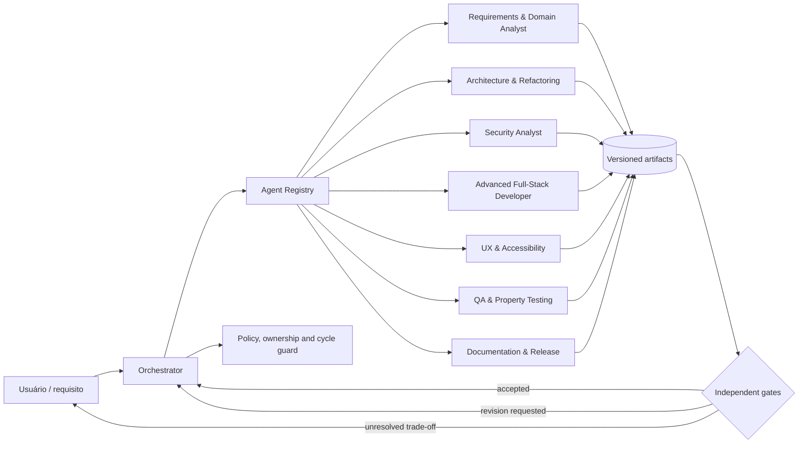
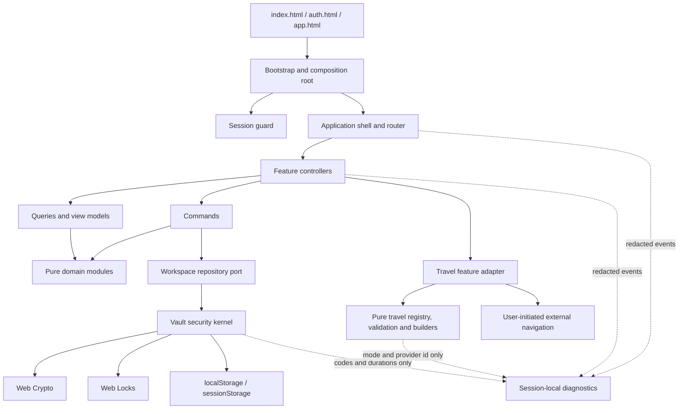
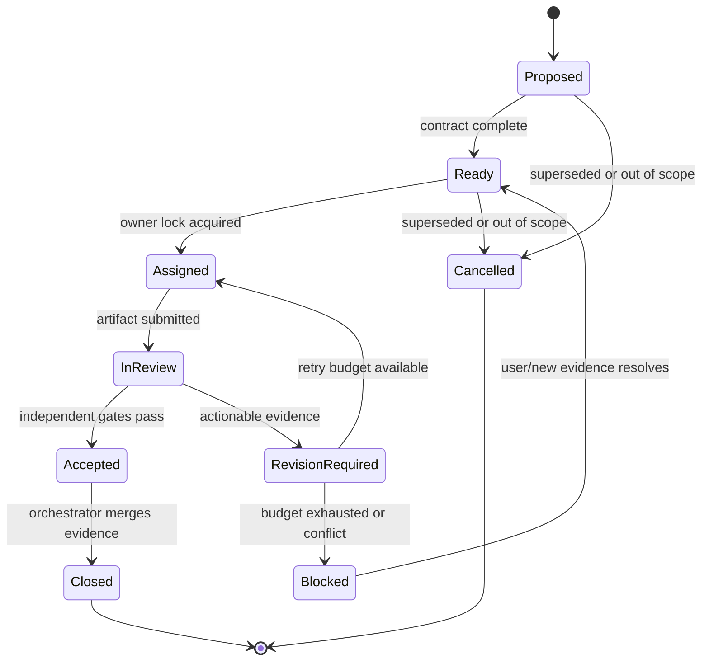
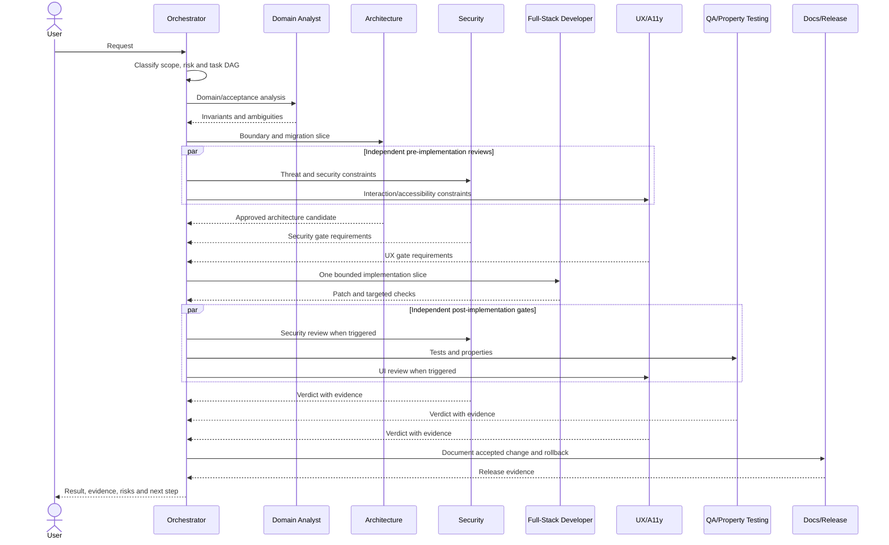
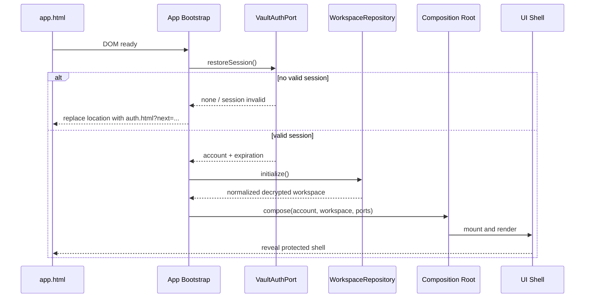
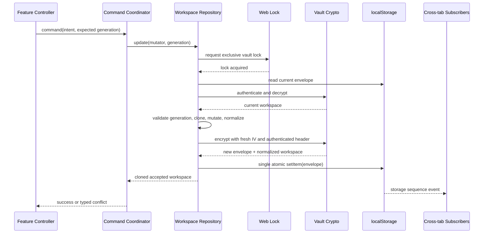

# Technical Design: Multi-Agent Code Architecture

**Feature:** `multi-agent-code-architecture`  
**Workflow:** Design-first  
**Detail level:** High-Level Design + Low-Level Design  
**Status:** Proposed — sem implementação nesta fase  
**Notation:** pseudocódigo estruturado, independente de linguagem

## Overview

Esta feature define duas arquiteturas complementares. A primeira é uma equipe de agentes e skills do Kiro, versionada no próprio workspace, com um `orchestrator` como único ponto de despacho e especialistas em domínio, arquitetura, segurança, desenvolvimento full stack, qualidade/property testing, UX/acessibilidade e documentação/release. A equipe usa contratos explícitos de entrada e saída, handoffs rastreáveis, separação entre autoria e aprovação, limites de ferramentas e um grafo acíclico de trabalho para evitar ciclos, duplicidade e decisões conflitantes.

A segunda arquitetura reorganiza progressivamente o PlannerDuo. A aplicação continua sendo uma SPA local, sem backend e sem dependências remotas, mas o atual `public/app.js` deixa de concentrar coordenação, estado, renderização, formulários e integrações. A migração usa extração incremental por módulos coesos e fachadas de compatibilidade, preservando os contratos públicos de `PlannerCore`, `PlannerLocal`, `PlannerTravel` e `PlannerApp` até que cada consumidor e teste tenha sido migrado.

O princípio central é **refatorar sem migrar dados e sem alterar comportamento**. O formato do workspace, o envelope do cofre, PBKDF2-SHA-256 com 600.000 iterações, AES-GCM, IV novo por gravação, AAD autenticado, sessão por aba, Web Locks, invalidadores entre abas, login, backups, CRUDs, recorrências, 26 provedores de viagem, allowlist HTTPS, CSP e testes atuais permanecem invariantes. Esta fase cria somente o design e a configuração da spec.

## 2. Goals and non-goals

### 2.1 Goals

- Definir uma equipe Kiro reutilizável, local ao workspace e governada por contratos.
- Especificar responsabilidades, gatilhos, entradas, saídas, limites, handoffs e gates de cada agente.
- Impedir ciclos de delegação, múltiplos donos, autoaprovação e resolução silenciosa de conflitos.
- Propor skills pequenas, composáveis e auditáveis, separadas das personas dos agentes.
- Definir uma arquitetura modular alvo para todas as áreas do PlannerDuo.
- Preservar APIs, formatos persistidos, garantias criptográficas e comportamento observável durante a migração.
- Permitir extrações verticais pequenas, reversíveis e validadas por caracterização, propriedades e smoke tests.
- Manter observabilidade estritamente local, limitada e sem conteúdo sensível.

### 2.2 Non-goals

- Implementar, mover ou editar código da aplicação nesta fase.
- Criar agora os manifests de agentes, os arquivos `SKILL.md` ou os módulos propostos.
- Alterar o schema do workspace, chaves de storage, envelope criptográfico ou parâmetros criptográficos.
- Adicionar backend, sincronização em nuvem, telemetria remota, CDN, framework, bundler ou dependência de runtime.
- Alterar provedores, deep links, UI, regras de negócio ou política de recuperação de senha.
- Gerar `requirements.md` ou `tasks.md` nesta fase específica.

## 3. Baseline and immovable contracts

| Área | Contrato atual | Consequência para o design |
|---|---|---|
| Runtime | HTML/CSS/JavaScript local, scripts clássicos/IIFE, sem build obrigatório | A migração começa com módulos compatíveis com o carregamento atual; ESM não é pré-requisito. |
| Fachadas | `window.PlannerCore`, `window.PlannerLocal`, `window.PlannerTravel`, `window.PlannerApp` | Nomes, assinaturas e semântica continuam disponíveis por fachadas durante toda a transição. |
| Domínio | Workspace normalizado e versionado; finanças, viagens, metas, checklist, decisões e participantes | Nenhuma extração pode mudar IDs, referências, arredondamento, recorrência ou normalização. |
| Cofre | PBKDF2-SHA-256, 600.000 iterações, salt de 16 bytes; AES-GCM, chave de 256 bits, IV de 12 bytes e tag de 128 bits | `local.js` é tratado como kernel de segurança e será o último módulo interno a ser dividido. |
| Persistência | `localStorage` para envelope; chave somente em `sessionStorage`; Web Locks para escrita | Não haverá segundo writer, dual-write ou cache legível do workspace. |
| Concorrência | Geração/revisão/sequence, epoch de autenticação, eventos de storage e BroadcastChannel | Fachadas e módulos novos devem manter serialização, invalidação e detecção de substituição. |
| Login | Todas as entradas do painel passam por `auth.html`; sessão inválida redireciona | O bootstrap modular deve falhar fechado antes de renderizar conteúdo protegido. |
| Viagens | 26 provedores, quatro grupos, modos exact/conditional/assisted/manual e allowlist de hosts | Registry, validação e builders continuam puros; abertura externa só após gesto do usuário. |
| CSP | Scripts e assets locais; `connect-src 'none'`; sem objetos ou base externa | Nenhum agente ou módulo de runtime pode introduzir carregamento ou telemetria remota. |
| Qualidade | Vitest, fast-check e `npm run verificar` com sintaxe, referências, CSP e smoke HTTP | Cada etapa de migração deve passar o gate completo, além de testes direcionados. |

## 4. Architectural decisions

1. **Workspace-local configuration.** Agentes, skills e governança serão versionados sob `.kiro/`; estado efêmero de execução não será parte do produto.
2. **Orquestração hub-and-spoke.** Somente o orchestrator cria tarefas filhas. Especialistas solicitam handoff ao orchestrator e nunca chamam outro especialista diretamente.
3. **Task graph acíclico.** Cada execução é um DAG com dono único, profundidade, tentativas e fan-out limitados.
4. **Skill over persona.** Conhecimento repetível fica em skills; o agent manifest define papel, escopo, ferramentas e política de acionamento.
5. **Least privilege and two-person gates.** Quem implementa não aprova sozinho segurança ou qualidade. Agentes recebem somente os caminhos e capacidades necessários.
6. **Compatibility-first modularization.** A aplicação é estrangulada por fachadas estáveis; não há big-bang rewrite.
7. **Security kernel last.** `local.js` só é dividido depois que contratos públicos e testes de caixa-preta estiverem estabilizados.
8. **No data migration for a code refactor.** Schema, envelope e storage keys permanecem byte/semanticamente compatíveis.
9. **One writer.** Todo comando persistente continua passando por um único `WorkspaceRepository.update` dentro de Web Lock.
10. **Local-only observability.** Eventos são redigidos, limitados e mantidos em memória de sessão por padrão; nunca atravessam a rede.
11. **No new runtime dependencies.** O alvo usa APIs nativas e as dependências de desenvolvimento já existentes até uma decisão futura explícita.

## Architecture

### 5.1 Kiro engineering team



There are intentionally no worker-to-worker edges. Handoffs flow through the orchestrator so ownership, depth, retry budget, evidence and conflict policy can be checked before another role is activated.

### 5.2 PlannerDuo target runtime



### 5.3 Dependency rules

- UI modules depend on application ports and view models, never on storage or Web Crypto.
- Application modules coordinate commands and queries but do not implement cryptography or manipulate DOM.
- Domain modules are pure and know neither browser APIs nor HTML.
- Only the vault security kernel may read/write vault and session storage keys.
- Only the travel navigation adapter may open an external URL; it accepts only a validated `TravelSearchResult`.
- Diagnostics is a sink. No business or security decision may depend on diagnostics availability.
- Compatibility facades may delegate inward; target modules never import or call compatibility facades back.

## Components and Interfaces

### 6.1 Proposed workspace structure

```text
.kiro/
  agents/
    orchestrator.json
    requirements-domain-analyst.json
    architecture-refactoring.json
    security-analyst.json
    advanced-full-stack-developer.json
    qa-property-testing.json
    ux-accessibility.json
    documentation-release.json
  skills/
    task-routing-governance/SKILL.md
    plannerduo-domain-contracts/SKILL.md
    modular-boundary-design/SKILL.md
    local-vault-security-review/SKILL.md
    compatibility-first-refactoring/SKILL.md
    property-regression-testing/SKILL.md
    web-accessibility-review/SKILL.md
    release-evidence/SKILL.md
  steering/
    agent-governance.md
  specs/
    multi-agent-code-architecture/
      .config.kiro
      design.md
```

The exact agent manifest schema must be validated against the Kiro version installed at implementation time. The architectural contract is stable: manifests remain declarative, skills live in `.kiro/skills/<skill-id>/SKILL.md`, shared non-persona policy lives in steering, and no manifest contains secrets, machine-specific paths or mutable run state.

### 6.2 Agent roster and contracts

| Agent ID | Responsibilities and activation criteria | Required inputs | Required outputs | Limits and handoff |
|---|---|---|---|---|
| `orchestrator` | Entry point for every request; classify risk and scope; build DAG; select skills; dispatch independent tasks; merge evidence; enforce gates. Always activated first. | User intent, repository context, registry, governance policy, current task graph. | Work plan, assignments, merged decision, status, unresolved questions and final evidence index. | Does not silently implement specialist work or self-approve. Only role allowed to create child tasks. Escalates unresolved requirement/safety trade-offs to the user. |
| `requirements-domain-analyst` | Clarify intent, identify PlannerDuo domain invariants and derive acceptance evidence. Activate for ambiguous scope, new behavior or cross-feature impact. | Request, current behavior, domain schemas, tests, prior specs. | Assumptions, domain impact map, acceptance criteria candidates and ambiguity list. | Read-only by default. Cannot choose architecture or weaken existing behavior. Hands findings to architecture/security through orchestrator. |
| `architecture-refactoring` | Define boundaries, dependency direction, extraction sequence and compatibility seams. Activate for moves, splits, new modules or cross-layer coupling. | Domain map, dependency inventory, public facades, runtime constraints. | Architecture decision, module map, migration slice, rollback and risks. | Cannot waive security gates or implement a broad rewrite. Sends an implementation-ready slice to orchestrator. |
| `security-analyst` | Threat model and review of vault, auth, storage, CSP, external navigation, agent permissions and data handling. Mandatory for changes touching `local.js`, `auth.js/html`, storage, cryptography, CSP, URL builders, dependencies, hooks or agent tool permissions. | Diff/design, security invariants, threat boundaries, relevant tests. | Findings with severity/evidence, required mitigations and gate verdict. | Read-only unless explicitly assigned a security patch. May block only with a violated invariant or credible threat path. Cannot approve its own fix. |
| `advanced-full-stack-developer` | Implement one approved slice across domain/application/UI/adapters while preserving contracts and style. Activate only after architecture and acceptance inputs are ready. | Approved slice, file ownership, contracts, tests and constraints. | Focused patch, implementation notes and targeted validation results. | Write scope is limited to assigned files. Cannot alter crypto parameters, storage/schema formats, CSP or add dependencies without a new approved decision. Hands patch to QA plus affected specialist gates. |
| `qa-property-testing` | Create characterization, unit, property, integration and smoke evidence; minimize counterexamples; assess regression risk. Mandatory for every behavior-affecting patch. | Acceptance properties, baseline behavior, patch, test commands. | Test changes/report, counterexamples, coverage gaps and pass/fail verdict. | Cannot weaken/remove a failing test to pass a patch without approved behavior change. Does not fix production code unless separately assigned. |
| `ux-accessibility` | Review information architecture, keyboard/focus behavior, semantics, announcements, responsive behavior and error recovery. Activate for DOM, CSS, forms, dialogs, navigation or user-visible text. | User flow, markup/styles, interaction contract and accessibility baseline. | UX/a11y findings, expected focus/announcement behavior and gate verdict. | Cannot bypass auth/security or change domain semantics. Hands actionable UI contract back through orchestrator. |
| `documentation-release` | Maintain architecture/user docs, change summary, release notes and verification evidence. Activate after behavior stabilizes or public commands/contracts change. | Accepted artifacts, test evidence, compatibility notes and rollback. | Updated docs/release checklist and traceable evidence index. | Cannot declare release readiness without independent security/QA verdicts. Writes documentation only unless explicitly reassigned. |

### 6.3 Skill catalog

| Skill ID | Primary consumers | Capability | Output contract |
|---|---|---|---|
| `task-routing-governance` | orchestrator | Risk classification, DAG creation, ownership, budgets, conflict policy and human escalation. | Valid task graph and routing rationale. |
| `plannerduo-domain-contracts` | analyst, architect, developer, QA | Workspace schema, settlements, votes, recurrence, CRUD references and compatibility facades. | Invariant checklist tied to affected modules/tests. |
| `modular-boundary-design` | architect, developer | Cohesion/coupling analysis, ports/adapters, composition root and extraction seams. | Dependency-safe module slice and rollback. |
| `local-vault-security-review` | security, developer, QA | PBKDF2/AES-GCM envelope, session, migration, backup, Web Locks, CSP and URL boundary review. | Threat findings and security property matrix. |
| `compatibility-first-refactoring` | architect, developer | Characterization, facade delegation, one-slice moves and removal criteria. | Patch plan that keeps old public contracts stable. |
| `property-regression-testing` | QA, developer | fast-check properties, model/equivalence tests, counterexample capture and deterministic fixtures. | Executable property plan and results. |
| `web-accessibility-review` | UX, developer, QA | Keyboard, focus, semantic HTML, ARIA live regions, dialogs and responsive checks. | Accessibility acceptance evidence. |
| `release-evidence` | docs/release, orchestrator | Traceability from intent to design, patch, gates, known risks and rollback. | Release/readiness report without unsupported claims. |

Skills must contain prerequisites, allowed inputs, procedure, expected artifact, stop conditions and prohibited actions. A skill never grants more tool or path permission than the consuming agent manifest already has.

### 6.4 Agent configuration model

```pascal
ENUM RiskLevel
  LOW
  MEDIUM
  HIGH
END ENUM

ENUM Capability
  READ_REPOSITORY
  SEARCH_REPOSITORY
  WRITE_ASSIGNED_SOURCE
  WRITE_TESTS
  WRITE_DOCUMENTATION
  RUN_BOUNDED_CHECKS
  REQUEST_USER_INPUT
END ENUM

STRUCTURE AgentManifest
  id: AgentId
  version: PositiveInteger
  description: NonEmptyText
  skills: List<SkillReference>
  allowed_capabilities: Set<Capability>
  allowed_paths: List<PathPattern>
  denied_paths: List<PathPattern>
  activation_rules: List<ActivationRule>
  input_contract: SchemaReference
  output_contract: SchemaReference
  maximum_child_requests: NonNegativeInteger
  can_dispatch: Boolean
  can_final_approve_own_work: Boolean
END STRUCTURE

STRUCTURE SkillManifest
  id: SkillId
  version: PositiveInteger
  prerequisites: List<Condition>
  procedure: OrderedList<Instruction>
  output_contract: SchemaReference
  stop_conditions: List<Condition>
  prohibited_actions: List<ActionPattern>
END STRUCTURE
```

Required manifest invariants:

- Agent IDs and skill IDs are unique and kebab-case.
- Every referenced skill exists and has a compatible version.
- Only `orchestrator.can_dispatch` is true.
- `can_final_approve_own_work` is false for every agent.
- Security and QA have no production write permission by default.
- Denied paths take precedence over allowed paths.
- High-risk activation rules require an explicit specialist gate and, where destructive, user confirmation.

### 6.5 Work item, artifact and handoff model

```pascal
ENUM WorkStatus
  PROPOSED
  READY
  ASSIGNED
  IN_REVIEW
  REVISION_REQUIRED
  BLOCKED
  ACCEPTED
  CLOSED
  CANCELLED
END ENUM

STRUCTURE WorkItem
  task_id: TaskId
  run_id: RunId
  parent_task_id: Optional<TaskId>
  objective: NonEmptyText
  owner_agent_id: Optional<AgentId>
  required_skills: Set<SkillId>
  risk_level: RiskLevel
  allowed_paths: Set<PathPattern>
  acceptance_checks: OrderedList<Check>
  status: WorkStatus
  depth: NonNegativeInteger
  attempt: PositiveInteger
  dependency_task_ids: Set<TaskId>
  evidence_ids: Set<ArtifactId>
END STRUCTURE

STRUCTURE HandoffRequest
  source_task_id: TaskId
  requested_role: AgentId
  reason: NonEmptyText
  unresolved_questions: List<Question>
  supplied_artifact_ids: Set<ArtifactId>
  requested_output_contract: SchemaReference
END STRUCTURE

STRUCTURE ArtifactRecord
  artifact_id: ArtifactId
  task_id: TaskId
  author_agent_id: AgentId
  revision: PositiveInteger
  content_digest: Digest
  summary: RedactedText
  affected_paths: Set<Path>
  claims: List<Claim>
  evidence: List<EvidenceReference>
  gate_verdict: Optional<GateVerdict>
END STRUCTURE
```

Artifacts are immutable by revision. A correction creates a new revision and retains the evidence chain. Handoffs pass references and concise, redacted summaries rather than copying the entire conversation or unrelated repository content.

### 6.6 Routing, cycle prevention and conflict resolution

Hard controls:

- One active owner per work item and one work item per write target at a time.
- Workers cannot dispatch; they return a `HandoffRequest` to the orchestrator.
- Maximum task depth: 4. Maximum attempts for the same role and artifact revision: 2.
- A child cannot target an ancestor role for the same unresolved question unless new evidence exists.
- Before creating a child, the orchestrator checks ancestor task IDs, semantic objective digest, affected paths and requested output.
- Independent read-only tasks may fan out; overlapping write tasks are serialized.
- Fan-out is capped at four specialists per orchestration wave.
- Security and QA gates are independent from authorship.
- Stagnation is detected when two consecutive revisions contain no new evidence or changed decision.

Conflict precedence applies to gate decisions, not to product preference:

1. Explicit user constraints and approved acceptance criteria.
2. Data confidentiality, integrity, recoverability and destructive-action safety.
3. Existing externally observable behavior and persisted compatibility.
4. Verified correctness/test evidence.
5. Dependency and maintainability preferences.
6. UX copy/style and documentation preferences.

A lower-priority concern cannot silently override a higher-priority invariant. If two higher-priority constraints cannot coexist, the orchestrator marks the task `BLOCKED` and asks the user for a decision.



### 6.7 Orchestration sequence



### 6.8 Orchestrator algorithm

```pascal
PROCEDURE ExecuteRequest(request, repository_context, registry, policy)
  INPUT: validated user request and current workspace evidence
  OUTPUT: OrchestrationResult

  root_task <- CreateRootTask(request)
  graph <- NewDirectedAcyclicGraph(root_task)
  ready_queue <- ClassifyAndPlan(root_task, repository_context, registry, policy)

  WHILE ready_queue IS NOT EMPTY DO
    ASSERT IsAcyclic(graph)
    ASSERT EveryActiveTaskHasSingleOwner(graph)
    ASSERT NoOverlappingWriteAssignments(graph)

    wave <- SelectIndependentTasks(ready_queue, policy.maximum_fan_out)

    FOR EACH task IN wave DO
      IF task.risk_level = HIGH AND RequiresUserConfirmation(task) THEN
        PauseUntilConfirmed(task)
      END IF

      agent <- ResolveEligibleAgent(task, registry)
      AcquireOwnership(task, agent)
      artifact <- InvokeWithMinimumContext(agent, task)
      ReleaseOwnership(task, agent)
      RecordImmutableArtifact(task, artifact)

      IF artifact CONTAINS HandoffRequest THEN
        candidate <- BuildChildTask(task, artifact.handoff)
        IF WouldCreateCycle(graph, candidate)
           OR ExceedsDepth(candidate)
           OR RepeatsWithoutNewEvidence(graph, candidate) THEN
          MarkBlocked(task, "handoff cycle or stagnation")
        ELSE
          AddTask(graph, candidate)
          Enqueue(ready_queue, candidate)
        END IF
      ELSE
        verdicts <- RunIndependentGates(task, artifact, policy)
        ApplyVerdicts(task, verdicts)
      END IF
    END FOR

    conflicts <- DetectUnresolvedConflicts(graph, policy.precedence)
    IF conflicts IS NOT EMPTY THEN
      EscalateToUser(conflicts)
      PAUSE
    END IF

    EnqueueNewlyReadyTasks(graph, ready_queue)
  END WHILE

  ASSERT IsAcyclic(graph)
  ASSERT EveryAcceptedClaimHasEvidence(graph)
  RETURN BuildResult(graph)
END PROCEDURE
```

## 7. PlannerDuo modular target

### 7.1 Proposed application structure

```text
public/
  app.js                         # temporary compatibility entry; becomes thin bootstrap
  auth.js                        # temporary compatibility entry; becomes thin auth bootstrap
  core.js                        # stable PlannerCore facade
  local.js                       # stable PlannerLocal facade and initial security kernel
  travel.js                      # stable PlannerTravel facade
  modules/
    bootstrap/
      app-bootstrap.js
      auth-bootstrap.js
      composition-root.js
    shared/
      contracts.js
      errors.js
      text.js
      dates.js
      money.js
      dom.js
    platform/
      diagnostics.js
      browser-navigation.js
      download.js
    application/
      app-store.js
      command-coordinator.js
      query-service.js
      conflict-policy.js
    domain/
      workspace.js
      participants.js
      finances.js
      recurrence.js
      settlements.js
      trips.js
      goals.js
      checklist.js
      decisions.js
      reports.js
    security/
      vault-envelope.js
      vault-crypto.js
      vault-session.js
      vault-repository.js
      vault-migration.js
      vault-backup.js
      vault-concurrency.js
    travel/
      provider-registry.js
      search-validation.js
      url-builders.js
      provider-icons.js
      travel-launcher.js
    ui/
      shell.js
      router.js
      dialogs.js
      notifications.js
      views/
        dashboard-view.js
        finances-view.js
        trips-view.js
        goals-view.js
        checklist-view.js
        decisions-view.js
        reports-view.js
        settings-view.js
tests/
  contract/
  characterization/
  property/
  integration/
```

This is a target ownership map, not a mandate to create all files at once. A file is introduced only when a migration slice proves that it creates a cohesive boundary. Tiny files that always change together may remain combined.

### 7.2 Component responsibilities

| Component | Responsibility | Must not do |
|---|---|---|
| Composition root | Resolve facades/ports, validate required modules, construct store/router/features and start app. | Contain domain rules, HTML rendering or persistence logic. |
| Session guard | Restore session before protected bootstrap; lock/redirection on invalidation or inactivity. | Read plaintext workspace outside repository APIs. |
| App store | Hold current workspace/account/view/filter state and notify local subscribers. | Persist directly or silently reconcile generation conflicts. |
| Command coordinator | Route mutations through repository, map typed errors and refresh accepted state. | Perform DOM rendering or bypass expected generation. |
| Query service | Derive read-only view models for dashboard, filters and reports. | Mutate workspace or access storage. |
| Feature controllers | Bind one feature's user intents to queries, commands and view rendering. | Reach another feature's private module or own vault logic. |
| Pure domain modules | Normalize and apply business operations for each domain area. | Use DOM, storage, time/network implicitly or global mutable state. |
| Vault security kernel | Authenticate, encrypt/decrypt, serialize updates, migrate, backup and notify cross-tab changes. | Expose key material/workspace in logs or permit a plaintext persistence path. |
| Travel engine | Registry, sanitization, validation, mode selection and safe URL construction. | Open windows, use network, trust arbitrary hosts or overstate prefilled fields. |
| Travel launcher | Open one validated URL after a user gesture with isolation; optionally copy a safe summary. | Construct arbitrary URLs or run during startup. |
| View modules | Render escaped view models and maintain focus/ARIA behavior. | Contain storage, cryptography or domain mutation logic. |
| Diagnostics | Record bounded redacted metadata for local debugging. | Persist secrets, email, password, key, plaintext entities or send data remotely. |
| Compatibility facades | Preserve existing globals, exports, signatures and error semantics while delegating inward. | Become a second implementation or introduce circular dependencies. |

### 7.3 Core interfaces and types

```pascal
INTERFACE FeatureModule
  METHOD id() RETURNS FeatureId
  METHOD mount(context: FeatureContext) RETURNS Unsubscribe
  METHOD render(view_model: ViewModel) RETURNS Void
  METHOD handle(intent: UserIntent) RETURNS Promise<IntentResult>
END INTERFACE

INTERFACE WorkspaceRepository
  METHOD initialize() RETURNS Promise<Workspace>
  METHOD load() RETURNS Promise<Workspace>
  METHOD update(mutator: WorkspaceMutation, expected_generation: GenerationId)
    RETURNS Promise<Workspace>
  METHOD reset() RETURNS Promise<Workspace>
  METHOD exportEncrypted() RETURNS Promise<EncryptedBackup>
  METHOD importBackup(source: BackupSource, optional_password: Optional<Secret>)
    RETURNS Promise<Workspace>
  METHOD subscribe(on_workspace, on_locked, on_legacy_conflict) RETURNS Unsubscribe
END INTERFACE

INTERFACE VaultAuthPort
  METHOD status() RETURNS VaultStatus
  METHOD createVault(input: CreateVaultInput) RETURNS Promise<CreateVaultResult>
  METHOD unlock(input: Credentials) RETURNS Promise<UnlockResult>
  METHOD restoreSession() RETURNS Promise<Optional<SessionSummary>>
  METHOD changePassword(input: PasswordChange) RETURNS Promise<PasswordChangeResult>
  METHOD lock(scope: LockScope) RETURNS Promise<Void>
  METHOD destroyVault() RETURNS Promise<Void>
END INTERFACE

INTERFACE DomainCore
  METHOD normalizeWorkspace(input: UnknownValue) RETURNS Workspace
  METHOD createEmptyWorkspace() RETURNS Workspace
  METHOD createParticipant(input, index) RETURNS Participant
  METHOD removeParticipant(workspace, participant_id) RETURNS ParticipantRemoval
  METHOD calculateSettlements(finances, participants, filter) RETURNS SettlementResult
  METHOD materializeRecurring(workspace, through_month) RETURNS RecurrenceResult
  METHOD removeFinance(workspace, finance_id) RETURNS FinanceRemoval
  METHOD vote(workspace, decision_id, option_id, participant_id) RETURNS VoteResult
END INTERFACE

INTERFACE TravelEngine
  METHOD providers() RETURNS ImmutableList<TravelProvider>
  METHOD validate(provider_id, input, reference_date) RETURNS TravelValidation
  METHOD build(provider_id, input, reference_date) RETURNS TravelSearchResult
  METHOD iconSvg(provider_id) RETURNS SafeInlineSvg
  METHOD badgeFor(provider) RETURNS Text
END INTERFACE

INTERFACE DiagnosticsPort
  METHOD record(event: RedactedDiagnosticEvent) RETURNS Void
  METHOD snapshot() RETURNS ImmutableList<RedactedDiagnosticEvent>
  METHOD clear() RETURNS Void
END INTERFACE
```

## Data Models

### Persisted data model — unchanged

```pascal
STRUCTURE Workspace
  format: ConstantWorkspaceFormat
  schema_version: ConstantSchemaVersion
  id: "workspace-local"
  generation: GenerationId
  revision: NonNegativeInteger
  name: Text
  participants: List<Participant>
  finances: List<Finance>
  trips: List<Trip>
  goals: List<Goal>
  checklist: List<ChecklistItem>
  decisions: List<Decision>
  budgets: Map<Category, Money>
  settings: WorkspaceSettings
  created_at: Timestamp
  updated_at: Timestamp
END STRUCTURE

STRUCTURE VaultEnvelope
  format: "plannerduo-vault"
  version: 1
  vault_id: VaultId
  sequence: NonNegativeInteger
  key_version: PositiveInteger
  account: VisibleLocalAccountMetadata
  kdf: Pbkdf2Sha256Parameters
  cipher: AesGcmCiphertextWithIvAndTagMetadata
  created_at: Timestamp
  updated_at: Timestamp
END STRUCTURE

STRUCTURE Finance
  id: EntityId
  type: INCOME OR EXPENSE
  description: NonEmptyText
  amount: Money
  date: CalendarDate
  category: FinanceCategory
  paid_by_id: Optional<ParticipantId>
  split_between_ids: UniqueList<ParticipantId>
  trip_id: Optional<TripId>
  recurring: Boolean
  recurring_source_id: Optional<FinanceId>
  recurrence_series_id: Optional<FinanceId>
  occurrence_month: Optional<YearMonth>
  recurrence_skipped_months: UniqueList<YearMonth>
  created_at: Timestamp
END STRUCTURE

STRUCTURE Decision
  id: EntityId
  title: NonEmptyText
  status: OPEN OR CLOSED
  options: List<DecisionOption> WITH MINIMUM_SIZE 2
  created_at: Timestamp
  closed_at: Optional<Timestamp>
END STRUCTURE
```

No field is renamed or added as part of module extraction. Normalization remains the single compatibility boundary for in-memory domain values; strict validation remains mandatory for imports and decrypted payloads.

## Compatibility and Ownership

### Compatibility facade contract

During migration:

- `public/core.js` continues to expose the current CommonJS-compatible return and `window.PlannerCore`.
- `public/local.js` continues to expose `window.PlannerLocal`, all constants used by tests/UI, `auth`, repository methods and exact error codes.
- `public/travel.js` continues to expose the provider order, count, IDs, hosts, builders, SVGs and badges through `window.PlannerTravel`.
- `public/app.js` continues to expose `window.PlannerApp.getState`, `navigate`, `render` and `travelSearch`.
- Existing routes `/core.js`, `/local.js`, `/travel.js`, `/auth.js` and `/app.js` remain valid until a separately approved compatibility removal.
- A facade may be thin, but it may not fork state, duplicate writes or catch-and-change established error codes.

### 7.6 Current-to-target ownership map

| Current responsibility | Target owner |
|---|---|
| `$`, `$$`, escaping, dates, money and download helpers in `app.js` | `shared/*` and `platform/download.js` |
| `state`, navigation, inactivity and composition in `app.js` | app store, router, session guard and app bootstrap |
| `commit` and entity conflict mapping | command coordinator + conflict policy, delegating to the same repository |
| Feature render functions | one `ui/views/*-view.js` per cohesive feature |
| Forms/actions for each entity | corresponding feature controller |
| Dashboard/report derivations | query service + pure report/settlement domain functions |
| Travel form integration and opening | travel feature controller + launcher |
| Registry, validation, builders and local SVGs in `travel.js` | `modules/travel/*` behind unchanged facade |
| Workspace normalization and domain operations in `core.js` | `modules/domain/*` behind unchanged facade |
| Auth screen orchestration in `auth.js` | auth bootstrap/controller, still using `VaultAuthPort` |
| Encryption, session, migration, backup and concurrency in `local.js` | security submodules behind one unchanged repository/auth facade; extracted last |

## 8. Runtime sequences

### 8.1 Protected bootstrap



The protected shell is not revealed before both session restoration and workspace initialization succeed.

### 8.2 Serialized workspace mutation



There is no plaintext write and no UI feature receives the key.

### 8.3 Safe travel launch

```mermaid
sequenceDiagram
    actor User
    participant UI as Travel View
    participant C as Travel Controller
    participant E as Travel Engine
    participant N as Navigation Adapter
    participant Site as Allowlisted Provider

    User->>UI: click provider
    UI->>C: search intent
    C->>E: validate(provider, input, today)
    E-->>C: normalized data or field error
    alt invalid input
        C-->>UI: focus field and announce error
    else valid input
        C->>E: build(provider, normalized data)
        E-->>C: HTTPS allowlisted result + honest mode
        C->>N: open(result, user gesture)
        N->>Site: new tab, noopener, noreferrer
        N-->>UI: local status; no background request
    end
```

## 9. Key functions with formal specifications

### 9.1 `DispatchWorkItem`

```pascal
FUNCTION DispatchWorkItem(task, graph, registry, policy) RETURNS ArtifactRecord
```

**Preconditions**

- `task.status = READY`.
- All dependency tasks are `ACCEPTED` or `CLOSED`.
- The task has a complete input/output contract and bounded path set.
- No active task owns an overlapping write path.
- The selected agent exists and references only installed skills.

**Postconditions**

- Exactly one eligible agent owns the task while it is executing.
- The resulting artifact is immutable, attributed and linked to evidence.
- Any requested handoff returns to the orchestrator; no worker is directly invoked.
- A policy violation produces `BLOCKED`, not an ungoverned fallback.

**Loop invariants**

- The task graph remains acyclic.
- Every active write path has at most one owner.
- Accepted claims continue to reference evidence.

### 9.2 `CommitWorkspace`

```pascal
PROCEDURE CommitWorkspace(mutator, expected_generation)
  INPUT: deterministic workspace mutation and optional generation guard
  OUTPUT: newly accepted normalized workspace

  ACQUIRE exclusive vault lock
  session <- RequireValidSession()
  envelope <- ReadCurrentEnvelope()
  ASSERT EnvelopeMatchesSession(envelope, session)

  current <- AuthenticatedDecrypt(envelope, session.key)
  IF expected_generation IS PRESENT
     AND current.generation != expected_generation THEN
    RAISE WorkspaceReplaced WITH current_workspace = Clone(current)
  END IF

  draft <- Clone(current)
  candidate <- Apply(mutator, draft)
  normalized <- NormalizeWorkspace(candidate OR draft)
  normalized.generation <- current.generation
  normalized.revision <- current.revision + 1
  normalized.updated_at <- CurrentTimestamp()

  new_envelope <- AuthenticatedEncrypt(
    normalized,
    session.key,
    fresh_random_iv = TRUE,
    sequence = envelope.sequence + 1,
    authenticated_header = TRUE
  )
  WriteEnvelopeOnce(new_envelope)
  RELEASE exclusive vault lock
  RETURN Clone(normalized)
END PROCEDURE
```

**Preconditions**

- A non-expired session matches vault ID, key version, account and auth epoch.
- Web Locks is available; otherwise the operation fails closed.
- `mutator` is bounded to the supplied clone and does not persist independently.

**Postconditions**

- Exactly one encrypted envelope write occurs on success.
- Revision and envelope sequence increase by one.
- Generation is preserved unless the explicit reset/import operation owns replacement semantics.
- Ciphertext uses a fresh 12-byte IV and authenticates header metadata.
- No plaintext workspace or key is written to persistent storage or diagnostics.
- On conflict/decryption/write failure, no candidate plaintext becomes authoritative.

**Loop invariants**

- Not applicable internally; the Web Lock serializes concurrent calls. Across queued calls, each next call reads the envelope committed by its predecessor.

### 9.3 `RestoreProtectedSession`

```pascal
FUNCTION RestoreProtectedSession() RETURNS Optional<SessionSummary>
  marker <- ReadSessionMarker()
  IF marker IS ABSENT OR Expired(marker) OR EpochMismatch(marker) THEN
    ClearSession()
    RETURN NONE
  END IF

  envelope <- ReadAndValidateEnvelope()
  IF NOT MarkerMatchesEnvelope(marker, envelope) THEN
    ClearSession()
    RETURN NONE
  END IF

  key <- ImportSessionKey(marker.encoded_key)
  TRY
    AuthenticatedDecrypt(envelope, key)
  CATCH ANY
    ClearSession()
    RETURN NONE
  END TRY

  ActivateInMemorySession(marker, envelope, key)
  RETURN RedactedSessionSummary(envelope.account, marker.expires_at)
END FUNCTION
```

**Preconditions**

- Browser storage and Web Crypto APIs are available.

**Postconditions**

- Returns a session only after authenticated decryption succeeds.
- Any invalid marker, epoch, envelope, key version or ciphertext clears local session state.
- The returned summary never contains key bytes or plaintext workspace.

**Loop invariants**

- Not applicable.

### 9.4 `BuildTravelSearch`

```pascal
FUNCTION BuildTravelSearch(provider_id, raw_input, reference_date)
  RETURNS TravelSearchResult

  provider <- FindProvider(provider_id)
  ASSERT provider EXISTS
  data <- SanitizeAndValidate(raw_input, provider, reference_date)

  IF ExactRequirementsSatisfied(provider, data) THEN
    candidate <- BuildExactUrl(provider, data)
    mode <- EXACT
  ELSE IF AssistedSearchSupported(provider, data) THEN
    candidate <- BuildAssistedUrl(provider, data)
    mode <- ASSISTED
  ELSE
    candidate <- ProviderOfficialHome(provider)
    mode <- MANUAL
  END IF

  ASSERT candidate.protocol = HTTPS
  ASSERT candidate.host IN ExactAllowedHosts()
  ASSERT candidate HAS NO credentials AND HAS NO custom port

  RETURN ImmutableTravelResult(candidate, mode, TruthfulFilledFields(data, mode))
END FUNCTION
```

**Preconditions**

- Provider ID belongs to the immutable 26-provider registry.
- Dates, passenger count and locations are validated before URL construction.

**Postconditions**

- URL is HTTPS and belongs to the exact host allowlist.
- Result mode and `filled` fields do not claim data that the URL does not carry.
- Missing requirements degrade to assisted/manual behavior instead of guessing.
- The function performs no navigation, network request, clipboard write or mutation.

**Loop invariants**

- For registry-wide validation, every already-checked provider has a unique ID, known group, local safe SVG and allowlisted result host.

### 9.5 `ExtractCompatibilitySlice`

```pascal
PROCEDURE ExtractCompatibilitySlice(slice, baseline_contracts)
  INPUT: one cohesive responsibility and its observable contracts
  OUTPUT: migration evidence or rollback

  characterization <- CaptureBehavior(slice, baseline_contracts)
  ASSERT characterization IS COMPLETE FOR affected behavior

  target_module <- DefineTargetBoundary(slice)
  MoveOneResponsibility(slice, target_module)
  MakeExistingFacadeDelegate(target_module)

  targeted_result <- RunTargetedTests(slice)
  full_result <- RunFullVerification()
  equivalence <- CompareObservableBehavior(characterization, target_module)

  IF targeted_result FAILS OR full_result FAILS OR equivalence FAILS THEN
    RevertSliceWithoutDataMigration()
    RETURN RollbackEvidence()
  END IF

  ASSERT NoSecondWriterExists()
  ASSERT PublicFacadeContractUnchanged()
  RETURN AcceptedMigrationEvidence()
END PROCEDURE
```

**Preconditions**

- The slice has one owner and a documented rollback.
- Characterization tests cover public API, errors and persisted effects.
- No unrelated feature or format change is bundled with the extraction.

**Postconditions**

- The old public entry delegates to exactly one implementation.
- Runtime behavior, storage schema, envelope and routes remain compatible.
- Failed extraction is reversible by code revert alone; no user-data rollback is required.

**Loop invariants**

- Across migration slices, there remains one authoritative implementation per responsibility and one authoritative storage writer.

## 10. Example orchestration usage

```pascal
SEQUENCE
  request <- "Extract the finances feature from app.js without behavior change"
  result <- ExecuteRequest(request, repository_context, agent_registry, governance_policy)

  EXPECT result.graph CONTAINS requirements_domain_analysis
  EXPECT result.graph CONTAINS architecture_slice
  EXPECT result.graph CONTAINS security_review
  EXPECT result.graph CONTAINS full_stack_implementation
  EXPECT result.graph CONTAINS qa_property_gate
  EXPECT result.graph CONTAINS ux_accessibility_gate
  EXPECT result.graph CONTAINS documentation_evidence

  IF result.status = BLOCKED THEN
    DISPLAY result.unresolved_trade_offs TO user
  ELSE
    DISPLAY result.accepted_artifacts AND result.validation_evidence
  END IF
END SEQUENCE
```

## 11. Incremental migration strategy

The migration follows a strangler pattern: characterize, extract one responsibility, delegate through the old facade, verify equivalence, then remove only the now-dead implementation. There is never dual-write or a second decrypted workspace cache.

| Phase | Scope | Exit gate | Rollback |
|---|---|---|---|
| 0 — Baseline freeze | Inventory globals, DOM selectors, error codes, storage keys, provider registry and current test behavior. Add missing characterization before movement. | `npm run verificar` passes; baseline contracts are enumerated. | Documentation/test-only revert. |
| 1 — Agent governance | Add manifests, skills, governance validation and dry-run routing. No application code. | Unique manifests/skills, acyclic test graphs, path permissions and handoff schemas validate. | Remove/disable workspace agent assets. |
| 2 — Pure shared seams | Extract escaping, parsing/formatting, date and immutable helper contracts where behavior can be compared directly. | Unit/property equivalence; no global/storage access in helpers. | Facade calls original helper until focused revert. |
| 3 — Low-risk UI slices | Extract one feature view/controller at a time, starting with checklist/goals, then decisions/trips, then dashboard/reports/settings. | DOM/interaction characterization, keyboard/focus checks and full gate per slice. | Revert one slice; workspace data is untouched. |
| 4 — Finance/application coordination | Isolate app store, command coordinator, queries, filters, settlements and recurrence UI around unchanged `PlannerCore`/repository contracts. | CRUD, cents conservation, recurring occurrence and conflict tests all pass. | Restore old controller path; no data conversion. |
| 5 — Travel internals | Split registry, validators, builders, icons and launcher behind unchanged `PlannerTravel`. | Exactly 26 providers, four groups, exact host allowlist, truthful modes, local SVG and user-gesture navigation. | Revert facade delegation. |
| 6 — Auth and domain facades | Thin `auth.js` bootstrap and split pure `core.js` internals while retaining exports/globals. | Login/redirect/session and all domain contract tests pass unchanged. | Revert modules; vault remains untouched. |
| 7 — Vault kernel internals | Last: separate envelope, crypto, session, migration, backup and concurrency internally behind unchanged `PlannerLocal`. | Full security/property suite, wrong-password immutability, fresh IV, tamper detection, migration safety, password rotation and cross-tab serialization. | Revert internal split; same envelope/schema remains readable. |
| 8 — Consolidation | Remove dead internal code only after references and compatibility tests prove it unused; update architecture docs. | No duplicate implementation, unresolved reference or reduced gate. | Restore last known facade implementation. |

Migration rules:

- One phase is not one large pull request; each row can contain multiple independently releasable slices.
- Every slice states affected files, public contracts, data effects, security triggers, UX triggers, tests and rollback before editing.
- `local.js` changes require security review both before and after implementation.
- No storage key, envelope field, schema version or cryptographic parameter changes under this feature.
- No module may persist a workspace except through `WorkspaceRepository`.
- Existing script routes and global APIs remain compatibility tests, not implementation suggestions.
- Text-based tests may be replaced only by stronger behavioral/contract tests first, never simply deleted.
- Removal of a compatibility facade is a future feature with explicit browser/test migration evidence.

## Error Handling

### 12.1 Agent workflow errors

| Scenario | Response | Recovery |
|---|---|---|
| Unknown agent or missing skill | Reject assignment before invocation; mark configuration invalid. | Fix manifest/reference and rerun validation. |
| Cycle or repeated handoff | Block child creation and attach the detected ancestor/equivalent objective. | Orchestrator reframes task with new evidence or asks user. |
| Overlapping write ownership | Serialize tasks; read-only review may continue. | Release first owner, refresh context and dispatch next writer. |
| Specialist timeout/failure | Record partial evidence; one bounded retry if idempotent. | Replan to another eligible role or escalate; never assume approval. |
| Security or QA veto | Set `REVISION_REQUIRED` with evidence. | Author creates a new artifact revision; original reviewer rechecks, but cannot author the fix. |
| Conflicting accepted recommendations | Apply precedence only when constraints decide the issue. | For product trade-offs, mark `BLOCKED` and ask the user. |
| Tool/path permission violation | Stop before mutation and record policy finding. | Narrow task or obtain explicit authorization; do not broaden permission automatically. |

### 12.2 PlannerDuo runtime errors

| Scenario | Response | Recovery |
|---|---|---|
| Required module/facade absent | Fail bootstrap with a local, escaped fatal message; keep protected shell hidden. | Reload after deployment correction; no partial initialization. |
| Invalid/expired session | Clear session state and redirect to `auth.html` with a validated local `next`. | User unlocks again. |
| Wrong password/tampered ciphertext | Generic invalid-credentials/corruption response; do not rewrite envelope. | Retry credentials or use explicit raw-backup/recovery path. |
| Web Locks unavailable | Fail closed before vault creation/update. | Use a supported browser; never fall back to unsafe writes. |
| Generation replaced | Return current workspace in typed conflict and discard local candidate. | Rerender current state and let user retry intent. |
| Write/quota failure | Keep prior envelope authoritative and show bounded error. | Free storage/export backup and retry. |
| Invalid backup/schema/reference | Reject before replacing current workspace. | Preserve current vault and request a valid backup. |
| Invalid travel input | Return field-specific local validation; no tab opens. | Focus invalid field. |
| URL outside allowlist | Throw safe build error; no navigation. | Select supported provider/fix registry under security review. |
| View render exception | Record redacted local event and isolate feature where possible; never log workspace content. | Keep store/repository intact, show retry/reload action. |

## 13. Local observability

No remote telemetry is introduced. `connect-src 'none'` remains both a CSP requirement and an architectural assertion.

```pascal
STRUCTURE RedactedDiagnosticEvent
  event_id: EventId
  correlation_id: CorrelationId
  timestamp: Timestamp
  area: BOOTSTRAP OR AUTH OR COMMAND OR VIEW OR TRAVEL OR VAULT
  operation: AllowlistedOperationName
  outcome: STARTED OR SUCCEEDED OR FAILED OR CONFLICTED
  duration_bucket: Optional<DurationBucket>
  error_code: Optional<AllowlistedErrorCode>
  provider_id: Optional<TravelProviderId>
  entity_type: Optional<EntityType>
END STRUCTURE
```

Rules:

- Default sink is an in-memory ring buffer scoped to the current tab, capped at 200 events.
- Events contain no names, email, password, key bytes, ciphertext, descriptions, notes, amounts, destinations, dates, clipboard content or serialized entities.
- Diagnostics failures are ignored safely and never change business outcomes.
- Console output is disabled in normal operation except existing fatal development diagnostics; an explicit development switch may expose only the redacted snapshot.
- Agent runs record task IDs, roles, status, artifact digests and gate verdicts in Kiro-visible task/report artifacts; raw prompts, secrets and unrelated source are not copied into run logs.
- Correlation IDs are random operational IDs and are never persisted into the workspace or vault envelope.

## Testing Strategy

### 14.1 Agent/configuration tests

- Schema validation for each agent and skill manifest.
- Unique IDs, existing skill references and compatible versions.
- Exactly one dispatcher and no self-approval.
- Permission/path tests proving deny rules override allow rules.
- Routing examples for security, UX, architecture, QA and documentation triggers.
- Property tests over generated task graphs: acyclicity, single ownership, bounded depth, bounded retry and termination.
- Conflict scenarios proving unresolved high-priority constraints block rather than merge silently.
- Prompt-injection/adversarial repository content treated as data, not governance instructions.

### 14.2 Application unit and contract tests

- Preserve existing pure domain tests for normalization, money, settlements, participant history, voting and recurrence.
- Add facade contract tests before each split: exported keys, globals, function signatures, error codes and immutability.
- Test view-model/query functions without DOM where possible.
- Test each travel builder and validator as a pure function.
- Test redaction by generating arbitrary sensitive-looking input and asserting it cannot appear in diagnostic serialization.

### 14.3 Characterization and equivalence tests

For each extraction, execute old and candidate implementations against the same generated/curated input where both can be isolated. Compare normalized results, typed errors, persisted envelope metadata rules and view-model output. DOM slices use fixture markup and compare semantic state, focus target, enabled/disabled state and announced status rather than brittle full HTML snapshots.

### 14.4 Property-based tests

Continue using the installed `fast-check` dependency. Important properties include:

- normalization is idempotent;
- money normalization is finite, non-negative and bounded;
- settlement balances conserve cents;
- each participant has at most one vote per decision;
- recurring materialization is idempotent for a fixed month and honors skipped months;
- generated task graphs remain acyclic and bounded;
- every accepted travel URL is HTTPS and allowlisted;
- any ciphertext/header tampering fails authentication;
- accepted concurrent updates are serializable;
- diagnostic output never contains generated secret tokens.

### 14.5 Integration, security and accessibility tests

- Login/setup/recovery, protected-route redirection, inactivity lock and cross-tab invalidation.
- Vault create/unlock/update/reset/import/export/change-password/migration flows.
- Wrong-password and write-failure non-mutation checks.
- CSP, local asset references, no remote runtime patterns and HTTP smoke routes.
- Travel user-gesture opening with `noopener noreferrer` and honest mode messaging.
- CRUD flows for every feature after its controller/view extraction.
- Keyboard navigation, dialog focus entry/return, Escape behavior, labels, skip link, live regions, color-independent state and responsive layout.

### 14.6 Required validation gate per implementation slice

1. Targeted tests for the changed module.
2. Contract/equivalence tests for affected facade.
3. Security or UX checks when their triggers match.
4. `npm run verificar` as the final repository gate.
5. Manual browser smoke only for interactions that cannot yet be represented in the automated harness; steps and observed evidence must be recorded.

No watch-mode or long-running development server is part of automated agent execution.

## Correctness Properties

### Property 1: Agent system properties

**Validates: Requirements 1.1, 1.2, 1.3, 1.4, 1.5, 1.6, 1.7, 1.8, 1.9, 1.10**

1. **Acyclic delegation:** for every run graph `G`, `G` has no directed cycle.
2. **Single ownership:** for every active task `t`, there is exactly one owner; for every write path `p`, at most one active task owns `p`.
3. **Bounded termination:** for every request, finite depth, fan-out and retry bounds imply the run reaches `CLOSED`, `CANCELLED` or `BLOCKED` in finite dispatches.
4. **Skill closure:** for every assignment, every required skill resolves to one installed compatible skill before invocation.
5. **No privilege amplification:** for every agent and skill combination, effective capabilities are a subset of the agent's allowed capabilities minus denied paths/actions.
6. **No direct worker dispatch:** for every handoff edge, the source that creates the child edge is the orchestrator.
7. **Separation of duties:** for every accepted code artifact, its author is not the sole security or QA approver.
8. **Evidence-backed acceptance:** for every accepted claim, at least one immutable evidence reference exists.
9. **Conflict safety:** for every unresolved conflict involving confidentiality, integrity, destructive action or explicit user constraint, merge is prohibited until resolved.
10. **Stagnation control:** for every repeated role/objective pair without new evidence, attempts never exceed the configured bound.

### Property 2: PlannerDuo properties

**Validates: Requirements 2.1, 2.2, 2.3, 2.4, 2.5, 2.6, 2.7, 2.8, 2.9, 2.10, 2.11, 2.12, 2.13, 2.14, 2.15, 2.16, 2.17, 2.18, 2.19, 2.20**

1. **Facade equivalence:** for every valid input supported before extraction, old public facade and delegated facade produce observationally equivalent results/errors.
2. **Normalization idempotence:** for every input `x`, normalizing an already normalized workspace does not change it.
3. **Reference integrity:** for every accepted workspace, all participant/trip/recurrence/vote references resolve according to the existing schema rules.
4. **Cent conservation:** for every valid set of shared expenses, the sum of participant settlement balances in cents is zero.
5. **Vote uniqueness:** for every decision and participant, the participant appears in at most one option; archived participants and closed decisions cannot receive a new vote.
6. **Recurrence idempotence:** for every workspace and fixed target month, running materialization twice adds no second occurrence for the same series/month.
7. **Encrypted-at-rest:** for every successful persistent workspace mutation, persistent storage contains only a valid encrypted envelope, never serialized plaintext workspace content.
8. **Fresh IV:** for every two successful encryption writes, their IVs differ with cryptographically random generation.
9. **Authenticated envelope:** for every changed authenticated header field or ciphertext byte, decryption fails closed.
10. **Credential immutability:** for every wrong credential attempt, the stored vault envelope remains unchanged.
11. **Serializable writes:** for every pair of concurrent accepted updates, the final state is equivalent to one serial order under the exclusive lock.
12. **Session isolation:** for every expired, epoch-invalid or mismatched session, protected bootstrap reveals no workspace and redirects to login.
13. **Migration preservation:** for every legacy migration, plaintext is removed only after encrypted persistence and round-trip verification succeed; on failure plaintext is preserved.
14. **Backup atomicity:** for every rejected backup, the current workspace remains authoritative; every accepted backup is normalized, validated and re-encrypted with the current account key.
15. **Travel registry stability:** for every compatible build during this feature, provider count remains 26 and group set remains flights/stays/ground/cars.
16. **Travel destination safety:** for every returned travel result, protocol is HTTPS, host belongs to the exact allowlist, credentials/custom port are absent and mode claims are truthful.
17. **No startup requests:** for every application startup, no travel provider is contacted; external navigation follows an explicit user gesture only.
18. **CSP preservation:** for every shipped page, scripts/assets remain local and background connections remain blocked.
19. **Safe rendering:** for every user-controlled string rendered as markup, escaping prevents interpretation as HTML/script.
20. **Diagnostic confidentiality:** for every diagnostic event and every secret/plaintext domain value, serialized diagnostics do not contain that value and the buffer never exceeds its cap.

## 16. Performance considerations

- Do not optimize or reduce PBKDF2 iterations; authentication cost is a deliberate security cost.
- Keep decryption/mutation/encryption inside the lock, but keep rendering, diagnostics formatting and unrelated computation outside it.
- Pure queries may memoize by workspace revision and filter key, but never persist decrypted results.
- Feature rendering should eventually update only the active/affected view; this is a later optimization gated by equivalence tests, not part of the first extraction.
- More local modules create more localhost requests under classic scripts. Measure startup on the same machine before/after each phase; a sustained regression above 15% in median protected-bootstrap duration requires investigation, but security work is not bypassed to meet the number.
- Session diagnostics is capped at 200 small redacted events.
- Agent fan-out is capped at four and overlapping repository searches should be deduplicated by the orchestrator.
- Specialists receive only relevant file ranges/artifacts to bound context and reduce contradictory stale analysis.

## 17. Security considerations

### 17.1 Agent-system threat model

- Repository files, comments, fetched text and generated artifacts are untrusted data; instructions embedded in them cannot override workspace governance or user intent.
- Agent/skill manifests are version-controlled security-sensitive configuration and require review like code.
- Tool capability and path restrictions follow least privilege. Security/QA are read-only by default; docs writes docs; developer writes only assigned files.
- No agent may transmit project code, user data, keys or secrets to third parties without explicit user authorization.
- Destructive Git, storage, infrastructure or security-parameter actions require explicit confirmation and cannot be inferred from a refactoring task.
- New dependencies require separate review, exact version pinning, license/supply-chain assessment and a demonstrated need.
- Security findings include evidence and affected invariant; vague concern alone cannot indefinitely block work.
- Agent outputs are advisory artifacts until independently gated and merged by the orchestrator.

### 17.2 Application threat boundaries

- Key derivation, key bytes, encryption/decryption and session restoration stay inside the vault security kernel.
- Key material remains session-scoped and is never passed through feature context, diagnostics or handoffs.
- AAD continues to authenticate envelope metadata; parsing validates lengths, versions and algorithms before use.
- Web Locks remains mandatory; there is no optimistic unsafe fallback.
- Cross-tab lock/password/destroy events invalidate active sessions through epoch plus local channels.
- Compatibility wrappers must not expose new debugging APIs that reveal plaintext or key material.
- User content is escaped before `innerHTML`; local SVG registry remains static/sanitized.
- External travel URLs pass exact protocol/host checks and open with `noopener noreferrer` only after user action.
- CSP continues to block remote scripts and connections. Modularization must not add dynamic remote imports, inline executable script or CDN assets.
- Backups remain encrypted by default; legacy plaintext import is immediately validated and re-encrypted.

## 18. Dependencies

### Runtime dependencies retained

- Browser Web Crypto API.
- Web Locks API.
- `localStorage` and `sessionStorage`.
- Storage events and optional BroadcastChannel.
- Standard DOM, URL, Blob, Clipboard and Intl APIs.
- Existing local HTML/CSS/JavaScript assets only.

### Development dependencies retained

- Vitest.
- fast-check.
- Node.js scripts already used by `npm run verificar`.
- Kiro workspace agents, skills, steering and specs.

No new runtime or development package is required by this design. If future DOM automation needs a package, that choice must be a separate pinned-dependency decision rather than an implicit part of refactoring.

## 19. Risks and mitigations

| Risk | Likelihood / impact | Mitigation |
|---|---|---|
| Agent manifest shape differs across Kiro versions | Medium / Medium | Validate exact installed schema before implementation; keep role/skill contracts independent of transport fields. |
| Agent overhead exceeds value for small tasks | Medium / Low | Orchestrator activates only triggered specialists; low-risk docs-only tasks use a minimal graph. |
| Delegation cycle or contradictory agents | Medium / High | Orchestrator-only dispatch, DAG checks, owner locks, bounded retries, evidence requirement and user escalation. |
| False confidence from a security persona | Medium / High | Security properties and executable tests, independent authorship, explicit residual risk. |
| Big-bang rewrite hidden as modularization | Medium / High | One cohesive slice, stable facade, equivalence gate and code-only rollback per change. |
| Crypto/session regression while splitting `local.js` | Low / Critical | Split last; black-box characterization first; unchanged format/parameters/error semantics; mandatory security gate. |
| Duplicate writer or plaintext cache | Low / Critical | Repository port is the only writer; architecture dependency test; encrypted-at-rest properties. |
| Script order/global namespace regression | Medium / High | Composition-root/module registry validation and facade contract/smoke tests. |
| Existing tests are coupled to source text | High / Medium | Add stronger behavior/contract test before replacing each textual assertion; never remove coverage first. |
| Module count slows local startup | Medium / Low | Measure relative baseline, group inseparable modules and avoid dependency fan-out. |
| UI extraction breaks focus or announcements | Medium / Medium | UX gate, semantic-state tests and manual keyboard smoke for each UI slice. |
| Diagnostics leak workspace plaintext | Low / High | Allowlisted event schema, generated-secret redaction properties, memory cap and no network. |
| Scope expands into feature redesign | Medium / High | Non-goals, immutable baseline contracts and separate decision required for behavior/schema/dependency changes. |

## 20. Implementation readiness and open decisions

Before implementation begins:

- Validate the concrete Kiro agent manifest schema available in this workspace version.
- Decide whether agent configuration supports native path-deny rules; if not, enforce them in shared governance and pre-tool hooks without weakening least privilege.
- Capture missing facade and DOM characterization tests before moving code.
- Establish a baseline for protected bootstrap and vault operations on the same machine.
- Confirm the first migration slice; recommended first slice is agent governance/configuration, followed by one pure shared helper boundary.

Explicitly deferred decisions:

- Native ES modules versus continued classic IIFE/UMD loading after compatibility migration.
- Removal of top-level legacy script routes/globals.
- Any workspace/envelope schema upgrade.
- Any new test framework, browser automation package or runtime dependency.

## 21. Design completion criteria

This design is ready for requirements derivation when reviewers agree that:

- every agent has a clear trigger, contract, limit, handoff and independent gate;
- cycle, conflict, ownership, retry and escalation policies are unambiguous;
- proposed skills contain reusable capability rather than duplicated persona prose;
- module boundaries cover all current PlannerDuo responsibilities;
- public facades, storage formats and security invariants have explicit preservation rules;
- migration phases are incremental, testable and reversible without data conversion;
- local observability cannot weaken CSP or expose plaintext;
- correctness properties are strong enough to drive unit, property, integration, security and accessibility requirements.
