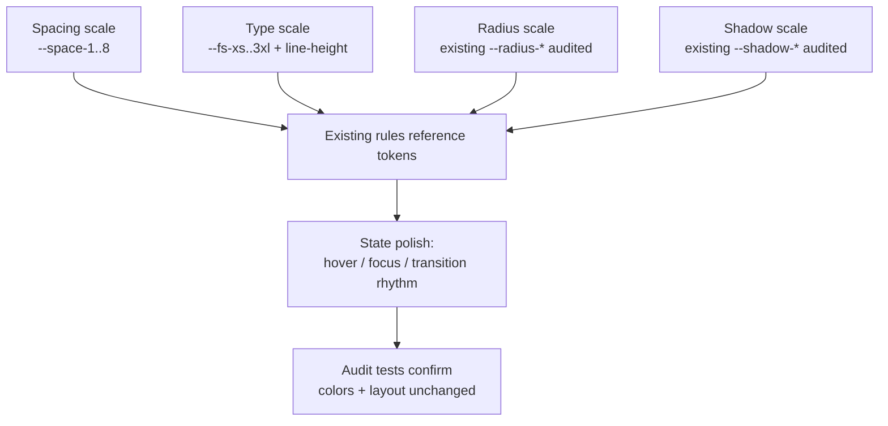

# Design Document: Visual Refinement & Polish

## Overview

This feature refines the **visual formatting** of the PlannerDuo frontend so the interface reads as more pleasant and professional, **without touching the existing "AgendaCar" color palette or the overall layout**. The owner built the current look (color tokens and structure in `public/style.css`) deliberately and wants it preserved pixel-for-structure. The work is strictly limited to formatting quality: spacing rhythm, a coherent type scale, consistent border-radius and shadow usage, alignment, whitespace balance, visual hierarchy, and hover/focus state polish.

The refinement is expressed as a small set of **additive, non-breaking design tokens** (a spacing scale and a type scale) plus **targeted value adjustments** to existing rules. Every color token (`--ac-*` and all mapped `--bg`, `--surface`, `--accent`, etc.) keeps its exact current value, and every structural property that defines layout (`--sidebar-width: 280px`, `.app-shell { display: flex }`, `.app-main { margin-left: var(--sidebar-width) }`, grid templates, header structure, positioning) stays identical. The change is verifiable: a layout/token audit can confirm colors and structural geometry are unchanged while spacing/typographic tokens are present and consistent.

Scope is `public/style.css` as the single source of change. The markup files (`public/index.html`, `public/app.html`, `public/auth.html`) are **read-only references** — they tell us which selectors are in play; no HTML is edited.

## Architecture

This section captures the high-level formatting system — the organizing structure that governs how the refinement is applied across `style.css`.

### Guiding principles

1. **Colors are frozen.** No hex value, no color token mapping, no gradient stop, and no `rgba()` alpha-over-color changes. Alpha may only be reused where it already exists; no new tint colors are introduced.
2. **Layout geometry is frozen.** Sidebar width, flex/grid structure, `margin-left` offsets, `max-width` of `main`, breakpoint values (900px, 600px), sticky/fixed positioning, and the number and placement of columns stay the same.
3. **Only formatting moves.** Padding, margin, gap, `border-radius`, `box-shadow`, `font-size`, `line-height`, `letter-spacing`, `font-weight`, and transition timing/easing are the properties allowed to change — and only to snap them onto a consistent scale.
4. **Additive tokens, minimal churn.** Introduce a spacing scale and a type scale as new `:root` custom properties, then reference them from existing rules. Prefer replacing a loose literal (e.g. `padding: 14px 18px`) with a scale token (`var(--space-3) var(--space-4)`) over inventing new structure.
5. **Respect the test contract.** Keep the typographic floor at `>= 13px`, keep resources 100% local (no `@import`, no remote `url()`/CDN/font), keep the responsive breakpoints, and do not remove motion-reduction / backdrop fallbacks where the test suite expects them.

### Formatting system approach

The polish is organized as **four coordinated scales** plus a **state-polish pass**:



- **Spacing scale** — a single rhythm (4px base) replaces ad-hoc `12px/14px/15px/20px/24px/25px/30px/40px` paddings and margins with scale steps, so vertical and horizontal rhythm feels intentional.
- **Type scale** — a modular set of font sizes with matching line-heights and subtle `letter-spacing` for headings, replacing the current mix of `rem`/`px` literals while never dropping below the 13px floor.
- **Radius scale** — the project already defines `--radius-sm/-/-lg/-xl/-pill`; the pass ensures each component references the right step instead of a one-off literal (e.g. inputs and buttons share a consistent corner language).
- **Shadow scale** — the project already defines `--shadow-sm/-/-lg`; the pass makes elevation consistent (cards at one level, dialogs/toasts at a higher level) instead of mixing `box-shadow: none` with literal shadows arbitrarily.
- **State polish** — unify hover/active/focus feedback and transition timing using the existing `--t-fast/-base/-slow` tokens so interactions feel cohesive. The orange "pressed button" shadow motif on `.nav-item` is preserved (it is layout/identity), only its timing/offsets are normalized.

### Non-goals

- No change to palette, gradients, or any color mapping.
- No change to sidebar width, flex/grid structure, breakpoints, positioning, or `max-width`.
- No markup/class changes in the HTML files.
- No new fonts, no remote resources, no removal of accessibility affordances.

## Components and Interfaces

The "components" of this CSS feature are the style areas (groups of selectors) in `public/style.css`, and the "interfaces" are the additive design tokens (`--space-*`, `--fs-*`, and the existing `--radius-*`/`--shadow-*`/`--t-*`) that act as the contract between the token layer and the consuming rules.

### Token interface (the contract)

The additive tokens form a stable interface that existing rules consume via `var()`. Rules depend only on the token name, never on a raw literal, so the formatting system can evolve a scale step in one place.

```css
/* Spacing interface — consumed by padding/margin/gap declarations */
--space-1 .. --space-8   /* 4px base rhythm */

/* Type interface — consumed by font-size + line-height + letter-spacing */
--fs-xs .. --fs-3xl
--lh-tight / --lh-base / --lh-relaxed
--tracking-tight / --tracking-wide

/* Existing interfaces reused (not redefined) */
--radius-sm / --radius / --radius-lg / --radius-xl / --radius-pill
--shadow-sm / --shadow / --shadow-lg
--t-fast / --t-base / --t-slow
```

### Affected areas / components

Each area is a cluster of selectors in `style.css`. The "formatting touched" column lists only scale-level changes; colors and geometry are untouched.

| Area | Selectors (in `style.css`) | Formatting touched |
|------|----------------------------|--------------------|
| Global base | `body`, `:root` | Add scale tokens; base `line-height`, `letter-spacing` |
| Views & panels | `.view`, `.panel`, `.compact-panel` | Padding/margin → spacing scale; radius/shadow consistency |
| Sidebar nav | `.sidebar`, `.nav-item`, `.nav-list` | Padding/gap rhythm; hover/active transition timing (keeps 280px width + button motif) |
| Headers | `.app-topbar`, `.mobile-header`, `.page-heading`, `.panel-heading` | Padding, heading type scale, letter-spacing, bottom spacing rhythm |
| Dashboard | `.hero-card`, `.metric-grid`, `.metric-card` | Internal padding, gap, type scale for numbers/labels |
| Tables | `table`, `th`, `td` | Cell padding rhythm, header letter-spacing |
| Forms | `input`, `select`, `textarea`, `label`, `.form-grid` | Field padding, radius consistency, label spacing |
| Buttons | `.button`, `.icon-button` | Padding rhythm, radius consistency, hover/transition polish |
| Cards | `.entity-card`, `.card-grid` | Padding, gap, radius/shadow consistency |
| Dialogs & toast | `.dialog`, `.dialog-header`, `.dialog-actions`, `.toast` | Padding rhythm, radius/elevation, action gap |
| Landing / Auth | `.landing-*`, `.vault-auth-*` | Section padding, heading type scale, whitespace balance |

### Interface implementation notes

The language in scope is **CSS** (the explicit, concrete language of the file being changed). All examples below are CSS and are illustrative of the *kind* of edit, snapping literals onto scales — not an exhaustive diff.

New additive tokens (append inside existing `:root`):

```css
:root {
  /* ===== Spacing scale (additive — no layout geometry changed) ===== */
  --space-1: 4px;
  --space-2: 8px;
  --space-3: 12px;
  --space-4: 16px;
  --space-5: 20px;
  --space-6: 24px;
  --space-7: 32px;
  --space-8: 40px;

  /* ===== Type scale (floor >= 13px to satisfy tokens.test.js) ===== */
  --fs-xs: 0.8125rem;   /* 13px */
  --fs-sm: 0.875rem;    /* 14px */
  --fs-base: 1rem;      /* 16px */
  --fs-md: 1.125rem;    /* 18px */
  --fs-lg: 1.25rem;     /* 20px */
  --fs-xl: 1.4rem;      /* 22.4px */
  --fs-2xl: 1.8rem;     /* 28.8px */
  --fs-3xl: 2.2rem;     /* 35.2px */

  --lh-tight: 1.25;
  --lh-base: 1.5;
  --lh-relaxed: 1.65;

  --tracking-tight: -0.01em;
  --tracking-wide: 0.04em;
}
```

> Note: these values are chosen to **match the literals already present** in `style.css` (e.g. existing `padding: 14px 18px`, headings at `1.4rem`/`1.8rem`/`2.2rem`, labels at `.875rem`). This keeps the visual footprint nearly identical while making it systematic. The only intentional micro-adjustments are rounding stray values (`15px`→`16px`, `25px`→`24px`, `10px`→`8px`/`12px`) onto the scale for rhythm.

Example rule changes (literals → scale tokens).

Panels and views — consistent padding rhythm and elevation, colors untouched:

```css
/* BEFORE */
.view { padding: 40px; margin: 20px; border-radius: var(--radius-lg); box-shadow: var(--shadow-sm); }
.panel { padding: 24px; border-radius: var(--radius-lg); margin-bottom: 20px; }

/* AFTER (same colors, same radius tokens, spacing snapped to scale) */
.view { padding: var(--space-8); margin: var(--space-5); border-radius: var(--radius-lg); box-shadow: var(--shadow-sm); }
.panel { padding: var(--space-6); border-radius: var(--radius-lg); margin-bottom: var(--space-5); }
```

Headings — apply the type scale and subtle tracking for hierarchy:

```css
/* BEFORE */
.page-heading h1 { margin: 0; font-size: 1.8rem; color: var(--ac-dark-blue); }
.panel-heading h2 { margin: 0; font-size: 1.4rem; color: var(--ac-dark-blue); }

/* AFTER (identical color token, type via scale, tighter tracking) */
.page-heading h1 { margin: 0; font-size: var(--fs-2xl); line-height: var(--lh-tight); letter-spacing: var(--tracking-tight); color: var(--ac-dark-blue); }
.panel-heading h2 { margin: 0; font-size: var(--fs-xl); line-height: var(--lh-tight); letter-spacing: var(--tracking-tight); color: var(--ac-dark-blue); }
```

Forms — field padding and radius consistency, border color unchanged:

```css
/* BEFORE */
input, select, textarea { padding: 14px 16px; border: 2px solid #ddd; border-radius: var(--radius-sm); }
label { gap: 6px; margin-bottom: 15px; }

/* AFTER (same 2px #ddd border, same radius token, spacing on scale) */
input, select, textarea { padding: var(--space-3) var(--space-4); border: 2px solid #ddd; border-radius: var(--radius-sm); }
label { gap: var(--space-2); margin-bottom: var(--space-4); }
```

Buttons and interaction polish — unify timing with existing tokens, keep the orange motif:

```css
/* BEFORE */
.button { padding: 12px 24px; border-radius: var(--radius-sm); transition: background-color var(--t-fast); }
.nav-item { transition: transform 0.1s, box-shadow 0.1s, background-color 0.2s; }

/* AFTER (same colors + same translate/shadow motif, timing normalized) */
.button { padding: var(--space-3) var(--space-6); border-radius: var(--radius-sm); transition: background-color var(--t-fast), box-shadow var(--t-fast); }
.nav-item { transition: transform var(--t-fast), box-shadow var(--t-fast), background-color var(--t-base); }
```

Dialog & toast — consistent padding rhythm and elevation step:

```css
/* AFTER */
.dialog form { padding: var(--space-6); }
.dialog-actions { gap: var(--space-4); margin-top: var(--space-5); }
.toast { padding: var(--space-4) var(--space-5); border-radius: var(--radius-sm); box-shadow: var(--shadow); }
```

Radius & shadow consistency pass (no new values):

- Interactive controls (`.button`, `.icon-button`, inputs) → `--radius-sm`.
- Containers (`.panel`, `.view`, `.entity-card`, `.metric-card`, `.hero-card`, `.dialog`) → `--radius-lg`.
- Pills/badges (`.status-pill`, `.nav-item b`) → `--radius-pill`.
- Elevation: resting cards use `--shadow-sm`; floating surfaces (`.dialog`, `.toast`) use `--shadow`/`--shadow-lg`. No literal `box-shadow` values are introduced; only existing tokens are referenced.

## Data Models

The "data" of this CSS feature is the design-token model: the fixed scales that every rule reads from. The tables below define the authoritative values and their intended usage.

### Spacing scale model

4px base rhythm. Padding/margin/gap literals snap onto these steps.

| Token | px | Typical use |
|-------|----|-------------|
| `--space-1` | 4 | icon gaps, hairline offsets |
| `--space-2` | 8 | label gaps, small internal gaps |
| `--space-3` | 12 | control padding (vertical), compact gaps |
| `--space-4` | 16 | control padding (horizontal), card gaps |
| `--space-5` | 20 | section margin, grid gap |
| `--space-6` | 24 | panel/dialog padding |
| `--space-7` | 32 | large section rhythm |
| `--space-8` | 40 | view padding, hero padding |

### Typographic scale model

Modular font sizes with matching line-heights. No value resolves below 13px, preserving the `tokens.test.js` typographic floor.

| Token | rem / px | Use | Floor-safe |
|-------|----------|-----|-----------|
| `--fs-xs` | 0.8125rem / 13px | small labels, captions | yes (= 13px) |
| `--fs-sm` | 0.875rem / 14px | secondary text, table meta | yes |
| `--fs-base` | 1rem / 16px | body | yes |
| `--fs-md` | 1.125rem / 18px | lead paragraph | yes |
| `--fs-lg` | 1.25rem / 20px | metric values, h3 | yes |
| `--fs-xl` | 1.4rem / 22.4px | panel heading h2 | yes |
| `--fs-2xl` | 1.8rem / 28.8px | page heading h1 | yes |
| `--fs-3xl` | 2.2rem / 35.2px | hero/landing h1 | yes |

Line-height and tracking companions:

| Token | value | Use |
|-------|-------|-----|
| `--lh-tight` | 1.25 | headings |
| `--lh-base` | 1.5 | body text |
| `--lh-relaxed` | 1.65 | long-form paragraphs |
| `--tracking-tight` | -0.01em | large headings |
| `--tracking-wide` | 0.04em | uppercase labels / table headers |

### Radius & shadow token model (existing — audited, not redefined)

These tokens already exist in `style.css`; the refinement only ensures consistent references. No new values are introduced.

| Token | Role | Applied to |
|-------|------|-----------|
| `--radius-sm` | control corner | `.button`, `.icon-button`, inputs, `.toast` |
| `--radius-lg` | container corner | `.panel`, `.view`, `.entity-card`, `.metric-card`, `.hero-card`, `.dialog` |
| `--radius-pill` | pill/badge corner | `.status-pill`, `.nav-item b` |
| `--shadow-sm` | resting elevation | cards at rest |
| `--shadow` / `--shadow-lg` | floating elevation | `.dialog`, `.toast` |
| `--t-fast` / `--t-base` / `--t-slow` | transition timing | hover/active/focus state polish |

## Error Handling

Because the change is pure CSS, "error handling" means graceful degradation: ensuring the refinement never leaves a rule in a worse state than before when a token or feature is unavailable.

### Token resolution failures

- **Undefined `var()` reference.** If a `--space-*` or `--fs-*` token is ever missing (e.g. a selector references a token name that was not declared), the declaration becomes invalid and the browser falls back to the inherited/initial value. To avoid a visible regression, every new token is declared in `:root` before it is referenced, and the refinement is applied token-first. Where a sensible literal fallback is cheap, `var()` fallbacks may be used (e.g. `padding: var(--space-4, 16px)`) so a missing token still renders the intended rhythm.
- **Scale drift.** Each token value is chosen to match (or round from) a literal already present, so even if a consuming rule is missed during the pass, the mixed state looks consistent rather than broken.

### Motion and interaction fallbacks

- **Reduced motion.** Any existing `prefers-reduced-motion` block that disables transitions/animations is retained. Transition polish is applied through the existing `--t-*` tokens so the reduced-motion override continues to neutralize them in one place.
- **Backdrop / `@supports` fallbacks.** Where `@supports` or backdrop-filter fallbacks exist for dialogs/toasts, they are preserved; the refinement only touches padding/radius/elevation inside those rules, not the feature-query structure.

### Accessibility affordances

- **Focus ring retention.** The `--focus-ring` token and `:focus-visible` styling remain intact so keyboard focus stays clearly visible after the state-polish pass.
- **Contrast and floor.** Since no color changes, contrast ratios are unchanged. The typographic floor (`>= 13px`) guards against any size change rendering text too small.

## Testing Strategy

Verification uses the existing test stack (`vitest`) and extends the current UI audits. The core idea is a **baseline snapshot**: capture the color/geometry state of `style.css` before editing, then assert invariance against that captured baseline rather than hard-coded legacy values.

### Baseline-snapshot approach

- Before editing, capture a snapshot of the current `style.css`:
  - the `name → value` map for every `:root` declaration whose value matches a color pattern (`#hex`, `rgb(a)`, named color, `linear-gradient`, or `var()` pointing at a color token);
  - the set of distinct color literals in the file;
  - the specific layout declarations (`--sidebar-width`, `.app-shell` display, `.app-main` margin-left, `main` max-width, breakpoint presence, grid track counts).
- After the refinement, re-derive the same maps and assert equality (palette and geometry) and subset (no new colors) against the captured baseline.

> Verification note: the current `style.css` palette (`#1e3a8a`, `#f28a1e`, etc.) differs from some literals asserted in the older `tokens.test.js` (which references `#27c0d4`/`#070a12`/backdrop fallbacks from a prior design state). The authoritative baseline for *this* feature is the present on-disk `style.css`, and the invariance tests must compare against that captured baseline rather than hard-coded legacy values.

### Unit / audit testing

- Extend `tests/ui/tokens.test.js`:
  - reuse `collectFontSizes` to assert every resolvable fixed `font-size` is `>= 13px`;
  - reuse the "recursos 100% locais" checks to assert no `@import`, no remote `url(http...)`, no CDN/font host, no remote `@font-face`;
  - assert `:root` defines `--space-1..8` and `--fs-xs..3xl`, and that `--focus-ring` / `:focus-visible` remain present.
- Extend `tests/ui/layout-audit.test.js`:
  - reuse the `offendingWidths` check to assert no non-decorative rule outside `@media` gains a `width: >= 360px`;
  - assert breakpoint presence (`@media (max-width: 900px)` and `@media (max-width: 600px)`).

### Property-based / invariance testing

- Palette invariance and "no new colors" are expressed as set/map comparisons against the baseline snapshot (see Properties 1–2).
- Layout geometry invariance is a declaration-level equality check against the baseline (Property 3).
- A sibling `tests/ui/visual-refinement.test.js` may be added to host the baseline-snapshot comparisons and the "scale tokens present and referenced" threshold check (Property 7).

**Property Test Library**: `vitest` with plain assertions over parsed CSS (no new dependency required).

## Correctness Properties

These are stated so a visual-regression / layout-audit test can confirm them. They extend the spirit of the existing `tests/ui/tokens.test.js` and `tests/ui/layout-audit.test.js`.

### Property 1: Palette invariance

For every color token in `:root` (`--ac-dark-blue`, `--ac-medium-blue`, `--ac-orange`, `--ac-orange-hover`, `--ac-orange-border`, `--ac-light-cyan`, `--ac-bg-gray`, `--ac-text-blue`, `--ac-card-orange`, `--ac-white`, and the derived `--bg`/`--surface*`/`--accent*`/`--primary*`/`--green`/`--red`/`--info`/`--purple` mappings), the resolved value after refinement equals the value before refinement.

- *Testable (property):* parse `:root`, extract `name → value` for every declaration whose value matches a color pattern (`#hex`, `rgb(a)`, named color, `linear-gradient`, or `var()` pointing at a color token); assert the map is unchanged against a baseline snapshot.

**Validates: Requirements 1.1, 1.2, 1.3**

### Property 2: No new colors introduced

The set of distinct hex/`rgba` literals in the file after refinement is a subset of the set before refinement.

- *Testable (property):* collect all color literals before/after; assert `after ⊆ before`.

**Validates: Requirements 2.1, 2.2**

### Property 3: Layout geometry invariance

`--sidebar-width` stays `280px`; `.app-shell` stays `display: flex`; `.app-main` keeps `margin-left: var(--sidebar-width)`; `main` keeps `max-width: 1280px`; the `@media (max-width: 900px)` and `@media (max-width: 600px)` breakpoints still exist; no grid `grid-template-columns` definition changes its track count.

- *Testable (example + property):* regex/parse these specific declarations and assert equality to baseline; assert breakpoint presence (already covered by `layout-audit.test.js`).

**Validates: Requirements 3.1, 3.2, 3.3, 3.4, 3.5, 3.6**

### Property 4: No fixed wide width regression

No non-decorative rule outside `@media` gains a `width: >= 360px`.

- *Testable (property):* reuse the existing `offendingWidths` check from `layout-audit.test.js`; assert empty.

**Validates: Requirement 4.1**

### Property 5: Typographic floor preserved

Every resolvable fixed `font-size` is `>= 13px`.

- *Testable (property):* reuse `collectFontSizes` from `tokens.test.js`; assert min `>= 12.9px`.

**Validates: Requirements 5.1, 5.2**

### Property 6: Resources stay local

No `@import`, no remote `url(http...)`, no CDN/font host references, no remote `@font-face`.

- *Testable (property):* reuse the "recursos 100% locais" checks from `tokens.test.js`; assert all pass.

**Validates: Requirements 6.1, 6.2, 6.3**

### Property 7: Scale tokens present and referenced

The new `--space-*` and `--fs-*` tokens are defined in `:root`, and at least a threshold number of former spacing/size literals now reference them (evidence the refinement was actually applied, not just declared).

- *Testable (example):* assert `:root` defines `--space-1..8` and `--fs-xs..3xl`; assert count of `var(--space-` and `var(--fs-` references exceeds a baseline threshold.

**Validates: Requirements 7.1, 7.2, 7.3, 7.4, 7.5, 7.6, 7.7, 7.8**

### Property 8: Accessibility affordances retained

`:focus-visible` focus ring and the `--focus-ring` token remain; any `prefers-reduced-motion` / `@supports` fallbacks that exist are not removed.

- *Testable (example):* assert `--focus-ring` and `:focus-visible` present; assert no net removal of motion/backdrop fallback blocks.

**Validates: Requirements 8.1, 8.2, 8.3**

> Verification note: when writing the automated check for properties 1–3, capture a **baseline snapshot** of the current `style.css` color/geometry maps *before* editing. Because the current `style.css` palette (`#1e3a8a`, `#f28a1e`, etc.) differs from some literals asserted in the older `tokens.test.js` (which references `#27c0d4`/`#070a12`/backdrop fallbacks from a prior design state), the authoritative baseline for *this* feature is the present on-disk `style.css`, and the invariance tests must compare against that captured baseline rather than hard-coded legacy values.

## Dependencies

- No new runtime dependencies.
- Verification uses the existing test stack (`vitest`) and may extend `tests/ui/tokens.test.js` / `tests/ui/layout-audit.test.js` or add a sibling `tests/ui/visual-refinement.test.js`.
- Changes are confined to `public/style.css`; HTML files are read-only references.
